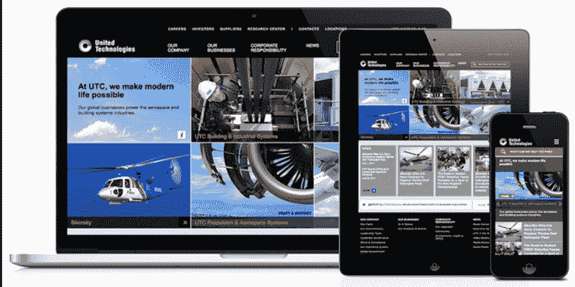
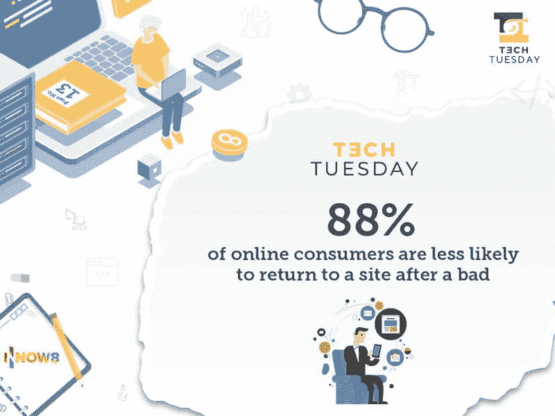
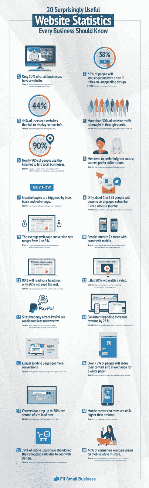
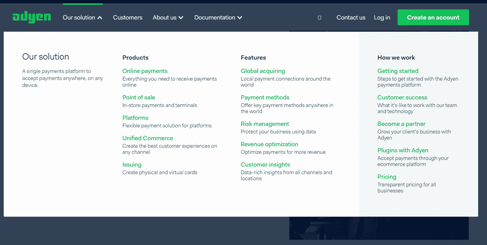
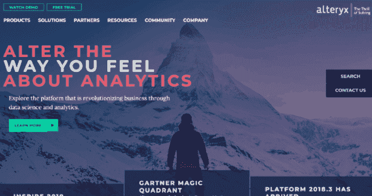
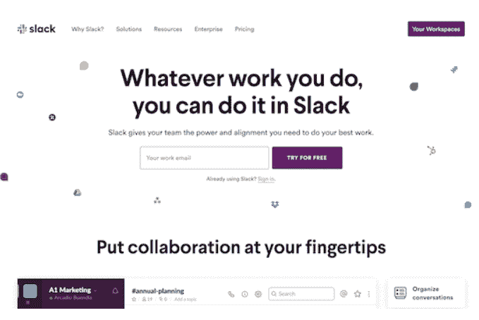
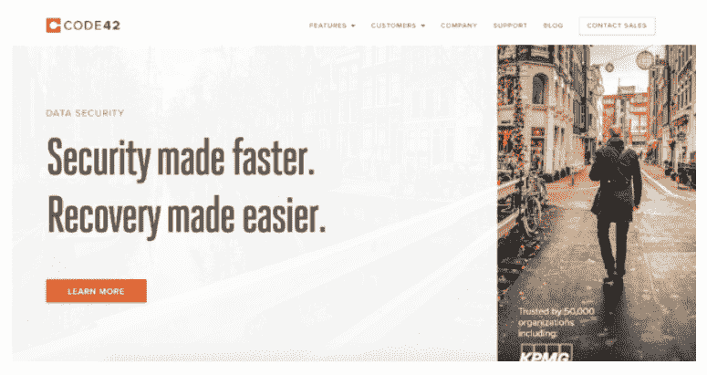

# 如何建立一个可以帮助你发展事业的公司网站

> 原文:[https://simple programmer . com/build-a-corporate-website-developer/](https://simpleprogrammer.com/build-a-corporate-website-developer/)

今天的企业网站已经走过了漫长的道路。以前，它们更像是一本商业小册子，信息仅限于公司名称、简介和对提供的[产品或服务](https://simpleprogrammer.com/products/)的简短描述。随着时间的推移，这种情况发生了巨大的变化，T2 的在线空间竞争越来越激烈，以至于商业网站已经从仅仅是一种选择变成了一种绝对必要。

作为程序员，理解一个好的公司网站的要素变得至关重要，以便能够创建一个真正与企业受众交流的网站。在这篇文章中，我将向你展示建立一个有吸引力的、有竞争力的、高领域声誉的公司网站，从而促进你作为一名开发人员的职业生涯所需要知道的一切。

## 一个好的企业网站是由什么组成的？

无论你是一名内部程序员还是一名自由职业者，理解[公司网站](https://simpleprogrammer.com/web-development-business/)存在的一个主要原因是至关重要的:让你认为对你的工作很重要的人参与到关于为什么你的公司很重要的对话中。企业网站是一个地方，人们可以在这里了解关于商业的整个 T2 故事。因为当涉及到 B2B 营销和沟通时，你的整个故事是至关重要的。

因此，始终记住用户体验是最重要的。没有什么比自言自语更阻碍参与了。无论是在实际的信息传递还是视觉设计中，都要把用户的体验放在心上。以下是一些你可以通过公司网站更好地沟通的方法。

### 响应性

[来源](https://www.ideasonpurpose.com/on/better-website/)

随着人们越来越多地通过不同的设备浏览网页并与之互动，您需要您的网站在任何设备上都具有良好的外观和表现——从笔记本电脑和平板电脑到电话和电视。随着 B2B 利益相关者的交流从会议室转移到任何他们需要的地方，你的网站应该像他们一样移动。

此外，请记住，作为开发人员，您的关注点与您的受众不同。换句话说，如果你只开发桌面应用程序，这并不意味着等待发现你的业务的人一定会使用桌面计算机。

2020 年，[全球一半的网络流量](https://www.statista.com/statistics/277125/share-of-website-traffic-coming-from-mobile-devices/#:~:text=Mobile%20accounts%20for%20approximately%20half,since%20the%20beginning%20of%202017.)来自移动设备。所以，如果你的网站还没有移动化，你就错过了一大群希望听到你的故事并与你做生意的人。这是一个简单而关键的[增长黑客](https://growthrocks.com/blog/growth-hacking-today/)策略，你需要实施。

### 内容结构

你可以有最鼓舞人心的故事，但如果你组织内容的方式和[促进用户体验的方式](https://simpleprogrammer.com/website-usability-for-applications/)有所欠缺，你将无法传达你的信息。此外，有价值的内容会影响其他业务领域，如搜索引擎排名、转化率和建立信任的。

实现这一点的方法之一是提供优秀的现场搜索。最简单的方法之一是在你的网站上实现谷歌搜索。你甚至可以以相对较少的费用使用这个功能。如果您想更进一步，您甚至可以集成 UTC 站点搜索，它可以预测用户在寻找什么，并在他们键入时提供建议。

利用下拉框和页脚来增强导航，让内容变得可查找也是明智的。这些多种途径鼓励持续参与，也可以最大限度地减少用户寻找所需的点击次数。

### 精心设计的视觉效果

虽然没人再阅读可能不是真的，但大多数时候，用户会喜欢少读一些，抓住你要说的关键。当略读时，用户倾向于寻找图像和图形作为指引他们正确方向的向导。因此，尽可能使用你的网络开发技能来帮助你。

## 一些数据可以让你更加信服

*   88%的在线消费者表示，在经历了糟糕的经历后，他们不太可能再回到某个网站。
*   57%的互联网用户表示，他们不会在手机上推荐网站设计不佳的商家。
*   75%的在线消费者表示，他们会根据一家公司的网站设计来判断其可信度。

以下是你应该知道的其他商业[网站统计数据](https://fitsmallbusiness.com/website-statistics/):

## 如何建设一个更好的企业网站

这里还有一些关于如何建立一个对整个企业产生积极影响的公司网站的建议。

### 了解你的观众

我早些时候已经提到了这一点，而且理由很充分。虽然沟通和营销团队可能会在这方面做很多跑腿的工作，但作为一名程序员，只有当你也有类似的理解时，它才会有所帮助。这将允许你[定制网站的元素](https://www.amazon.com/dp/B06XFJ2JGR/makithecompsi-20)以适应你的人口统计，反映他们说的语言，需求和愿望。

### 响应对速度的需求

一些报告发现，40%的互联网用户会放弃一个加载时间超过三秒的网站。这是一个巨大的百分比，负面地渗透到企业想要实现的一切——从提高意识和获得他们的信息，到产生线索和增加转化。

你可以采取一些简单的步骤来确保你的网站顺利运行。这些包括优化图像和视频，保持软件更新，并选择一个网站主机，可以处理您的带宽需求。

### 引诱他们行动

网站上的每一页都应该鼓励访问者做一些事情。无论是进一步了解产品和服务、订阅电子邮件还是下载内容。行动号召按钮的设计、位置和传达的信息会极大地影响访问者在你的网站上做一些事情的冲动。

另外要注意的是，把你的 CTA 放在文件夹的上方，这样访问者就不必在找到你想让他们做的事情之前滚动页面。

### 添加个人风格

虽然企业网站通常保持一定的严肃性，但这并不意味着你不能与你的观众建立个人关系。这是[了解你的受众](https://simpleprogrammer.com/why-data-analyst/)有所帮助的另一个领域，因为它有助于创造高质量的在线体验，有助于品牌认知和整体沟通。

## 令人敬畏的公司网站能激发你的灵感

很想看看如今令人惊叹的企业网站是什么样子？看看这些网站:

### Adyen

[来源](https://www.bluleadz.com/blog/10-of-the-very-best-software-website-examples)

该 SaaS 为企业提供了一个多渠道平台，用于接受在线支付、移动设备支付和店内支付。虽然这听起来可能是一个复杂的命题，但网站的导航菜单以一种帮助访问者和潜在客户了解他们必须提供什么以及他们将如何去做的方式呈现。

此外，一进入网站，Adyen 的主要价值主张就能立即、轻松地传达出来:如何轻松地从客户那里收款。

### 变音

同样，Alteryx 会很快传达他们能为你做什么。分析的世界可能会让经验不丰富的企业主感到害怕，但当你访问他们的网站时，你很快就会打消这种感觉。

自助服务平台允许您准备、混合和分析数据，这是 Microsoft Excel 和其他电子表格无法做到的。当涉及到可能相当复杂的服务时，在与潜在客户沟通时简化它总是更好。Alteryx 就是这么做的。

### [松弛](https://slack.com/intl/en-ph/)

你会发现直截了当的交流是这个顶级公司网站列表的一个主题，Slack 和任何人一样做到了这一点(并且让它很酷)。网页设计简洁明了，而内容(尽管功能丰富)简洁明了。所有这些都带来了出色的用户体验。

### [代码 42](https://www.code42.com/)

这是一种基于云的数据保护和安全服务，可帮助企业最大限度地降低数据丢失的风险，并提供意外事件的灾难恢复。这是一个没有多少企业会想到的话题，Code42 很好地为访问者提供了有关端点数据保护的信息，以及它对大多数企业的重要性。

这种对他们的产品不如其他产品知名的理解是他们网页设计方法的信息本质的基础。

## 走向合作

当所有的行业，很可能是你的所有竞争对手都占据了数字世界的空间时，你也必须在网上建立自己的品牌。拥有一个有效的企业网站只是第一步，但它确实为你的业务开辟了许多可能性。

如果你正在工作的企业还没有一个合格的网站，使用上面的指导来制作一个[实现其目标](https://simpleprogrammer.com/software-testing-trends-2021/)的网站。

创建一个有吸引力的公司网站是几个因素的产物。从好的、反应灵敏的设计到理解你的受众，从技术上的卓越到添加个人风格，作为一个开发者，有些事情你可以有发言权。确保运用你的知识和经验为你的公司增加价值