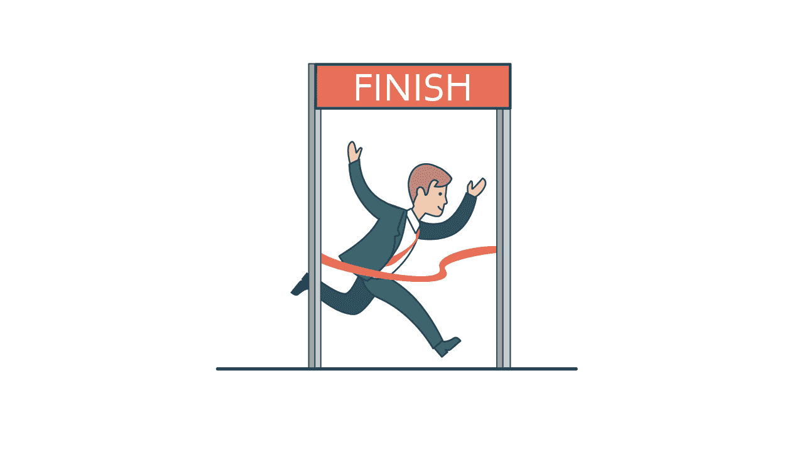
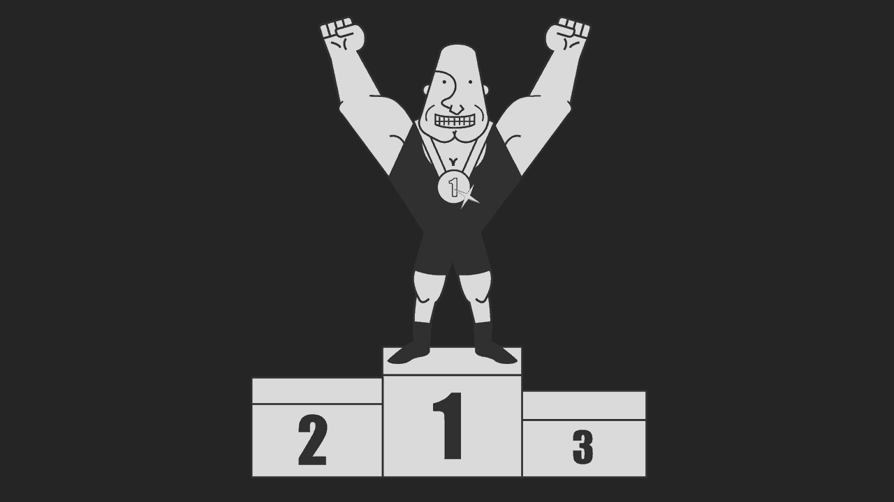

# 成为牛头犬:如何建立牛头犬心态

> 原文：<https://simpleprogrammer.com/build-bulldog-mindset/>

天啊，天啊…我已经有一段时间没写博客了。

似乎很久了。

我写的最后一篇“博客文章”是在我写我的书《完整的软件开发人员职业指南》的最后一章时，那大概是一年前的事了。

我想念写作。写作是……嗯，它是一个婊子。但是，这也是一种有趣的方式，扭动你松动的牙齿，直到它受伤。

我现在写这篇博客的原因是我们找不到一个客座作家在今天的截止日期前及时提交一篇高质量的文章。

所以，我决定吹掉旧打字机上的灰尘，看看我是否还能在一页纸上写几个字。

哦，在我们进入正题之前，顺便提一下，这篇文章的真正主题是:**人们写东西很烂**。

我正在尝试雇佣一个代笔人，把我的 YouTube 视频转换成亚马逊的电子书，我阅读了这么多提交的“像样的写作”，但不是好的写作。

他们的作品糟糕的主要原因是因为它没有活力——没有声音。

太多的人害怕在写作——以及在生活中——冒险，正因为如此，他们没有摔个脸……但他们也没有真正飞起来。

它们只是全速跑到悬崖的尽头，而不是跳跃和拍打翅膀，它们只是毫不客气地…掉了下来。

现在，我意识到不是每个人都像我一样写作，用我的风格或声音，我也绝不是世界上最好的作家，但他妈的抓住机会吧。真的，他妈的碰碰运气……

*…带写*

*…用你的生命*

*…与你的关系*

炸一些屎…捡起碎片，把它们缝合在一起，然后重复这个过程，直到你要么死了，要么感觉你还活着。T3】

哦，你看到了吗？去吧，到外面去，我们刚好降落在我们想去的地方。

所以，吸一大口新鲜空气，让它下去的时候有点刺痛你的喉咙，然后…

## 准备成为他妈的牛头犬！

我在我的 YouTube 频道上谈论过的最受欢迎的话题之一是“[我是如何成为一只‘他妈的牛头犬’并改变了我的生活。](https://www.youtube.com/watch?v=bJsZfpwm_Fs)

我不打算在这里重复那个视频，因为，让我们面对它，那将是蹩脚的。

相反，我将深入挖掘它，给你一点不同的视角，并告诉你如何开始改变你的生活，让你变得更勇敢。

我要教你如何真正咬紧牙关，从生活中得到你想要的东西——真正咬紧牙关——不管你遇到什么障碍或其他狗屎，都要坚持下去。

听起来不错吧？

你想成为一只斗牛犬吗？

很好。那我们就这么做吧。

## 做烂透了的屎，就因为烂透了

有时候，当我正在跑 10 英里，两天没吃东西，前一天跑了 10 英里，却没穿鞋的时候，一个想法掠过我的脑海…

“你他妈的为什么要这样做，约翰？为什么？”

在那些时刻，我不得不提醒自己**给自己带来痛苦*——*自愿*——*是什么让你变得更强大。**

当痛苦或挣扎被强加给你时，往往会产生相反的效果，让你崩溃。

再说一次，并不总是这样。我的生活中有些艰难的事情，不是我自找的，而是它迫使我成长。

但是，如果你真的想成长，我是说真正的成长，你会自找麻烦的。

你会做一些很糟糕的事情，只是因为它们很糟糕 *—* 没有别的原因。

你越是训练自己去拥抱糟糕的事情，去积极地寻找它，去控制它，去征服它，你就会成长得越多，你就会变得越强大，你就越不会害怕生活中那些你不得不做但不想做的事情。

你真的想发展精神训练吗？这是怎么回事。

所以，挑选出挑战，身体的、心理的、精神的、情感的，各种各样的挑战，让你超越极限——远远超越极限。

他妈的跑进山洞，用你的剑戳龙。不是因为你想拿他的宝，而是你想感受他的气息到底有多热。

面对现实吧，生活就是痛苦。

不管你喜不喜欢，痛苦都会降临到你身上。

你不妨走出去面对痛苦，用你自己的方式面对它，而不是让它强加于你。

然后，当它真的来了——它会来的——你会准备好的。

## 承担责任，不管是谁的错

但是，但是..是的，我知道借口，借口。

倒楣的事情发生了，生活发生了，我们都有借口。

有些借口质量高，有些借口质量低。

但是你猜怎么着？

如果你没有设置闹钟，所以你今天早上没有及时起床，或者你的房子今天早上着火了，这都没关系，最终结果都是一样的:狗屎没有完成。

今天早上我坐在这里写这篇博客，因为有些事情没有完成。那么，我该怎么办呢？

我会发牢骚吗？我会抱怨说“哦，今天是感恩节”，或者“哦，这不是我的错？”

不，这是我的公司，这是我的博客，我今天想发布一个帖子。今天会发出一封邮件。我会写一个。

这与对错或谁的错无关。它是关于完成任务 *—* 让事情发生。

你看，我们可以一直玩指责游戏。我们总是可以为我们的失败或为什么情况不受我们控制找借口、给出借口、理由，或者我们可以忘记所有那些狗屎，而是采取行动——大规模行动[(就像老好人 G 叔叔格兰特·卡尔多内会说的](http://amzn.to/2zp1UVB)。)

所以，无论生活中发生什么——你的生活——记住这是你的错。这是你的责任。

记住，没有人比你更在乎你。所以，不管是你直接造成的，还是间接造成的，或者是你停车等红灯时它从后面撞了你，即使这可能不是“你的错”，但这仍然是你的责任，因为这是“你的问题”。

如果你要拥有问题，你最好也拥有解决方案。

唯一的方法就是承担责任——完全的责任。

## 如果你开始了，就完成它

大多数人在生活中失败是因为他们放弃得太快。

他们离金子只有 3 英尺远。

他们所要做的只是**再坚持一会儿**，咬紧牙关再坚持几分钟，在比赛中再坚持几英里，他们就会成功，但是相反，当比赛变得艰难或者道路不是他妈的金色百合铺成的，他们就认输了。

好吧，让我告诉你一些关于生活的事情。生活很艰难。生活是一个婊子。

通往伟大的道路上有很多他妈的坑坑洼洼，这里没有百合花，几英里之内，你唯一能看到的路标就是写着“立即掉头”的那个

如果你要走这条路，就走到底。不要走到一半再回头。

你建造半座桥的收益是 0%。

你在 90%的路程中建造一座桥，却只有 0%的收益。

你能猜到 99%的时候建造一个会给你带来多少好处吗？

你一无所获！事实上，少于零——你知道为什么吗？

因为你不仅不能过河，而且你还损失了 99%的建桥时间和材料。

完全是浪费时间和精力！

因此，如果你不打算 100%完工，那就根本不要开始建这座桥。

但是，当你决定建一座桥，或者参加一个健身项目，写一本书，编写你梦寐以求的移动应用程序，开始创业，不管是什么，他妈的完成它！

## 承担风险，很大的风险，接受后果，成长并继续前进

记得我说过很多作家都是垃圾作家吗？

这是因为他们没有承担足够的风险。

他们害怕违反一些语法规则，害怕听起来像狗屎，害怕被嘲笑，害怕不够专业，等等，等等，等等。

生活就是他妈的冒险。这都是他妈的一个大机会。

你永远不知道会发生什么。

当你坐在车里等红灯的时候，你永远不知道一架 747 飞机的舱门会不会在飞行途中掉下来，从几千英尺的高空摔下来，压死你。

就我们所知，一颗该死的流星随时可能撞击地球，毁灭所有生命。

是的，如果你纵身一跃，你会摔个嘴啃泥——这种事我们谁都会遇到。

但是，猜猜“我们中最好的人会做什么？”我们他妈的起来了！

我们再做一次。一次又一次。

正如我最喜欢的作家之一纳西姆·尼古拉斯·塔勒布在他的优秀著作《反脆弱的人》中所说:

斯多葛派是一个有态度的佛教徒，一个对命运说“去你的”的人

让我们都成为这种品质的禁欲主义者。让我们一起竖起中指，告诉命运她能把它推到哪里去。

为了做到这一点，你必须开始冒险。

你不能总是稳扎稳打，希望一切顺利。

写一些值得写的东西，做一些值得做的事情，跳一跳，跳他妈的鲨鱼。

你会失败很多次。

你会磨破膝盖的皮。

人们会取笑你的。

你看起来会像个白痴。

但是，那又怎么样？

你想成为斗牛犬吗？

你想成功并从生活中得到你想要的吗？

然后，就去做，接受后果，从中吸取教训，继续前进。

不要往小处想。不要去想什么会出错。

相反，想想把屎炸了吧。

想想直接走进暴风雨，只是想看看会发生什么。

跑，不要走，直接掉进别人会想尽一切办法避开的屎里，因为**当你无所畏惧的时候，你就是无与伦比的。**

## 最后，不要让任何人对你说“不”

我给你最后一个建议:

不要理会别人说的话。

挺好的。他们是好意。他们想保护你远离自己，远离失望和不切实际的期望。

或者他们只是想压制你，或者他们不想让你让他们难堪，或者让他们想起自己生活中的失败，因为他们已经放弃了自己的梦想。

或者他们真的真的认为你做不到。

他妈的没关系。

甚至成功不成功都无所谓。重要的是你尽了全力，做了你相信的事情，没有任何保留。

在我看来，这是衡量成功的最重要的标准。

努力工作不会产生成功，努力工作才是成功。

在[博伽梵歌](http://amzn.to/2jdLrIP)中写道，*“你有权履行你规定的职责，但你无权享受你行为的果实。”*

这意味着**你做你做的事是因为你选择去做，因为这是你应该做的，**而不是因为你做这件事会得到什么结果。

在生活中，你会发现在不可能的事情上失败比在琐碎而平凡的事情上成功更有乐趣。

还有那几次你做了不可能的事…他妈的金子！

所以，当有人告诉你“不”，“你不能这么做”，“这永远行不通”，“你不够格”，“你以为你是谁？”或者其他你不喜欢的，就笑着照做就是了…

那是牛头犬会做的。