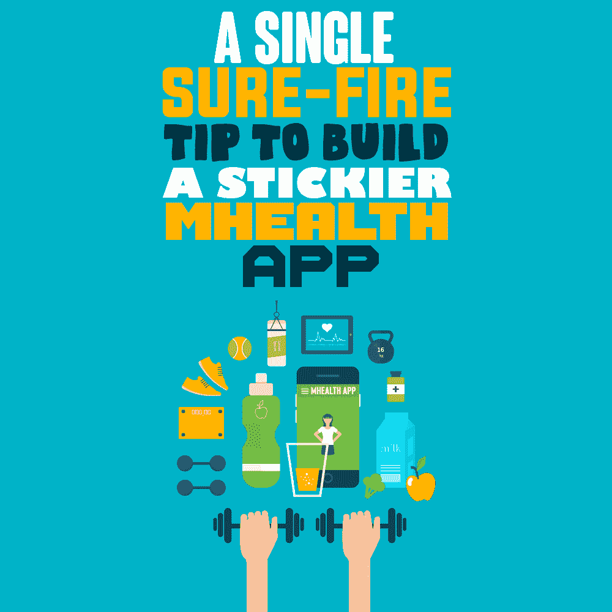
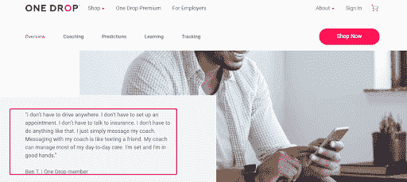
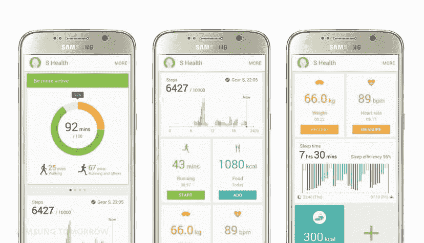

# 构建更具粘性的移动医疗应用的一个简单可靠的建议

> 原文：<https://simpleprogrammer.com/build-effective-mhealth-app/>

Apps are not just conventional tech products anymore. Just like smartphones, they have become a major part of our everyday lives. Funded lavishly, designed ultimately, and marketed carefully, they have become the mainstay of the modern connected world, especially mobile health or mhealth apps.

目前，应用商店拥有相当数量的移动健康应用。Google play 商店有 53，054 个 mhealth 应用，而苹果应用商店有 53，979 个。请看这张由 Statista 制作的图表，该图表称，在 2020 年疫情期间，应用商店见证了医疗应用下载量 65%的增长。

因此，从这一点来说，移动健康(mHealth)应用是医疗保健行业的未来并不夸张。

然而，尽管这些工具提供了潜在的好处，移动健康应用的采用率却很低。大多数用户在使用几次后就停止使用了。

根据[research 2 guide 的一项被广泛引用的调查，](https://r2guidance.medium.com/only-7-of-mhealth-apps-have-more-than-50-000-monthly-active-users-best-mhealth-user-retention-9c839cc5d144#:~:text=for%20this%20story.-,Only%207%20%25%20of%20mHealth%20apps%20have%20more%20than%2050%2C000%20monthly,Best%20mHea)只有 7%的移动健康应用拥有超过 50，000 名月活跃用户。近[九分之八的糖尿病患者](https://pubmed.ncbi.nlm.nih.gov/28970445/)拥有智能手机，但只有三人使用糖尿病应用程序。更重要的是，全球有超过 10 亿人患有慢性呼吸系统疾病，但在这个目标群体中，只有不到 1%的人使用移动健康应用。

换句话说，移动健康应用的高下载率并不等同于高采用率。显而易见的结论是，医疗保健应用不符合用户的需求和期望。

在这篇文章中，我将解释如何通过整合以患者为中心的功能，即符合用户需求的功能，来加速移动医疗应用的采用。

## 移动医疗应用中以患者为中心的功能是什么意思？

从广义上来说，从患者的角度来看，某个给定的医疗保健开发商认为是伟大的功能可能是不相关的。比方说，开发人员在应用程序中设计了多个列，并希望患者填写这些列以获得相应的药物。**问题**:需要通过多个屏幕和步骤进行大量手动数据输入的应用程序不太受患者欢迎，因为他们甚至无法完成基本任务。

患者提到的另一个可能的问题是开发人员方面的解释不清楚(或缺乏)，这会导致任务不完整。

例如，在大多数糖尿病应用程序中，用户只需完成部分任务，比如输入更多的血糖水平。很快，他们感到失落和无助，因为他们无法在没有帮助的情况下填补大部分空白。根据一项[研究](https://www.commonwealthfund.org/publications/journal-article/2016/jul/usability-commercially-available-mobile-applications-diverse?redirect_source=/publications/in-the-literature/2016/jul/usability-mobile-apps)，参与者在没有帮助的情况下，只完成了 185 项任务中的 79 项(43%)，跨越了 11 个应用程序。

我反复强调的一点是:当你为病人开发应用程序时，要以病人为中心。换句话说，透过他们的眼睛看。和他们说话。发现他们的需求以及他们打算如何使用该应用程序。根据他们的说法，找出哪些功能会让他们想使用你的应用程序。显而易见，通过将你的病人放在你的应用程序的中心，你将在某种程度上确保你的病人长期坚持应用程序。

另一方面，如果你的应用已经发布，看看应用商店的评论。如有投诉，补救。假设你对某些功能的功效有任何疑问，找一家以设计成功的移动医疗应用而闻名的[应用开发](https://www.goodfirms.co/directory/country/app-development/us)公司。这样做，你可以放心，你的应用程序会得到很好的处理，最终的结果会如你所愿。

## 移动健康应用的基本特性

要真正拥有一个以患者为中心的移动医疗应用，某些功能应该被视为成败的关键；换句话说，必不可少。以下是其中的一些。

### 与卫生保健从业者直接互动(HCP)

我知道；考虑到医生们以日程排得满满的而闻名，尤其是在疫情的情况下，这似乎是一个至关重要的提示。但事实仍然是:实现患者和医生之间的实时沟通可以保证更高的用户保留率，特别是在当前场景下人们更喜欢呆在家里的时候。

想象一下，一名医生通过一款应用程序分享测试结果，作为回报，他会得到患者的反馈。毫无疑问，实时视频聊天、文本和语音信息会促使用户改变行为，从而提高应用的参与度和留存率。

除了健康预测之外，ONE DROP 应用程序还为其成员提供每日个性化教练服务，以及针对 1 型糖尿病、二型糖尿病、糖尿病前期、高血压和高胆固醇的更多服务，以帮助患者改善健康。ONE DROP 旨在通过其直接的一对一辅导服务来彻底改变医患关系。

这里有一个 One Drop 应用用户的证词，揭示了用户喜欢这个应用的地方。

来源:https://www.onedrop.org/en/

### 简洁明了的仪表盘

换句话说，避免“功能蔓延”根据 Dan 和 Cheap Heath 在他们的经典著作《[make to Stick](https://www.amazon.com/dp/1400064287/makithecompsi-20)》中的观点，大多数技术和产品设计项目都必须与“功能蠕变”作斗争。换个说法；这是一种使事情逐渐变得更加复杂的趋势，直到它们不再能很好地执行它们最初的功能。当你的遥控器有五十个按钮时，你就不能再换频道了。

简而言之，不要让你的仪表板功能过多，而是设置干净简单的仪表板。通过这样做，应用程序的关键元素将像霓虹灯一样闪烁，吸引用户的眼球。通过突出你的应用程序的最佳特性，你可以让用户掌握它们。这种仪表盘非常适合健身和健康管理应用。

通常情况下，健身或健康应用程序的仪表盘中应该主要有活动提要，用户可以用来跟踪他们的健康相关目标。这可能与康复训练有关，也可能与他们那天是否服用了药物有关。

此外，仪表板应该有用户跟踪数据，恢复进度，以及可视化的健康记录。这种健康记录很方便，因为医生或病人可以立即查找信息，并且鉴于它们是图形格式，人类大脑更容易记住信息。

最好的部分是，开发人员可以更容易地创建这样的仪表板，同时，它可以推动行为变化，并帮助重新吸引用户。

国家生物技术信息中心调查的参与者之一分享了以下关于仪表板的想法:“我喜欢仪表板的样子。它实在是太干净了，所以我说，'好吧，好吧，我会下载并尝试一下！'我真的很开心。"

**三星健康**的仪表盘既多彩又非常人性化。

来源:https://news.samsung.com/

### 简洁明了的语言

众所周知，卫生保健从业者使用复杂的术语，通常包含希腊语和拉丁语。众所周知，在医疗保健领域，你使用的语言可以成就或毁掉你的应用。所以要确保语言足够简单，能够引起用户的共鸣。

虚拟医疗保健移动平台 Conversa Health 通过在整个应用中使用相关和简洁的语言，实现了其妙语“更好的对话，更好的护理”。该公司更进一步，与心理学家合作，添加鼓励患者继续使用该应用程序的词语。

### 个性化通知

如果说有什么不同的话，个人通知有助于围绕你的应用建立一个[繁荣的社区。它为接下来的步骤提供了一个清晰的方向，从而促使用户行为规范。在移动健康应用中，用户应该能够根据他们特定的健康目标和环境定制他们的通知。](https://simpleprogrammer.com/building-community-around-mobile-app/)

**Mango Health** 使患者能够为各种健康目标设置个性化提醒和警报，如保持水分、按时服药，甚至提醒自己进行血压检查。如果用户按时服药，他们可以获得积分。

### 坦率地说出费用

不透露应用程序的确切成本也是让用户对你的医疗保健应用程序失去兴趣的主要限制之一。事实上， [36.1%的患者认为隐性和意外成本](https://www.ncbi.nlm.nih.gov/pmc/articles/PMC4704953/)是应用程序中断的原因。解决这一问题的理想方法是提前告知免费的和需要付费的功能。

请记住这一点:如果应用程序给人们的生活带来积极的变化，人们会乐意为其付费。另一方面，如果你免费提供应用程序，但强迫用户付费使用这些功能，你可能会疏远许多用户。明确成本，因为用户不喜欢意外费用。

## 以患者需求为中心，让你的移动医疗应用更具粘性

开发、部署和提示患者下载移动健康应用程序是比较容易的部分。难的是让它变得讨人喜欢，这样病人不会在使用几次后就停止使用。

增加以病人为中心的功能是关键。从满足用户需求和与 hcp 直接互动，到使用清晰简洁的语言，从启用个性化提醒到开发整洁的仪表盘，这些都是确保应用长期持续使用的可靠策略。

那么，准备在今年推出一款移动健康应用吗？以病人为中心。马上。