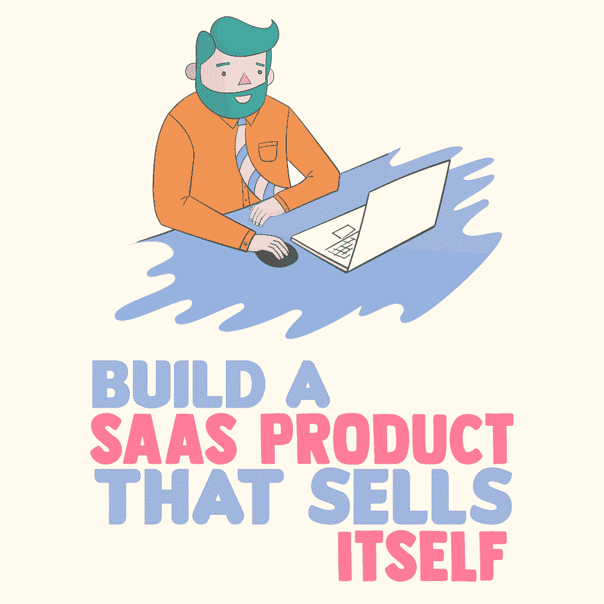

# 构建一个自我销售的 SAAS 产品

> 原文：<https://simpleprogrammer.com/build-saas-product/>

<figure class="alignright is-resized">

</figure>

作为一名崭露头角的软件即服务(SaaS)程序员，你[面临一些挑战](https://simpleprogrammer.com/9-common-problems-new-programmers-face/)，首先是你希望如何在该说的都说了，该做的都做了之后盈利。

如果你希望打造一款 SaaS 产品，好到[实际上是在推销自己](https://simpleprogrammer.com/sell-without-seeling)，你需要从一开始就知道结果。

这意味着要了解你的受众，并开发一种产品来满足他们的特定需求。作为一名程序员，有几个方面是你必须关注的，但是定义你的受众是第一步。

## 定义你的受众

在你开始之前，你需要确定你的听众。太多的 SaaS 程序员在早期就陷入了试图迎合多种受众的困境。

此外，如果你的内容没有给用户增加任何附加价值，现在市场上的 SaaS 产品数量可能会让你两手空空。

如果你在开始开发时，头脑中有一个理想用户的清晰图像，你就可以创建一个有洞察力的产品，而不会使仪表板过于复杂。

理解你的理想受众的最好方法是把你的 SaaS 应用程序想象成一个解决方案，而不是一个产品。转向你的产品的人会有一个问题，他们需要一个解决方案，即使他们还不清楚那是什么。

如果你清楚地定义了你要解决的问题，你就能更好地了解你的受众。了解你的受众是谁，他们需要什么，最终会让你创造一个令人满意的用户之旅，帮助你交付一个有巨大价值的产品。
T1。med rectangle-4-multi-110 { border:none！重要；显示:屏蔽！重要；浮动:无！重要；行高:0；边距-底部:15px！重要；左边距:0！重要；右边距:0！重要；margin-top:15px！重要；最大宽度:100%！重要；最小高度:250px 最小宽度:250 像素；填充:0；文本对齐:居中！重要}

## 专注于你的 MVP

构建一个 SaaS 产品应该涉及一个完全不同于你在其他应用程序上使用的过程，因为在整个项目中应该涉及更多的策略。一旦你确定了你的受众，定义你需要什么样的[最低可行产品](https://simpleprogrammer.com/learn-product-playbook) (MVP)。

如果你的视线转移到其他领域，你的产品很容易变得过于复杂和臃肿。

当您或您的客户可能开始对产品感到兴奋，并开始向各个不同的方向发展时，这种混乱问题就会发生。关键是你要关注你的 MVP。

通过关注 MVP，您将消除浪费，并更快地将产品推向市场，这是真正的反馈循环的开始。用户越早告诉或向你展示他们如何使用产品，成功的几率就越高。

## 懂语言

不管是什么应用，SaaS 产品都需要两方面的开发:客户端和服务器端。为了正确地开发双方，有各种各样的编程语言可以用于你的 SaaS 应用程序开发。

*   PHP 是一种嵌入 HTML 的脚本语言，非常容易理解。如果你选择 PHP，你将能够快速编写动态生成的页面。
*   **node . js–**node . js 使用事件驱动的非阻塞 I/O 模型，这使得它非常轻便，非常适合跨多个设备运行的数据密集型实时应用。使用 Node.js 的另一个好处是，它使您能够用同一种语言编写前端代码和后端代码。
*   **Python–**Python 是执行数据分析的最佳风格之一。它也适用于动态类型、元编程和快速原型制作。Python 是新程序员的绝佳选择，因为它的语法简洁，并且使用了空格。
*   **Java–**Java 是企业界广泛使用的编程语言。虽然它可能运行较慢，需要更多内存，但对于各种平台来说，它是一个极好的选择。
*   对于通过微软开发的应用程序来说，c#–这种编程语言是一个极好的选择。

除非您使用 Node.js，否则您需要知道如何使用两种语言编写:一种语言运行在浏览器端，另一种运行在服务器端。

比如你可以用 Python 开发你的服务器端，用 JavaScript 用 HTML/CSS 开发客户端进行交互。服务器端语言的选择并不重要，但是你应该选择你最喜欢的风格。

## 前端先走

<figure class="alignright is-resized">

</figure>

一旦你知道你使用的是哪种语言，就从前端开始。从开发的前端开始，你会看到功能在用户体验中的位置。

用户体验对产品的成功至关重要。在深入编程过程之前，您还将获得关于什么可行，什么不可行的深刻见解。

通过从前端开始，您可以避免一些代价高昂的错误，例如编写太多代码或在前端硬塞元素，使平台看起来混乱或无组织。此外，你会清楚地知道下一步该怎么做，让你的 SaaS 对买家更有吸引力。

## 想想整合

SaaS 销售的另一个重要方面涉及到你的软件产品如何与其他应用程序集成，这样你可以最大化产品价值并简化集成过程。

首先决定您想要集成哪些服务，或者哪些服务可能对您的客户有价值。这些集成应该包括入站和出站服务和工具。

选择能够为您的用户提供价值、使您的产品在市场上脱颖而出并获得曝光率的集成。不要担心找到每一个可能的组合，只需要找到那些对你的应用最重要的组合。

一旦你进入市场，你可以看到哪些是最好的，并在你的过程中测试新的。

## 看看每个特征

随着你对编程越来越深入，花点时间看看你创造了什么。看看你包含的每个特性，以及它是否是原始 MVP 的一部分。

附加功能很棒，但往往会占用上市的时间，在市场上你可以测试产品对用户是否有吸引力。

市场和你之间的这些反馈循环将会推动你在未来创造更多有意识的功能。

此外，构建一个全面的平台可能会浪费您的资源。你可能会花费时间和金钱去研究一个对你的观众毫无用处的特性。

将每个元素与您的应用程序的核心功能进行比较，您可以找到简化产品和更快上市的方法。
T1。leader-2-multi-119{border:无！重要；显示:屏蔽！重要；浮动:无！重要；行高:0；边距-底部:15px！重要；左边距:0！重要；右边距:0！重要；margin-top:15px！重要；最大宽度:100%！重要；最小高度:250px 最小宽度:250 像素；填充:0；文本对齐:居中！重要}

## 考虑销售工具

大多数程序员直到他们的应用程序准备好发布时才担心销售。如果你想领先一步，你应该开发一套销售工具，让你的产品在市场上脱颖而出。

通过近十年与技术市场中的企业、中型市场和初创公司打交道的经验，[B2B 销售线索生成服务公司 Launch Leads](https://www.launchleads.com/industries/saas/)发现，将 SaaS 技术与战略性销售功能相结合可以显著提高买家的兴趣。

在开发任何新的 SaaS 产品时，您应该认真考虑在您的应用程序中添加以下内容:

### 简单易懂的用户教程

如果你的应用需要一点点时间让用户完全掌握，包括用户教程可以帮助用户和潜在客户更好地了解你的产品的价值。

这些“初学者指南”应该非常简短，易于理解。

### 简化的购买流程

您的购买流程对产品的可持续性至关重要。如果你的用户必须处理冗长的问题或点击多次，你增加了他们放弃购物车或不完成购买过程的机会。

确保你的入职系统足够简单，用户可以毫不犹豫地通过它。

### 分享和推荐功能

作为数字世界的一员，你的用户喜欢聊天、点赞、转发和分享。如果你希望让你的产品成功，可以考虑通过精简的推荐服务来简化分享过程。

## 价格分层

<figure class="alignright is-resized">

</figure>

在你发布产品之前，你应该仔细考虑你的定价策略。几乎每个 SaaS 产品都有的一个策略是定价层级。

通过向潜在客户展示与其当前需求和兴趣相匹配的接入点，构建层级将有助于最大化您的市场参与度。虽然每种产品都有其早期用户，但大多数潜在客户会更加犹豫不决。一个删节版本先发制人地解决了后一组的问题。

对于不熟悉您的优势的客户来说，前期财务负担可能太高。基础版本可以帮助他们了解项目的价值，同时帮助减轻他们的财务风险。或者，客户可能会对您的程序的细微差别感到不知所措。一个简单的版本可以让他们使用你的产品，而不会感到不知所措。

你可以使用几个层级策略，但最好是基于你的买家角色。因为你从一开始就知道你的理想买家，你可以很快确定如何为每个人物角色分解你的 SaaS 产品。

基于客户价值的定价对于大多数行业来说是一种相对较新的定价类型，包括 SaaS 应用。因此，您应该仔细研究和考虑如何为您的平台实现这一点。

如果有一个按照客户价值进行价格分层的例子，那就是苹果公司。

在苹果手表的发布会上，这个科技巨头精心制作了三种不同的设计。Apple Watch 是一款普通的日常手表，Apple Watch Sport 配有塑料表带，Apple Watch Edition 采用贵金属材质。

从每个选项来看，很明显他们考虑到了他们的客户，并相应地区分了设计。您可以将此应用到您的价格分层中，以获得更好、更有效的销售策略。

## 将数据用于你的优势

当您将产品推向市场时，通过使用数据和指标来更好地取得成果。

无论是改变你的价格点，交替标题，提高行动要求，还是其他什么，测试服务都可以帮助你作为一个程序员。确保你不断地与用户和你的客户交流，优化你的在线工作。

## 销售是发展的一部分

作为一名 SaaS 开发人员，您可能会发现销售产品是开发过程中令人生畏的一部分。将你的产品送到最需要的人手中似乎是一项艰巨的任务。

然而，你不需要成为销售专家来帮助你的产品销售。将销售视为构建产品的一部分，而不是一个单独的步骤。

如果你在构建你的 SaaS 产品时使用这些易于实现的策略，甚至只是其中的一部分，不久之后，当别人开始开发他们自己的产品时，你的解决方案的小想法可能会成为他们理想化的 SaaS 产品。