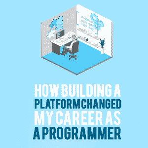

# 构建平台如何改变了我的程序员生涯

> 原文:[https://simple programmer . com/building-a-platform-changed-career/](https://simpleprogrammer.com/building-a-platform-changed-career/)

The concept of a “personal brand” is stale and outdated. Even the phrase makes my toes curl. It conjures up cringey thoughts about “selling ourselves.”

但是作为程序员，这是我们经常听到的话:“[你需要有一个利基](https://simpleprogrammer.com/programming-niche-good-enough/)，“[你需要突出](https://simpleprogrammer.com/store/products/how-to-market-yourself/)”你以前听过这个，对吗？我也是，一直都是。

人们说，拥有一个利基市场并脱颖而出很重要，因为编程是一个竞争激烈的行业，展示你的能力是茁壮成长的关键。

但是，即使我们同意这个想法，我们怎么做呢？有没有一种方法可以建立一个“个人品牌”而不会让你觉得自己在出卖自己？

简单的回答是肯定的。

你*[可以建立一个个人品牌](https://simpleprogrammer.com/personal-brand-reputation/)，分享你独特的兴趣和激情，[可以帮助别人](https://thedevcoach.co.uk/your-portfolio-is-not-about-you/)，带给你更多的满足感，提升你的地位，而这一切都不需要你交出灵魂去做一个见不得人的蛇油推销员，或者在你的个人生活中进行交易。*

*而且这叫有平台。*

*但是为什么我今天要和你分享这个呢？你为什么要在乎？因为我认为这是我为自己的职业生涯找到的最有影响力的想法。而且，你很快就会看到，它比拥有一个网站或博客的想法要深刻得多。*

*为了利用平台，我们需要:*

*   *首先，要知道一个人是什么，以及它为什么重要*
*   *看看为什么许多人不考虑拥有一个平台*
*   *最后，我们将解决关于构建平台的三个误解*

*有很多内容要讲，所以让我们开始吧。*

## *不仅仅是一个网站，什么是平台？*

*对我来说，“平台”这个词令人沮丧，因为它创造了一个听起来比实际更复杂的新概念。*

*但是，为了讨论这个话题，我们真的需要将其概括为一个术语。我们还需要区分拥有一个平台和仅仅拥有一个网站的区别。*

*没有其他术语能充分涵盖平台涵盖的所有主题。这让我想到了一个非常重要的问题:什么是平台？*

*Michael Hyatt 在他的书“[平台](https://platformuniversity.com/)”中，将平台定义为:*

*"一个你站在上面向世界传递信息的盒子."*

*这个定义是可以的。但并不伟大。*

*为什么？因为我认为这产生了一种下意识的反应:“但是我没有一个信息——所以这个平台的概念可能不适合我。”这不仅仅是两极分化，因为如果我说实话，这听起来也有点像选美大赛。*

*我不希望你被推迟，因为一个平台可以面向所有人，而不仅仅是那些认同“有一个信息”这一想法的人(稍后会有更多介绍)。*

*但是我不能给你留下这个模糊的定义。*

*为了给这个定义添加一些内容，我会说一个平台实际上是由您的各种资产(包括智力资产和物质资产)组成的:*

*   *主意*
*   *网站*
*   *书*
*   *Meetup 群组*
*   *YouTube 频道*
*   *播客*

*平台不仅仅是这些领域之一。例如，它不仅仅是一个网站。当所有这些领域和谐地一起工作时。*

*在我们的个人生活中，社会已经向这些媒体开放，但是我们花了很长时间才意识到，我们也可以利用这些媒体获得巨大的职业收益。*

*事实上，“个人”和“专业”之间的界限正在消失。我不是说我们都应该在 LinkedIn 的个人资料上分享我们周末的啤酒桶照片，但这个世界，特别是在技术和知识工作中，开始意识到简单地穿着西装坐在椅子上并不总是带来最好的结果。相反，我们应该鼓励人们“充分发挥自我”去工作。*

**

*What does this have to do with platform-building? Well, it means that [companies are looking for better ways to employ staff](https://simpleprogrammer.com/skills-dream-software-job/). They know that simply going through CVs doesn’t give them a real sense of an individual and their personality. But having a platform allows you to do this.

拥有一个平台是我完全掌控自己的生活、事业和想法的方式(同样，稍后会有更多介绍)。

如果你对平台到底是什么还有点困惑，不要担心。一开始，平台的概念并不总是容易理解。

但是我们还有更多的地方要覆盖，所以让我们继续努力吧。

## 为什么大多数人不“理解”平台的概念

为了真正理解这个概念，我们需要首先解决我们的信仰体系。这似乎是一个奇怪的开始，但你很快就会明白我的意思。

当我给出平台的定义时，我说过有些人可能不认为他们“有信息”

许多人不愿发表这种声明的原因严格来说并不是我们的错。我在英格兰北部长大，那里很多事情都被认为是正常的。但是“拥有一条信息”或一个平台的想法，绝对不在任何正常人做的事情清单上。

搭建平台不是我们被告知可以从事的工作(它可以是)，或者它可以帮助你的职业(它可以)，或者它可以是获得更多乐趣和花时间分享你喜欢和热衷的事情的好方法。

对大多数人来说，平台的概念是陌生的。

如果我们认为建立一个平台是为行业“专家”——那些在生活中取得伟大成就的人——保留的，那么这个平台可能会感觉陌生，而专业世界的看门人现在允许他们出击并分享他们的信息。我们最终会觉得，在生命中的某个时刻，有人会走过来告诉我们:“现在你成功了，你可能有了一个平台。”

但是平台没有看门人，没有要达到的任意基准，也不需要证书。

事实是，建立一个平台并不是从被告知你现在被允许这么做开始的；它始于拥有开始的勇气。

## 案例研究:凯尔·辛普森如何将平台付诸行动

如果你仍然没有完全理解平台的概念，以及它如何成为职业战略和思维模式，让我们举个例子:[凯尔·辛普森](https://github.com/getify)。

凯尔是系列丛书“[你不知道的 JS](https://www.amazon.co.uk/You-Dont-Know-Js-Book/dp/B01AY9P0P6) ”的作者他是一个会议发言人，一个开放网络的倡导者，等等。我很幸运最近在伦敦的一次聚会上遇到了凯尔。我来听 Kyle 关于函数式 JavaScript 的演讲，但是我带着更强大的东西离开了:灵感。

为什么？因为凯尔花了前 20 分钟热情地讨论在活动中发言、写文章、以及简单地走出去作为与他人联系和“在公共场合练习”(我喜欢这个短语)的重要性。凯尔信守诺言，他甚至完全开源地写了他的书(免费！)上的 GitHub 。

关于凯尔另一个值得注意的独特之处是*他没有网站*。Kyle 更喜欢以视频、播客、推文和讲座的形式提供内容，这证明了平台有各种形状和大小。

Kyle’s platform is centered around [helping and empowering others](https://simpleprogrammer.com/coaching-programmers/); it’s not about him. That said, I’m very sure Kyle is inundated with lucrative job offers, which he doesn’t even need.

为什么？因为凯尔有更好的东西:他有一个平台，允许他按照自己的方式做他喜欢的事情，对他选择的观众和他感兴趣的话题产生他想要的影响。

拥有一个平台不是关于金钱、认可或名声，而是关于自由、按照自己的方式生活和创造影响力……然而(几乎)令人惊讶的是，这两者似乎总是在中间相遇。

## 误解

我相信每个程序员都可以也应该从今天开始搭建平台。

在本文的其余部分，我将剖析一些我认为可能会阻碍您构建平台的误解。

我如何知道这些误解是什么？因为这些正是我对搭建平台的误解:

*   这可能会损害你的职业生涯。
*   你需要放弃其他爱好/兴趣。
*   一切都需要提前了解和规划。

如果你真的认为一个平台不适合你，我强烈建议你问问自己这是客观事实，还是恐惧在说话。

你真的不希望是后者。

### 误解 1:这会损害你的职业生涯

当我第一次开始在网上写作时，我非常害怕。我想知道别人会怎么想，我写的东西会不会被拒绝。

我想也许同事们会因此把我撕成碎片——或者更糟，我会被解雇。

我害怕如果我写的东西太具煽动性或者用错误的角度阅读，会发生不好的事情。

发生了多少这样的坏事？零。

违反直觉的是，如果我的写作真的让我被解雇了，那将是一件好事。因为从长远来看，如果你在一个压制你的想法或观点的地方工作，那么它们会拖你的后腿。

我没有意识到的是，最好的公司不会因为搭建一个平台而留人；他们做的正好相反。这些公司展示他们的员工。

为什么？因为这是互利的。

实践中这方面的典型例子有:

谷歌的保罗·爱尔兰人。

或者是 ThoughtWorks 的马丁·福勒。

例如，ThoughtWorks 是一家希望站在行业顶端的咨询公司。凭借他们的声誉，ThoughtWorks 赢得了他们的客户，收取了他们的费用，并吸引了顶级程序员为他们工作，以保持他们的服务标准。

为了让 ThoughtWorks 保持其品牌在行业中的领先地位，他们需要最好的程序员为他们工作。这就是马丁·福勒这样的程序员的用武之地。在马丁的帮助下，ThoughtWorks 正在撰写其他公司的程序员都在阅读的书籍。

就在昨天，我买了一本萨姆·纽曼写的 [*构建微服务*](https://www.amazon.co.uk/Building-Microservices-Sam-Newman/dp/1491950358) ，当我翻阅这几页时，萨姆提到他当然也为 ThoughtWorks 工作。

平台与全职软件开发人员的工作并不对立——它们和谐地一起工作。

### 误解 2:你需要放弃其他爱好/兴趣

搭建平台确实需要时间和精力。但我发现，建立一个平台并不违背我的其他爱好——相反，它似乎让这些爱好变得更加有趣。

我现在更多地参与到我读的书和我的对话中，因为我从不同的角度看待生活。

我并不是建议你在神经质的狂热中为你的平台寻找下一个伟大的内容，但是对内容的搜索可能会帮助你通过一个不同的、更高度调谐的镜头来看世界。

你将开始在一个不同的、更深入的层面上观察你的同事、你的工作、你自己的互动、优势和劣势。在情境中寻找更深层次，在以前平凡的日常情境中寻找叙事。

奥斯汀·克莱恩说得好:

“你不想看起来像你的英雄，你想看起来像你的英雄。”

此外，我不是说一个平台不需要时间；这需要努力。但是你可以做一些事情来减少两个最大的时间损失:最初的准备时间和决策时间。

初始设置是一次性的事情。例如，你可能想建立一个网站或社交媒体页面。但是，如果你聪明地利用时间，利用像 MailChimp T1 和 T2 Buffer T3 这样的工具，你可以在很多方面实现自动化，比如电子邮件简讯和社交帖子。当您克服了理解工具和设置的最初障碍时，自动化可以为您做很多繁重的工作。作为一名程序员，自动化融入了我们的血液。

第二个浪费时间的领域是决策，我们马上会谈到这一点，作为误解三的一部分。但是我们也可以在这里解决它。

简而言之:如果你改变了追求完美的心态，你就能腾出很多时间。我们经常花比我们意识到的更多的时间去努力使每件事都完美，并努力做出完美的决定。当我们意识到有些决定可以推迟，并选择探索和实验，我们可以大大提高我们的执行速度。

### 误区三:凡事都需要提前了解和规划

One of the biggest hurdles I faced when building my own platform was: What do I talk about?

我认为这也是大多数程序员可能面临的问题。我个人对未来的不确定性有很多恐惧。如果我想[转行](https://simpleprogrammer.com/ok-quit-change-job/)呢？如果一年后，我不想再谈论编程了呢？如果我谈论一项技术，然后它很快就过时了怎么办？

有许多方法可以减轻这种风险，例如，作为一个个体而不是一种特定的技术，围绕你自己建立一个品牌。或者从小事做起，同意自己先写作和讲故事，然后在特定领域建立平台。

当我们试图找到一个可能无法回答的问题的完美答案时，我们无法创造动力:我如何确保我现在做出的决定是无风险的？我们在寻找一个可能永远找不到的答案。

相反，我们最好把这个问题重新定义为:“如果我现在就开始，而不是等待，我会得到什么？”或者，“如果我只是简单地开始，我会对自己和我想要建立的平台有什么发现？”

现在就开始尝试更有意义，这样当你有更多的知识、信心或方向时，你就有能力把自己推向正确的方向。

如果你仍然不确定你需要多少清晰度来开始，我最喜欢的工具之一是[回溯机](http://archive.org/web/)。它允许你回到过去，查看过去的网站。这让你了解了其他网站或博客的出发点。

想想你崇拜或敬仰的人，把他们的网站放到这个工具里，回到过去看看他们的起源是什么样子的。

你可能会惊讶地发现，你所钦佩的人中有多少人是以一个不成熟的想法开始他们的平台的，后来他们对这个想法进行了提炼。不是所有的想法都是完全成形的，你的也不需要。

## 今天就开始构建您的平台

你的平台会对你的事业有益，我保证。在这个过程中，你可能会发现自己有趣的事情，发现你不知道自己拥有的激情，并发展你否则不会拥有的技能。

搭建平台的最大障碍是缺乏起步的勇气。为了建立这种勇气，我们需要改写平台建设不是常态的说法。因为现在，它是。

格里·克鲁斯总结得比我更好:

“为了‘拥有’你必须做，为了‘做’你必须做。”

一切都来自于决定*是*，然后从这开始我们*做*工作，然后只有当我们完成了这两项，我们*才能有*结果。不是反过来。

如果你想有一个确定的结果，比如有一个非凡的职业生涯，你必须做一个有着非凡职业生涯的人所做的工作。为了做事业卓越的人所做的工作，你必须首先决定成为那个人。

先做，然后做，然后拥有。

今天，选择成为那个人。搭建你的平台。*