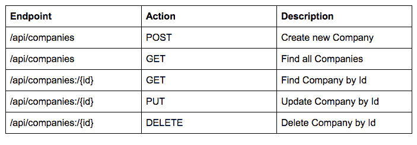
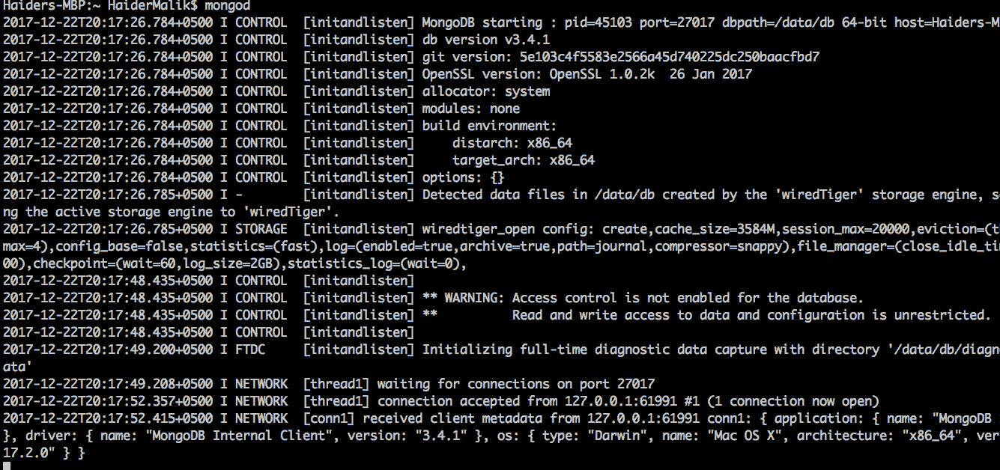
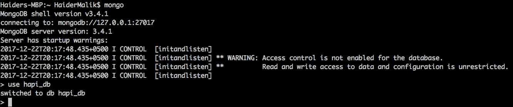
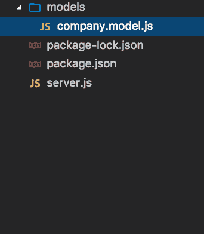
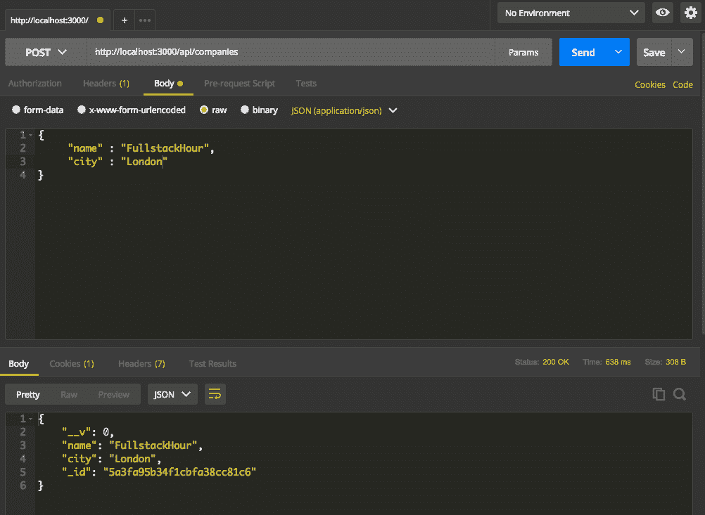
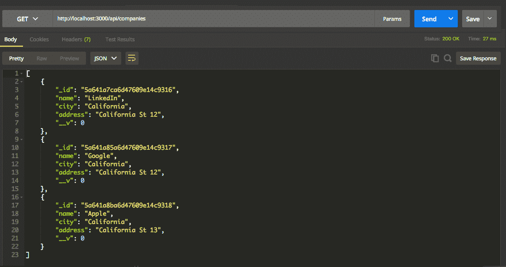
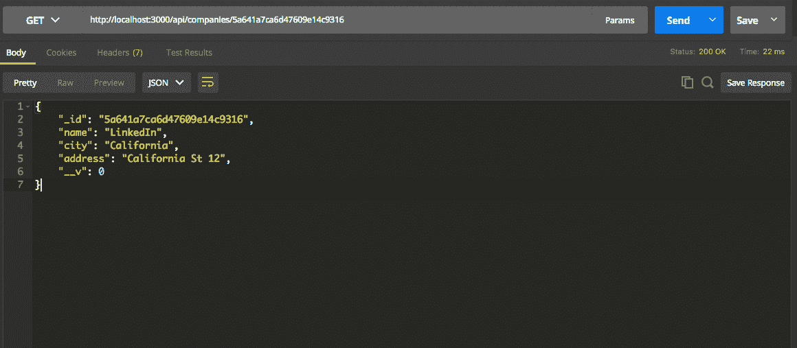
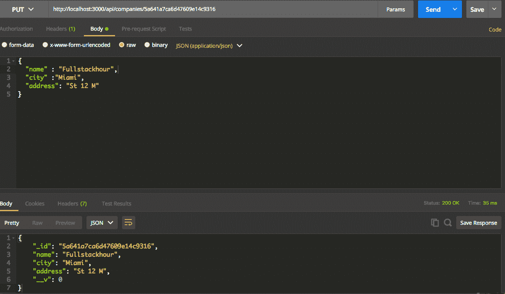
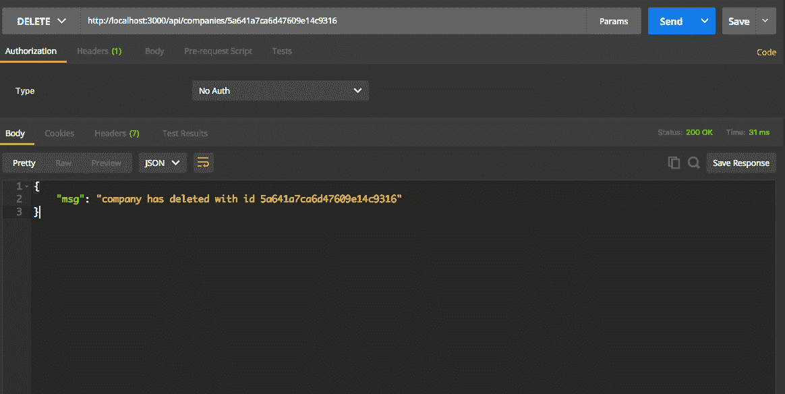
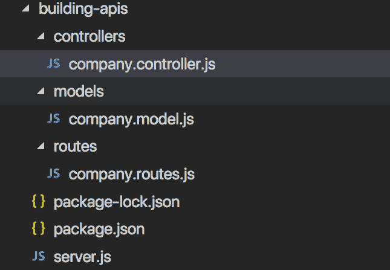

# 用 HapiJs 和 MongoDB 构建高度可伸缩的 API

> 原文：<https://simpleprogrammer.com/building-highly-scalable-apis/>

Hapi.js (also known as hapi) is an open-source framework for web applications. The [most common use of](http://www.amazon.com/exec/obidos/ASIN/1633430219/makithecompsi-20) hapi is to build web services such as JSON API. You can build application programming interface (API) servers, websites, and HTTP proxy applications with hapi.js.

哈比神简化了开发人员编写高度可伸缩 api 的方式。它是一个功能强大、功能丰富的框架，具有坚实的体系结构。如果你是 hapi.js 的新手，建议你看看我之前的[介绍](https://simpleprogrammer.com/introduction-hapijs/)文章。

## 什么是 REST API？

REST(表述性状态转移)是一个应用程序接口( [API](https://en.wikipedia.org/wiki/Application_programming_interface) )，它使用 [HTTP](https://en.wikipedia.org/wiki/Hypertext_Transfer_Protocol) 请求来获取、上传、发布和删除数据。

RESTful API——也称为 RESTful web 服务——基于表述性状态转移( [REST](https://en.wikipedia.org/wiki/Representational_state_transfer) )技术，这是一种架构风格和通信方法，常用于 [web 服务](https://en.wikipedia.org/wiki/Web_service)开发。

哈比神为构建 REST API 提供了一些强大的特性。一些例子是路由、插件、日志、HTTP 接口、错误处理等。

您不需要使用原始 Node.js HTTP 库。哈比神封装了 HTTP 请求的请求和响应对象。哈比神允许您更快地构建 REST API。让我向您展示如何在 hapi.js 和 mongoose 中创建 api

## 安装 Hapi.js

首先，我将向您展示如何安装 hapi.js。打开您的终端并运行以下命令。 **Npm init** 将在应用程序的根目录下创建一个新的 **package.json** 文件。您可以使用 npm install 命令在本地计算机上安装 hapi。Npm(节点包管理器)将从存储库中获取 hapi 包，并将其保存到您本地的**节点模块**文件夹中。

npm init —是
npm 安装— *保存 hapi*

### API 端点概述

我将向您展示如何用 hapi.js 构建纯粹的 **CRUD** (创建、读取、更新、删除)API 端点，我使用了一些 HTTP 动词，如 **POST** 、 **GET** 、 **PUT** 和 **DELETE** 。

*   **POST** 用于在数据库中创建新记录
*   **GET** 请求用于从端点获取记录
*   **PUT** 用于更新记录
*   **删除**用于用 MongoDB 删除记录

### 创建新服务器

首先，我们需要在 hapi.js 中创建一个新的本地服务器。哈比神允许您从 **hapi 创建一个新的服务器实例。Server()** 方法。通过提供主机和端口配置，可以在本地机器上配置 hapi 服务器。您必须使用 **server.start** 方法启动服务器。如果在启动服务器时出错，它将抛出以下错误:

### 运行哈比神应用程序

您可以通过执行以下命令在本地计算机上运行 hapi 应用程序:

node server.js

如果服务器启动成功，那么您将在您的终端或命令提示符下看到这条消息:**服务器运行在端口 3000**

## 将哈比神应用程序连接到 MongoDB

我将使用 MongoDB 数据库来存储我公司的记录。 [MongoDB](https://www.mongodb.com/) 是一个免费开源的跨平台面向文档的数据库程序。Npm 提供了一个优秀的 mongoose 插件来与 MongoDB 交互。[mongose](http://mongoosejs.com/)(对象文档映射器)是 MongoDB 的包装器。我将使用**mongose ODM**将 hapi 应用程序连接到 MongoDB。您必须从 npm(节点包管理器)库安装 mongoose 包。

### 运行 MongoDB

打开您的终端并执行 mongod 命令，这将在您的机器上启动 MongoDB 服务器:

数据库

### 创建新数据库

我将把我公司的所有数据保存在 **hapi_db** 数据库中，但是我们还没有创建数据库。首先，在终端中打开另一个选项卡，执行以下命令:

蒙哥。

它将在您的机器上启动 mongo shell，这允许您运行 MongoDB 语句。

现在，您需要通过运行以下命令来创建新的数据库:

使用 hapi_db

它将在您的 MongoDB 数据库中创建 **hapi_db** 。您可以在下面看到 MongoDB 服务器的输出。

### 连接到猫鼬

我将使用 mongoose 与 MongoDB 进行交互。Mongoose 允许您在 Javascript 对象中定义本地 MongoDB 集合。您还可以在 Mongoose 的帮助下向模型添加验证。

**mongose . connection**继承自 nodejs **EventEmitter** 类。我已经注册了一个**关联**事件的监听器。当应用程序成功连接到 **MongoDB 时，Nodejs 将调用连接的监听器。**

**Server.connection** 用于为 hapi 应用程序配置您的主机和端口。我已经将主机设置为 localhost，端口设置为 3000。您可以选择任何端口号，如 4000 或 8080。

**Server.route** 用于在 hapi.js 中创建一个路由。它将采用一个配置对象，该对象必须具有**路径、方法和处理程序**属性。我还为错误事件注册了一个错误监听器。如果在连接到时发生错误，哈比神将发出错误侦听器

**MongoDB。reply** 方法用于将响应发送回用户。

## 创建新模型

Mongoose 中的一切都是从一个模式开始的。每个模式映射到一个 MongoDB 集合，并定义该集合中文档的形状。模型的实例代表 MongoDB 文档。

你需要在项目根目录下开发一个新的 **models** 目录。你还必须在模型的文件夹中建立一个新模型，我将选择**公司.模型. js** 文件名。

我创建了一个新的 **CompanySchema** 来保存 MongoDB 数据库中的公司记录。该模式表示 MongoDB 中的**集合**。**mongose . model**表示 **MongoDB** 中文档的实例。我已经导出了模型的实例，因为我需要将这个公司模型用于其他 javascript(控制器)文件。

## 在 MongoDB 中添加记录

现在我想向您展示如何在 MongoDB 中创建新公司。我已经创建了一条路径为 **/api/companies** 的新路线。你必须向邮递员发送 HTTP **POST** 请求。我将使用邮递员发送请求。

您可以从 **req.payload** 对象中访问请求参数。我获得了有效载荷对象的名称和城市，还为 **req.payload.name** 字段添加了必需的验证。如果用户在创建新公司时没有提供名称，它将在响应中发送验证错误。

我从 mongose**Company**模型中调用了 create 方法。您还可以通过使用**回复**方法将错误发送到响应中。

如果您将请求从 postman 发送到**http://localhost:3000/API/companies**，您将在响应中看到 200 状态代码。200 状态代码表示请求已成功执行。

## 查找所有记录

我们还可以从公司模型中获取所有记录。我将定义 GET HTTP 请求端点来获取所有公司。你只需要发送 HTTP GET 请求到这个端点 **/api/companies。**

### 查找单个记录

mongoose 模型类还提供了 findById 方法来访问数据库中的单个记录。我将创建一个新的端点来根据 id 查找一家公司。这个端点的路径应该是 **/api/companies/{id}** 。我会从邮递员动态发送公司 id。

我已经使用了 **findById** 方法从 MongoDB 获得了一个公司。如果从数据库获取记录时出错，那么您将收到 **404(错误请求)**错误。如果响应中没有错误，那么您将在回复中获得单个公司。

## 更新记录

您还可以更新数据库中的公司记录。我将向您展示如何通过 Id 更新公司。您可以使用 **findByIdAndUpdate** 方法来更新 **MongoDB 中的记录。**

它将采用四个参数:第一个参数是您想要升级的公司的 id，第二个参数是更新对象的记录，第三个变量是具有新属性的对象，最后一个参数是您需要指定的回调函数 T2。

如果公司没有成功更新，你会得到一个服务器错误，状态码为 **500(服务器错误)**。如果 MongoDB 更新公司成功，您将收到公司的更新记录。

## 删除记录

如果您想要删除任何公司，您必须将删除请求发送到此 URL**http://localhost:3000/API/companies/{ id }。**你要从邮递员动态提供这个{id}。

我将使用 **findByIdAndRemove** 方法从数据库中销毁该公司。您只需要在这个函数中指定两个参数。第一个参数应该是您公司的 id，第二个变量应该是回调函数。

## 重构应用程序文件结构

我将所有的源代码放在一个文件中，这个文件就是 server.js 文件。如果您正在处理一个大型项目，您必须创建一个更好的文件结构来组织您的源代码文件。

我将为我的文件结构使用一些 **MVC(模型视图控制器)**设计模式。我将把我所有的路由操作或请求处理程序放在我的 **controller.js 文件**中，并且有一个单独的文件用于定义路由。我将把我所有的猫鼬模型放在**模型**目录中。

如果您想在这个应用程序中注册一个新的端点，您需要在 **routes.js** 文件中添加一个新的路由，并在控制器文件中添加路由操作处理程序。您可以在下图中看到确切的文件结构。

## 创建新的公司控制者

**控制器**类负责以下处理阶段:

*   定位要调用的适当操作方法，并验证它是否可以被调用。
*   获取用作操作方法参数的值。
*   处理动作方法执行过程中可能出现的所有错误。

现在，我将向您展示我的公司控制器文件。您可以通过复制这个文件中的代码来重构您的 **company.controller** 文件。

## 创建新的公司路线

每个路由都有一个请求处理程序或操作方法。我们将把应用程序逻辑放在控制器文件中。我将在 **company.routes.js** 中定义我的公司相关端点。我已经提到过，每个控制器都应该有一个单独的路由文件。我也申请了 **SRP(单一责任模式)**。每个文件应该有一个单独的责任。让我们看看 **company.routes.js** 文件中的代码。

### 掌握 Hapi.js 构建可伸缩的 api

您已经学习了如何在 hapi.js 中构建 CRUD(创建、读取、更新、删除)Restful API，现在您能够将 hapi 集成到 MongoDB 中。

我还向您展示了在 hapi.js 中维护文件夹结构的一些最佳实践。在下一篇文章中，我将向您展示如何在 Hapi.js 中添加*验证。*您可以下载构建 api 模块的完整[源代码](https://github.com/HaiderMalik12/hapi-casts/tree/master/building-apis)。