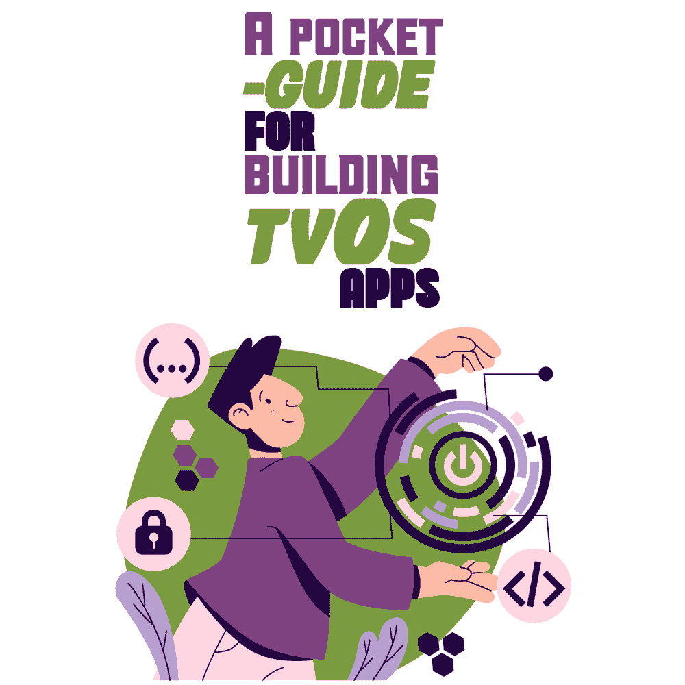
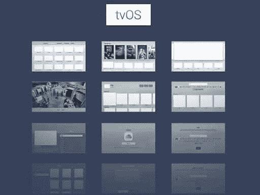
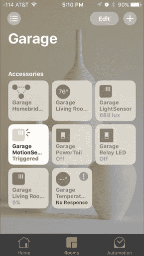

# 构建 tvOS 应用程序的袖珍指南

> 原文：<https://simpleprogrammer.com/building-tvos-apps/>

Would you like to be part of a $3 trillion technology—the highest-grossing of 2022? As per reports, [Apple was valued at 3 trillion USD in 2022](https://www.nytimes.com/2022/01/03/technology/apple-3-trillion-market-value.html), making it the highest-grossing technology of the year. Creating and launching apps for Apple TV can give OTT apps viewership a great boost!

然后，你可能会问，为什么你需要自己的苹果电视应用程序？

我已经涵盖了你，因为在这本袖珍指南中，我将涵盖你需要了解的关于 Apple TV 的所有内容——为什么你今天需要 Apple TV，以及 Apple TV tv 应用开发的三大方式[T1】。另外，我将分享一些 TvOS 功能的奖励列表。](https://www.resourcifi.com/blog/app-development/?utm_source=SimpleProgrammer&utm_medium=offsite)

## 定义苹果电视

Apple TV 是一种紧凑型设备，可以使用 HDMI 电缆连接到电视机。一旦它连接到电视，个人就可以轻松地点播专门为 Apple TV 创建的视频。

简而言之，视频业务的用户可以下载 tvOS 应用程序，在方便的时候观看。这些应用程序可以与电视频道相关联，用户可以毫不费力地访问这些频道。

总而言之，Apple TV 被视为与精通技术的观众联系的完美选择，这些观众包括 z 世代、千禧一代和技术极客。

## 了解 Apple TV 应用程序

Apple TV 应用程序是可以从 iOS 应用程序商店下载、访问和通过 Apple TV 插件设备流化的 iOS 应用程序。用户可以获得超过 100 个预装的苹果电视应用，如 Hulu、网飞、迪士尼、HBO 等。由于这些应用程序是预装的，用户可以根据自己的选择删除或组织它们。

有趣的是，如果 Apple TV 设备通过 HDMI 线连接到电视或 iPad，人们可以毫不费力地在屏幕上查看所有这些应用程序！

[来源:Pinterest](https://in.pinterest.com/pin/694117361327287193/)

当 OTT 应用程序在 tvOS 应用程序商店上可用时，用户可以更容易地访问应用程序并将其下载到他们的 Apple TV 设备上。务必注意 tvOS 应用程序商店中 tvOS 应用程序的可用性。

tvOS 应用程序是由 iOS 开发者为流媒体节目和播客策划的特殊应用程序。在移动应用的应用商店上找不到它们。

## 苹果电视应用程序的流行

如果我们谈论苹果作为一个品牌所积累的忠诚度，那就没有可比性了。苹果拥有全球客户。如果你是苹果用户，那么你应该知道转向另一个品牌或技术的困难。

这意味着，当苹果在全球市场推出任何产品时，它都会吸引全世界的关注——非常吸引。这很可能是 OTT 应用首次亮相选择 Apple TV 并很快接触到大量精通技术的观众的关键原因。

作为一个声誉卓著的品牌，苹果在技术升级方面总是领先于竞争对手。这不仅保证了无缝的用户体验，还鼓励了 OTT 内容创作者制作更好的内容。

现在，在我们讨论了苹果电视和苹果电视应用程序之后，让我们了解更多关于苹果电视应用程序在 tvOS 上的开发。

## 苹果电视的应用程序开发

使用下面列出的方式，你可以在 iOS 商业平台上获得你的视频业务，寻求 Apple TV tv [应用程序开发](https://simpleprogrammer.com/mobile-app-development-trends-2022/)——你可以这样做节省开支。

### 雇佣一个专业的 tvOS 应用开发者

一些品牌愿意投资以获得更好的结果。在这种情况下，专业的 tvOS 应用程序开发公司就出现了。这样的公司/机构由勤奋的 tvOS 开发者和程序员支持。

他们在创建/开发 tvOS 方面的专业技术和知识有助于根据要求构思正确的线框和最终产品。向 iOS 开发者透露细节将有助于他/她对该应用有一个大致的了解。

但是这要花多少钱呢？

整合设计、定制、设计等。需求资源。一个人会为 tvOS 的苹果电视应用程序开发投资一大笔钱。此外，开发商还将收取如下费用:

*   技术支持
*   修复 bug
*   集成更新
*   对应用程序进行测试

一旦 tvOS 应用程序通过了这些阶段，就可以进入下一个测试阶段了。

### 租赁一个白色标签的 tvOS 应用程序

许多公司预算不足，租赁白标 tvOS 应用程序是一种预算友好的方法。软件业的白标意味着一家公司生产软件，并为另一家公司重新命名。

您可以找到各种 OTT 应用，这些应用提供了提供 tvOS 示例应用的公司。使用预设的应用程序模板，应用程序看起来像是新构建的。

除此之外，还将获得以下好处:

*   品牌视频点播/直播应用
*   访问 OTT 平台以管理应用内容和用户
*   促进视频点播业务发展的一揽子营销工具
*   直播视频的功能

### 使用基于 SaaS 的平台

转向基于 SaaS 的平台是创建你自己的苹果电视应用程序的另一个首选。这是一个具有多种优势的无忧选项。苹果现在将自己定位为一个基于 SaaS 的平台。最常见的是，我们都知道它的名字叫 iOS。备受喜爱的 iPhones、iPads、Mac 等。，都搭载了苹果自己的 SaaSyness。

下面列出了使用基于 SaaS 的平台的优势。

*   预算友好。使用位于 SaaS 的平台为[的 tvOS 开发 Apple TV 应用程序](https://www.amazon.in/Getting-Started-Apple-TV-Ridiculously/dp/1610421310/ref=tmm_pap_swatch_0?_encoding=UTF8&qid=1649162175&sr=8-3)是一个预算友好的选择。提供这些服务的公司储备了各种模板来创建 OTT tvOS 应用。有了更多可供选择的模板，启动应用程序变得更加容易。个人只需要选择模板，上传媒体文件，并设置货币化。
*   **节省时间。**当您使用基于 SaaS 的平台进行 OTT 应用开发时，整个过程会很顺利。由于数据&设计是现成的，开发人员不需要花很长时间来创建应用程序。
*   **由专家管理。当公司从 SaaS 的平台上获得 tvOS [应用开发](https://simpleprogrammer.com/programming-languages-mobile-app-development/)服务时，项目由整个专业团队开发。由项目经理领导的开发人员和设计人员的专门团队将负责 OTT 项目。此外，他们还与客户保持联系，以实施建议。**

只有通过一些特定的功能才能享受到好处。接下来，您将了解 tvOS 的特性。

## tvOS 功能列表

在所有的软件或设备中，提供给用户的功能决定了整个概念的成败。所以我们来看看 Apple TV OS 的新功能。

### Siri 遥控器

我们知道 Siri，这是苹果公司创造的虚拟助手，功能就像谷歌助手一样。Siri 支持并响应不同的命令，比如，他们说了什么？谁在电影里？打开字幕等。

### 多用户支持

[苹果 tvOS 在版本 13](https://www.amazon.com/dp/1629176206/makithecompsi-20) 中引入了多用户支持。这一功能支持不间断地在账户间切换。因此，用户可以轻松访问个性化音乐应用程序和 Apple TV Up，而不会干扰他们的帐户。

在 14 版本中，这个功能被扩展到了 Apple Arcade。它的加入使得用户可以继续游戏并追踪游戏中心的成就。

### -我要回家了

HomeKit 是苹果公司开发的一款特殊软件。它充当一个集线器，使用户即使不在家庭网络中也能操作他们的设备。使用 HomeKit hub，设置日常提醒、闹钟等任务。，可以轻松完成。

Siri 也可以访问任何与 HomeKit 连接的设备。如下图所示，应用程序在使用时会将功能图标显示为“活动”。

来源:Pinterest

在版本 14 中，苹果引入了安全摄像头的功能。当兼容的摄像机收到警报时，它会在与之相连的屏幕上显示画中画。

### 空中屏保

空中屏保是集成到 tvOS 中的一项新功能。所有图像都是用 4K HDR 设备拍摄的。可以将首选项设置为在屏幕空闲时自动下载。

## tvOS 应用程序开发可以提供新的机会

为苹果电视创建或开发 tvOS 可以为你的职业生涯提供新的机会。在这篇文章中，我介绍了 tvOS 的基础知识，包括它的主要特性。

尽管各大操作系统为保持其在市场中的突出地位展开了激烈的竞争，但毫无疑问，苹果凭借 Apple TV 成功实现了第三方平台。苹果的 tvOS 框架在基于 iOS 的设备上运行流畅——比如 Apple Watch。

改版后的苹果 tvOS SDK 给了主要操作系统一个新的机会来集成用户可能在即将到来的版本中期待的新功能。