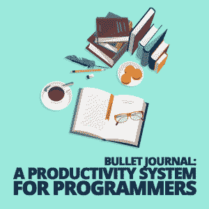

# Bullet Journal:程序员的生产力系统

> 原文:[https://simple programmer . com/bullet-journal-productivity-programmers/](https://simpleprogrammer.com/bullet-journal-productivity-programmers/)

Whether you work full-time as an employee, for yourself as a business owner/freelancer, or are juggling both, you have a lot to keep track of.

开发包括跟踪每个项目的大量细节，当你必须管理客户时，细节会加倍。此外，还有整个“拥有生活”的事情，它有各种各样的任务、日期、义务和烦恼。

如果你正在经营自己的企业或者正朝着这个方向发展，管理这些信息是非常重要的。错过约会、错过截止日期、忘记细节不是任何人的错，而是你自己的错。

因此，计划者、跟踪工具、笔记应用程序和其他相关软件成为大生意也就不足为奇了。看看你最喜欢的应用商店的“生产力”类别。只有游戏超过了你在那里找到的应用程序的数量。

但是许多开发人员最终将信息分散在几个系统中。备忘录存储在不同的应用程序中，这些应用程序可能会也可能不会在您的所有设备上同步。文本文件分散在不同的项目中，而便利贴和纸片则被塞在口袋里，夹在书页之间，贴在显示器上，让你记住它们为什么在那里。

所以这是我的建议:扔掉所有这些，用一支笔和一个笔记本取而代之。

[Bullet Journal](https://bulletjournal.com/) (简称 BuJo)是一个管理笔记、任务、约会的框架(有一个小“f”，没有 API 文档)。就像我们开发人员使用的更好的框架一样，它很灵活，您可以根据自己的需要进行调整。

## 收集信息的模拟系统

程序员在工作中会遇到大量的新信息。我们会接到新的需求，在编辑代码时寻找改进代码的新机会，发现新的错误，学习新的库和技术。我们不能同时对所有这些事情采取行动。BuJo 适应我们的个人工作流程，并在我们积累信息时为我们提供一个处理信息的地方。

BuJo 可以轻松地将您的笔记和待办事项保存在一个地方，在您输入信息时对其进行分类，并随时确定您需要做什么。

Bullet Journal 由称为每日日志、每月日志、未来日志和索引的模块组成。

*   每日日志是系统的核心，在这里你可以跟踪任务和约会，并在进行过程中编辑笔记。不同的项目符号表示不同类型的条目，这使得数据输入快速，扫描条目快速且直观。每日日志可以保存任务和约会，你可以添加任何事情的笔记。
*   在**月日志**中，每个月有两页，一页列出了约会的日期和截止日期，另一页列出了你想在那个月完成的任务。
*   **未来日志**就像它听起来的那样:一个按月组织的日志，其中你列出了当月之后到期的约会和任务。
*   将所有这些联系在一起就是**指数**。你给你的杂志页编号，并使用索引按月份或主题查找章节。如果每天的日志最后变成了一个干净的页面，上面有会议的笔记或项目的想法，你可以将它编入索引以供将来参考。

然而，BuJo 的真正优势在于迁移的概念。当我们不能完成一项任务或需要推迟时，我们会把它放在该放的地方。

因此，当我们遇到需要重构的代码，或者需要单元测试的类时，我们可以做一个记录，然后在我们下一次 BuJo 审查时，将它放在我们的日志中，这样到时候就可以完成了。

[这个四分钟的视频](https://www.youtube.com/watch?v=fm15cmYU0IM)很好地介绍了 BuJo。它甚至可能是你所需要的一切。系统就是这么简单。

## 为什么要开始使用子弹日记

你可能会想，“所以，这是一个潮人 PDA？说真的？”

是的。说真的。

我存在的时间够长了，曾经有过第一代苹果牛顿，然后是几个不同的 Palm Pilots，甚至还有一个心灵感应。自从 iOS 和 Android 取代 PDA 以来，我已经记不清我用过的所有不同的组织者应用程序了。(还记得《记得牛奶》吗？)

但是不管我用什么软件，我还是会把便利贴扔在桌子上、口袋里，有时甚至粘在手机上。即使是评价最高、宣传最广的应用程序最终也没有被使用，是在浪费金钱。

我肯定应用程序对很多人都有用，但从我和一些朋友的交谈和观察来看，纸和笔仍然是很多人的可靠选择。

从小学开始，我的书法就很糟糕，双手也做过几次手术。写作可能是痛苦的，但不管我怎么努力，我最终都会拿着笔回来。日记给了我一个存储信息的地方，写下东西有助于我记住它们。

## 写下来的力量

有研究表明，写下某件事比打出来更容易记忆。这也有直观的意义，因为与使用键盘相比，手写迫使你慢下来，特别是如果你是一个快速的打字员。

BuJo 通过*迁移*更进一步。未完成的任务被转移到下个月(或者一天，如果你用我的方法的话)，这意味着你重新写它们，增加你保留信息的机会。把事情写下来有助于你记住它们，但是抄录下来*会让你拥有它们。*

Forcing yourself to write things down and copy them has another powerful side effect: It helps you decide what’s important. I migrate tasks every evening in my journal. If they’re not done after a few days, I tire of copying them and have to decide if I will ever do them.

这是一个管理和优先处理开发人员每天遇到的问题和信息的机会。

有时优先级会改变(或者对我们来说被改变了),任务需要在第二天移到队列的顶端。不太重要的优先级放在每月日志中，较长期的项目放在未来日志中。其他的被丢弃和遗忘，这样我们就可以专注于重要的事情。

### 开环是思维-黑仔

把事情做好(GTD) 我发现这个系统一直是最有用的，许多应用程序都在大胆尝试实现它，但应用程序反映了它们的设计师的信念。如果你不同意他们的选择和实现，你要么发现自己试图强迫应用程序按照你的意愿弯曲，要么你就是不使用它。通常结果是你的信息分散在不同的应用程序中，或者那些便利贴粘在你的屏幕上。

我从 GTD 那里学到的最有价值的概念之一是[将开放循环收集到一个单一的可信系统](https://gettingthingsdone.com/2011/10/gtd-best-practices-collect-part-1-of-5/)中的过程。

开环是未完成的承诺。我们典型的日子充满了这些:回电话，更新库，构建需要修复，计划新功能。它们可以是任何在你脑海中挥之不去的东西，让你无法专注于你现在需要完成的事情。

因此，对于像开发人员和作者这样的知识工作者来说，留出开放循环供以后审查是一项关键技能。当它们潜伏在我们的大脑深处，而不是被归档时，它们所引起的语境转换是昂贵的。

GTD 让我们收集开放循环，对 BuJo 来说，这意味着写下它们，然后定期处理它们。“可信系统”的概念非常重要。一张纸片意味着你必须记住它的存在和你把它放在哪里。手机上的笔记应用不可信，除非定期检查是你日常工作的一部分。当你在一个可信的系统中把某样东西放在一边，你可以忘记它，因为你知道你以后会记得它。

bu jias 是这样一个系统，因为它是一个你随身携带的物理项目，并定期检查以处理你放入其中的条目。

我把 BuJo 作为一个 GTD 系统，每天而不是每月进行一次回顾。我每天晚上回顾我的日志，并处理当天的新增内容。BuJo 是一个框架——您可以随意更改它。

### 远离屏幕更容易

我晚上复习时远离电脑，身边也没有手机。我这样做的一个原因是，它迫使我诚实地评估我的一天，并帮助我对第二天做出有时很困难的决定，而不是浪费时间浏览网页或偷看 Twitter。

另一个原因是，这是一种让我在睡觉前远离屏幕的方式。我的复习经常是我晚上和家人在一起之前做的最后一件事。有证据表明，睡前半小时左右远离电子产品有助于更好的睡眠。

白天，在我信任的系统而不是设备上写日志，更有可能让我快速记下一些东西，然后继续工作。

将软件相关的问题直接输入吉拉似乎更快、更直接，但有时对吉拉的快速访问变成了半个小时的浏览工件和检查团队。

### 你可以把它变成你自己的

当您使用 BuJo 时，最好的系统是您使用的系统，您使用的系统是适合您工作流程的系统。

如果你做了很长时间的代码，并且有幸一次做一个项目，每周或每月的回顾可能会更好，你甚至不需要将来的日志或索引。

如果你在一个管理岗位上，每天回顾和建立详细但灵活的时间表可能是最好的。

一个空的笔记本和一个组织它的框架永远比软件更灵活。我们都写过代码，我们知道我们的观点是如何渗透进来的，不管我们写的是什么。

由于 BuJo 是基于一组灵活的模块，所以您可以根据自己的需要省去某些部分或添加新的模块。虽然我不使用笔记或任务管理应用程序，但我仍然依赖日历应用程序进行一些提醒，并且仍然背负着日常工作的 Outlook。

## 你需要一个系统

对于开发人员来说，开始使用笔和日记来保持条理似乎是一种倒退，但是有足够的理由去尝试一下。Bullet Journal 是一个模块化系统，可以成为 GTD 的基础，十多年来，许多开发人员都采用了这个系统，并取得了不同程度的成功。

通常最有效的系统是最简单的，没有什么比一个笔记本和一支笔更简单的了。

但是最终，找到一个适合你需要的系统并使用它。它会帮助你掌控你的职业和事业，让事情发生。