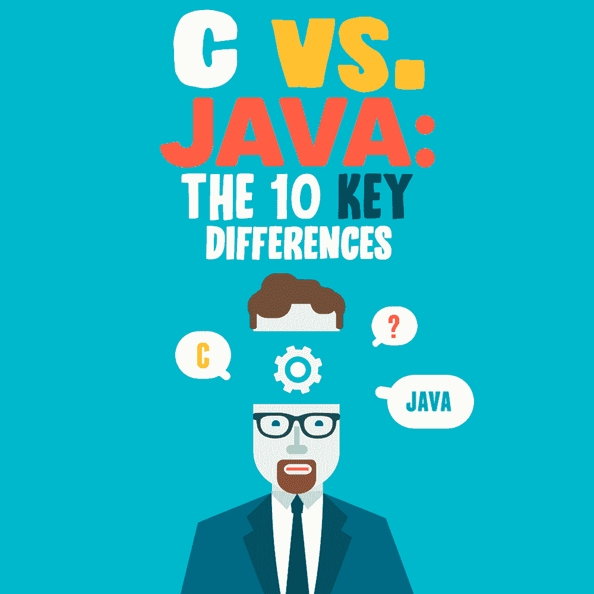

# c 与 Java:10 个关键区别

> 原文：<https://simpleprogrammer.com/c-vs-java-10-key-differences/>

Both Java and C are powering some of the most robust enterprise platforms on the market. They have similar support, OOP, and syntax. This might have made you wonder which one is better—Java or C?

也许，答案取决于你的学习目的，因为你将要在两种仍在主流使用的最古老的编程语言之间做出选择。

然而，尽管有上面提到的相似之处，事实是 Java 和 C 是两个不同的世界。在这篇文章中，我将向你展示它们之间的主要区别，这样你就可以知道它们各自的特点。

## C 和 Java 编程语言之间的 10 个关键区别

c 编程语言是一种通用的过程编程语言，支持结构化编程、递归和静态类型系统的词法变量范围。目前，它是最著名和最基本的语言。丹尼斯·里奇于 1970 年在贝尔实验室开发了它。

另一方面， [Java](https://www.java.com/en/) 是由詹姆斯·高斯林设计的面向对象的、解释性的高级语言。Java 因其平台独立性行为和其他用途而闻名，如桌面计算、[、移动应用开发](https://simpleprogrammer.com/programming-languages-mobile-app-development/)、游戏和数值计算。因此，它是这个时代最有影响力的编程语言之一。

记住这些，现在让我们仔细看看它们的主要区别。

### 体系结构

[C 编程语言](https://www.cprogramming.com/)是中级的，结合了机器和高级语言。既然是编译，就把代码转换成机器语言。此外，C 是面向过程的，遵循自顶向下的方法。

另一方面，Java 是一种高级的、[面向对象的编程语言](https://www.amazon.com/dp/0135181968/makithecompsi-20)，它使用编译器或解释器将代码转换成机器语言。在 Java 中，代码首先转换成字节码，然后虚拟机执行字节码。因此，Java 是一种解释语言，Java 遵循自底向上的方法。

### 内存管理

c 支持基于用户的内存管理，而 Java 使用垃圾收集器。

Java 具有自动内存管理功能。当程序执行时，它以各种方式使用内存。例如，对象位于内存的“堆”部分，这与垃圾收集有关。这保证了堆有空闲空间；它会找到并删除无法到达的对象。

此外，JVM (Java 虚拟机)在分配任何对象时都会检查大小。JVM 主要区分大小，但是这种区分也取决于 JVM 版本、垃圾收集器等。

另一方面，C 编程有许多内存分配和管理功能。该函数位于头文件 **< stdlib.h >** 中。函数 **void calloc** 分配 number 元素的数组， **void free** 释放块， **void malloc** 分配数组并保持它们未初始化，最后， **void realloc** 重新分配内存，将其扩展到新的大小。

### 范例

关于[设计一门编程语言](https://www.amazon.com/dp/1800204809/makithecompsi-20)从软件开发开始就有不同的意见。因此，每种语言都有重要的规则、概念和原则，称为编程范例。

Java 和 C 都是多范例。例如，C 是一种过程化、结构化和命令式的编程语言。另一方面，Java 是一种面向对象的、通用的、命令式的函数式编程语言。

如果您构建一个应用程序，并希望它运行得更快，您可以选择 c。但是，如果您希望具有类似速度的可移植性，您应该选择 Java。

### 变量声明

c 在块的顶部声明变量，但是 Java 可以在任何地方声明。同样，C 使用一个 **free()** 变量来释放任何变量，允许释放内存块，Java 使用垃圾收集器编译器。

声明一个变量后，Java 在内存中为该数据类型设置位，并分配名称。因此，Java 需要声明数据类型，以便进一步使用和表示。

在 C 编程语言中，应该在使用变量之前声明变量。与 Java 不同，C 在声明变量时不分配内存。值得注意的是，C 语言有三种类型的变量:局部变量、全局变量和静态变量。另外，Java 不需要指针语法，而 C 显式处理指针。

**C 变量声明:**

`#include <stdio.h>`

`void function()`
`{`
`int x = 10; // local variable`
`}` 
`int main()`
`{`
`function();`
`}`

**Java 变量声明:**

*String name = " Alena "；*
*System.out.println(名称)；*

### 功能

一起执行的一组语句就是一个函数。在 C 编程中，它被称为函数，而在 Java 中，函数被称为方法。

Java 方法是一个顾名思义的代码，但是它与任何对象相关联。您可以将参数传递给方法，并从它们那里获得一些返回值，但是它们总是与一些对象相关联。Java 支持异常处理。

相比之下，C 中的函数只是一段代码，你可以随时通过它的名字调用它，并向它传递参数。你也可以从任何函数中得到结果。C 标准库有各种内置函数，如 **main()、strcat()、memcpy()** 等。c 不支持异常处理，为此它经常有程序流维护的问题。Java 支持方法重载，C 不支持。

**C 语言中的函数声明:**

`return_type function_name( parameter list ) {`
`body of the function`
T2】

**Java 中的方法声明:**

`returnType methodName() {`
`// method body`
T2】

### 速度

语言的速度效率取决于它的用法。首先，C 语言是为机器偏好而开发的，所以代码直接进入机器。

另一方面，Java 需要一个虚拟机将 bite 代码转换成机器语言，然后交付给机器。它增加了额外的过程和时间。所以，在那种情况下，C 比 Java 快。

由于内存分配的原因，Java 在运行时比 C 快，但这种情况很少见。Java 单独分配堆，在数据结构和自动垃圾收集方面提供了灵活性，这比 c 语言高。

### 安全性

在安全性方面，内存损坏是高安全性因素中最大的一类。不幸的是，Java 没有任何模拟规则，因为它的类型系统可以防止内存损坏——这在 c 中变得更加困难。

C 和 Java 在权限提升方面都有一些规则。然而，虽然 Java 有一个内部特权系统，但 C 不支持它。结果，你在 C 中得到静态数据隐藏，在 Java 中得到私有数据隐藏。

如果你在 Java 和 C 之间选择一个网页浏览器的插件，你应该选择 Java，因为 Java 经常一次发布大量的安全补丁。

### 对象管理

c 提供手动对象管理，而 Java 提供自动对象管理。c 操作员可以手动创建和销毁对象。另一方面，Java 很大程度上依赖于垃圾收集过程来完成这项工作，并且需要一些时间来收集。但是您不能承担在关键部分中意外使用 Java 进行内存管理的风险。

### 汇编

As you already know, C is a compiled programming language, and Java is interpreted. Likewise, C directly converts codes into machine language, while Java transforms codes into bytecode first, then converts this bytecode into machine language. Therefore, compiled languages tend to be faster than interpreted languages, though their platform dependency is questionable.

### 学习曲线

一门新语言的学习曲线取决于学习者以前的编程经验。如果你是新手，C 应该是更简单的语言，因为它需要学习的概念更少，所以你可以在很短的时间内很快理解它的意思。

另一方面，作为一个面向对象程序，Java 提供了许多特性，可能需要更长的时间来掌握所有的功能。

## c 与 Java:先选哪个？

明智的做法是[开始学习早期语言](https://simpleprogrammer.com/programming-language-should-learn-first/)，因为当前的语言是基于早期语言语法的。同样，Java 从 C 和 C++中派生出了它的语法和一些特性。

由于 C 编程的功能较少，学习起来不太复杂，也不容易出错，所以先掌握 C 编程是明智的。然后，稍后，你可以学习 Java 和其他语言，如 C++、C#、Objective-C 或 Python。

学习 C，当你处理计算机科学和软件开发的低级语言时，你将不得不学习更多的编程。作为面向对象的编程，Java 被广泛用于开发项目和其他编程范例。它也是当前世界上收入最高的编程语言之一。所以，最终还是要选择适合自己的。