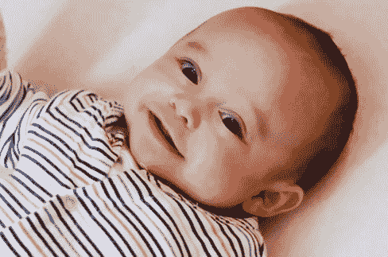
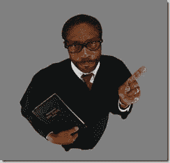
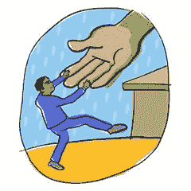

# 批评别人的工作

> 原文：<https://simpleprogrammer.com/calling-someones-baby-ugly/>

自从 [TypeScript](http://typescript.codeplex.com/) 公布后，我就一直无法停止思考公众的批评，以及它有多糟糕。

当我公开批评公众的批评时，请允许我自己做一个伪君子。当然，我不认为我是虚伪的，因为我这篇文章的目的是谴责某人的工作，而不是对一般的行为做出任何判断。但如果你想叫我伪君子，请便，我不介意。

当 [TypeScript 被公布的时候](http://blogs.msdn.com/b/somasegar/archive/2012/10/01/typescript-javascript-development-at-application-scale.aspx)在我看来，Twitterscape 被一种嗜血的愤怒激怒了，有人把 snarkiness 的刻度盘直接调到了 11。

我定期喜欢的各种友好的好人都在喷涌各种仇恨。

我不认为他们是故意的。我不认为他们的目的是伤害任何人的感情或破坏某人的工作，但我也认为没有多少人在通过电线喷涌谴责时真正思考他们在做什么。

## 每个人都喜欢自己的孩子

我自己也是最近才为人父母的，有一些朋友和熟人也是最近才为人父母的，我发现人们真的真的很喜欢自己的孩子。

我不能确切地告诉你为什么。我认为这可能是多种因素的混合。在某种程度上，这是一部分自然本能。但是，我也认为这与成为某个事物创造的一部分的想法有很大关系。成为另一个人造物的一部分，使那个人对我们来说是特别的。

我确实见过一些丑陋的婴儿。确实不是所有的婴儿都可爱。但是，我还没有找到一个人同意我的观点，他们的孩子很丑。部分是因为我永远不敢告诉别人我是这样想的，部分是因为他们的眼睛会对我的观察完全视而不见。

实际上很少有人会厚颜无耻地说别人的孩子丑。几乎所有人都能意识到，说别人的孩子丑是多么糟糕的事情。我们不会亲自去做，甚至不会在脸书做。

如果你有孩子，或者你有一些有孩子的家庭成员或朋友，你可能已经在脸书上看到或张贴了你孩子的可爱照片。想象一下，当你这么做的时候，你的朋友列表和他们的朋友列表中的所有人都在评论你的孩子或朋友的孩子有多丑。你会有什么感觉？

事情的真相是:如果你想制造最糟糕的敌人，就说一些关于某人孩子的坏话。你很可能会树立一个终生的敌人。

当你批评某人的工作时，尤其是如果他付出了巨大的努力，你基本上是在说他们的孩子丑。(如果他们的“孩子”有某种精神或身体残疾，这一数字会翻倍。)

## 为什么批评是不好的

我不得不承认，我曾经是一个大批评家。如果有人做了我认为不对的事情，我会立即指出来。我会趾高气扬地站在那里，相信让这个世界变得更好的唯一方法就是清除所有漂浮在外面的愚蠢想法。

我曾经相信负强化。这种观点认为当众叫人出来羞辱他们会让他们改变。

男孩被我看错了。我错得太离谱了。

一本叫做[《如何赢得朋友和影响人》](http://www.amazon.com/gp/product/1439167346/ref=as_li_ss_tl?ie=UTF8&camp=1789&creative=390957&creativeASIN=1439167346&linkCode=as2&tag=makithecompsi-20)的书改变了我的人生。

在那本书里，作者用了整整一章来阐述永远不要批评、谴责或抱怨的观点。

关键是，99%被你批评的人无论如何都不会认为自己有错。

> “一个被违背自己意愿说服的人仍然持有同样的观点。”T3】
> 
> *–本杰明·富兰克林*

事实证明，这并不是说服任何人相信任何事情或改变行为的有效方式。这在动物和人类身上都得到了证明。

它会产生可怕的递减效应，摧毁一个人的自我价值，阻止一个人相信自己。

更糟糕的是，有一天它可能会回来咬你。不管你是否相信因果报应，它的原理似乎仍然在我们的生活中发挥作用。

令人惊讶的是，你经常坐在桌子对面的椅子上，面试你真正需要的工作的人碰巧从事你公开谴责的开源项目。哎呦。

底线是，如果你试图改变某人的想法，批评不是一个有效的方法。

## 扭转局面

如果你还不相信，让我们稍微改变一下。

如果有人说你的宝宝丑，你会怎么做？

也许你没有孩子，那样的话:

你还记得上一次有人给你尖锐的批评吗？

那是什么感觉？你喜欢吃吗?

哦，但是安德斯是个大男孩。安德斯创造了 C#。安德斯可以接受。*(我说的安德斯是* [*安德斯·海尔斯伯格*](http://en.wikipedia.org/wiki/Anders_Hejlsberg)*C #的首席架构师，TypeScript 的主要创造者之一。)*

可以吗？

你真的认为他和你有什么不同吗？

你真的认为他不会去查看推特，看看人们对他的“孩子”说了些什么好话，结果却遭到了一连串严厉的指责吗？

你能想象如果你花了两年的时间去做一些你真正感到兴奋的事情，一些你认为对社区有益并且人们会欣赏的事情，却发现一群纸上谈兵的专家甚至没有给你创造的东西一个机会，甚至在它第一次呼吸空气之前就试图杀死它，你会有什么感觉？

我不想这么夸张，但是有人不小心毁了你全心全意投入的工作——这很伤人！很疼，很痛！你是谁，你取得了什么成就都不重要。

这里还有一个外卖。我们不仅可以决定不批评别人的工作，还可以决定如何回应别人对我们的批评。

当你批评某人时，你期望达到什么目的？不管是什么，当有人批评你的时候，这就是你应该做的。

在许多情况下，我们只是想确保我们的意见被听到。我们想听听我们在发现为什么别人的想法是错误的或有缺陷的方面有多聪明。别担心，这是人之常情，我们都在某种程度上以这种方式运作，我知道我是这样。

那么我们能做些什么呢？

当有人批评我们时，我们可以承认他们所说的话，并认真考虑。你不必假设他们是对的，但你也不应该假设他们是错的和愚蠢的，无论他们用多么丑陋的包装来传递内容。

每个人都寻求认同，所以给予认同。每个人都需要一些建议，所以接受吧。

毕竟，他们可能是对的。

## 善意的反对

现在我不是建议你对任何在互联网上抛出项目的白痴给予虚假的赞美，也就是所谓的奉承。

这将是不真诚的，就像用你的 twitter snark-blaster 给他一个新的 ahole 一样毫无意义。

你仍然可以不同意某人的观点，或者不喜欢他们的一些作品，但不要表现得像个混蛋。

我从许许多多相反的错误中学到的关键规则是“你永远不能太仁慈。”

我再说一遍！我会加粗，我会用斜体，我会用引号。

**

**

*

如果整个世界都意识到这一点，我们可能会提升到更高的意识层面，在物质中漂浮，一起歌唱 Kumbaya。

无论何时，当你在屏幕上打字或者思考该说些什么或者认为某人有多愚蠢时，我建议你记住，你真的不能太仁慈。

你看，攻击某人和比较和对比观点是有很大区别的。

当你攻击某人时，你只提出你的想法，并摧毁他们的想法。这往往会让某人处于守势，除非他们有甘地那样的禁欲主义，否则他们很可能会对你发起反击。

当你比较和对比观点时，你是在公平客观地陈述他们的观点，就像你自己的观点一样。这个想法是，你试图通过让他们自己的推理来决定，当客观地呈现时，你这边的天平比他们那边的天平要重一点，从而赢得他们的支持。

注意这里的区别。用某人自己的心智能力把他推向你认为正确的方向，而不是硬塞给他们，因为他们是“愚蠢的白痴，什么都不知道。”

这需要练习，我自己也不是这方面的专家。你可以看看我的博客文章，看看我是如何失败的。虽然，我在努力。

我发现，当我以礼貌和尊重他人的方式陈述自己的观点时，我是最成功和最有效的。

我经常试着从认识到我可能真的错了开始。这很难做到。问题是很难意识到你可能是错的，因为如果你有做出这种评估所需要的知识，你一开始就不会错。

因此，只要假设你可能是错的，不要担心它是否有意义。

其次，我尽量先听。没有人会听到你的声音，除非他们知道自己已经被听到了。因此，确保你听到了你试图说服的人的声音。如果他们发明了新的东西，那意味着你必须先尝试一下。你不能坐视不管，对你没有尝试过的事情指手画脚。

按照同样的想法，不谈论问题而不提供解决方案是好的。这样做就叫抱怨。没有人喜欢抱怨，即使是同意你的人也经常被抱怨激怒，因为抱怨毫无意义。

如果你真的无私地觉得有必要纠正某人带到这个世界上的一些令人厌恶的事情，你最好愿意帮助，否则你可能就应该对此保持沉默。

## 我不是圣人

在这篇文章中，我并不想摆出一副高高在上的样子。我自己当然不是圣人。我不仅对我上面所说的一切感到绝对的内疚，我仍然不时地犯这些错误。虽然，我真诚地希望它会在我的生活和与他人的互动中继续减少。

当其他方法都失败时，咬紧牙关，想些开心的事情。

> ***即使是保持沉默的傻瓜也被认为是明智的；当他闭上嘴唇时，他被认为是聪明的。*T3】**
> 
> *——箴言 17:28**