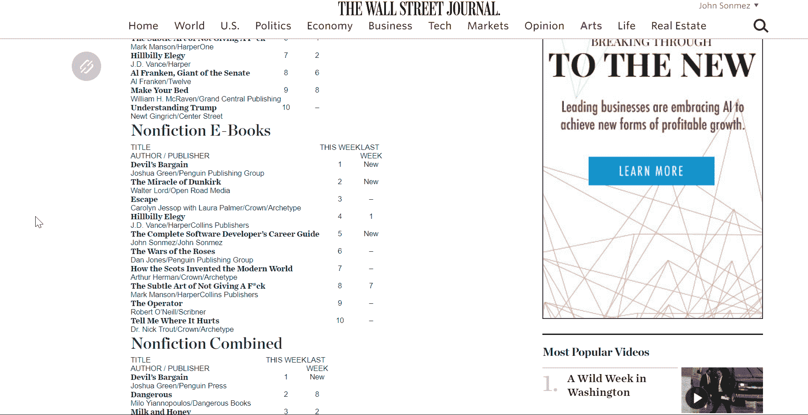
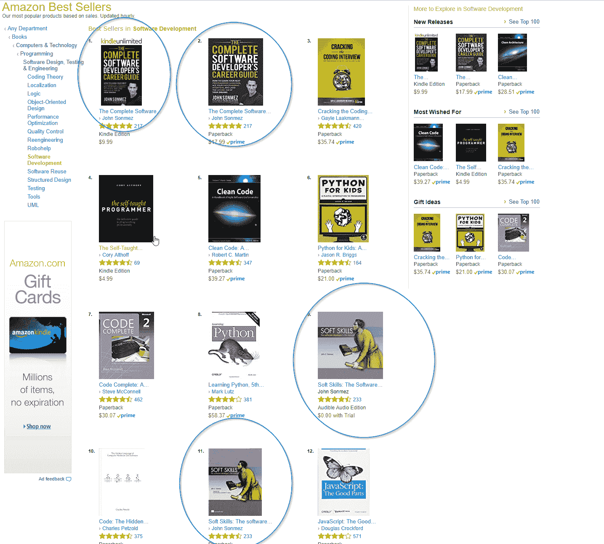
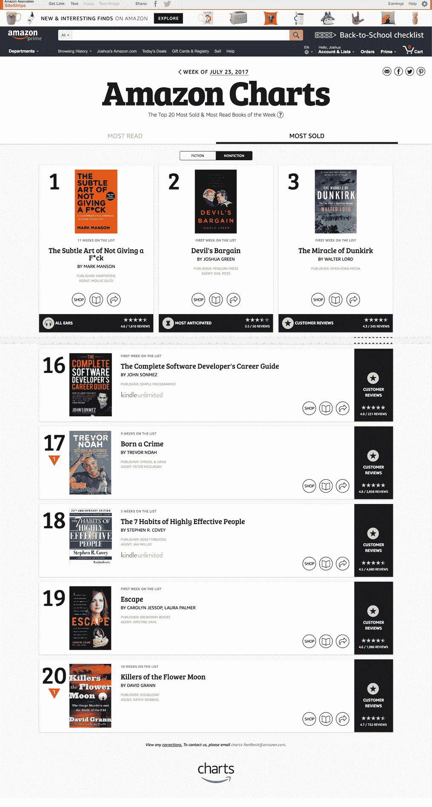

# 完整的软件开发人员职业指南，巨大的成功，谢谢你

> 原文：<https://simpleprogrammer.com/career-guide-thank-success/>

好了，现在尘埃落定，我也结束了我的欧洲旋风之旅，是时候做两件事了。

首先，我想和大家分享一下这本书的发布会进展如何——暗示一下，进展相当不错。

第二，我要感谢每一个让它成功的人。即使写一本书可能是一个人的努力，编辑它，润色它，并把它推向市场不是。

## 发布结果…

好了，事不宜迟，到底发生了什么？怎么样了？

好吧，我就不跟你说发布会的所有无聊细节了，给你重点，先从最大的开始。

《完整的软件开发人员职业指南》一书发布会最值得注意的成就是**首次登上著名的《华尔街日报》非小说类畅销书排行榜的第五名。**

这是巨大的——出乎意料的。

我甚至没有把目光放在这个目标上，所以当我看到新闻稿时，我非常震惊。

能够把《华尔街日报》畅销书作家加到我的简历中是一件很酷的事情——虽然现在我真的很需要一份简历，但这仍然很酷。

这本书在第一周左右就登上了亚马逊几乎所有类别的排行榜榜首。事实上,《完整的软件开发人员职业指南》和《软技能:软件开发人员的生活手册》在相当长一段时间内都绝对主导了亚马逊上的软件开发类别。

当然，亚马逊也有自己的畅销书排行榜——亚马逊最畅销的非小说类图书排行榜——这本书在 2007 年首次登上了第 16 名。

至于 Kindle 的排名，这本书一度在亚马逊的 Kindle 书籍中排名第 24 位，封面上是我的杯子和我周围的一堆色情浪漫小说。(我应该考虑为我的封面拍摄一个 ab 镜头，以便完成。)

最后，在相当长的一段时间里,《完整的软件开发人员职业指南》在亚马逊所有 Kindle 非小说类书籍中排名第二，被一本约翰·格里森姆的小说挤下了榜首，我强烈怀疑这本小说实际上是虚构的——但是，你能做什么呢？

## 余波

是的，发布会很疯狂，而且非常顺利。比我预期的要好得多。尽管如此，下一次肯定会有一些需要改进的地方——就像以前一样。

我还收到了一些国际出版商和有声图书分销商的询问，所以我很高兴地说，我和我的团队正在制定所有的细节，以出版这本书的有声版本，以及这本书的大多数主要语言的翻译版本。

事情现在刚刚开始稳定下来，但这本书的销售仍然强劲。

## 谢谢你

我想花点时间公开感谢一些人在推广这本书的过程中所扮演的角色，并表达我的感激之情。

首先，非常感谢你。是的，你们中那些支持我的使命的人，通过帮助人们实现和完成他们的梦想，并最大限度地发挥他们在生活中的潜力，使世界变得更美好。

即使你没有买这本书，通过阅读这个博客，观看我的 YouTube 视频，购买我的产品，或者只是成为社区的一部分来表达你的支持，这都是非常值得赞赏的。一直出现在公众面前并不容易——尤其是当你有一些有争议的观点，而不只是告诉人们他们想听的时候。

所以，非常感谢你的支持。(但是，一定要去买这本书！)

接下来，我想感谢我在 Simple 程序员团队。做这种规模的事情需要一个团队在你背后支持，而我有可能拥有的最好的团队。

几乎 SP 团队的每个人都为这本书和它的成功发行做了些贡献。这确实是一项共同努力。

特别感谢 SP 发布团队和早期评审人员。你们中的许多人给了我关于这本书的早期反馈，问了许多好问题，并在发布当天留下了对这本书的评论，这些都有助于它的成功。

说到早期的评论者，我答应给他们一个大声喊出来和一些公开的承认，所以下面是列表。感谢各位对本书的详细反馈:

*   托马斯
*   亚历山大·海默宁
*   安迪·维尼特
*   本·诺曼
*   棍子是租来的
*   布兰登·春
*   克劳迪奥·贝纳斯科尼
*   科斯明·普帕扎
*   丹尼尔·唐巴万
*   达雷尔·特里
*   戴夫鹿
*   季米特里斯·卢卡斯
*   埃德温·胡安
*   埃德温·克莱斯曼
*   费尔南多·萨莫拉
*   杰森倒下了
*   约翰尼斯·塔木人约翰·塔木人约翰·塔木人约翰·塔木人约翰·塔木人约翰·塔木人约翰·塔木人约翰·塔木人约翰·塔木人约翰·塔木人约翰·塔木人
*   乔纳森·托马斯
*   林肯·皮雷斯
*   马克·科尔曼
*   马修·韦伯
*   诺伯特·哈吉斯
*   奥莱克西·费多罗夫
*   瑞·菲格雷多
*   托马斯·奥罗佩扎

最后，感谢我们出色的推广合作伙伴 Usersnap，它在帮助推广这本书的过程中发挥了关键作用，并且没有期待太多的回报。

他们很慷慨地提供了一次免费试用和一个礼包。

## 获得 30 天免费用户试用+礼包

Usersnap 是一个数字产品构建平台，构建从开发到客户服务的解决方案。

Usersnap 让追踪 bug 变得简单。通过点击式注释工具，Usersnap 可以帮助您报告发生错误的地方:在您的浏览器中。无需切换到错误报告应用程序或填写无休止的表格。Bug 跟踪现在变得轻而易举！

从您的错误跟踪和用户测试工作开始，并注册一个延长的 30 天免费 Usersnap 试用。

只需在此注册 Usersnap，立即获得 30 天试用期。

最好快点:前 15 名注册 Usersnap 的用户还将收到 Usersnap 提供的礼包。

工作原理:

在这里注册 30 天的免费试用。

然后在 help@usersnap.com 给他们发一条信息来获得你的免费礼包。不要错过！

## 再次感谢所有支持或参与发布的人！

是时候开始写下一本书了…