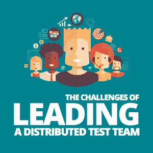

# 领导分布式测试团队的挑战

> 原文：<https://simpleprogrammer.com/challenges-leading-distributed-team/>

Being a manager of a distributed team of people can be a challenging role. When you have to communicate on a daily basis and those people are in different time zones, or if you're at the end of the project delivery date, you may find your stress levels slowly creep up higher and higher.

在过去的一年里，我不仅试图领导一个分散的(尽管规模很小)团队，还试图平衡我的日常测试任务，研究可以帮助我的团队的新工具，以及保持或提高整个公司项目的整体质量。

让我和你们分享我所面临的一些挑战，以及我已经或计划如何在未来克服它们。

## 团队成员之间的不同时区

在每个项目中，团队成员定期交流是很重要的。细节很容易被忽略，尤其是在开发过程中的繁忙时期。

当您的团队在不同的时区时，确保他们每天都进行交流就更加重要了。你只有一段特定的时间可以同时和你的团队直接交流。这个时间必须被利用，任何人都不能跳过。

你的团队可以通过每日站立会议(如果你使用敏捷方法)进行交流，或者确保你通过其他渠道提供每日报告，比如 Slack 或 Skype 等内部交流系统。无论你使用什么媒介，只要确保交流是定期的，每个人都参与进来。

教训:把会议安排在每个人都有空，项目不忙的时候。

## 平衡所有团队成员的工作量

即使在 100 人的团队中，重要的是每个人都觉得他们不会被我们的工作压垮，并且也能尽自己最大的能力完成工作。

拥有一个分布式团队还需要你考虑其他团队成员的工作时间，这样你就可以把正确的项目分配给正确的人。你可以使用像 Trello、Asana 甚至电子表格这样的工具来管理项目分配。这样做将有助于团队成员更轻松地管理他们的工作量，从而使项目更紧密地与他们的时间表保持一致。

你还需要[考虑项目所需的技能](http://www.amazon.com/exec/obidos/ASIN/B01FYBQSWI/makithecompsi-20)以及项目将持续多长时间。这将帮助您将合适的团队成员分配到合适的项目中。例如，假设你有一个即将到来的项目，其中测试框架需要用 C# 写成[，你的团队中有些人精通 Java，有些人精通 Ruby。您可能会发现，这种类型的项目将更容易和更快地由团队成员实现，因为他们非常相似的语言。](http://www.amazon.com/exec/obidos/ASIN/B00ERG0H7E/makithecompsi-20)

经验:尝试将合适的项目与具有相似技能、兴趣和时间的团队成员配对，以执行项目。

## 试图管理每个人和每件事

尽管我们是一个小型的测试团队，但我们的工作量一直很大。我们同时管理两到四个项目的质量和日常测试。就我的工作而言，执行日常测试任务、构建自动化套件，以及尝试监控公司的整体质量策略，对于一个人来说可能会有很多事情要做。但对我来说不是，我是女超人！

只是(显然)开玩笑。说真的，我很早就意识到没有时间去做所有的事情，而且我无法独自管理所有的人和事。所以，为了确保我能完成我所有的任务，我对我的工作进行了优先排序，并将优先级较低的任务委派给其他团队成员。

我根据项目期限、项目要求和团队成员的可用性在团队成员之间划分职责。我鼓励我的团队做同样的事情，以确保他们也不会感到不知所措，并能把工作做好。

在分布式团队中，这可能对您有利。例如，如果您的团队成员在某个时区比您早或晚几个小时，您可以在重叠时间结束后让他们继续工作。然后当你回来的时候，任务可能已经全部或几乎完成了，准备好让你去关注其他的事情。

为了做到这一点，你需要了解你的团队，并相信他们会执行他们的工作，这样你就可以专注于大局。

教训:让优秀的人帮你管理事情。

## 试图监控你的策略的进展

When I first arrived at my current company, Immerse, one of the first things I was asked to do was [outline a Test Strategy](https://kayleigholiver.com/2017/08/17/creating-a-test-strategy-from-scratch/) for the company.

每个月我都会试着追踪我们是否还在实现我一年前设定的目标的路上，它们是否需要调整，或者它们是否不再相关，一些策略是否需要重新审视。

如果我的团队成员都在一个地方，只需每月开一次小会就能知道我们在哪里。但是拥有一个分布式的团队意味着这需要提前计划，并且在每个人都有空的时候。由于我团队中的一些成员有时要在远达四个小时的时区内，所以需要在项目期间的某个时间安排会议，每个成员都不会比平时忙，比如产品交付的前一周。

利用免费的日历资源，如 Google Calendar，在团队很忙或没空的重要日期共享团队日历预订。用它来定期跟踪你在团队会议中的进展。

教训:对你的愿景有一个清晰的想法，并跟踪它的执行情况。

## 安静的成员更容易躲起来

确保团队中比较安静的成员在团队会议上也能畅所欲言。想办法让每个人都参与到他们的团队中来。安静的人很容易坐下来，让更自信的人发言，让别人听到他们的声音，特别是如果这些会议是通过 Slack 或 Skype 进行的。

你可以通过向这些人提出具体问题或询问他们的意见来做到这一点。这将促使他们说得更大声一点。如果英语不是他们的第一语言，他们可能更倾向于不说话，但通过在这里问他们一个问题来给他们一点推动，或者他们需要建立他们的信心。

请记住，这些人沉默寡言可能是有原因的，所以当你在大家都准备好并等待的会议上向他们提问之前，也许可以私下和他们谈谈。了解他们是谁，他们的动机是什么，然后利用这一点定期与他们接触。

经验:了解你的团队是谁，他们喜欢如何交流，并鼓励他们参与进来。

## 很难保持每个人的技能

在任何技术领域，如软件开发、虚拟现实、大数据或人工智能，挑战之一是确保你不断学习。事情总是在变化，保持你的技能是很重要的。

很难找到时间来培养你的技能(尤其是在测试和 QA 角色中)，因为在一天结束时，你被雇佣来开发和运输产品。提高你在某个领域的技能通常是日复一日工作的副产品。但是，我建议你鼓励你的团队[在一周内抽出一些专用时间](https://simpleprogrammer.com/importance-routine/)来学习新技能或提高现有技能。这不仅会让人们留在你的团队中，表明你关心并愿意投资于他们的个人发展，还会让他们喜欢来工作。

利用资源，如 [Pluralsight](https://www.pluralsight.com/) 课程(针对技术专业人员)、YouTube 视频(针对所有人和所有事情)、知识分享会议和结对编程都很容易获得。所有这些都是免费的低成本的方式来提高你的知识和加强你的团队的技能。

很容易让截止日期让我们度过这些时间，所以确保你的团队把它们安排在他们很少或没有分心的时间(如果可能的话)。

教训:告诉每个团队成员每周安排一个时间段来学习技能，以提高他们的知识。

## 底线:拥有一个伟大的团队

作为一名经理，领导一个分散的团队以及你的所有其他职责是一项具有挑战性的任务。你不应该低估每天完成的工作量，这与你在同一地点领导一个团队的工作量是一样的。

在分散的团队成员之间共享任务，如职责、项目甚至会议，将帮助您平衡日常工作和管理任务。但是你需要一个好的团队来帮你做这件事。

所以，一定要找到合适的人来帮助你。作为回报，投入一些时间给他们，确保他们不会超负荷工作，通过找出他们的动机来了解他们，并鼓励他们通过自我培训来建立自己的技能。