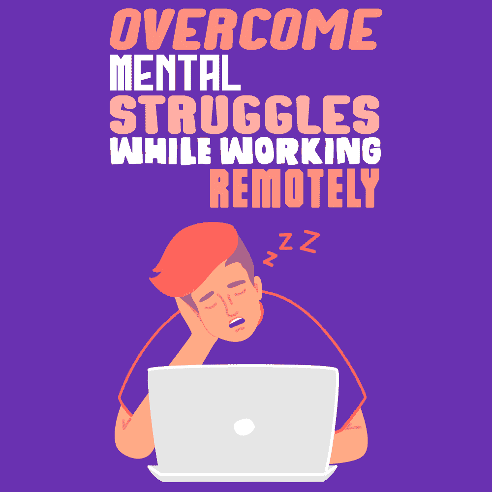

# 克服远程工作时的心理斗争

> 原文：<https://simpleprogrammer.com/challenges-remote-workers-face/>

As a software developer, you have no pragmatic factors to stop you from working at home. After all, with most programming jobs, as long as you have access to a computer and a reliable internet connection, you’re all set.

尽管如此，在正常情况下，并不是每个雇主都允许你远程工作。在许多组织中，说服你的老板允许你在家工作可能会涉及一个漫长而复杂的谈判过程。

像目前的新冠肺炎疫情爆发这样的情况改变了这一切。当隔离到位时，你不再需要说服任何人允许你在家工作。事实上，你是*要求*这么做的。

然而，成为一名远程工作者并不总是像看起来那么容易。如果你现在像大多数被隔离的人一样，你正在一个通常与工作无关的环境中工作。环境的剧烈变化会造成心理障碍，让你很难保持工作效率。如果你已经不由自主地变成了远程工作者，这就更是如此了，这意味着你还没有机会为这项任务准备好合适的个人环境。

这种改变可能很难，但并非不可能克服。让我们来看看你在家工作时可能会遇到什么问题，以及你如何有效地克服这些问题。

## 是什么让在家工作变得艰难？

如果你以前从未在家工作过，你的潜意识可能不会把你的房子和工作联系起来。这也许是让在家工作变得困难的最大因素。

心理联想极其重要。它们导致我们称之为习惯的潜意识决定，这些决定本质上是毫不费力的行动。如果你还没有把某个行为养成习惯，那么执行这个行为可能会耗费相当多的精力。

另一方面，如果你已经养成了一个与你正在努力做的事情相违背的习惯，那就更难正确执行了。

这就是为什么如果你以前没有在家工作过，你会觉得在家工作很辛苦。

人们在很大程度上使用他们的家来休息和娱乐，所以这是他们与他们的家的联系。这使得有必要抑制住做他们在家时喜欢的正常活动的冲动。

或许，在家里，你大部分时间都在客厅玩游戏。在这种情况下，如果控制台触手可及，尝试完成一些工作将会非常困难。

也许你喜欢保持你的房子整洁，是时候打扫一下了。在这种情况下，你必须抑制住做家务的冲动，集中精力完成远程工作。

为了成为一名成功的远程工作者，你需要养成在非工作环境中进入工作状态的习惯。

不是每个人都会发现适应远程工作有困难。然而，即使你是那些幸运的人之一，你仍然可以通过对你的日常工作做一些简单的调整来提高你的工作效率。

## 如何让远程工作变得毫不费力

幸运的是，养成在家工作高效的习惯并不难。有一些技巧可以帮助你实现目标。

这里有四个我发现非常有效的窍门。

### 1.不要在工作电脑上使用与工作无关的内容

At home, you may have a powerful PC that you built for gaming. Or you may have a laptop you occasionally use to watch Netflix or YouTube.

虽然这些活动适合您的家用设备，但请远离您的工作设备。游戏或狂看电视等活动旨在引发你的身体释放大量多巴胺，如果不加以控制，会导致有害习惯，如 T2 成瘾。

因为多巴胺(以及它诱发的感觉)会上瘾，所以通常很难抵制参与多巴胺诱发活动的冲动。毕竟你的大部分正常工作活动相比之下都会平淡无奇。这就是为什么如果你想完成你的工作，你应该把你的工作设备和娱乐设备分开。

这也意味着你不应该将你的家用设备用于与工作相关的目的。因为你的大脑已经学会了将特定的设备与特定的功能联系起来，所以在工作中使用娱乐设备会让你在保持专注的同时完成手头的任何任务变得更加困难和耗时。

即使你成功地抑制住了在工作时玩视频游戏或观看搞笑视频的冲动，你也会花费相当多的精力来对抗这些冲动，所以你的工作结果不会像原本应该的那样好。

当你在办公室，周围的人可以看到你在做什么的时候，不要进行非生产性的内容消费总是比较容易的。然而，当你在家的时候，你只有自己来管理你的行为。但是让你的工作设备只用于工作是值得的。

### 2.不要在与娱乐相关的房间里工作

这条规则与第一条非常相似。

如果你的客厅里有一个大的宽屏电视，下面有一个游戏机，那么客厅可能不是你工作的最佳场所。你只是用眼角看着你的游戏机。最终，你要么放弃你的工作去玩游戏机，要么花大量的精力去抵抗这样做的冲动。

这就是为什么许多经常远程工作的人在他们的房子里有一整个房间作为他们的办公室的原因。呆在一个专用于工作的房间里会帮助你建立起和平时一样的工作心态，并帮助你变得更有效率。

但是如果你没有多余的房间怎么办？

好消息是这种情况也有解决方案。在工作会议期间，把所有与娱乐相关的东西都藏起来。通过让你的房间看起来不同来改变你的环境。

如果你不能隐藏某些可能太大的物品，或者你只是因为任何原因而没有能力隐藏它们，那么至少要以这样一种方式定位自己，这样你就不会看到它们。俗话说，眼不见，心不烦。

### 3.保持你的工作环境整洁

我不会谈论通过整洁的办公桌来提高你的工作效率的哲学。其他人比我更好地解释了这个概念。

我所说的是在你开始工作之前确保你工作的房间已经整洁，这样当你工作的时候就不会想到做家务。

人们经常试图一箭双雕。当你在家工作时，把家里收拾得井井有条是很诱人的。

这种方法的问题是[多任务处理不起作用](https://simpleprogrammer.com/context-switching/)，这已经被无数的研究证明了。如果你试图同时做两件事，你很可能会以一件事都做不好而告终。

确保你的环境整洁有助于你在工作时不想做家务。它会把这些想法从你的脑海中带走，让你的注意力集中在重要的事情上，你的工作。

### 4.工作时穿上工作服

Another productivity lifehack for remote working is to never do it in your pajamas.

如果你通常穿着睡衣在家里放松，那么很有可能你的大脑已经学会了把睡衣和放松联系起来。穿着休闲的衣服会让你很难进入工作状态。

当然，如果你的工作场所通常要求你遵守严格的着装规范，那你在家里也不必这么做。但是，即使你只是简单地整理床铺，洗澡，让自己看起来像样，也更容易进入工作状态，你不会再感觉像是在休假。

通过做这些小任务，你从一天开始就积累了[个小胜利](https://simpleprogrammer.com/pre-planning-resist-procrastination/),并为你富有成效的一天做好准备。

## 成为一名高效的远程工作者

你可以做许多其他的事情来提高你的工作效率。正念练习、锻炼和把工作分成小块是帮助在家工作的最有效的方法。

如果你通过创造一个有效的工作场所来限制你的分心，你将离成为一个有效的远程工作者更近一步。当然，你可以试着仅靠决心来战胜家里的干扰，但不是每个人都有足够的意志力来应对它们。此外，发挥意志力会消耗大量的能量，即使是在拥有大量能量的人身上。

记住，一切从整理床铺开始。剩下的，当养成习惯，应该是小菜一碟。