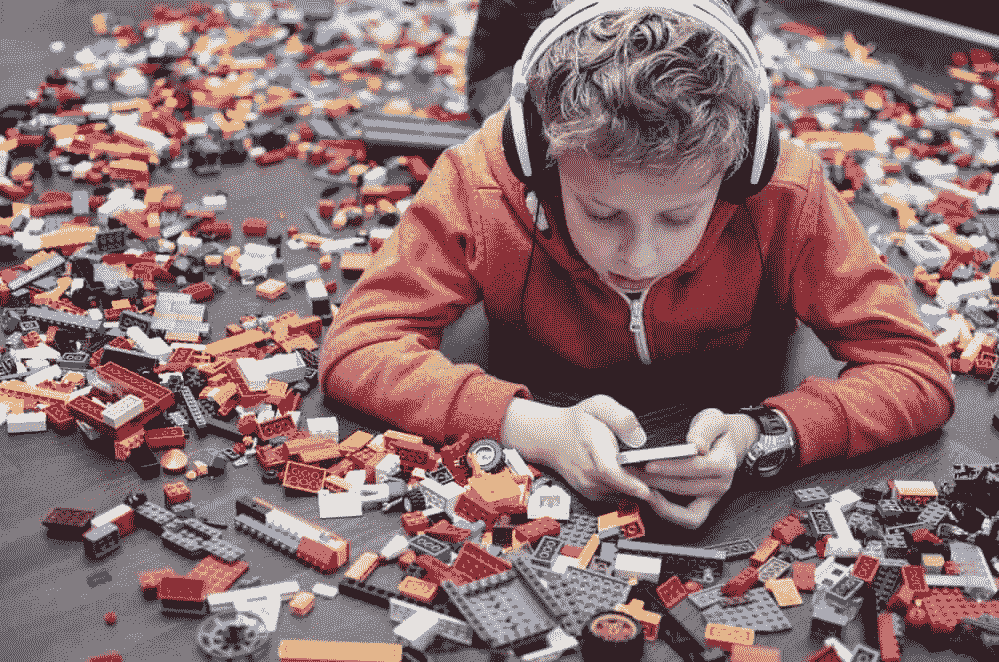

# 有时候，孩子们真的做对了

> 原文：<https://simpleprogrammer.com/children-get-it-right/>

也许是因为我是一个极端偏见的父亲，有三个了不起的公主。也许是因为我内心仍然有一个大孩子，他对玩乐高和 K'NEX 很兴奋。或者可能是因为这个世界上的成年人每时每刻都在努力保持政治正确和礼貌，从而使事情变得过于复杂。

我的孩子们有着令人难以置信的想象力，每天他们只会变得更加惊人。作为程序员，我们的创造性想象力是我们拥有的最重要的资产之一。所以，停下来——看看周围——把注意力放在你周围的一些孩子身上。

公平的警告:如果你不喜欢孩子，你现在可以停止阅读。因为当我把童年和我们作为程序员(和编程团队)的技能联系起来时，我计划做一点父亲般的滔滔不绝。

# 把你的情感穿在袖子上

As my oldest matures, she’s starting to guard her emotional state a little bit more carefully than she did even a year ago. However, if there’s one thing I can count on with all three of my kids it’s that they’re not afraid to let me know how they feel. In fact, I’ve got one of them staring at me right now, screaming her lungs out because it’s bedtime, and she *always* fights bedtime loudly and noisily.

这并不是说你应该走进你老板的办公室，对着他的脸大喊大叫。然而，确保你与你的情绪(甚至是强烈的情绪)保持联系，对于你如何与你的队友和你的管理层互动有着重要的意义。

除非你在完全错误的领域工作([听起来很大一部分美国劳动力都在做](http://www.gallup.com/poll/181289/majority-employees-not-engaged-despite-gains-2014.aspx))，否则至少在一段时间内，你会发现自己被公司或团队的使命深深吸引。对工作场所充满热情会带来许多情绪状态。

当事情进展顺利的时候，快乐就会泛滥。当人们表现得像白痴时，很容易生气。如果你在一个可靠的、训练有素的团队中，如果有人在他们的生活中经历了悲伤，你也会经历一点，通过共情纽带。然而，有一种情绪状态是必须避免的:冷漠。

所有这些情绪都非常重要。然而，我想更深入地探究快乐、愤怒和冷漠，来解释为什么我觉得它们如此重要。

## 如果你快乐并且你知道

Clap your hands! Well, OK. Maybe give a high five or a thumbs up. Smile and cheer. Brag about the accomplishments of someone else on your team and build them up a little bit.

我的女儿们跳舞。唱歌。当他们心情好的时候，会拍手跺脚，或者发出喧闹声。看他们开心的时候玩耍是我生命中最大的快乐之一。这是庆祝性质的，所以不要犹豫在工作中庆祝。

编程领域好像真的很矛盾。我们非常维护自己的工作，并且非常愿意告诉别人为什么他们是错的，而我们是对的。但是，当我们取得一个小小的胜利时，我们突然变得害羞起来，说，“啊，没什么。这真的没什么。”主要区别在于，当我们为自己的决定辩护时，是在我们的同伴群体中。

当我们获得赞誉时，通常是在我们的同龄人中*而不是*。如果在演示过程中某件事情进行得非常顺利，这将使产品团队看起来非常好。也许这甚至让 CEO 看起来真的很棒。但他们不是程序员。而且和*那些人*交往很吓人很恐怖，拜托，别让我和*那些人*说话。

不过，老实说，当你的团队中有人击出全垒打、触地得分或上演帽子戏法时，这些人需要知道。([我知道，科技博客中的体育隐喻。对不起不会再发生了。](https://simpleprogrammer.com/2015/10/21/programming-is-a-sport/))如果你不花时间公开祝贺你努力工作的团队成员出色完成工作，他们可能会开始找一个愿意的地方。即使他们从来没有大声说出来，这份工作的一个纯粹的乐趣就是被人说“干得好”

我认识的大多数程序员都不会要求表扬。大多数人也不能没有一个。所以告诉每个人你和你的团队对正在做的编程感到高兴的理由。值了。

## 我生气的时候你不会喜欢我的

Back to that screaming toddler again. She never has any issue letting us know, in no uncertain terms, when she disagrees with a decision mommy and daddy have made on her behalf. Her tantrums even tend to include throwing herself on the floor and kicking her feet as hard as she can. I keep telling myself this is a phase… But I digress.

人类有想让婴儿停止哭泣的本能倾向。出于某种原因，我们变得讨厌听小孩子发脾气。好家伙，他们能扔一个很好的适合！

有趣的是。本能也适用于工作。当孩子大发脾气时，最好的父母会立即设法解决问题。如果你能在适当的时候发适当的脾气，你也会得到关注。但是要非常小心。权力越大，责任越大。

对我来说，我以“[丰富多彩的隐喻](https://www.youtube.com/watch?v=7WTvEbUkeLM)的形式运用它我非常小心地保护我的舌头，当我真的想引起人们的注意时，我倾向于只说出最下流的脏话。不常发生。这就是为什么它有效。

这需要练习和谨慎的原因是，如果你总是发脾气，人们会说你头脑发热。这没什么帮助。

向你周围的人证明你对你正在做的工作有足够的热情，以至于如果事情搞砸了，你会发疯，这很好。给大家看看你是人就好。

## 看，长官，机器人！

当心你工作场所的冷漠。这是一个狡猾的小恶魔，它将有效的、运转良好的、充满激情的团队转化为“朝九晚五、挣工资、回家”的类型。他们也开始听起来有点像 C-3PO。小气，烦人，总是在最糟糕的时候出现。

我不会说我的女儿们冷漠。事实上远非如此。他们总是让我知道他们对所有事情的感受。从我们对晚餐食物的选择，到电视节目，到我该如何去洗澡。就像现在。他们从不害怕释放自己的情感，并引领潮流。冷漠会很快杀死它。

冷漠在野外是很难发现的，因为它开始时被伪装成悲伤、愤怒、恐惧和其他负面情绪，我们可以很容易地将其视为“过了糟糕的一天”

然而，如果有人连续经历了太多糟糕的日子，他们很可能会完全停止关心，因为冷漠比心痛更容易。我意识到这听起来不太“程序化”(这是一个词吗？)，但我们必须意识到我们的情绪如何影响我们成为健康团队一员的能力。

有很多很好的建议可以让你和你的队友获得最好的内在动力，但我还是要说最好的资源之一是《团队极客:软件开发人员与他人合作指南》 。

作为程序员，分享我们的情绪状态消除了我们工作的一些机器人性质。我们都可以分享的最重要的事情之一是我们的人性，而我们做到这一点的最佳方式是在适当的时候保持适当的情绪。否则，我们很可能会变得像和我们一起工作的机器一样没有人性。问问艾伦·图灵(Alan Turing)最近怎么样吧。

# 发挥你的想象力

Have you ever built a blanket fort? Or maybe one out of big twigs and other branches that fell out of trees? Did you ever build a snowfort in a shovel bank that showed up on one side or the other of your driveway? Or maybe you were just obsessed with Legos as a kid?

希望你知道我在说什么。我认识的大多数从事软件工程师工作的人都能回忆起几十个记忆，其中唯一真正重要的是童年的无拘无束的自由。

再回到那个*团队怪胎*参考。这才是 autonomy 真正唱功的地方。我们需要创造力、激情和动力去追求那些不一定显而易见的解决方案。

用和以前二十次完全一样的方法做一件事，但是用不同的参数和不同的数据库表，会把我们变成流水线编码员。我不知道你怎么想，但我觉得这听起来很可怕。

相反，环顾四周。找到未知的地方，并开始绘制地图。做一个概念证明。找到一种方法使开源库适合你的世界(只要它得到很好的支持，或者如果没有，你愿意自己支持它)。

最重要的是，确保不要忘记我们作为研究人员会茁壮成长。我们从不解决同一个问题两次。那么为什么问题用同样的方法解决了两次呢？

虽然我认为为美国宇航局(或 SpaceX)工作听起来真的很棒，但我觉得就在我们面前有一个不涉及进入太空的前沿。软件创新仍处于起步阶段，在这一点上作为一种职业只有几十年的时间。

相比之下，比如说，材料工程。回到过去的好时光，这可能被称为炼金术。在我们完成创新之前，我们还有很长的路要走。所以打开盖子。把它拆了，然后重建它。用毯子和枕头做一座宫殿。最重要的是，玩得开心！

# 线条外的颜色

有人称之为草率。有时候我觉得一点也不马虎，只是我大女儿表达创意的方式。事实上，她通常更喜欢在一张白纸上画画，而不是在纸上画线。这样，她可以从一开始就决定最终的结果。

正如 John Sonmez 所说，虽然我们作为程序员并不真正“有色”，但有时打破规则是可以的。只要记得留意他对此的跟进:[你必须掌握规则，然后才能打破规则](https://simpleprogrammer.com/2015/08/17/you-have-to-master-the-rules-before-you-can-break-the-rules/)。

最近在这个博客上出现了一篇关于创造力带来的灵感的伟大文章:[创造力的必要性](https://simpleprogrammer.com/2015/12/28/the-necessity-of-creativity/)。

对我来说，当我离开 IDE，步入创造性的世界时，我感觉与我解决问题的能力有了更多的联系。我的创造力来自于写作，也来自于绘画。我没有足够好的画挂在某人的壁炉架上，但当我画画时，我觉得它让我大脑中解决问题的逻辑部分得到了急需的喘息。它给我的大脑的比特方面重新充电和补充能量。

我还没有遇到一个优秀的程序员认为我们解决的任何问题都只有一个正确的答案。事实上——因为对于“我们如何解决这个问题”这个问题有如此多的正确答案——我们发现自己处于软件工程的复兴时期。关于做某事的正确方式或最佳方式，有太多的发现有待发现；我认为我们还没有触及表面。

# 有一个午睡！

我很确定我看到一件婴儿连体衣上有这个。如果我没有，我说了算。它会大卖的！

不过，玩笑归玩笑，我们成年人倾向于逃避的一件事就是每天中午休息充电。对孩子们来说，这叫做“午睡时间”对于成年人来说，这叫做…等等，我不知道这叫什么，因为在美国社会我们并不真正宽恕它。

我想墨西哥的“午睡”也差不多。但这也不是我真正想说的。更确切地说，为了保持你在接通电源时真正努力工作的能力，每天至少拔掉电源几分钟也同样重要。

如果你保护好你的生产时间，你应该能找到至少一两个好的、可靠的时间来更新你的大脑。大多数时候，我会带着它去外面快步走一走，这有助于我清理杂乱的东西，为下一轮我将要关注的任务做好准备。

所以，虽然我们不能像孩子一样每天下午都小睡一会儿，但是有一些方法可以找到宁静，我强烈建议你去尝试一下。

# 我不想长大！

I love hanging out with my kids because they serve as a daily reminder to me of the most important things in my life. I don’t live to work, I work to live.

孩子们不知道什么是压力。他们不知道什么是钞票。希望他们甚至不知道什么是剧烈疼痛或慢性病。他们只是快乐和自由。我想尽我所能来保护这种幸福和自由，因为它会带来令人惊叹的生命火花。

对于那些拥抱我们内心的孩子的人，我说，“真棒酱！”对于那些犹豫不决的人，看看镜子吧。当你还是个孩子的时候，照镜子的时候，你有没有看到另一边的成年人——你？当大人回头看到小孩时，你说了这句话吗？“看！我正是你想要我成为的人！”

如果不是，问问自己为什么。然后找出是否有办法帮助你内心的那个小孩重新快乐地跳舞。

当我们让自己与更像孩子的本能联系起来时，我们就放下了成年后的一些情感包袱。随着这个版本的发布，我们可以真正开始在成为最好的程序员方面取得一些令人敬畏的进展。甚至像我们的孩子认为的那样好。