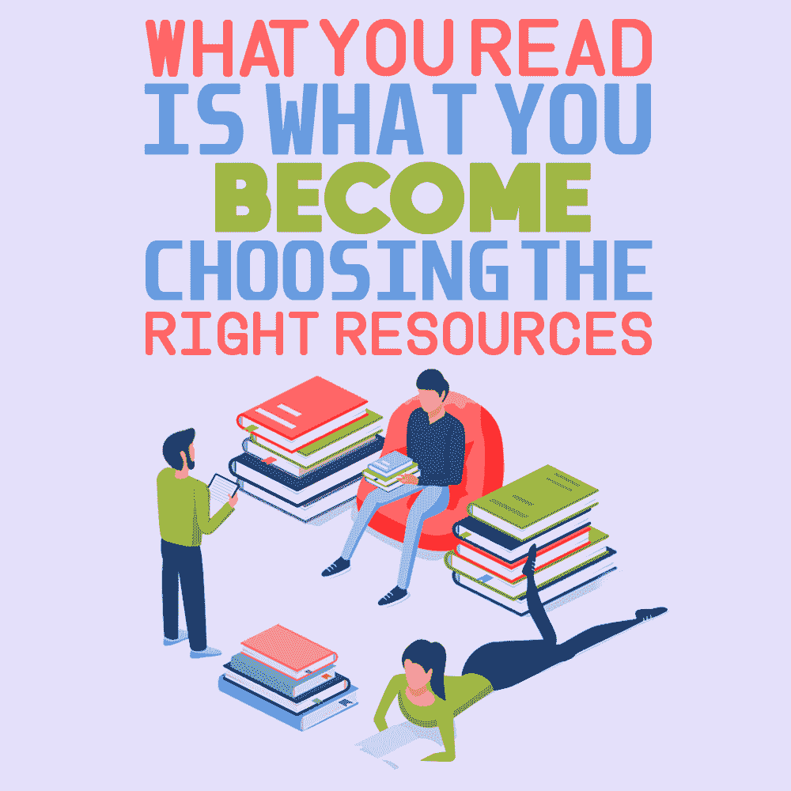

# 你读什么，你就成为什么——选择正确的资源

> 原文：<https://simpleprogrammer.com/choosing-resources/>

Software development is an industry filled with people from different educational and economic backgrounds. Some developers get formal computer science education in colleges and universities, whereas some are self made, learning from the greatest teacher of modern times: the internet.

澄清一下，我来自前一组，但也是后一组的一部分。我有一个计算机科学学位，但是我利用互联网上的资源自学了开发。

尽管我在大学里学了四年的计算机，但我不得不强调，我所受的大部分软件开发教育都来自于我自己在互联网上的学习。大学教育不会总是让你为发展工作做好准备。我的课程没有，只能自己找资源，自己学。我经常和家人开玩笑说，如果我没有上大学，我也会做得一样好。

在我成为专业人士的过程中，我学到的最重要的一点就是你所学内容的重要性。当你自己学习时，你的资源就是你的老师，决定你在职业生涯中能做什么。

软件开发有很多领域——你可能想成为一名 web 开发人员、一名区块链开发人员、一名数据科学专家……可能性是无限的。你需要选择一个目标，这样你才能选择你想学的东西。

或者，你可能只是想提高现有的技能，以推进你的职业生涯，完成一个项目，或者只是满足你的好奇心。

我从各种资源中学习——从书籍到 YouTube 视频到像 Udemy 这样的在线学习网站。不管是什么资源，最重要的是你要仔细选择，这样才不会浪费时间。

## 准备前的准备

作为一个自学成才的开发者，你可能犯的最大错误之一就是一头扎进你首先找到的任何资源。相信我，去过那里，做过那个。

这不仅浪费了你的时间，还可能会花掉你一些钱。我开始阅读一本关于 Ruby on Rails 的书，只是因为这是第一本出现在亚马逊上的书，后来我后悔没有阅读这本书的正确评论，因为它对初学者没有帮助。

你需要决定的第一件事是你学习的目的。你学习是为了转行吗？提高现有技能？了解你的动机会让你更容易选择职业道路，从而选择资源。首先仔细选择目标，然后开始寻找实现目标的资源。

一旦你心中有了想学什么的目标，你需要仔细彻底地选择你的资源。就像买一部新手机一样。你会买你在网上找到的第一个吗？不是吧？你会花上几个小时，甚至几天的时间，在你计划的预算内寻找最适合你需求的手机。这就是你在搜索学习资料时需要做的事情。找出哪些资源可以教会你需要知道的东西，然后像买手机一样阅读评论。

互联网上充斥着与软件开发相关的各种主题的视频、播客和书籍。此外，如果你能负担得起，有网上课程和研讨会可以提供很大。如果你想的话，继续用谷歌搜索你选择的主题——你会看到数量惊人的结果出现。现在，在这个结果的海洋中，你需要找到最适合你的。

我过去常常花很多时间在网上问人和搜索与我想学的任何东西相关的课程和书籍。我认为这是“准备前的准备”，就像在我开始准备工作，或技能发展，或任何我正在学习的东西之前，适当地准备材料。

当你自学的时候，你知道时间和金钱的重要性，如果一开始为了节省一点时间而选择错误的资源，会导致更多的时间被浪费。因此，你需要在投入研究之前做好调查。

## 向专家寻求建议

正如我提到的，互联网是资源的海洋。只要在谷歌上搜索你喜欢的任何主题，比如“面向初学者的 Javascript”我得到的是 0.55 秒大概 184 亿个结果。祝你在其中找到你的资源。

幸运的是，它不一定是压倒性的。你需要的是和你经历过同样困境的人的帮助。

我能给你的最好建议之一是加入社交网络上的社区，比如脸书群、LinkedIn 群，以及其他与你的主题相关的社区，在那里你可以提出你的问题。那些群体中的人可以帮助你选择资源，引导你度过困惑。

当我开始学习 web 开发时，我一直这样做，直到今天我仍然这样做。我从团体和社区中的人们那里得到了关于资源的很好的建议，这些资源可能还不是很受欢迎，但是真的很棒。这实际上是我最初了解简单程序员的方式！

现在，你可能是一个书虫，也可能喜欢从视频中学习。这是你在征求资源建议时需要添加的内容。每当我不知道在哪里可以找到对我来说最好的资源时，社区中乐于助人的开发人员就会来拯救我，并就我喜欢的媒体中的资源向我提供建议。

如果出于某种原因，你不想加入一个社区，那么我的建议是浏览博客文章和 YouTube 视频，寻找你想学习的最佳资源。如果资源是一本书，可以去 Goodreads 这样的网站查看评论。你要的是对所有资源做一个彻底的研究，权衡利弊，然后决定你最喜欢哪一个。

## 时间、能力和经济

Time, ability, and economy are the three criteria that I use to choose my resources. Let’s take a look at all three one by one.

### 时间

在选择学习资源时，时间是非常重要的。也许你正在学习一项技能，为你需要在周末交付的应用程序中的一个小特性，或者也许你正在学习将你现有的技能提升到一个更高的水平。

学习某样东西的动机可能千差万别，一个人愿意为学习这种技能付出的时间也可能千差万别。你不能指望花 30 个小时去学习需要在一周内学会的东西(相信我，30 个小时的在线课程至少需要 15-20 天)。

此外，你不能平等地衡量你学习不同技能所需的时间——例如，学习骑自行车和学习操作潜艇不需要同样多的时间。我花了几个月的时间来掌握 ReactJS，但不到一周就熟悉了 MongoDB。

你需要知道你愿意花多少时间来学习这项技能。你需要选择一种资源，它能在你能承受的时间内给你提供基本的技能。

### 能力

当你从一个初学者成为一个更高级的程序员时，能力是选择资源的主要决定因素。互联网上充满了对初学者友好的资源，但是对于一些高级的材料就不一样了。

当试图学习一些高级的东西时，你必须适当地研究你将要学习的东西是否对你现有的技能有益。你不应该买一本书，认为它会教你新的技术，当所有的都是你已经知道的东西的时候！

### 经济

如果你是一个自学成才的程序员，第三个起作用的因素是你能在一个资源上花多少钱。就我个人而言，我觉得没有比提高自己作为程序员的水平更好的投资了，但是我明白有时候钱是一个障碍。

你必须努力不要在那些你最终根本用不到的随机资源上浪费金钱。在一个你会广泛使用的更好的资源上花更多的钱，比在一个只会闲置，你甚至永远不会打开的资源上花更少的钱要好。

根据我个人的经验，像 Udemy 和 Udacity 这样的网站上的课程与训练营和个人网站上的课程相比非常棒，而且非常便宜，所以你可以在那里试试运气。

我想明确的一点是，一旦你达到了学习一项技能的目标，一切都会有回报——我最喜欢的电影 *3 白痴*中有一句非常著名的独白:“不要追求成功，追求卓越——成功会自然到来。”

找到好材料的一些最佳地点是:

*   **[关于最佳资源的博客文章](https://simpleprogrammer.com/)**——被大多数博客作者尝试和测试过。
*   **在 Udemy 和 Udacity** 这样的网站上可以根据技能水平进行筛选的课程——便宜，时间更长，可以学到各种技能。
*   **你正在努力学习的技能的文档**——免费、省时、准确。
*   **[书籍](https://www.amazon.in/Programming-Software-Development-Books/b?ie=UTF8&node=1318116031)**——成本低，有深度，可作为参考。

现在，实际的资源因领域而异，所以我无法准确指出您可能需要什么，但这是一个好的起点。

## 我找到了一个资源，现在怎么办？

经过大量的努力和研究，当你最终找到资源时，不要急于假设它是世界上最好的资源。我知道你可能研究了很多，比较了很多类似的东西，但是相信我，你可能会出错。

我过去犯过错误，现在有时仍然会犯错误。我在一些事情上浪费了金钱和时间，我甚至没有完成 10%(这是一门数字营销课程)。课程本身并不坏，但它只是不是我追求它的好时机。所以，在开始某件事之前，也要对自己有信心。重要的是在早期阶段弄清楚你选择的资源是不是你想要的。

仅仅因为你花了一些时间研究那个资源并不意味着你必须继续研究它，即使你对它感到不舒服。您可以选择其他资源。不要把你真正的学习时间，可能是几周或几个月的时间，浪费在你学习初期不喜欢的资源上。

然而，并非一切都令人沮丧。如果你根据自己的喜好好好研究，接触一些在你之前已经经历过资源的有经验的人，用不了多久你就会有很大的收获，到最后，你读的就是你成为的。

## 通过首先选择资源来拯救你自己

What you want to do is reach a goal. That goal here is probably to learn a skill, gain knowledge, or improve yourself in some way. What is important is that you choose your resources wisely and with lots of research because you’re only as good as what you’ll be learning from.

记住，根据你能花的时间、能付得起的钱和你想学的技能水平(初级、中级、高级)来为你的资源设定标准。此外，记住你的首选媒体。你可能喜欢视频、书籍、播客，甚至可能向导师学习。

即使经过大量研究，如果资源并没有变得很好，也不要沮丧——相信我，任何东西都会至少教会你一些东西。然而，如果你付出了足够的努力和研究，很有可能你会得到一个理想的资源，引导你实现目标。相信我，有些资源太棒了，你可能会给它的创造者发邮件！

所以，充分利用互联网，通过资源不断学习技能，提升自己。