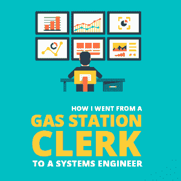

# 我是如何从一名加油站职员成为一名系统工程师的

> 原文:[https://simple programmer . com/clerk-to-engineer-choose-success/](https://simpleprogrammer.com/clerk-to-engineer-choose-success/)

So, I’ll start out with this: I didn’t get into IT the quickest or smartest way that I could have — but with a lot of perseverance, I made it happen.

我在一家名为 QuikTrip 的加油站做兼职店员，每小时挣 8 美元。最后，我不得不在克罗格再找一份兼职，仅仅是为了每周带回家 300 美元。

一天，当我在工作的时候拖地，我意识到有些事情需要改变。我诚实地面对自己，接受了这样一个事实:我并不满足于勉强糊口，做着自己不喜欢的工作，只是为了填满公司高管的口袋。

我需要改变我的思维方式，开始在一些让我感到满足的事情上增长知识。我知道我必须离开零售业，转向我真正喜欢的东西。

## 第一步:自我教育

首先，我开始寻找可以在当地社区大学学习的科目，并偶然发现了一个网络安全项目。

当我开始了解更多关于网络安全的知识时，我受到了启发，开始从事科技行业。我想象自己解决复杂的问题，保护人们的信息安全。我一直想对人们的生活产生影响，我相信网络安全是实现这一目标的好方法。

此时，似乎每周都有大公司报告新的数据泄露事件。我心想:“能够对抗黑客和保护人们信息的想法听起来很令人兴奋！”

然后我查了一下网络安全的平均工资，更加兴奋了——所以那年秋天我在社区大学开始了网络安全项目。

对你感兴趣的主题做尽可能多的研究是很重要的。我知道很多人只是选择了一个听起来不错的主题，而他们中的大多数人甚至没有在那个领域工作。你需要知道当你以此谋生的时候，你是否真的喜欢你正在学习的学科。

在大学里，我必须上和计算机课一样多的“核心”课，因为我是全职工作，所以每学期只能上几门课。这些事情，再加上生活中的重大变化，比如结婚和买房，减缓了这个过程。

在社区大学上课的好处是费用低廉，很多课程在网上提供，你可以通过你的同学和老师获得有用的信息和联系。我还建议在 YouTube 上查找视频，或许可以参加一些你感兴趣的在线课程。互联网上任何学科都有丰富的知识。

转行时自学很重要，因为要做出改变需要付出很多努力。你要确保你会喜欢这份工作，并且在你想居住的地方，你感兴趣的领域有一个好的市场。

## 第二步:找到初级职位

工作经历是你简历上最重要的部分。当务之急是尽快开始向与你想从事的领域相关的入门级职位努力。

我开始找办公室工作，因为我认为这比在加油站工作更接近办公室。靠近你想做的事情和正在做的人会增加你得到理想工作的机会。

对我来说，在办公室工作让我有机会成为 IT 的最终用户，因为我需要那里的 IT 部门的支持。这让我能够与该领域的人们互动，感受他们的工作。尽可能接近你想要的环境是一个好主意。

大学几个月后，我去了一个招聘会，看到了一个招聘机构的摊位。几周后，我参加了一家名为 Korkat 的小公司的行政助理职位的面试，并最终得到了这份工作。该公司向公园和学校出售游乐场和娱乐设备。

我全职工作，每小时挣 12 美元，还上了社区大学。大约一年后，我从研究网络安全转到了计算机网络，因为我一直在做一些研究，并意识到网络安全更像是 IT 中的一个高级职位。我认为，获得任何入门级 it 职位并逐渐过渡到网络安全比直接进入网络安全更容易。

在工作中，我从一名行政助理变成了一名成本估算员，并最终过渡到了计算机辅助设计(CAD)。我们用 AutoCAD 设计操场。

作为一名 CAD 设计师很有趣，但我无法满足自己对使用新技术和解决复杂问题的热情。

Because of that, I knew I didn’t want to be a CAD designer for the rest of my career: IT was still where I wanted to be.

## 第三步:申请，申请，申请

在我有了大约六个月的 CAD 经验后，我开始寻找收入更高的工作，因为我每小时只能挣 15 美元。

我得到了一份桁架制造厂 CAD 职位的工作机会，时薪 16.50 美元，最终我接受了。最终，我在 truss 工厂做全职工作，每小时挣 18 美元，但我还是寄出了数百份 IT 职位的简历。

我很快就厌倦了桁架工厂。我每天都做同样的事情，和那些似乎对生活没有热情的人一起工作。如果你不喜欢你的工作，做点什么来改变它。不要就这样放弃，而是开始朝着别的目标努力。人生苦短，不要做自己不喜欢的事。你可以做出改变。因此，我一直在寻找我梦想的工作。

大约每个月，我都会得到一次电话面试，但从未收到过 IT 职位的工作邀请。

在两年的时间里发出了成百上千的申请后，我开始感到气馁，并认为我可能永远也不会进入这个行业。也许我应该以 CAD 为职业。

但是我的内心告诉我要继续搜索工作列表，把自己放在那里——所以我做了。

我就一直发简历。最终，我接到了一家名为 PeopleStrategy 的小公司的电话，要求招聘网络运营中心的技术人员。我经历了一轮大约五次的电话面试，感觉自己已经稳操胜券了。一个星期过去了，当我给招聘经理发邮件询问情况时，他们告诉我这个职位已经有人了。我没得到它。

当你接近成功时，它会让你更加渴望成功。我了解到，我寄出的每份简历都是一个新的机会，让我得以闯入梦想中的职业领域。因为这种思想上的改变，我变得有动力每天看招聘板，不停地插入我的简历。

## 第四步:战胜拒绝和失败

在这一点上，我已经习惯了拒绝，只是继续发出更多的申请。

但是，在我被通知没有得到 PeopleStrategy 的那份工作的几个星期后，事情发生了。

我收到 CTO 的邮件，问我是否还在找工作。我兴奋地回答说我有空，我们开始谈论职位。

职位名称是初级系统工程师，描述基本上是我梦想做的事情。我最终得到了这份工作，并比当时多挣了几千美元。不仅如此，我还可以远程工作。

在得到这份工作的时候，我还没有拿到大专文凭，也没有专业的 IT 经验。他们给了我一次机会，我仍然很震惊。为了得到这份工作，上帝一定在对我微笑。

我会说，我一直在学习并尽可能多地获取 IT 方面的基础知识，这样我就可以在面试中交流 IT 的基础知识。

这个经历告诉我，不管我听到多少次“不”，只要我得到一个“是”，那就值得了。能够战胜拒绝是我一生中最有用的工具之一。放弃会让你一事无成。

如果你处于类似的情况，你听到的都是“不”，不要停止前进。保持这种势头，继续[学习和成长](https://www.amazon.com/Start-Why-Leaders-Inspire-Everyone/dp/1591846447)，继续努力——总有一天会有事情发生，改变你的生活。

## 我希望我做得不一样

So there’s my story. In hindsight, it took me longer than it could have to get into IT, so here are some things I would have done differently to speed up the process.

在参加任何核心课程之前，我会在社区大学只学习计算机课程。我在没有副学士学位的情况下得到了这份 IT 工作，如果我在学习核心课程之前先学习计算机课程，我会更快地掌握我需要的基础知识。

如果你上不了社区大学，就用互联网吧。每个主题都有大量的资源。从搜索你想了解的主题开始，让自己沉浸在研究中。

我也会试着获得基础认证，比如 A+，因为我认为有了它我会更快地找到工作。不过，我并没有追求这个认证，因为当我发现它的时候，我已经深入社区大学，不想停止上课学习证书考试。但是现在回过头来看，我看到很多招聘信息要求不需要任何大学学历的 A+证书。

最后，我会努力结识更多业内人士。我真的没有建立任何关系网，在我面试的任何地方都没有人脉。如果你已经在你申请的公司有关系，如果你的关系为你说了好话，你很可能会成为面试的首选。

## 坚持不懈会有回报

总而言之，我花了两年多的社区大学时间和数百份工作申请才找到了我的第一份 it 工作——但这是值得的。

我认为从我的故事中最大的收获是永不放弃。最终，你会有办法的。每天都做些事情，让你离你想要的工作更近一步。

搜索工作，发送简历，给你申请的公司打电话，跟进你的申请，阅读关于你想从事的领域的书籍，想办法在你想从事的行业中建立联系，你很快就会从事你想从事的工作。