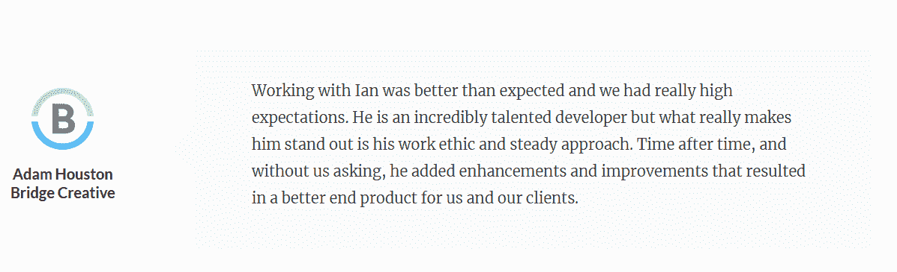
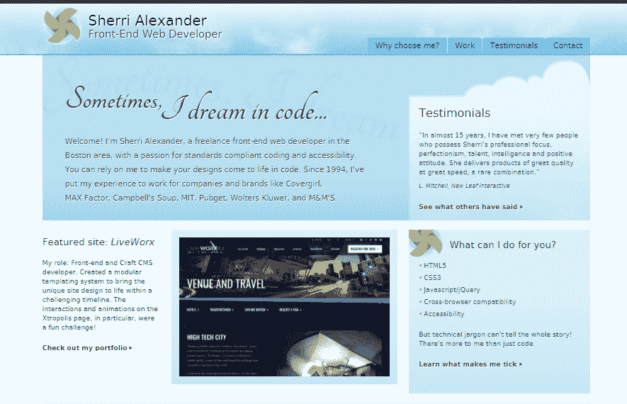
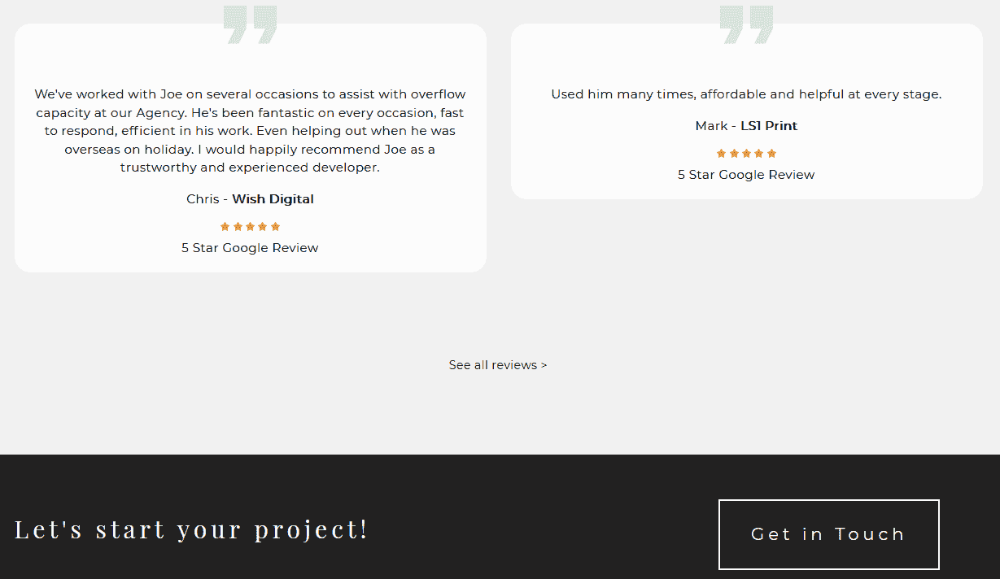
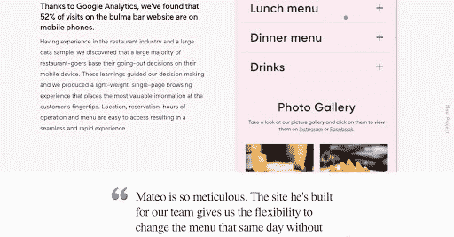

# 作为一名自由开发者，如何收集客户评价(以及如何处理它们)

> 原文：<https://simpleprogrammer.com/client-testimonials-freelance-developer/>

我们大多数人都曾因为信任的人向我们推荐某样东西而购买过它。根据社会证明理论，这种对人类认可的渴望是人类本性的一部分。我们期待其他人在特定情况下效仿他们的行为。我们对人类认可的渴望会影响我们的购买选择。

像许多服务提供商一样，自由开发人员可以利用这个已被证实的心理学原理。吸引新客户的最好方法之一是使用社会证明，即来自快乐客户的证明。[根据 Optinmonster](https://optinmonster.com/social-proof-statistics/) 的研究，一个销售页面上的推荐可以增加 34%的销售或查询数量。

但是你是如何收集这些证明的呢？当你有了它们，你会怎么处理它们？

在这篇文章中，我们将看看推荐的好处，以及作为一名自由开发者如何利用推荐来发展你的业务。

为了使文章具有可操作性，我用自由开发者和程序员的例子来说明我的观点。他们允许我在本指南中分享他们如何在业务中使用证明材料。

## 你应该什么时候收集推荐信

在营销和广告中，客户评价是使用过产品或服务的人对产品或服务的赞扬。这里有一个来自开发者 Ian Lunn 的例子:

图片来源:[ianlunn.co.uk](http://ianlunn.co.uk)

理想情况下，你应该从你最近合作过的客户那里寻求证明。建立一个系统来检查你和客户的工作质量是一个很好的方法来确定你做的对和哪里有问题。

大多数公司和许多咨询顾问将获得客户反馈作为他们场外项目的一部分。场外项目是一个在合同结束时审查服务质量的系统。一个好的场外项目将做三件事:

*   让客户感觉受到重视
*   收集有关服务质量的信息
*   尝试为更多的业务产生推荐

当然，你可以做得更多。此图很好地展示了您可能希望交付和请求的东西，作为您的客户离开流程的一部分。

如果你还没有这样的系统，我建议你考虑添加一个。增加一个从现有客户那里收集反馈的系统并不会阻止你从以前的客户那里获得反馈。

首先列出过去三个月左右和你一起工作过的所有人。对这些客户来说，你仍然会让他们记忆犹新。如果有必要，你可以追溯到六个月到一年前。我会避免走得太远。

## 如何收集评价，你应该问谁

收集评价的最简单方法是在项目结束前与客户讨论你的离开过程。这个过程不需要很复杂。然而，至少，我建议你进行一次客户离职面谈，就像我前面提到的那样。

当收集评价时，试着收集能打动参与招聘的各种利益相关者的反馈。那种能打动高级 IT 工程师的评价不一定能打动对编程了解有限的 CEO。

因此，在请求证明时，请尝试询问特定于服务的问题。例如，对于高级 IT 经理来说，要求对你的编码进行技术反馈。对于首席执行官来说，问一些关于你工作积极成果的问题。例如，“你估计解决软件错误为你的客户支持团队节省了多少钱？”

不要问别人对你的工作有什么看法。模糊的问题得到模糊的答案。

不要忘记监控你的请求。电子邮件跟踪工具允许您确定谁在何时打开了您的电子邮件。利用这些信息，你可以继续跟进，或者把他们从你的清单上划掉，然后去找下一个客户。

## 作为一名程序员，如何从推荐中获益

恭喜你，你收到了一些精彩的推荐。现在是时候利用它们来获得你应得的惊人项目了。以下是使用客户推荐的最佳方式。将以下策略运用到你的业务中，我相信你会收获推荐的好处，也就是说，客户询问的增加。

### 将它们放在您的主页或自定义登录页面上

如果有人有兴趣雇用你，他们会做的第一件事是谷歌你的名字。一个没有强大的在线存在的开发者不能激发信心！

拥有搜索引擎结果页的一个好方法是建立一个网站，就像你的在线简历一样。理想情况下，你网站的主页应该有一些推荐和服务列表。开发者雪莉·亚历山大是这样做的:

图片来源:[sherri-alexander.com](http://sherri-alexander.com)

看到你为以前的客户所做的出色工作的即时社会证明可以帮助说服他们你是这份工作的合适人选。你可以使用[登陆页面软件](https://launchspace.net/software-comparison/best-landing-page-builders)来构建完美的页面。

### 让它们在你的博客中可见

如果你还没有一个编程和开发博客，现在就开始吧！写博客不仅能增加你网站的流量，还能让你与潜在客户分享你的知识。这也是展示你的个性，让你的观众了解你的好方法。

在博客中加入推荐书是个好主意。在你的侧边栏上放一篇很好的推荐文章是一个很好的选择，它们可以立即看到，但不会打断阅读体验。

### 将它们放在行动号召附近

行动号召(CTA)是你告诉读者你想让他们做什么的地方。在这种情况下，你可能会要求潜在客户查看你的[投资组合](https://simpleprogrammer.com/how-to-build-a-portfolo/)或与你联系报价。在 CTA 附近加入推荐书是个好主意。如果一个潜在客户能读到你为一个新客户取得的惊人成果，他们更有可能点击“雇佣我”按钮并与你联系。

图片来源:[joehuggans.co.uk](http://joehuggans.co.uk)

上面，我们有一个来自自由开发者 Joe Huggans 的例子，他把他的评价放在他的“联系”按钮的正上方。如果潜在客户被说服了，他们可以点击“联系”按钮，直接联系 Joe。

### 将它们添加到您的案例研究中

你的案例研究是对过去项目的详细分析，包括你所取得的成就，以及它成功的原因。案例研究已经成为销售服务的有力工具。一个案例研究和一份客户证明是让潜在客户雇用你的神奇公式。

图片来源:[mateostabio.com](http://mateostabio.com)

Mateo Stabio 是一名自由开发人员，他总是在每个案例研究中都附上一份证明。包括满意的客户的报价加强了案例研究的影响。

### 在社交媒体上分享它们

社交媒体是[推广你的服务](https://simpleprogrammer.com/how-to-market-your-programming-services/)的有效营销渠道。你不必活跃在所有主要渠道，但作为一名开发人员，你至少应该在脸书和 LinkedIn 上有一个专业的存在。

您可以在您的脸书页面上手动或通过脸书点评功能分享评价。LinkedIn 的推荐区也是展示你的客户推荐的好地方。

对于 LinkedIn 来说，只要记住客户需要在平台上直接输入证明即可。如果你有任何视频推荐(稍后会有更多)，你也可以在你的社交媒体页面上分享。

### 让它们成为你的电子邮件营销序列的一部分

电子邮件是销售的最有效的数字营销渠道之一。通过电子邮件列表，你可以联系你的读者，让他们了解你的工作，并尝试销售你的服务。

你可以在电子邮件营销中使用推荐书来推销你的服务。例如，你可以发送一系列电子邮件给注册你的名单的任何人。你的介绍邮件序列可能看起来像这样:

*   **第 1 天:**向您的订户提供内容升级，并介绍您自己。
*   **第三天:**邮件发一些[编码小技巧](https://www.amazon/dp/0735619670/makithecompsi-20)。可能给他们一个 YouTube 视频或 PDF 的链接。
*   **第 5 天:**分享一个案例，展示你是如何解决你的理想客户可能遇到的问题的。
*   **第 7 天:**讨论你的服务，并提供一份证明。

你也可以在发给潜在客户的邮件中使用推荐书。例如，您可能会向一家您认为需要您服务的企业发出询价。你可以用一份推荐书作为你推销的一部分。

### 把他们聚集在一个推荐页上

在一页纸上整理你所有的推荐总是一个好主意。在一页上整理客户评价可以让潜在客户对你的成就一目了然。这里有一个来自自由开发者 Krista Simmons 的例子，她在自己的网站上使用滚动推荐转盘:

图片来源: [kristasimmons.io](https://kristasimmons.io)

包括名字，公司，和每个前客户的照片，增加了客户评价的可信度，让网站访问者放心。

### 制作视频证明

你的推荐不必是基于文本的。为什么不让客户拍摄一个非常短的视频推荐呢？你不需要昂贵的视频设备或大量的编辑来创建一个视频证明。简单地对着镜头说话就足够了。

一旦你收集了一些视频推荐，你可以在你的 YouTube 频道上分享它们，将它们发布到你的社交媒体页面上，将它们添加到你的网站主页上，甚至将它们编辑成一个蒙太奇。

## 利用客户推荐来获得那份工作

In this article, we discussed how to collect testimonials, the benefits of testimonials, and how to use testimonials to promote your services. It should be clear to you that client testimonials are powerful tools for selling your services. They function as a form of social proof that shows your prospective clients what you can do.

因此，不要害怕伸手索要证明。对你的服务感到满意的客户会非常乐意帮助你获得更多的工作。一旦你拥有了它们，就按照我的建议去充分利用它们吧。

你应该在整个营销过程中使用推荐书。作为一个拥有网站的自由程序员，确保在你的网站主页、案例研究、甚至你博客的侧边栏中包含评价。最重要的是要确保推荐放在你希望人们采取行动的地方附近的显著位置，例如，填写调查表或点击链接到你的销售页面。

除了在您的网站上使用推荐，您还可以在社交媒体上分享它们，在您的电子邮件营销中使用它们，并在推荐页面上收集它们，您可以在向潜在客户的演示中使用它们。

利用客户评价的关键很简单:设身处地为你的潜在客户着想。他们想看什么？什么能说服他们雇用你？

如果你一直让你的客户惊叹，然后用这些成功的项目作为社会证明，你就不会缺少新的演出。

祝你好运！