# 使用 AWS 开发人员工具开拓您的云计算之路

> 原文:[https://simple programmer . com/cloud-computing-AWS-developer-tools/](https://simpleprogrammer.com/cloud-computing-aws-developer-tools/)

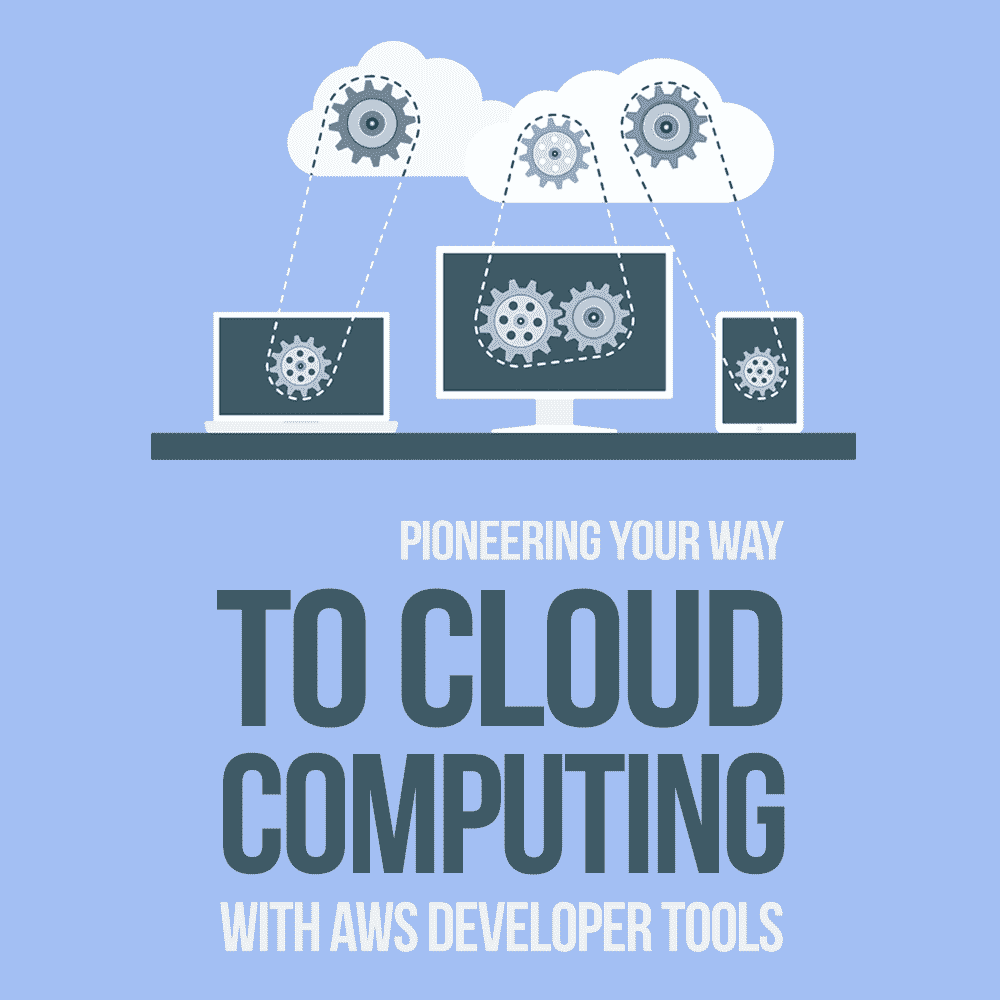

There’s a journey happening right now as more and more organizations migrate to cloud platforms.

根据[Right Scale 2017 年 2 月的“云状态”调查](https://www.rightscale.com/blog/cloud-industry-insights/cloud-computing-trends-2017-state-cloud-survey)，79%的组织现在拥有在公共云或私有云基础架构中运行的系统，95%的组织将寻求采用云。

精明的程序员已经认识到了这种转变，并已经开始了他们向云熟练程度的跋涉。

作为一名程序员，你可以看到货车装载和出发。你会是这趟旅程的领路人吗？不要固执己见，被留在一个孤独的鬼城里。不要犯软件开发人员会犯的 5 个学习错误。

准备好马鞍！是时候成为云计算先锋了。

就像任何一个拓荒者看着面前的荒野一样，知道该走哪条路是至关重要的。

## AWS 开发人员工具图

Amazon Web Services 开发工具包括两个主要领域:CodeCommit 和 CodeBuild。每个领域都专注于一个特定的开发领域，包括源代码管理和构建自动化。这些工具共同将您带到一个成熟开发平台的目的地，与您的系统基础设施完全集成。

简而言之，让我们介绍一下这两个开发人员工具的概念。之后，我们将通过几个实际操作练习来更详细地探索这两者，在您自己的小微型项目“午餐之轮”中设置和使用每一个这个基本应用程序将演示 AWS 开发人员工具套件的每个组件。

最后，您将对这两种工具的作用以及如何使用它们有一个基本的了解。您将准备好独自探索未被发现的国家，并在自己的开发项目中利用这些工具。

### 代码提交

源代码管理总是通往成熟开发目的地的第一站，因为没有稳定的源代码的坚实基础，你就像踩在流沙上。没有得到良好管理的源代码会把你拖进一个故障排除和救火的陷阱，这会扼杀前进的动力——并且会完全扼杀一个项目。帮助你远离流沙的 AWS 开发者工具是 AWS [CodeCommit](http://aws.amazon.com/codecommit) 。

AWS CodeCommit 构建在大家熟悉的 [git 源代码控制管理平台](https://git-scm.com/)之上。因此，如果您已经熟悉 git 和 git 实践，您可以利用这些知识开始使用 CodeCommit。如果你对 git 不熟悉，有大量的 [git 资源和教程可以帮助你入门](http://natthompson.com/git-resources-for-developers/)。

如果您在团队环境中工作，CodeCommit 可以被配置为让多个团队成员在同一个存储库中工作。根据团队的复杂程度，您可以在 CodeCommit 中配置批准级别，或者依赖于对过程的遵守来控制哪些提交到达最终将进入产品的代码主干。

在 git 功能之上，CodeCommit 允许您集成地图上的下一个区域 CodeBuild。通过对存储库的一次提交，可以为 QA 环境构建、打包一个部署变更以进行手动测试，然后部署到您的生产环境中。

### 代码构建

每辆好的货车都有。严格挑剔，注重细节，“我的方式或公路”的拖车老板不会高兴，直到每个细节都被仔细检查，每个皮带都被扣上，每个车轮都被拧紧，甚至在旅程开始之前。

CodeBuild 是测试版 boss，但是是自动化形式；它确保您的代码真正准备就绪。当您将 CodeBuild 集成到您的软件交付管道中时，您正在邀请一台无情的机器来挑选您的代码，寻找缺陷，并向您提供您的代码质量有多差的列表。对于这一批判性的分析，你永远心存感激。

对提交到您的存储库的每个提交的无情评估确保您的代码符合成功发布所需的性能、架构和回归标准。在过去的日子里，这种分析是通过同行评审和手动测试来完成的，这需要更长的时间，并且容易出错。

有了 CodeBuild，每一步都是自动化的。每一次构建都完全按照指示进行，就像之前的构建一样。所有这些过程只需几轮人工审查所需时间的一小部分。没有机会，一个同伴累了，错过了一些东西。每次都会产生一个精确的结果。

构建的持续集成意味着在任何手动审查或测试发生之前发现更多的问题。在这个阶段发现的问题比手工测试中发现的错误，或者更糟糕的是，在发布到生产环境之后发现的错误，纠正起来要便宜得多。每次提交后都进行代码的干净构建意味着您可以确信您的代码已准备好投入生产。

## 开发者工具，

循序渐进

您已经查看了地图，但是在出发之前，您需要去一趟 AWS 商店，为这次旅行做好准备。

你需要一个 AWS 帐户来开始。幸运的是，[AWS 第一次为亚马逊客户提供了一个免费的服务使用等级](https://aws.amazon.com/free/)。它的容量足以涵盖我们将在本文中讨论的所有内容，并让您自己进行更多的探索。

### 设置您的 AWS 帐户

AWS 控制台是所有与 Amazon Web Services 相关的事情的起点。前往[http://aws.amazon.com](http://aws.amazon.com)，点击“创建 AWS 账户”按钮，进入账户注册界面。

当您准备好继续时，请填写表格并单击“创建帐户并继续”按钮。

即使您将使用 12 个月的免费等级，您也需要输入一个支付选项才能继续。亚马逊只会在你超过免费使用门槛的情况下对这张卡收费。

您将看到一个屏幕，要求您提供电话号码，并验证您是人类而不是机器人。一旦你输入了你的信息，你就会收到一个带有密码的电话；在屏幕上寻找通知并输入 PIN。

之后，您将看到一个欢迎横幅，并被提示登录 AWS 控制台。

输入创建帐户时使用的电子邮件地址，然后输入创建帐户时使用的密码。

恭喜你！你的补给已经买好了。你的马车装满了。是时候推出并开始使用 AWS 了。

你正走向小径上的第一个标记。它是一个名为 CodeCommit 的目的地。让我们一个接一个地走这条路，把你带到那里。

### 设置代码提交

在“AWS 服务”搜索框中，输入 CodeCommit 并单击出现的选项。

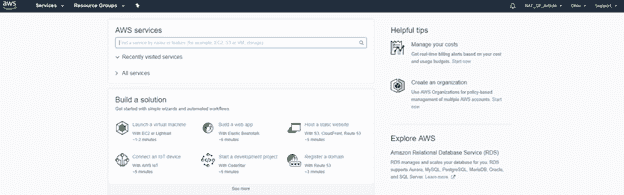

您现在位于 CodeCommit 控制台，在这里您应该单击“Get started”按钮。

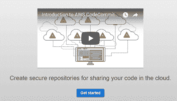

您需要输入存储库名称和存储库的可选描述。输入这些内容后，单击“创建存储库”按钮。

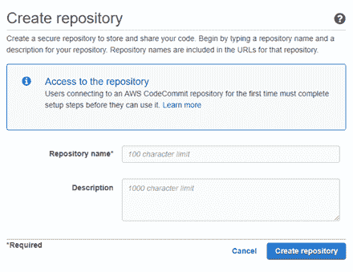

系统会询问您是否希望通过电子邮件收到事件通知以及对您的存储库的任何评论。如果有一个开发团队在一起工作，这个选项可以改善沟通，以便在源代码被推送到服务器时得到通知。

AWS 将完成存储库的创建，并向您显示一个弹出窗口，其中包含有关安全性和连接到 CodeCommit 存储库的信息。它警告你的危险值得注意。

这说明你正在使用的账户对你所有的 [AWS 账户](http://www.amazon.com/exec/obidos/ASIN/B01CIV6QLU/makithecompsi-20)拥有完全控制权。如果它被破坏了，强盗们就可以带着你的货车队向西运送给内华达地区孤儿的所有捐款逃走。稍后我们将解决这个问题。

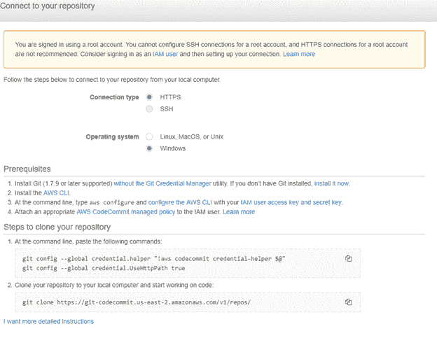

如果你没有安装 Git，你必须在继续之前安装它([https://git-for-windows.github.io/](https://git-for-windows.github.io/))。由于 Git 的分布式特性，每一台运行 Git 的计算机都是您的存储网络中完全足够和独立的节点。只要任何一个节点保持完整，就有可能完全恢复 Git 存储库，这意味着有必要在本地机器上安装 Git，以使它成为网络中的一个节点。

您还需要安装 AWS 命令行界面 CLI。选择 [64 位](https://s3.amazonaws.com/aws-cli/AWSCLI64.msi)或 [32 位](https://s3.amazonaws.com/aws-cli/AWSCLI32.msi)操作系统安装程序。

在完成设置和克隆存储库之前，您需要创建一个名为 IAM 用户的帐户，其权限级别低于设置 AWS 时创建和登录的 root 帐户。该帐户将允许您通过 HTTPS 连接连接到 CodeCommit 存储库，而不用担心如果该连接被破坏，攻击者将可以访问您的根级别帐户。

### 创建 IAM 用户

是时候把手弄脏了。你在山口脚下，向山区前进。接下来您将使用的概念超越了您的非云开发经验。你可能会觉得脖子后面的汗毛竖起来，然后问自己:“这里有熊吗？山狮呢？”

这条路上没有什么东西会吃了你，但是脚下有点棘手。别担心，我是来指导你的。如果你听从我的领导，你会安然无恙地度过难关，变得更聪明，并且有故事可以讲给你的孙子们听。

从“安全性、身份和合规性”部分的服务下拉菜单中，单击 IAM 链接。

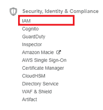

在 IAM 导航面板中，单击“用户”链接。

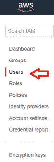

单击“添加用户”按钮。

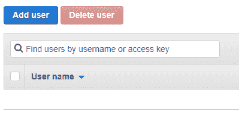

输入您的用户名。

确定选择了“编程访问”复选框。

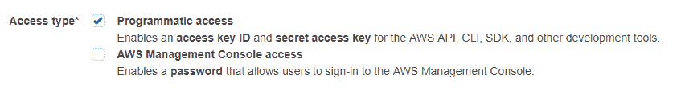

单击“下一步:权限”按钮。

让我们授予用户 CodeCommit 的权限。如果您的团队很大，或者团队成员来来去去，另一个选择是建立一个开发人员组，并授予它 CodeCommit 的权限。然后，您可以根据需要在组中添加和删除用户。对于本练习，直接向用户授予权限就足够了。

选择“直接附加现有策略”选项。在搜索文本框中键入“CodeCommit”。

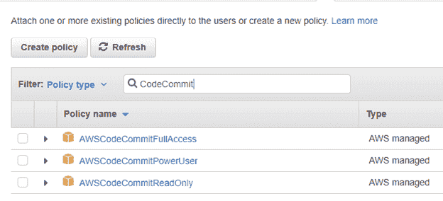

选择“AWSCodeCommitFullAccess”策略，然后单击“下一步:查看”按钮。

确认一切符合您的预期，然后单击“创建用户”按钮。

您将看到一个选项，将用户的安全凭证下载为 CSV 文件。请点击“下载”。csv”按钮，并将文件存储在安全的位置。

现在需要配置 AWS CLI 来存储 IAM 凭据。启动命令提示符并键入“aws configure”以启动 AWS CLI 配置。

输入您在中下载的 AWS 访问密钥 ID。您创建的 IAM 用户的 csv 文件。

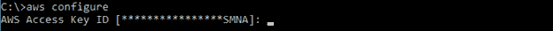

输入秘密访问密钥。

接受默认区域和输出格式。

现在，您已经准备好将您的存储库克隆到您的本地计算机上。如前所述，Git 是一个分布式节点系统。克隆存储库使您的本地计算机成为存储库中的第二个节点，并且是对第一个节点(Amazon 云上的 CodeCommit 存储库)的完整备份。

要开始克隆过程，请创建一个要用来存储源代码的目录。

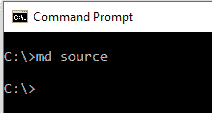

从根目录下一步到您刚刚创建的目录。Git 操作是相对于您正在工作的目录的，因此更改到新目录对于防止根目录中的意外更改非常重要。

在 CodeCommit 存储库中，单击“连接到存储库”链接以显示您的连接信息。将 git clone 命令中的 URL 复制到剪贴板。

在命令提示符下键入“git clone ”,后跟您复制的 URL。

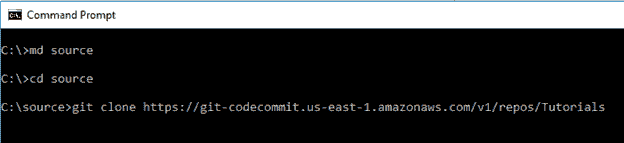

该操作将创建一个连接到 AWS CodeCommit 存储库的本地 git 存储库。

系统将提示您使用您的 git 用户名和密码登录。输入 IAM 用户的这些凭据。

克隆操作完成后，您将收到一条消息，提示您已经克隆了一个空存储库。

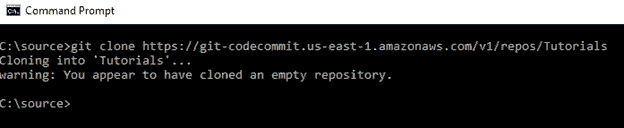

我们很快就会看到一个编码的例子。现在，让我们从一个简单的文本文件开始，演示 CodeCommit 正在工作。

转到在您的文件夹中创建的子目录 Git。

在命令提示符下键入“notepad HowdyPartner.txt”

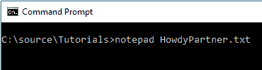

您将收到一条消息，提示该文件不存在。将询问您是否要创建新文件。选择“是”

现在，您将进入记事本应用程序。键入“嗨！你过得怎么样？”或您喜欢的文本到记事本中，保存并关闭文件。

回到命令提示符处，键入“git status”。您将收到一条消息，表明您有新文件准备好进行转移和提交。

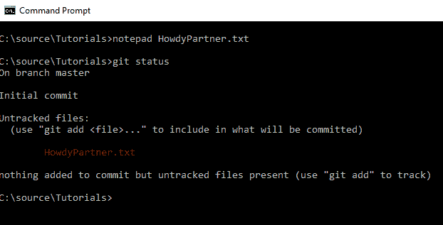

您需要通过键入“git add *”来暂存文件。txt"。再次键入“git status”将显示您的文件已暂存并准备提交。

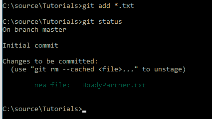

通过键入“git commit-m ' Adding howd partner . txt ' to git repository”提交文件

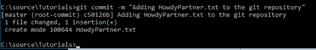

此时，您的新文件位于您计算机上的本地 Git 存储库中。要在 CodeCommit 上将它同步到云中的存储库，您需要发出一个 push 命令。在命令提示符下键入“git push”。

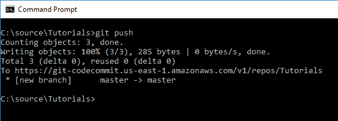

现在，在 CodeCommit 上，您已经有了云中文件的副本。在 CodeCommit 控制台中刷新您的存储库屏幕以查看您的新文件。

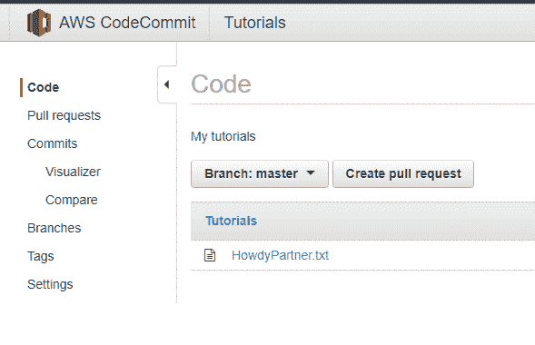

现在，您已经拥有了开发人员工具管道中的第一个构建块。从这里开始，下一步是将您的 CodeCommit 存储库与自动化构建相集成，并用 CodeBuild 进行测试。

### 设置代码构建

此时你已经在一些艰难的国家找到了自己的路。你已经获得了一些老茧和智慧。你已经接近踪迹的尽头了，但是你必须小心。既然你已经走下坡路了，你就不能自满。一个错误的转弯会让你被大雪困在山上，没有足够的食物过冬。

CodeBuild 是一个工具，它可以确保你保持头脑清醒。它的目的是使纪律系统化，这样当你疲倦或匆忙时，你就不会在这个过程中错过一些关键的东西。

要完全理解 CodeBuild 的能力，您需要一个编码项目。我们将使用我的示例项目“午餐之轮！”它是一个. Net 核心控制台应用程序，因此可以在 Windows 和 Unix 操作系统上运行。本练习不需要编码；可以下载完整的[。Net 核心教程项目](http://natthompson.com/dotnetcoretutorialproject)马上启动并运行。

下载文件并将它们放在本地计算机上的 CodeCommit 目录中。你需要往回走一点点，重新追踪你的脚步。重复上面的步骤来添加、提交和推送这些文件到 Git。现在，当您刷新 CodeCommit 存储库控制台时，您将看到这些新文件已经准备就绪。

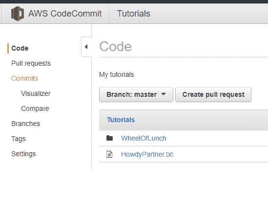

现在您已经准备好用 CodeBuild 建立一个自动化的构建了。

在使用 CodeBuild 设置构建之前，我们需要一个位置来存储构建的工件输出，以便在以后准备部署应用程序时使用。我们将使用 S3，简单的存储服务。S3 储存容器被称为桶。让我们快速设置一个 bucket 供 CodeBuild 使用。

### 设置 S3 时段

从 AWS 服务下拉菜单中，选择 S3。

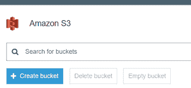

我们将把我们的存储桶命名为“build_output”。单击“创建存储桶”按钮开始。

输入唯一的存储桶名称。此名称对于任何地方的所有 S3 存储桶都必须是唯一的，而不仅仅是您的帐户，因为此名称将被用作访问此存储桶的 URL 的一部分。

单击“下一步”按钮。

接受默认设置，并在“设置属性”和“设置权限”屏幕上再次单击“下一步”按钮。检查一切以确认它符合您的期望，然后单击“创建存储桶”按钮。

您将在 S3 控制台看到您的新铲斗。现在，您可以继续在 CodeBuild 中创建您的构建定义。

### 返回代码构建

从 AWS 控制台的服务下拉菜单中，选择 CodeBuild。

单击“开始”按钮。

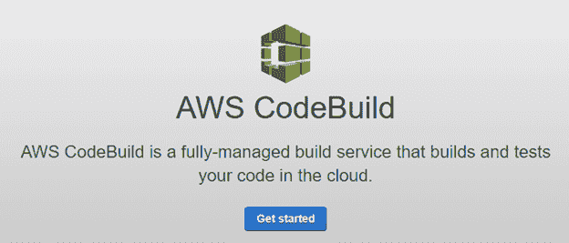

为您的代码构建项目命名。

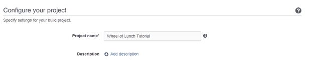

现在您已经准备好告诉 CodeBuild 您想要构建什么了。下面截图中的信息表明我们想要构建的源代码位于教程存储库中的 CodeCommit 中。选择“完整”克隆深度可确保存储库中的所有文件都可用于构建，从而避免任何缺失的依赖项。

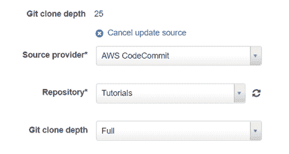

接下来，我们将指定我们希望 CodeBuild 使用的环境。选择“使用由 AWS CodeBuild 管理的图像”单选按钮。从下拉框中选择合适的操作系统(Ubuntu)。将运行库指定为。NET Core 和运行时版本 dot-net-core-2.0。

在项目的源代码文件中，我包含了一个构建规范文件 buildspec.yml，它包含了在哪个项目上进行代码构建的指令。要使用这个文件，请确保选择了“在源代码根目录中使用 buildspec.yml 文件”。

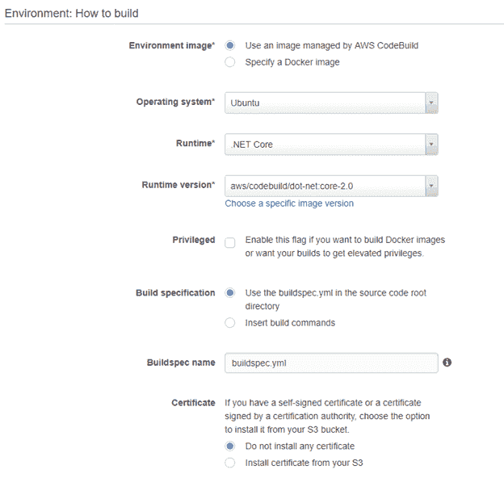

在下一部分中，我们指定我们希望构建产生的工件被放置在我们上面创建的 S3 桶中。

在“工件”部分，从类型下拉菜单中选择“亚马逊 S3”。

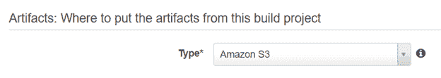

在剩余的框中，输入您喜欢的值。

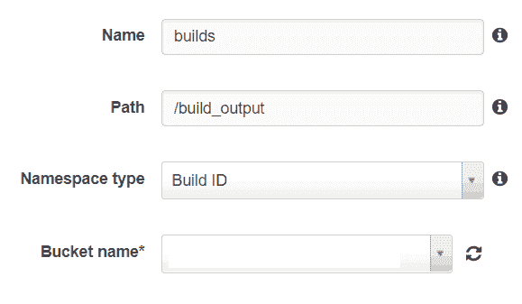

在“存储桶名称”下拉列表中，选择您在 S3 创建的第一个存储桶。单击“更新”按钮保存您的更改。

现在，当您的构建运行时，它会将工件(如可执行文件和库文件)复制到 S3 桶中。

我们将需要一个服务角色来执行这个构建。选择“在您的帐户中创建服务角色”单选按钮。在“角色名称”文本框中输入您的角色名称。

在本例中，我们不会使用虚拟私有云(VPC)。从下拉框中选择“无 VPC”。

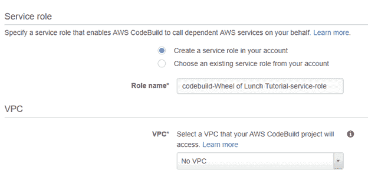

单击“继续”按钮，然后检查您的构建配置并单击“保存”按钮。

现在，您有了一个指向 CodeCommit 存储库的完全定义的构建，它将为您提取和构建代码。要启动您的构建，请从 CodeBuild“构建项目”控制台中选择它。

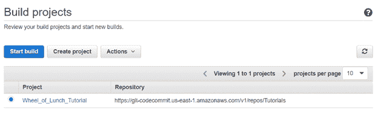

单击“开始构建”按钮来触发构建。此操作将显示“开始新版本”屏幕。从“分支”下拉菜单中选择“主”分支。

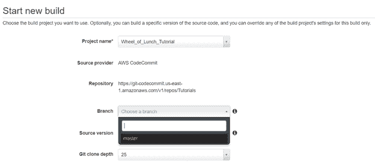

从“Git 克隆深度”下拉列表中，确保选择了“完整”选项。该选项将检索整个存储库，以确保构建成功所需的关键文件不会丢失。

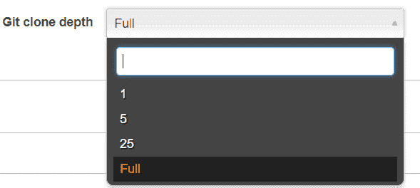

单击“开始构建”按钮启动您的构建定义。构建将会运行。完成后，您将看到一份关于最终结果的报告。

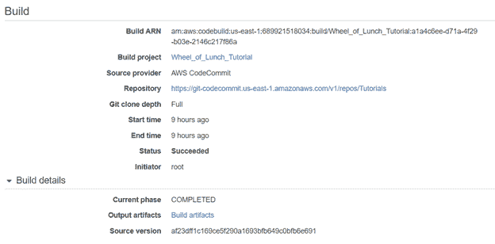

状态行应指示“成功”如果您有不同的结果，该报告下面提供的日志文件应该会告诉您失败的原因。

在详细信息部分，标签“输出工件”位于存储这些工件的 S3 存储库的链接旁边。你可以点击它来看看你努力的结果。

有了这个输出，您可以部署和测试您的代码。当它通过所有测试并符合质量标准时，就可以进行生产部署了。

## 后续步骤

你成功了！越过平原和山脉，你到达了你的新家园、金矿或孤儿院。有了云计算，可能性多得数不清。

你已经熬过了这段旅程，并掌握了新的技能，这些技能将在你的新努力中很好地为你服务。

使用 CodeCommit，您可以确保您的源代码得到良好的管理和控制。您可以获得完整的版本历史，Git 强大的分支功能唾手可得。

CodeBuild 使您能够构建和验证源代码的生产就绪性。一旦您的代码被提交到 CodeCommit 存储库中，CodeBuild 就可以测试它了。

所有这些工具仅仅触及了 AWS 必须提供的服务的表面。从通过人工智能进行语音和图像识别，到基于云的关系数据库和 NoSQL 数据库，很难说出一项技术不是以某种形式从 AWS 获得的。

AWS 提供的开发人员工具具有强大的功能。作为一名程序员，熟练使用它们是一项很有价值的技能。

如果你对更多 AWS 主题感兴趣，并且正在寻找一个很好的起点来介绍基本概念，那么这个 [AWS Essentials](http://natthompson.com/freeawscourse) 页面或[Amazon Web Services in Action](http://www.amazon.com/exec/obidos/ASIN//makithecompsi-20)是一个很好的起点。如果你想要一个如何尽快学习 AWS 技术的策略，视频[如何快速学习一门新的编程语言！](https://simpleprogrammer.com/learn-new-programming-language-fast/)向您展示如何操作。

现在，走出去，用 CodeCommit 和 CodeBuild 来构建一些伟大的东西吧！