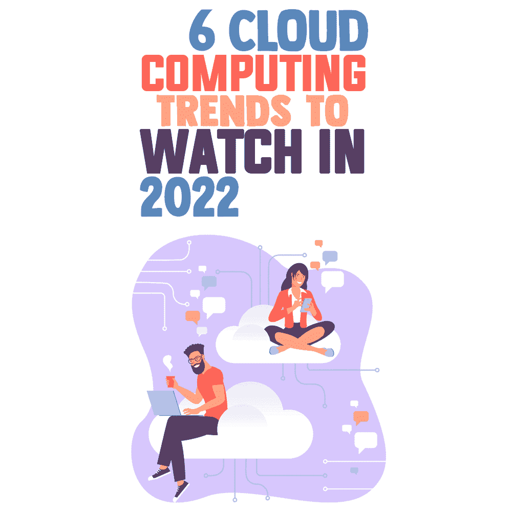

# 2022 年值得关注的 6 大云计算趋势

> 原文：<https://simpleprogrammer.com/cloud-computing-trends-2022/>

The future of cloud computing is changing rapidly. It is a domain that has been at the forefront of technological advancements and will continue to be for the foreseeable future.

[云计算](https://simpleprogrammer.com/career-in-cloud-computing/)能够帮助组织随时随地访问各种资源和应用，从而实现数字化转型。

## 理解为什么云变得越来越重要

云正变得越来越重要，因为它提供了一种更灵活、更具成本效益的方式来存储和访问数据。它也比传统的内部数据中心更安全。

云计算是通过互联网交付软件、服务和基础设施作为服务。它是一个分布式系统，可以通过互联网或专用网络进行远程访问。

在展望 2022 年即将到来的趋势之前，让我们回顾一下云计算的一些优势。

## 云计算的优势

*   **灵活性**:用户可以扩展服务以满足其特定需求，定制应用程序，并通过互联网连接从任何位置访问云服务。
*   **效率**:企业用户可以快速将应用推向市场，而不必担心基础设施成本或维护。
*   **战略重要性**:云服务通过利用最前沿的技术为企业提供竞争优势。

随着云计算为多个行业带来如此多的基本好处，让我们深入了解一下趋势。

## 2022 年及以后的 6 大云趋势

### 1.采用软件定义的一切(Sdx)

软件定义一切(SDx)是使用软件来控制和管理业务各个方面的想法。这包括计算、网络、存储等。本质上，目标是从开始到结束对业务进行软件控制。

近年来，SDx 的采用稳步增长，因为它比传统系统提供了许多优势。

例如，借助 SDx，您可以快速部署新应用，而无需等待硬件升级或配置。您还可以通过软件自动化增强安全性，以及提高灵活性和可伸缩性。

也就是说，组织[必须能够适应](https://www.amazon.com/M%D0%B0%D1%81hin%D0%B5-L%D0%B5%D0%B0rning-B%D0%B5ginn%D0%B5r%D1%95-Everything-Tensorflow-ebook/dp/B07TQJ1LVK/)尽可能地提高效率。

### 2.人工智能(AI)和机器学习(ML)重要性的上升

人工智能和机器学习是现代世界最重要的两项技术，因为。它们已被应用于广泛的领域，从医疗保健、教育，甚至像营销这样的行业。

人工智能和机器学习(ML)重要性的上升对营销和其他行业产生了重大影响。

过去，市场营销大多是通过广告来完成的。这对营销人员来说很容易，因为他们的工作可以量化，并分解成一门科学。

现在情况不同了，人工智能和人工智能让营销变得更加困难和重要。

AI 的应用范围更广。例如，由人工智能驱动的项目管理软件可以显著降低企业成本，同时也有助于更顺畅、更有效的管理系统。

### 3.提高对数据主权问题的认识

数据主权是许多公司越来越关注的问题，这也是许多公司确保使用[云安全最佳实践](https://www.blumira.com/cloud-security-best-practices/)的原因。

对于 SaaS 公司来说，保持云性能对他们在客户中的声誉至关重要。服务中一分钟的停机时间会对他们的客户群产生巨大影响。

为了保持业务蓬勃发展，最重要的是要有一个系统，对所有系统进行定期检查，并监控您的云服务器。

这使得检测系统中任何潜在的或现有的问题变得容易和有效，以帮助您立即修复它们。例如，你可以用 graphite[监控云服务器性能](https://www.metricfire.com/blog/how-to-monitor-cloud-server-performance-with-graphite/)。

《通用数据保护条例》( GDPR)强制要求公司在使用其数据之前必须获得用户的同意。

这项法规使得公司很难将数据转移到欧盟以外。GDPR 还强制要求公司在系统出现任何漏洞时通知用户。

此外，如果有任何数据删除或转移，他们必须通知用户，并强制他们公布所收集的用户信息以及这些信息的使用情况。这是为了更好的保证用户安全。

根据 GDPR 使用[区块链技术是数据管理领域讨论最多的概念之一。](https://simpleprogrammer.com/gdpr-blockchain-guide/)

从企业到社交媒体，各种创新型创业公司开始建立自己的去中心化协议，比如那些建立在以太坊上的协议。

区块链是一个开源网络，所有交易和数据都存储在一个公共账本中，任何人只要能上网就可以访问。

### 4.人工智能和云计算

Cloud computing is critical to the delivery of artificial intelligence (AI) services. Its impact on society is more profound than electricity or fire which will be explained in this section.

机器学习平台需要巨大的处理能力和数据带宽来训练和处理数据，云数据中心让任何人都可以使用这些数据。

我们在周围看到的大多数“每天”人工智能——从谷歌搜索到 Instagram 过滤器——都生活在云中，机器学习用于将流量从数据中心路由到我们的设备，并管理存储基础设施。

许多企业正在使用云咨询来提高效率和实施新技术。这些云计算机构能够协助定制云解决方案的设计、开发和/或维护。

有时候，新技术只是一种工具，可以改善你公司的工作流程。

其他时候，它是一套技术原则，支撑着称为 [MACH architecture](https://blog.bluestonepim.com/blog/easy-breezy-guide-to-mach-architect) 的新型最佳技术平台，也称为基于微服务、API 优先、云原生和无头技术。

### 5.区块链和 Kubernetes

区块链是一种[改变游戏规则的技术](https://www.amazon.com/Blockchain-Revolution-Technology-Changing-Business-ebook/dp/B0141ZP32E/)，它创建了一个共享的、防篡改的数字账本，用于记录公共或私人网络中的数据。它保持准确的交易记录，而不依赖于中央机构。

Kubernetes 是一个开源的容器编排平台，使组织能够自动扩展、部署和管理容器化的基础设施。

因为当前的区块链公共基础设施在大数据存储和管理方面没有扩展，所以为大数据应用程序整合[区块链](https://simpleprogrammer.com/blockchain-trends-2022/)系统非常困难。

然而，使用 Kubernetes for 区块链可以通过始终为关键服务运行多个容器来实现环境的快速扩展和高可用性。

Kubernetes 上的区块链支持具有不同架构的组织之间的服务互操作性。

### 6.云游戏

云游戏是一项新技术，它允许用户以固定的月费播放几乎无限数量的游戏。它允许你在任何台式机，笔记本电脑或智能手机上玩，消除了对昂贵的控制台的需求。

在游戏行业使用云技术增加了多人游戏的需求和参与度，同时消除了现有的平台障碍，尤其是移动应用程序开发。

云游戏还消除了用户对存储空间、专用硬件和盗版问题的需求，所有这些都转化为更低的总体成本和可持续性。

微软、谷歌、亚马逊、苹果、三星、索尼和英伟达是目前云游戏领域的主要玩家。

尽管游戏流媒体技术还没有达到应有的强大，但它向云的迁移将确保云游戏的未来不断发展。

它还将迎来一个未来，云既是游戏的来源，也是玩家选择的平台。

## 底线

云应用被用于许多不同的领域，在考虑 2022 年的趋势时，必须注意这一点。

云应用也可能对数据主权构成威胁。这可能会对企业产生影响，尤其是在使用区块链和 Kubernetes 的情况下。

人工智能和人工智能是不可避免的，不仅在云计算领域，而且在软件开发的未来也是如此。

最后，由于云计算的好处，云计算正在主导游戏行业。