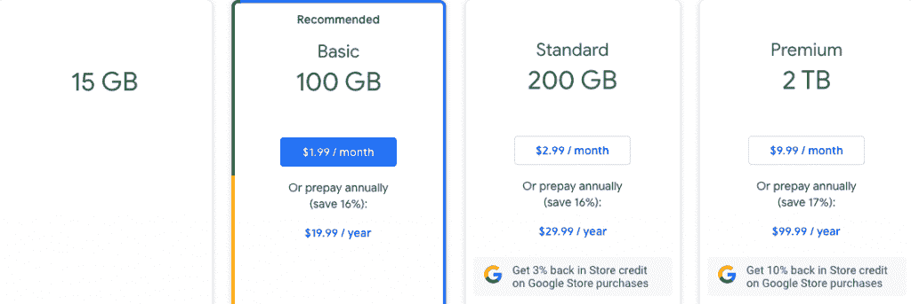
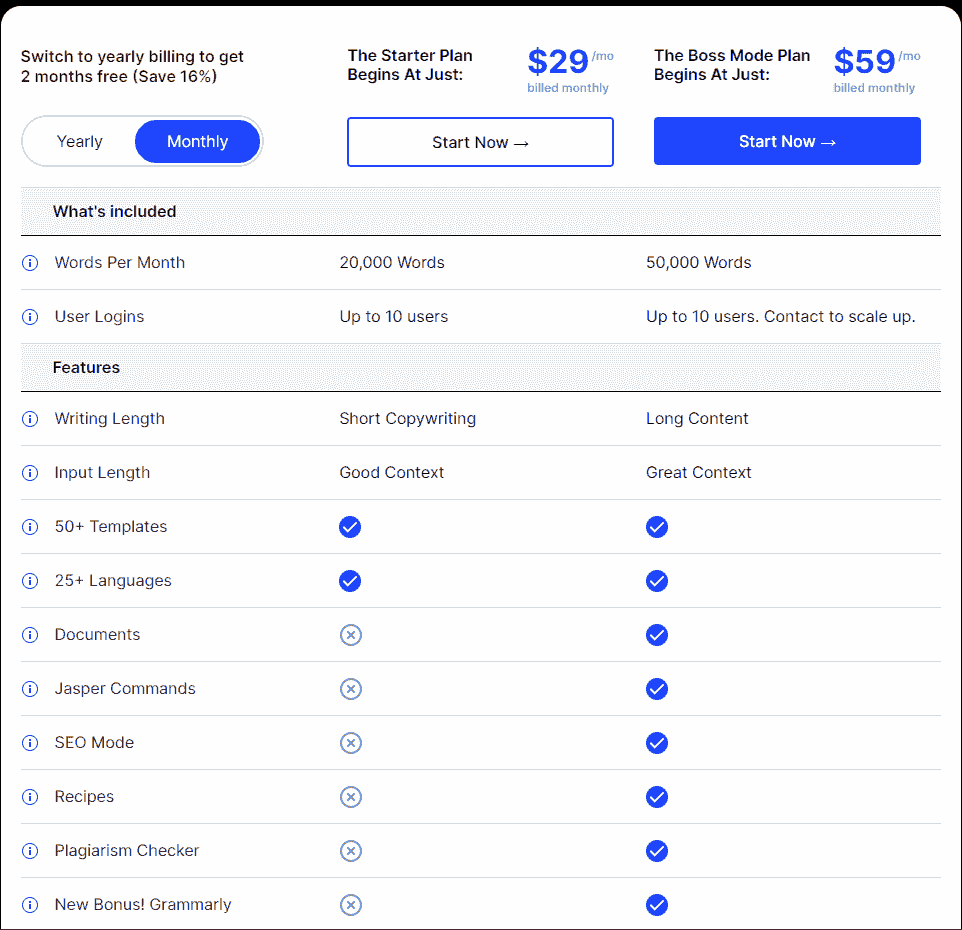
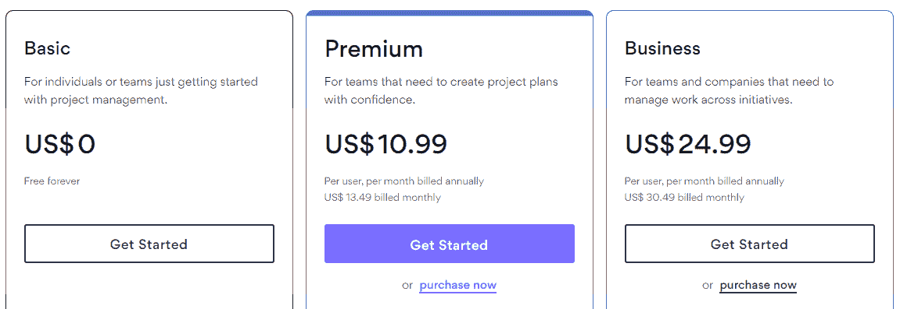

# 云软件开发的完整指南

> 原文：<https://simpleprogrammer.com/cloud-software-development/>

你可能使用过各种商业工具，比如任务跟踪器、视频会议软件、消息平台和日程安排软件。然而，作为最终用户，你不会经常听到的一个术语是“云计算平台”尽管云平台听起来很复杂，但它们比你想象的要普遍得多——当你是一名软件开发人员时，它们实际上无处不在。

云技术超越了消费者照片存储。基于云的软件开发解决方案跨越多个行业，但它们都允许用户降低成本，减少维护和劳动力需求，并在工作场所推广最佳实践。

在本文中，我将讨论不同种类的云模型、云计算的优势和主要特性，以及所有这些对软件开发人员的意义。如果你是一名云软件开发人员，理解云计算的概念是开始你的旅程的好地方。

## 什么是云计算？

基于云的计算包括用户可以在任何地方使用不同设备按需访问的工具和服务。这些工具包括托管在 web 上的服务器、存储和代码库，可以到达世界各地的许多不同用户。

来源:[谷歌](https://storage.googleapis.com/gweb-uniblog-publish-prod/images/PhotosBlogBanner_1.max-1000x1000.jpg)

如果你以前使用过类似 iCloud 或 Google Photos 的东西，你可能已经知道什么是消费者层面的云计算。一些商业例子包括 Google Workspace、Asana、Hubspot 和 GitHub。

然而，基于云的服务不仅限于软件。它们分为三类:

*   软件即服务(SaaS) :这可能是你最熟悉的一个。SaaS 是通过云提供商托管的软件。 [SaaS 有多种形式](https://paykickstart.com/how-to-survey-your-saas-customers-the-complete-guide/)，从 B2B 商业解决方案(HubSpot)到消费软件(Google Drive)。
*   **平台即服务(PaaS)** :这些是基于云的开发工具，用于构建软件。开发人员使用 PaaS 创建 web 应用程序、移动应用程序和各种其他软件。
*   **基础设施即服务(IaaS)** : [云基础设施](https://simpleprogrammer.com/visualizing-cloud-infrastructure/)使用存储、服务器、计算能力等物理组件的虚拟版本。亚马逊网络服务(AWS)和谷歌云就是一个例子。

除了这三种类型的云服务，还有不同的云模型。

### 用于软件开发的不同类型的云模型

在基础层面，有四种类型的云模型。

*   **公有云。**这些服务是可访问和可扩展的，因为基于云的公共软件可供公众使用。比如 Asana 和 Google Workspace，在这两个平台上添加用户所需的唯一信息就是他们的电子邮件地址。这些解决方案有助于软件开发人员轻松分配任务。
*   **私有云。**这种模式的实例更加安全，也更加可定制，因为它们是专为企业或组织开发的。虽然它们很昂贵，并且需要持续的维护，但是它们对于从事必须谨慎的项目的大型组织很有用。
*   **社区云。**社区云包含用户可以贡献给云环境的共享云资源。社区云凭借其协作性极大地帮助了一个行业的集体技术(和文化)发展。IT 和软件开发行业的 GitHub 就是一个例子。
*   **混合云。**混合平台环境最为复杂，需要更多的监控和维护。混合云的一个示例设置是在私有云上存储[源代码](https://www.amazon.com/dp/B00JDMPOK2/makithecompsi-20)或敏感个人信息，同时为员工提供基于公共云的非机密数据应用。

## 云计算的优势

与传统的内部设备相比，云计算有一些优势。以下是云计算的主要优势:

### 提供易用性

与[内部解决方案](https://www.techslang.com/definition/what-is-on-premises/)相比，云解决方案可供您的员工使用，并且对您的管理员来说压力较小。借助基于云的应用，您的员工可以享受基于云的应用提供的一流服务和功能，像任何业务工具一样有效地增加工作流程。

云计算[系统编排](https://databricks.com/glossary/orchestration)也让你的团队可以在任何地方工作，将来自世界不同地方的团队成员聚集在一起。这使得云软件能够提供与众不同的[用户体验](https://sixgun.com.au/user-experience-and-its-impact-on-seo/)。

因此，云计算系统的易用性在您的组织内培养了一种更高效的工作文化。

然而，基于云的应用程序和网络应用程序是不能相互混淆的。以下是两者之间的一些主要区别:

| 开发 | 云应用 |
| Web 应用程序需要互联网连接才能使用。因此，如果您的办公室 wifi 中断，或者提供商的服务器因维护而停机，这可能会中断您员工当前的工作流程。 | 基于云的应用程序需要互联网连接才能设置，但不需要互联网连接才能使用。员工可以继续使用基于云的解决方案，因为软件会在本地缓存数据。这些数据将被上传到云中，供员工的设备下次上线时使用。 |
| Web 应用程序是基于浏览器的应用程序，需要浏览器才能使用。 | 云应用不需要浏览器就可以使用。相反，你需要下载与你的操作系统相匹配的应用程序。例如，谷歌文档既有安卓应用，也有 iOS 应用。 |

这使得基于云的应用程序比典型的基于网络的解决方案更容易为您的员工所用，尽管它们都使协作对您的组织来说轻而易举。

### 易于扩展

云解决方案可以轻松适应各种变量，例如您组织中的人数、您需要的存储以及您需要的云计算资源。

您可以通过支付额外费用来升级您的云软件或基础架构，而不必为不断增长的团队租用更多办公空间，以及添加服务器和现场基础架构。这些升级包括更高的用户容量、更多的功能或增加的存储。你也可以轻松地降级你的云软件。

这意味着，无论是向上扩展还是向下扩展，您都不需要构建新的数据中心或在您的场所安装新的设备。这种灵活性使得基于云的解决方案能够轻松适应组织内快速而动态的变化。

来源: [Google Drive](https://googledrivepro.com/wp-content/uploads/2022/01/Google-Drive-Pricing-1024x343.png)

Google Drive 是这种可扩展性的一个很好的例子。免费计划提供 15 GB 的云存储空间，而你可以每年支付 19.99 美元获得 100 GB 的存储空间。在选择企业选项之前，您可以购买更多存储空间，因为企业选项对存储空间没有限制。

像 Google Drive 这样的云软件解决方案让那些只需支付所需费用的公司更容易扩展，而不是让 IT 和管理团队来管理服务器等私有组件。

### 很划算的

与网站托管和服务器等现场架构相比，云计算的建立和维护成本要低得多。您不需要支付维护人员的费用，也不需要负担拥有现场基础设施的成本。你也不需要花钱让它通宵运行。

基于云的平台，如谷歌云，全天候运行，只需要订阅。您不必担心电力和维护预算的分配，也不必担心停电和技术问题。您的云服务提供商会为您管理这一切。你需要担心的只是他们承诺的服务的月费。

## 云计算的 3 个主要特征

云计算有一些独特的功能，所有这些都有助于它的可靠优势。

### 现收现付模式

云计算的一个好处是，你只需为你使用的东西付费。与吃到饱的自助餐不同，不管你吃的是一块纸杯蛋糕还是一整场盛宴，你都要支付固定的金额，云计算根据你使用的服务和分配给你的组织的资源量按比例收费。

云平台上的各种应用程序为不同的公司需求提供了量身定制的选项。云应用程序为小型企业提供了一个选项，如您朋友的针织业务，但也为大众汽车和埃森哲等拥有 60 多万员工的巨头提供企业级云计算服务。你打赌你的朋友不会像这些行业巨头一样支付相同的月费。

**按需购买软件开发:** PaaS 和 IaaS 解决方案有助于降低软件开发的成本，让开发人员更加轻松。基于云的应用程序开发利用云工具和基础设施为软件工程师提供必要的工具包，同时为最终用户提供简化的用户体验。

以谷歌云平台为例。

谷歌为许多不同的行业提供云服务，其中之一就是软件开发。Google Cloud 为企业提供了构建软件所必需的工具，以及一个可以托管这些应用程序的 Google Cloud 平台(云托管)。

基于云的应用程序开发只产生你实际使用的成本，而不是必须建立现场基础设施，例如即使你的流量为零也会产生电力成本的服务器。正如谷歌云的无服务器架构所吹嘘的那样:“我们的无服务器计算会根据流量自动扩大或缩小你的服务，甚至缩小到零，你只需为你使用的服务付费。”

这为你的应用程序开发节省了大量预算，让你可以专注于其他领域，如营销、SEO 优化和敏捷 UX 研究。

只为你使用的功能付费:你可能不需要人工智能写作平台的所有功能。相反，您可以选择具备所需功能的计划:

来源: [Jasper.ai](https://www.jasper.ai/pricing)

以 Jasper.ai 为例。

每月 29 美元，Jasper.ai 提供 10 个用户登录和每月 20，000 个单词，以及对多达 25 种语言和简短内容的支持。该计划非常适合开始扩大内容创作规模的小型企业。另一方面，59 美元的计划提供了 50，000 个单词，支持长格式内容，以及像抄袭检测和语法检查这样的高级功能，使该计划成为大型企业的理想选择。

**仅在使用期间付费:**当您决定不再需要云计算提供商的服务时，您可以随时取消。除非你选择了年度服务，否则你的云服务供应商不会因为你几个月没有使用云应用程序而向你收费。

来源:[体式](https://asana.com/pricing)

例如，项目管理软件 Asana 提供年度和月度计费选项。如果你只是尝试不同的项目管理解决方案，你可以选择按月付费，一旦你决定要长期使用，就可以选择按年付费。

云计算的现收现付模式有助于提高成本效率和可扩展性，使您能够根据自己的需求调整计划。

### 自助服务

云原生应用需要最少的人工干预来运行。云是自我管理的强大基础。[云应用开发](https://simpleprogrammer.com/get-started-cloud-native-application-development/)依靠多个远程数据中心(而不仅仅是一个远程服务器)为全球用户提供他们所需的云计算技术。

这使得依赖云应用开发的软件企业能够最大限度地降低劳动力成本。软件开发人员不再将资源投入到维护中，而是简单地依赖云服务供应商致力于更好的服务。

### 多租户

多个用户可以同时使用云计算解决方案。然而，与您的办公室 wifi 不同，拥有更多用户不会扰乱其他云用户的用户体验。

云软件开发可以将资源集中到需要更多计算能力、更多带宽等的用户。

这就是为什么为云计算供应商的最高级选项付费的用户比免费版本的用户获得了增强的客户支持和更多的资源分配。由于支付更多费用的组织的需求和能力更高(请记住，这是一种按需付费的模式)，云巧妙地将资源集中到这些组织，以便为那些支付较少费用的组织提供良好的用户体验。

这是因为订阅廉价计划的组织不需要那么多的功能和容量。因此，较低的资源分配正好适合他们。

## 云计算对软件开发意味着什么

云计算的各种功能意味着应用程序和软件开发人员不必担心随着用户群的自然增长(或减少)而建设(或拆除)更多的服务器。虚拟服务器根据应用程序开发人员认为合适的方式扩大或缩小其容量。

因此，如果应用程序开发者突然通过病毒式营销策略在一夜之间获得额外的 10，000 名用户，云平台将简单地适应这种突然的变化。

使用基于云的应用构建工具也是如此。如果您需要为公司增加 100 或 200 名应用程序开发人员，云工具可以分配适当的容量，而无需建立一个现场服务器塔。

## 软件开发的未来在云中

云计算为用户和管理员提供了易用性，有效地[提高了生产力](https://simpleprogrammer.com/productivity-boosting-software-tools/)并培养了高效的工作文化。由于它可以在世界任何地方和任何设备上使用，因此非常适合远程团队。云计算软件还具有成本效益和可扩展性，因为您不必设置内部设备。你花钱让云服务提供商为你做这些事情。

因为云计算允许用户从世界上几乎任何地方访问不同的资源，软件开发人员也使用基于云的工具与他们的同事在项目上进行协作。这些工具允许开发团队几乎昼夜不停地工作，将开发时间削减到严格的内部团队所需时间的一小部分。

此外，由于多租户，基于云的开发平台还让开发人员能够访问他们自己无法负担的额外资源。开发团队还可以根据项目需要增加或减少存储，在成本方面给予他们很大的灵活性。此外，现收现付模型允许团队仅在需要时访问功能。

所有这些特性使云工具和平台非常适合应用和软件 development⁠—a 快速增长的行业，该行业也需要针对不断变化的市场的动态解决方案。云工具为软件开发人员和最终用户提供了易用性。