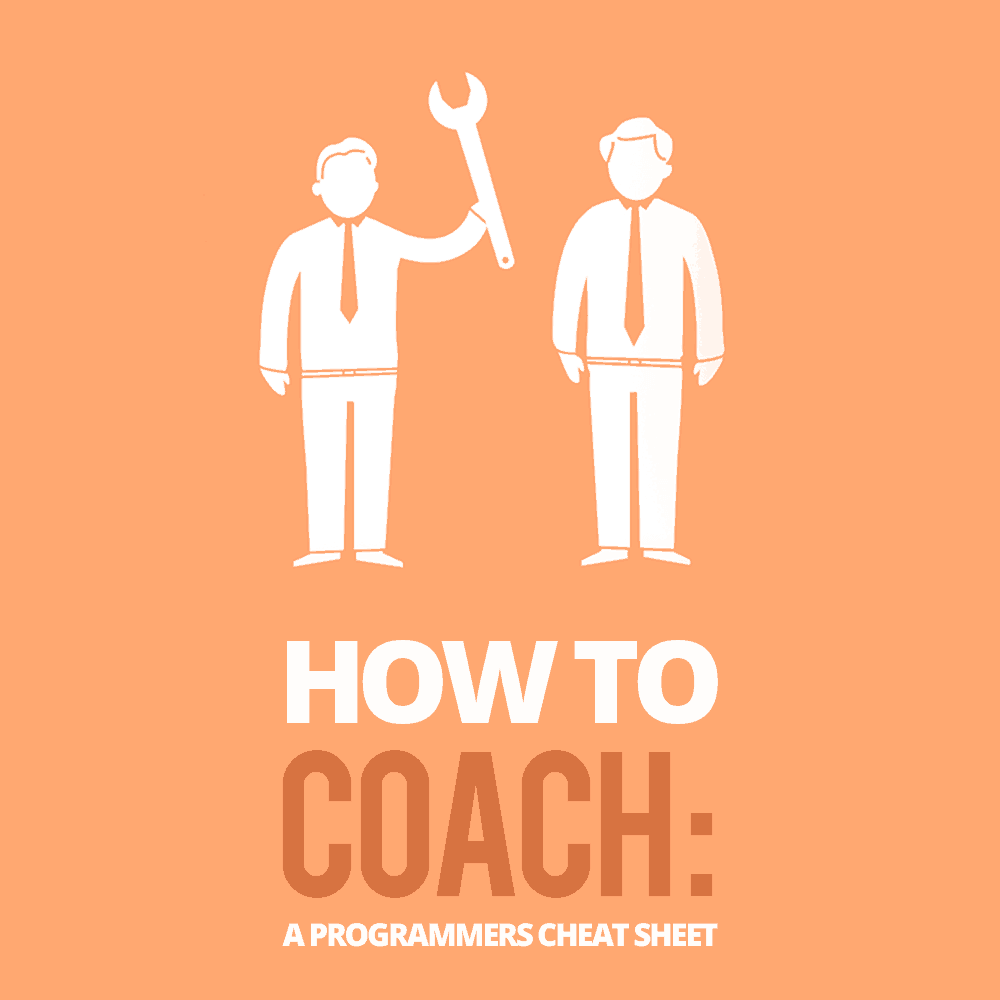

# 如何蔻驰:一个程序员小抄

> 原文：<https://simpleprogrammer.com/coaching-programmers/>

**

*“你对他人的影响是最有价值的货币。”—金凯瑞*

在你迄今为止的编程生涯中，你可能会被要求“指导”大多数程序员进入这个领域是为了写代码，通常在我们意识到这一点之前，[我们就已经成为了领导者，这几乎是偶然的。](https://simpleprogrammer.com/2018/01/22/accidentally-lead-developer/)

我记得在我第一份工作刚开始几个月的时候，我告诉我的老板，我觉得我教了很多东西。我想说这是对教学的一种自然倾向，但我不认为是这样。由于技术领域的性质，教导和指导他人是我们工作的固有部分。即使我们对这个领域很陌生。

大多数开发人员可能不认为指导是一项“必需的技能”但是有能力、耐心和意愿去指导的程序员有一种尚未开发的超能力。如果你愿意用这种超能力来帮助你的团队或公司的其他人成长和发展，你就会脱颖而出。除了与一个更有凝聚力、更快乐的团队一起工作，增加你自己的工作满意度之外，成为一名教练英雄意味着你的工作更有可能得到认可，也许会加薪(或两次！).

即使是超级英雄也需要一个计划。如果你想成为一名教练英雄，你需要知道一些简单的事情来做好它。我将会给你一个计划——一个小抄，如果你愿意的话——你需要知道的一切来指导你的程序员同事。

## 但是我不能蔻驰。(对吧？)

也许你有点怀疑，认为你不够了解教练。教练必须在这个领域工作多年，或者有多个学位，或者类似的东西。如果你这样想，你并不孤单。关于教练的一个令人惊讶的误解是，你需要首先了解一个主题的一切。事实上，你没有。

是的——你*没有*读对。我再说一遍，因为它保证了重点:你不需要为了指导而了解主题领域的一切。我希望我没有让你困惑，但如果我困惑了，让我们看看一个教练实际上是做什么的。

教练是只配备一种武器的人:[问题](https://thedevcoach.co.uk/5-tips-on-how-to-ask-powerful-questions-to-get-powerful-answers/)。

## 使用苏格拉底方法训练程序员

I first discovered the Socratic method when I worked for the technology mentoring company [Thinkful](http://www.thinkful.com/). In their mentor welcome pack, they talked about something called [The Socratic Method](https://en.wikipedia.org/wiki/Socratic_method). I’d heard of it mentioned before in programming talks but hadn’t really understood what it was about or why it was relevant to programming.

苏格拉底教学法意味着[通过提问](https://thedevcoach.co.uk/what-the-hell-is-the-socratic-method-and-why-as-a-developers-you-should-care/)来教学。你不是直接回答问题，而是通过提问来引导个人，迫使他们自己思考问题。克制自己不给出建议，而是引导他人，这需要一定的自我克制。为了更好地理解苏格拉底式教学法，我们来看一个例子:

**被辅导者:**“我一直在努力解决这个 bug 你介意帮我一把吗？”

蔻驰:“当然，为什么不先告诉我你到目前为止都做了些什么？”

**被辅导者:**“好的，我一直在写这个把两个数相乘的函数。”

蔻驰:“对，还有什么？”

**Coachee:** “嗯，我期望它返回数字，但它却返回一个奇怪的字符串错误:NaN。”

**:“好吧，那你知道南是什么吗？”**

****被辅导人:**“呃，我不确定。”**

**蔻驰:“好吧，如果我告诉你这是首字母缩写，其中一个单词是‘数字’，会有帮助吗？”**

****被辅导人:**“非一号！”**

****蔻驰:**“对！你知道它为什么会抛出这个错误吗？”**

****Coachee:** “啊，第二个变量是一个字符串，不是一个数字，所以当它们加在一起时，它返回 NaN——这就是它出错的原因！”**

**在示例中，您可以看到教练没有介入并为个人解决问题。有些违反直觉的是，当我们投入到解决问题中时，从长远来看会产生一种依赖感。**

**教练的目标应该是解放我们的员工，让他们能够做好自己的工作，而不是让他们依赖我们一直在那里解决他们的所有问题。在一段时间内成为关键人物可能感觉不错，但是当你有 20 个初级开发人员组成的队伍用刺激和无聊的消息轰炸你时，你可能会后悔这是出于好意的帮助。**

**这种方法不仅是一种更好的教学方式；我见过整个企业陷入停顿，因为个体程序员为其他程序员“解决”问题，而不是解放他们去解决他们自己的问题。在编程中，这种人力瓶颈被称为[布伦特](http://devopsdictionary.com/wiki/Brent)，以著名小说*T5 凤凰计划 T7】中的人物命名，他被召来解决每一个问题。布伦特变得精疲力竭，心怀不满，变得不那么好相处。***

**要聪明——不要像布伦特那样。**

## **两种类型的辅导**

**我喜欢将教练视为两种不同的类型:发展教练和绩效教练。**

**发展辅导是较慢的辅导类型。发展辅导侧重于发展长期技能和关系，通常以一对一的方式进行。**

**但不一定要那么正式。你对教练越有直觉，你就越能在日常生活中发现机会。在一些小的时刻，比如去吃午饭的时候，在代码审查的时候，或者在会议之后，你可能有机会展示你的教练肌肉。这种非正式的场合甚至会对你有利，因为和你谈话的人可能会太放松了，他们甚至没有意识到你在练习绝地心理辅导技巧。**

**第二种类型的教练，绩效教练，更多的是一时冲动。你给出了一次性的反馈。这些方法不太具有战略性，而更具战术性，比如在船只可能稍微偏离航道时对其方向舵进行实时校正。**

**这种类型的一个真实例子是，在 sprint 演示完成后，立即给同事反馈。或者它可以给出关于他们如何处理冲突区域的反馈。**

**现在是承诺的备忘单，它将帮助我们进行这两种类型的辅导。**

## **你的五个问题辅导备忘单**

**好了，我已经带你到这里了，但是现在我们要为我们的小抄做一些战略性的借用。借用艾萨克·牛顿的话，我们将不得不“站在巨人的肩膀上”**

**站在巨人的肩膀上正是我们将要做的。谁的肩膀？《非凡教练》,作家，教练公司[蜡笔盒](http://boxofcrayons.com)的所有者，迈克尔·班盖·斯坦尼尔。在他的书 *[教练习惯](http://www.amazon.com/exec/obidos/ASIN/0978440749/makithecompsi-20)* 中，斯坦尼尔列出了七个战略性的教练问题，我们可以用它们来成为更好的教练。今天我们只看前五个。**

**我在日常互动中，以及在与我指导的开发人员的一对一会议中使用过这些问题。**

**请记住，使用这些问题，你不需要成为首席开发人员、经理甚至是主题专家。辅导最好的部分是任何人都可以使用这些问题。一旦你知道了所有这些，你就可以尝试并创造性地运用它们。**

**事不宜迟，我们开始吧！**

## **问题 1:你在想什么？**

## 

**T2】**

**这个问题可能是一对一谈话的一个很好的开场白。询问你的想法会给你所辅导的人一点自由，让他们表达他们认为重要的事情。这不是一个会引导他们找到某个答案或把他们限制在一个话题范围内的问题。**

**如果你没有进行一对一的辅导，这个问题仍然有助于理解你的同事的挫折。当你知道那些困扰你周围人的问题时，你可以主动伸出援手。**

**这个问题可能会引起这样的反应:“哦，天哪！迄今为止，我度过了最糟糕的一周；我得到了这个功能，但我不知道从哪里开始。我才来了一周，他们希望周五能完成。真的开始让我担心了！”**

**当你得到像这个例子这样的见解时，你可以用它们来推动你的其他同事和你一起解决这个问题。例如，你可以让其他程序员知道这个新人正在努力，看看他们是否有时间提供结对编程。**

**如果你不是首席开发人员，你可能会想:“但这真的不是我的工作，对吗？”也许这看起来是相当大的努力。老实说，这种想法在技术上是正确的。这绝对是一点额外的工作。但是，我们的工作不仅仅是做我们的工作，我们的工作是为我们的团队和同事做到最好。**

**超越自我的工作让我们受到关注和奖励，并通过令人满意的工作获得额外的奖励。**

## **问题 2:还有呢？**

**有时候你想的还不够。首先想到的可能不是你同事的根本问题。这就是你可以使用斯坦尼尔所说的令人敬畏的问题的地方，这个问题是*还有什么？*这种方法可以防止我们的膝跳反应，试图解决任何即时反应。**

**我们必须记住，指导就是要[变得苏格拉底](https://simpleprogrammer.com/workplace-learning-culture/)并驯服我们的建议怪兽，而不是选择通过调查来指导。**

**你可以问几遍这个问题，深入了解某人的想法和关注点。当你问某人他们在想什么时，他们可能会说:“我只是想知道我是想用工厂模式还是单体模式来实现这个模块。”在这一点上，您可能很想跳进来，将您所有的设计模式知识下载到这位毫无戒心的同事的大脑中。**

**但是推迟并询问*和其他什么*可以带来更多的洞察力，并有希望让他们自己得出结论。他们可能会回答:“嗯，实际上我很困惑，主要是因为我注意到 Sarah 非常喜欢 Singleton 模式，而我知道 Sam 不喜欢；也许讨论利弊来决定一种使我们的代码更加一致的模式是值得的。”**

**你可以看到，通过给某人喘息的空间，他们可以解决自己的问题。**

**蔻驰 1–问题 0。**

## **问题 3:对你来说，真正的挑战是什么？**

**至此，你可能已经挖得有点太深了，现在你正淹没在你的同事已经向你坦白的问题中。虽然治疗可以让人平静下来，但我们作为教练的角色是帮助指导患者找到解决方案，而不是鼓励对潜在脾气暴躁的同事进行无意识的八卦。考虑以下场景:**

**“嗯，我一直很难与我们的产品负责人克雷格沟通，他写的罚单非常模糊，我是一个注重细节的人，我只是需要更多细节。”**

**还有什么呢？**

**“我真的不确定我是否在这个团队中扮演了正确的角色；也许我应该考虑加入一个更注重细节的团队。”**

**还有什么呢？**

**“唉，通勤真是一件痛苦的事。我每天上班要花将近两个小时！”**

**好的——到这个时候，我们可能会转向树林，可能会陷入生存危机，并且最终会超出我们作为程序员的职权范围。为了回到正题，我们可以通过问你这里有什么问题来巧妙地推动对话。**

**通过问这个问题，我们鼓励这个人指出一个特定的领域。这个领域可能是他们正在努力从团队中的某个人那里获得适当水平的指导。有了这些知识，我们就可以试着鼓励他们想出不同的方法来解决这个问题。**

**在“还有什么”的问题上加上“为了你”，可以防止注意力转移到我们无法控制的事情上，比如外部事件和人。而作为教练，我们只能辅导眼前的这个人，可惜不是公司里的*每个人*。**

## **问题 4:你想要什么？**

## 

**T2】**

**一个看似简单的问题:你想要什么？作为一名教练，我们希望让我们的同事有能力做出改变——参与比赛，而不是旁观评判。这就是为什么问这个问题会有帮助:你想要什么？或者类似的选择:*你想达到什么目的？***

**如果我们在指导一个编程问题，有时后退一步，确保我们已经记住了目标，会有所帮助。特别是对于那些编程新手来说，当我们有相当多的代码函数一起工作时，很容易忘记更大的画面和我们在做什么。通过问*你想要实现什么*，我们可以帮助引导程序员更多地考虑最终结果，暂时远离细节。**

## **问题 5:我能帮什么忙？**

**最后，发出帮助的邀请也很重要。毕竟，到目前为止，我们只是在挖掘细节。最好提醒他们，如果有必要，我们可以提供帮助。可能仅仅通过问这个问题，我们与之交谈的人就会回答，“不，那很好——我想先多尝试几次来修复这个错误。但如果我还是被卡住了，我会给你发信息的？”**

**有时候，仅仅提供支持就足以提醒我们的同事，如果他们需要我们，我们就在他们身边。这是一个很小的姿态，但它往往有很大的作用。**

## **选择成为蔻驰**

**有了这些问题作为指导，它会给你信心，让你觉得自己是一名教练——如果你选择成为教练，你就是教练。辅导是一项持续的技能。我们可以每天练习，直到它成为一种习惯。我们只需要抑制自己给出建议的欲望，简单地多问一点。**

**最后，不要忘记，关于教练最自由的事情是，你不需要知道一切。有时候，只需要让某人大声思考，他们就会找到自己的解决方法。所以开始吧；你已经具备了所需的一切。**

**球场上见，教练。**