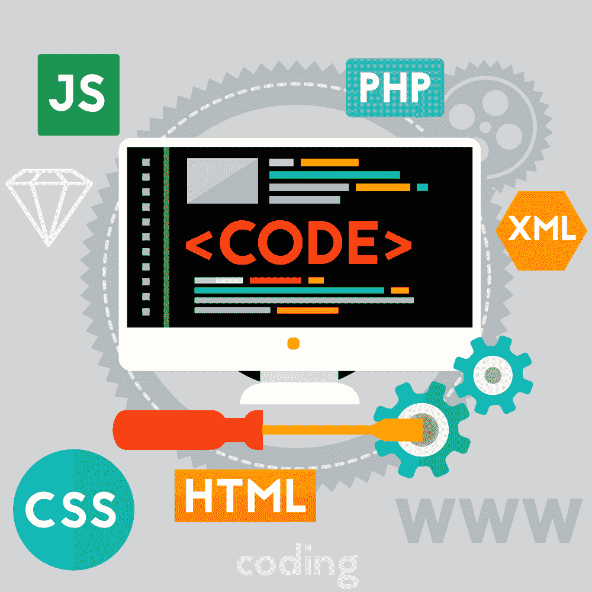
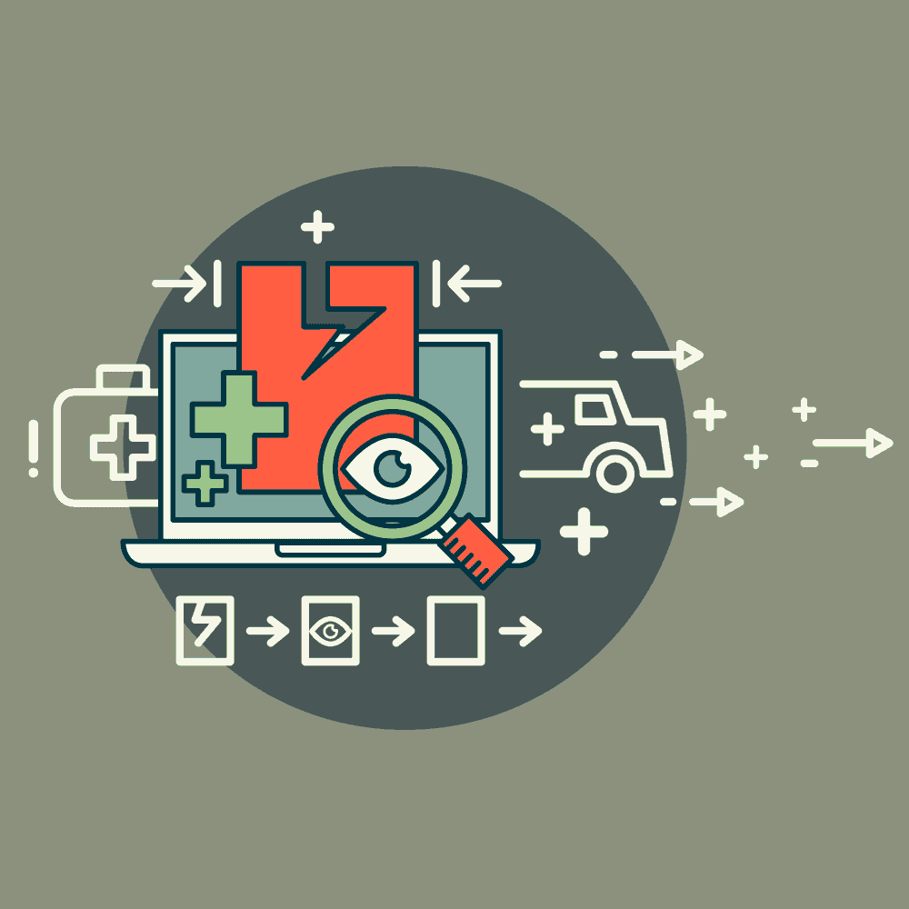

# 现代开发人员，第 4 部分:代码审查和质量保证

> 原文：<https://simpleprogrammer.com/code-review-and-quality-assurance/>

<figure class="alignright is-resized">

</figure>

作为一名软件开发人员，你的工作不仅仅是写代码。而是为复杂的问题提供高质量的解决方案。

你写的代码质量高吗，允许软件做它应该做的工作吗？当软件遇到错误时，它是否优雅地处理它？软件足够安全和高性能吗？

有两个过程用于度量和提高软件项目的质量:代码评审和质量保证。让我们来研究它们，看看如何在工作流程中实现它们，以获得更好的结果。

## 代码审查

前阵子写了一篇关于[优质代码](https://simpleprogrammer.com/hunting-mythical-high-quality-code/)的文章。在本文中，我想重温几件事:

### 自我代码审查

首先要知道的是，自我代码审查是绝对强制性的。

第二，有些代码质量如此之低，而且有如此多的不一致之处，以至于每个人都放弃了它们。这意味着它们只是在绝对必要的时候才被修补和进一步开发。

对于这种类型的代码库，我从最初的文章中创建了一个“精简”版本的[代码质量](https://simpleprogrammer.com/code-quality)清单。我在编写代码时也使用这个精简版本。

当我写代码的时候，我通常会省去很多要做的事情，以便以后重构。通过这种方式，代码达到了可接受的质量水平，并且我不必从业务逻辑中分心。自从我开始使用这个列表，我代码中的待办事项已经显著减少。

以下是清单:

*   新代码是否遵循你正在编辑的文件的指导方针和风格？——即使约定是旧的、丑陋的、不是最佳的，如果你没有时间去修正一切，那么保持当前的约定很可能是比引入第二种风格更好的方法。

*   入口点是否受到应有的限制？–模块/类的入口点应该有尽可能多的检查。如果您保证您的所有私有函数和业务逻辑函数都使用干净的参数，这将删除许多样板代码，并将使关键函数变得更小，更容易阅读和调试。

*   变量名和函数名是描述性的吗？–即使它们很长，这也是比使用小而神秘的名字好得多的解决方案。对于“腐烂”的代码库，这有助于将来阅读代码。对于新开发的代码，长名称最终会帮助您选择一个好的替代名称，因为您可以将名称本身修改得更短，但含义不变。

*   错误检查是否足够严格并记录在案？–必须记录每个错误。此外，您希望进行尽可能多的检查，只要它们不重叠。同样的事情检查两次毫无意义。尝试用一张支票处理多个案例。

*   如果出现错误，我能从一行代码中理解整个问题吗？–当错误发生时，日志应该是描述性的，这样您就不需要额外的调试信息来理解哪里出错了。

### 团队代码评审

<figure class="alignright is-resized">

</figure>

更常见的代码审查方法是让团队中的某个人来执行。流程本身取决于公司，可能会有所不同，但重要的是必须给出反馈。

对于评审者，他们必须给出建设性的反馈。审查者应该知道代码应该做什么。走廊代码审查——当你从一个随机的同事那里得到对一段代码的反馈——是一个例外，但这很少使用。

当涉及到你的时候，被评估者，总是假设你有好的意图。您和评审者都希望交付尽可能高质量的代码。不要把任何对你的代码的批评当成是针对你个人的——你不是你的代码，你也不是你的作品。

不要忘记代码的目的是解决问题。如果你不同意评论者的观点，那就接近他们，进行简短的讨论。我建议你跳过电子邮件，除非这是公司的政策，因为在解决这种误解时，口头交流更好。

### 代码审查软件

有一些工具可以自动进行代码审查。尽管它们可以捕捉一些错误，并遵循诸如“函数名不能长于 XY 符号”的规则，但它们还没那么有用。

对我来说，它们是扩展的代码和风格。尽管他们中的一些人可以指出圈复杂度问题，但是他们不能捕捉业务错误。请随意使用它们，但是它们不能代替自我代码评审或团队代码评审。

### 不要跳过代码审查

尽管时间问题和尽快发布的压力可能会诱使您跳过代码审查，但这总是一个坏主意。

软件是团队的成果，作为一个团队，你有责任尽你所能交付最高质量的软件。代码审查是提高工作质量和验证发布的特性是否成功的最简单的方法之一。

请记住，即使是 10 分钟的自我代码审查，最终也可能会捕捉到将被发布到产品中的关键业务错误。不要妥协质量。做代码审查。

## 质量保证

质量保证(QA)经历了许多趋势。这个行业正在走向自动化测试，但是有趣的是，仍然有相当多的职位对手工测试人员开放。

让我们分解一些最流行的 QA 方法，看看每种方法是如何提高软件质量的。

### 由开发人员完成的质量保证

这是指开发人员，通常是团队中的某个人，作为最终用户测试特性的正确性。这是最古老的方法之一，部分原因是管理层不想雇佣人工 QA 人员。最终的结果通常很糟糕。

大多数时候，开发人员已经有足够多的事情要考虑，不会像对待开发任务一样对待测试。理论上这是不应该发生的，因为这是不专业的，但实际上这就是发生的事情。

如今，开发人员进行测试的唯一合法方式是在开发人员之间进行内部测试，通常是由团队领导进行，然后才是真正的 QA。

### 人工质量保证

<figure class="alignright is-resized">

</figure>

在最古老的 QA 形式中，一个或多个人手工测试软件。带有图形用户界面的软件主要是手工测试的。尽管它的市场份额已经变小，但它将完全消失的预测到目前为止都是错误的。

尽管由人类完成的质量保证并不完美，但人类会学习——不像自动化测试。一个经验丰富的质量保证专家已经对系统进行了几个月的测试，他经常会发现开发人员和设计人员没有考虑到的问题和情况。关于该系统及其使用方法的知识价值连城。

由于 QA 是手工完成的，一些最有用的用户体验和可用性反馈可以来自经验丰富的质量保证工程师。当反馈来的时候，使用它，当 QA 工程师有改进产品的想法时，不要拒绝他们。

### 自动化测试

自动化测试非常棒！编写一次，然后根据需要运行多次，不管是出于什么原因。

想在提交前检查代码吗？当然可以！想要在生产环境中运行常规测试以确保系统正常运行吗？没问题！在 master 中每次合并后自动运行它们怎么样？我们开始吧！

自动化测试的用例可能很多。上面的例子只是其中的一小部分。但是为什么不是每个人都做自动化测试呢？

不幸的是，尽管自动化测试很棒，但它们的代价也很大。因为自动化测试是用代码完成的，所以你必须对*测试本身*进行质量保证和测试。此外，软件的任何改变都需要测试的改变。

简而言之，自动化测试需要大量的资源来运行。这也是他们缺席这么多公司的原因。

对我来说，如果做得正确，自动化测试是值得投资的。我编写自动化测试的清单如下:

*   对业务关键特性进行自动化测试。
*   让它们尽可能简单，即使代码很难看。
*   对测试进行严格的测试，以确保它们在所有用例中都有效，并且不会返回误报。
*   当一个特性即将进入 QA 阶段时，开始实现测试，以尽量减少由于主要代码或功能变更而被丢弃的测试数量。

自动化测试可以为大型项目节省数百小时的调试时间。如果做得正确，这是一个很大的优势。唯一真正的缺点是它们需要不断地分配资源。归根结底，自动化测试为项目增加了很多价值，所以作为开发人员，您应该支持它们。

### 功能和非功能测试

到目前为止，我们已经根据谁或者什么执行了测试，对测试进行了分类。现在我们将探讨一些类型的测试，重点是*正在测试什么*。

有两大类:功能测试和非功能测试。

从前者开始，功能测试是那些测试系统做什么的测试。例子包括:

*   **单元测试**–通常由程序员执行，测试软件产品的最小组件，比如函数和类。
*   **集成测试—**检查不同的模块和子系统是否能很好地协同工作，并能正确通信。这对分布式应用程序尤其有效。
*   **验收测试**–由客户或产品所有者执行，测试系统的全部功能。成功通过验收测试通常意味着系统接近产品发布。

<figure class="alignright is-resized">

</figure>

尽管很想跳过单元测试和集成测试，但大多数时候，从长远来看，跳过它们会使你的速度更慢。不要试图偷工减料——适当地做事情，这样一旦项目发布，你将有非常轻的维护，而不是让错误困扰你，并把你的生产力降低到下一个或两个季度。

另一方面，非功能测试是那些检查系统应该如何执行某些任务的测试:

*   **性能测试**–检查系统在正常负载下的工作速度。
*   **压力测试**–检查当有许多并发用户时系统的行为。
*   **恢复测试**–揭示系统是否能够从崩溃中恢复。通常，进程开始运行时不会出现很多问题，但是存储(文件系统和数据库)将进入恢复模式。有时，让系统运行的唯一方法是使用备份。
*   **安全测试**–如果你能负担得起安全审计，就进行一次。如果你不能，这里有很多给定技术(如 web)最常见的漏洞列表。确保你没有这些安全漏洞，你的系统会比所有软件的 95%更好。

在大多数组织中，功能测试往往优先于非功能测试。这是非常不幸的，因为每种类型的测试都是为了捕捉特定的错误，而项目通常迟早会遇到各种各样的错误。

即使分配给 QA 的资源不够，所有主要类型的测试都应该在系统投入生产之前进行。

### 不要忘记功能测试

一个特性可以没有 bug，工作速度快，对用户友好，但仍然不是一个好的特性。更重要的是这样的问题:它能完成它应该完成的任务吗？对系统有用吗？它增加价值了吗？

很多时候，如果功能在目标用户那里经历了几次反馈循环，它们就不会带来尽可能多的价值。这不是代码审查或伟大的 QA 工程师能够解决的问题。这是存在于公司文化层面的东西。

## 软件质量是一个旅程，而不是目的地

只要软件发生变化，保持质量就是一场持久战。这不会总是直截了当的，也不会总是容易的，但这是保持项目活力和低技术债务的必要条件。

进行自我代码审查是交付更高质量软件的最便宜和最有效的方法之一。类似地，使用自动过磅器和样式检查器将帮助您专注于业务逻辑。

但是除此之外，让你的同事参与进来将会帮助你交付一个更好的架构代码，并且做好质量保证，无论是手工的还是自动的，都将会减少进入生产的 bug 的数量。

作为一名软件开发人员，要时刻提醒自己，保持高质量的代码与添加新功能一样重要。