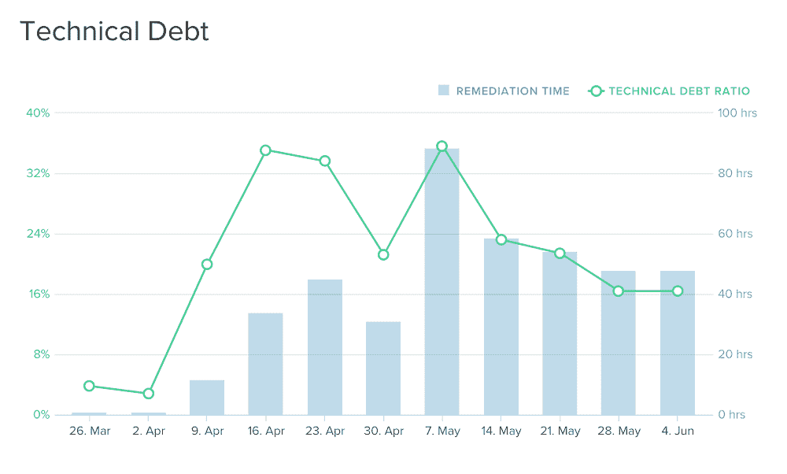
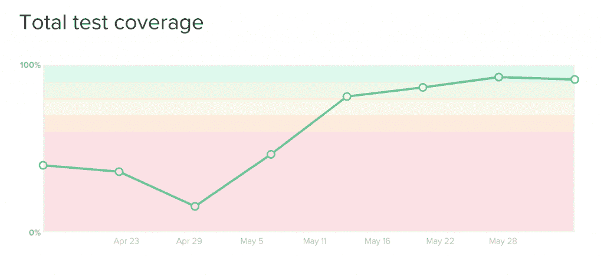
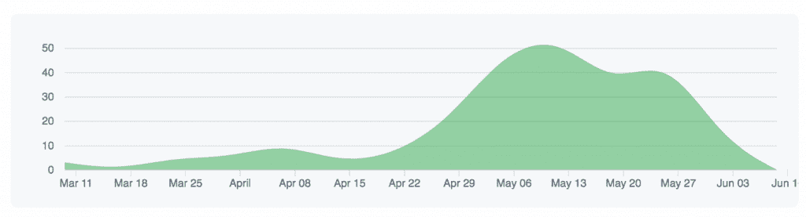

# 为什么代码审查会损害您的代码质量和团队生产力

> 原文:[https://simple programmer . com/code-review-trunk-based-development/](https://simpleprogrammer.com/code-review-trunk-based-development/)

最近，我和我的团队进行了一项实验。

这个实验具有足够的挑战性，甚至让一些经验丰富的开发人员感到紧张。

我们做了什么实验？我们停止了代码分支，我们抛弃了代码审查，我们开始直接推给 master。

—

如果此时你需要去洗手间，请去吧。

—

如果你是一个有经验的开发人员，那么这个实验的想法很可能会让你不舒服。

我知道这一点，因为代码审查和分支是非常[广泛接受的编写伟大代码的方法](https://simpleprogrammer.com/why-code-reviews-make-better-code-teams/)；事实上，他们几乎是神圣的牛。在为伦敦的许多大公司工作时，我看到大多数团队采用标准的代码审查和分支范例。

那么，我们究竟为什么要消除这些做法呢？我们疯了吗？

但是，事情是这样的(我们的结果可能会让你吃惊):

*   我们的代码质量提高了。
*   代码覆盖率增加了 10 倍。
*   自从我们实施这些变更以来，可用性已经达到了 100%。
*   我们已经将攻击部署增加到每天 10 次以上。

不相信我？让我们看看数字…我们在今年四月中旬/下旬实施了基于主干的开发(TBD)。

以下是来自我们的[代码气候](http://codeclimate.com)实例的报告:

你可以看到，在 TBD 开始驯服和降低复杂性之前，技术债务正在迅速增加。

很明显，代码覆盖率显著增加了。

提交也爆炸了！(随后的下降是因为代码库被分解成单独的微服务。)

我们的生产力，我们进入生产的“流量”，急剧上升。

如果你想变得更有成效，提高你的代码质量和测试覆盖率，请继续读下去，因为我将与你分享我们从实施 TBD 中获得的一些重要经验。

我们还将介绍 TBD 的目的和好处，我们在实施时面临的困难和问题，以及我们如何从恐惧和担忧走向好奇和无畏的发展。

因为——让我们面对它——解释像 TBD 这样的技术可能会变得非常理论化，你可能会开始想知道它如何在一个真实的团队中工作，带有真实的恐惧、担忧和偏见。

我们开始吧。

## 什么是 TBD？

TBD 是一种实践，它通过鼓励多个开发人员同时在同一个代码分支上工作、频繁集成和少量提交来解决分支模型和代码集成带来的困难。

这与基于分支的方法正好相反，在基于分支的方法中，开发人员可以在许多不同的分支上工作，然后每隔一段时间(通常是几周或几个月)集成回一个主干分支。

### 真实世界中 TBD 的细节

在文章的开始，我声称我们抛弃了代码审查。

好吧，现在我需要澄清一些事情:我们实际上并没有停止审查代码；我们只是用了一种有点非正统的方式。

首先，我想说我热爱代码审查。主要是因为我以前做过低质量代码的开发，不好玩。堆积如山的未维护代码开始堆积起来，直到你陷入极度不一致和过于复杂的代码中。这些代码库感觉就像在玩 Jenga——你所做的每一个改变都可能使整个事情分崩离析！

但是据说代码审查(至少在理论上)会丰富关于代码质量和增加所有权的对话。但我在实践中经常看到的并不是这种乌托邦。

相反，我经常看到沮丧的开发人员执行被动的行为，他们争论是否需要对实现的特性进行更改。通常，声音最大的开发人员获胜，而其他人则翻着白眼，屈从于他们的每一个突发奇想，只是为了更快地结束痛苦。

这就把我们带到了一个问题:在 TBD 的世界里，代码评审过程是什么样的？

我们不是等到之后的*所有代码都写好了才提出拉请求并要求审查，而是对程序进行配对。这种方法有效地使事后审查过程变得“多余”，因为代码已经被潜在的许多开发人员看到了。*

现在，我知道对于一些开发者来说，这会让他们感到不安。因为他们知道结对工作可能不足以吸引足够多的注意力——有时我们需要两个、三个或更多的开发人员来评审代码。

但是我们没有和许多开发人员一起审查代码，而是频繁地循环配对。这意味着潜在的许多对工作在同一个特征上。因此，与其简单地评论改进并希望它们得到实施，不如两人实际上可以继续前进并做出改变。

但是结对并不是我们复习的唯一方式…

We also review post-check-in. When code is pushed, other developers are notified of the commit and can read and comment. While this might sound quite reactive when you’re making very small commits, they’re easy to revert if necessary or to open up a conversation on how to make an improvement. Because the post commit doesn’t slow down the individual, this leads to far less frustration.

但是这种非正统的工作方式并不适用于任何团队……对于一些团队来说，取消代码审查会导致混乱。随着时间的推移，一小部分糟糕的代码会变得越来越多，并且永远得不到解决。

那么我们如何解决这个问题呢？

简单来说:[自动化。](https://simpleprogrammer.com/best-automation-frameworks/)

例如，我们可以测量代码的复杂性和代码覆盖率，运行静态分析，确保提交的格式正确，代码中没有日志或代码注释，或者任何软件包安装时都有漏洞，等等。

您可能开始看到，实现 TBD 并不意味着仅仅致力于同一个分支；这是一种完全不同的思考代码质量和我们如何工作的方式。

然而，除了听起来很有趣之外，我们确实需要思考 TBD 到底带来了什么，以及我们为什么要使用它…

## 为什么 TBD 很重要

在这个阶段，你知道 TBD 经常帮助整合到一个中心分支机构。您还知道，它有助于进行结对编程和高度自动化，而不是进行笨重的、拉式请求式的审查。但是，我们不仅需要涵盖我们如何做到这一点，还要涵盖它如何让我们更有效率。

随着实验的进行，我真的很惊讶地看到好处出现了，它们不是我所期望的…

### 优势 1。减少工作进度，完成更多工作

传统的基于拉式请求的代码评审会拖团队的后腿。要了解原因，最好看一个例子:

你[提出一个拉取请求](https://simpleprogrammer.com/5-things-learned-from-first-pull-request/)，要求审核，然后等待几个小时。与此同时，当您收到对以前代码的评论时，您可能会拿起一张新罚单，并开始思考它。所以你放下正在做的改变，推动它们，再等几个小时，获得更多的评论，然后重复，重复，重复。

听起来熟悉吗？

很多团队都是这样运作的。但是很慢。

基于拉式请求的代码审查似乎鼓励开发人员单独工作，捡起新的标签，而不是一起工作来完成当前的工作。

### 优势二。更好的沟通

当在一个单独的分支上工作时，重要的是它在任何时候都是完全有效的。这意味着如果在分支中有任何已知的错误或缺陷，它们应该被立即修复或恢复。但这需要整个团队的自律。

如果主构建崩溃了，团队必须立即投入到构建中去找出问题所在，让相关的开发人员拥有正确的知识。

在传统的特性分支模型中，您可能不知道任何东西被破坏了，直到您可能在开始代码几周后提出一个拉请求——到那时代码可能已经发生了显著的变化，需要大量的返工。

有了这个神圣的核心建筑，团队开始交流，这是我过去从未见过的。很快，一种真正的主人翁意识出现了，以确保建筑始终是绿色的。因为每个人都需要建设绿色建筑，所以每个人都平等地参与进来。

### 优势三。对重构更有信心

当两人一组工作时，大多数人都非常了解代码库，这意味着两人正在查看的代码很有可能已经被其中一个开发人员看到过。

这使得编码更加高效。当开发人员知道代码的结构时，找到正确的代码会快得多。不仅如此，它也给了对代码进行修改的极大信心，因为更广泛的修改影响更容易被了解。

从长远来看，这种持续的整理确保了代码库保持干净。

## 从实施 TBD 中吸取的经验教训

So we’ve talked about what TBD is, how you could implement it, and some of the benefits. Hopefully, now you’re curious enough to want to see how it could work for your team. Well, if you’ve made it this far, I’m going to assume so!

我内心的愤世嫉俗者对在任何情况下都被认为是最好的做法保持警惕。很少有那么黑白分明的，对吧？像“总是这样做，从不这样做”这样的陈述看起来太简单化了(如果我们诚实的话，也是以高人一等的态度)。

因此，让我们来谈谈实施 TBD 的细节——经验教训。我相信你想知道真相，以及我们为了让整件事成功所遭受的痛苦。

这不是一个简单的旅程，这是肯定的！

以下是我们了解到的关于 TBD 的六件速战速决的事情。

这些应该有助于您实现实践，并通过避免陷阱获得更好的生产力。首先也是最重要的…

### 1.TBD 可能并不适合所有人(但原因并不像你想的那样)

只是说 TBD 可能不适合所有人，这伤害了我的内心。我真的希望它能适用于每个团队；我认为所有的团队都可以从这种类型的开发模式中受益匪浅。

但是……我知道这根本行不通。

为什么？因为有些团队没有实施 TBD 所需的适当的动力和好奇心。要完全改变一个团队在整个职业生涯中的工作方式是非常具有挑战性的。

### 2.团队需要自我监督

基于为什么它可能不适用于所有团队的原因，团队还需要能够“自我监督”

团队需要自己执行规则，因为他们相信规则，而不是因为他们被告知要这样做。如果没有自我监管，就很难全面转向 TBD。

### 3.严重依赖自动化

有了 TBD，你需要以不同于以前的方式思考代码质量。

不要认为代码评审是实现反馈循环的唯一时机，相反，您可以并且应该选择通过自动化来实现它们。

总是问:“我需要添加什么自动化来给我们更多的信心，我们的代码是写得很好的和功能性的？”

### 4.任何事情上的结对程序

配对程序的失败将意味着您可能需要重新引入分支来对您的代码进行审查，这是一个滑坡，因此尽可能避免由单个开发人员进行更改。

哦，当我们讨论结对的时候……努力经常交换结对。这样做可以确保知识得以传播，并且不会出现代码孤岛。

### 5.分离提交和故事

对于 TBD，你必须采取另一种思维方式的转变，那就是把每一个提交都看作是增加了它自身的价值——这与许多开发人员的想法非常不同。大多数开发人员习惯于在一个特性完全完成之前不提交他们的代码。

我并不是说你应该抄近路，我是说应该尽可能经常地将变更带回主干分支。这一开始会感觉不舒服，但是强迫自己写比你认为可能的更小的提交。

### 6.将 TBD 从工具和自动化中分离出来

TBD 的核心与其说是一个技术问题，不如说是一个文化问题。

In order to exemplify this idea, rather than invest in elaborate tooling and risk losing the essence of TBD, consider adopting the practice without any expensive or time-consuming automation.

在我的上一个团队中，我们使用了塑料装饰品火烈鸟。火烈鸟被称为“象征”…TBD 的实物代表。火烈鸟就位后，一名团队成员请求乘坐火烈鸟并入主干。在火烈鸟的监视下，他们拉下任何远程更改，运行所有测试，如果是绿色的，他们就释放火烈鸟，继续他们一天的剩余时间。

这意味着我们可以实现 TBD，而不需要复杂的工具，也没有大量的前期成本。

## 现在轮到你了

起初，我对 TBD 持怀疑态度。也许你也是。

作为一名开发人员，我非常喜欢代码审查以及它给我带来的安全感。

但有时，更多的官僚主义并不是答案。如果我们追求的是生产力，那就不是了。

相反，我们可以选择授权团队做出小的改变，并鼓励团队更经常地交流和分享他们的工作。

我还有最后一件事要分享:

做日本人称之为 *genchi genbutsu* …意思是“自己去看”

想知道 TBD 是否适合你的唯一方法就是去尝试，带着好奇心去看看你能收获什么。所以我敢说你…放下代码审查，忘记分支，直接推给 master ( [with tests](https://www.thedevcoach.co.uk/arent-convinced-unit-testing/) ！).

看看它对你是否和对我们一样有效！