# 代码评审:权威指南

> 原文：<https://simpleprogrammer.com/code-reviews-definitive-guide/>

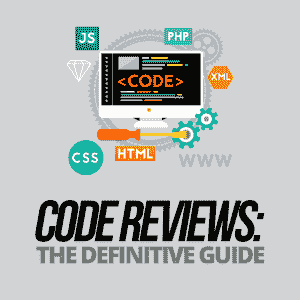

Many developers have a love-hate relationship with code reviews.

我们喜欢它们帮助我们提高代码质量和技能，但我们讨厌它们做得很差，成为痛苦的经历。

在本指南中，我将为您提供成功进行代码评审所需的一切。

我们开始吧！

## 第一部分.代码评审基础

### 第 1 章:什么是代码评审？

简而言之，代码审查是一种评估方法，用于在软件开发过程中识别代码中的错误。

代码审查应该揭示并消除错误，帮助代码库长期可持续，并建立开发人员的技能和自信。

### 第 2 章:代码评审过程

代码审查非常类似于编辑或复制审查过程，创建面向客户的内容的公司已经到位，以确保内容没有缺陷，也就是错别字。

代码审查过程因公司而异，但是在高层次上，它是这样的:

**步骤 1:代码评审请求**—**作者**或编写代码的开发人员提出请求并提交代码进行代码评审。

**步骤 2:代码评估**—**评审员**，通常是另一个开发人员或质量保证团队成员，评审或评估提交的代码。这是识别错误和其他问题的地方。

**第三步:批准和反馈**—一旦评审者发现了代码中的任何错误和问题，他们就向作者提供反馈。这通常是有问题的代码被批准或拒绝的地方。

**步骤 4:开发人员行动和确认**—作者阅读评审，确认给出的任何反馈，并采取行动(如果必要的话)，对代码进行任何必要的修改。

### 第 3 章:代码审查的好处

**好处#1:代码审查节省时间和金钱**

代码审查很重要，因为当错误在早期被发现时，公司可以节省大量的时间和金钱。在软件发布之前修复 bug，耗时更少，成本更低。

IBM 的一项研究显示，在软件开发生命周期后期修复的错误比早期修复的错误要昂贵得多。

事实上，该研究发现，在测试阶段修复的错误要比修复贵 15 倍。它还发现，后期制作过程中修复的 bug 要贵 100 倍。

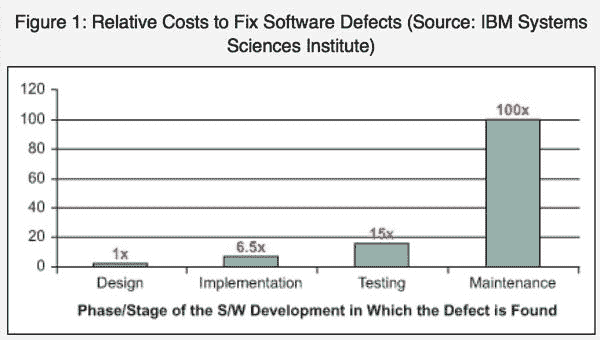

来源:[https://www . IBM . com/cloud/garage/experience/deliver/DIB be _ Edwards _ devo PS _ shift _ left/](https://www.ibm.com/cloud/garage/experience/deliver/dibbe_edwards_devops_shift_left/)

**好处#2:代码审查可以防止糟糕的用户体验**

我已经成了程序员幽默的粉丝。《机器人杀手》这部漫画提醒我，代码审查对于避免意想不到的结果和糟糕的用户体验是多么重要。

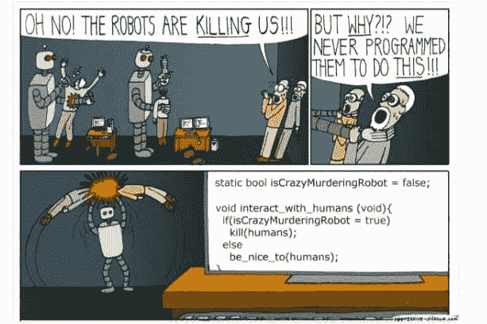

这是我个人的一个例子。

发现了一个真的很神奇的人工智能 logo 创作工具，爱上了。我能够以合理的价格快速制作出漂亮的商标。

我从他们那里创建并购买了一些徽标，然后有一天，我创建了一个徽标，在创建过程中收到了错误消息。

我开始了标志的创作过程，同样的事情发生了。沮丧和失望之余，我最终去找了他们的一个竞争对手来设计我的商标。

我用他们竞争对手的工具创建的徽标不如我在创建过程中创建的那样好，但我至少能够创建和购买一个徽标，而不会在此过程中遇到错误消息。

我没有给该公司留下负面评价，但我对他们工具的使用大幅减少。不久前，他们邀请我加入他们的大使计划，我参加了，但由于这次负面的经历，我无法说服自己去推广他们。

如果这种事发生在我身上，我相信其他人也会这样。

诸如此类的经历会导致公司在现有销售和未来销售上的损失，因为客户会犹豫是否相信产品实际上是按照预期的方式工作的。

公司还会因为缺乏客户推荐而损失销售，这种情况不会发生是因为负面的体验。

当我和他们一起做第一个 logo 的时候，我告诉所有我认识的人，推荐他们。

当我有不好的经历时，我会提到它们，但诚实地说出我最近的经历。我告诉我的朋友和同事，他们的竞争对手我不太喜欢，但我觉得更可靠，可以生产高质量的产品。

从声誉和市场地位的角度来看，如果开发团队在代码评审中发现他们自己的错误，这比最终用户发现它们要好。

通常，当客户有负面体验时，他们会在社交媒体上并通过负面评论向世界抱怨。这些投诉对产品当前和未来的销售有负面影响。

**好处#3:代码审查可以建立更强大的团队**

代码审查不仅仅是捕捉和修复错误。如果做得好，他们可以增强开发团队的技能并增加他们的知识。

微软 2013 年的一项研究显示，尽管代码评审的主要目的是发现缺陷，但开发人员从代码评审中寻找和期望的其他好处包括:

*   知识转移
*   团队意识的提高
*   开发问题的替代解决方案

当开发团队一起工作，并且能够共享知识，扩展他们解决问题的能力，并且更加了解彼此的优势和劣势时，他们就有了建立更强大团队的基础。

## 第二节。如何进行代码评审

### 第 4 章:揭示并消除错误

如前所述，任何代码审查的主要目标都是揭示和消除 bug。作为评审者，你的工作是发现作者/开发人员在编写代码时犯的错误，并防止它们进入生产。

下面是进行代码评审时要注意的常见错误列表。

*   **逻辑/语义错误**

逻辑或语义错误是导致您的代码产生您不希望产生的结果的错误。因为代码实际上起作用，所以逻辑错误可能是最难检测的错误。

下面是一些逻辑错误的例子:

**不正确:**

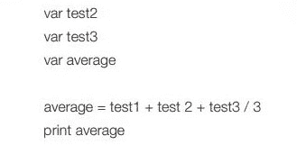

来源:[http://cambridgegcsecomputing . org/sites/94/upload/user files/217 p _ q _ teachers notes _ edited CT _ 3 proof . pdf](http://cambridgegcsecomputing.org/sites/94/upload/userfiles/217p_q_teachersnotes_editedct_3proof.pdf)

**正确:**

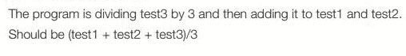

来源:https://en.wikipedia.org/wiki/Logic_error

这是另一个简单而有趣的逻辑错误的例子:

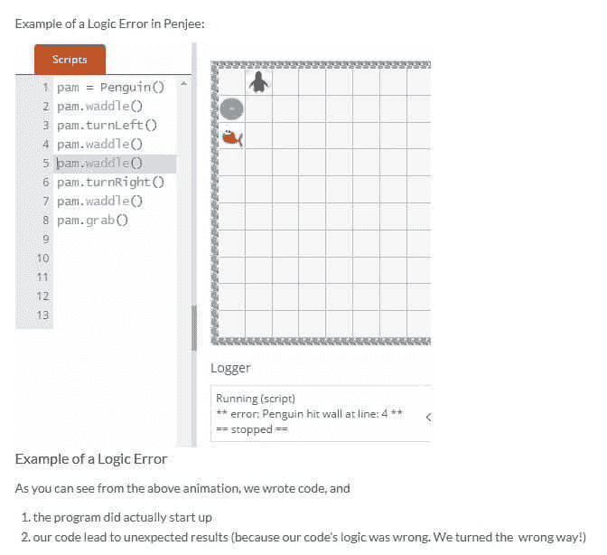

来源:https://blog.penjee.com/what-is-a-logic-error/

上面的代码是有效的，但是可怜的企鹅被编程为转错了方向，撞到了墙上！

*   **运行时错误**

运行时错误是运行程序时出现的一类错误。

当程序运行时，最终用户会看到一条错误消息。逻辑错误属于这一类。

运行时错误通常由非法的用户输入触发，并且没有程序来处理输入。

运行时错误的类型包括:

*   内存泄漏—导致程序在运行时使用更多 ram
*   程序崩溃—当程序停止运行时发生(可能由内存泄漏或编程错误引起)
*   被零除—当用户在分母字段中输入零时发生
*   逻辑错误—当您的代码产生意外结果时发生

下面是一个被零除的运行时错误示例:

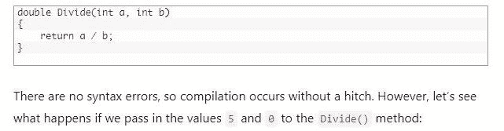

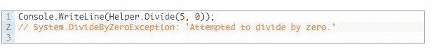

来源:https://airbrake.io/blog/what-is/runtime-error

当值 0 用于 int b 时，生成的运行时错误消息是被零除的错误消息。

处理这种情况的方法是为这种情况的发生做好计划。

下面是在 C#中使用 try-catch 块来计划这一点的方法:

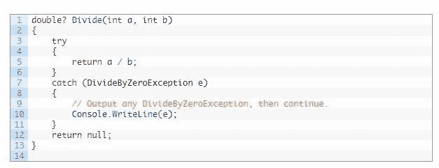

来源:https://techterms.com/definition/runtime_error

*   **语法错误**

当你不遵守你正在使用的编程语言的规则时，就会出现语法错误。

[这些错误是由以下原因引起的:](http://python-textbok.readthedocs.io/en/1.0/Errors_and_Exceptions.html)

*   标点符号的错误
*   错别字(包括添加或省略符号)
*   拼写错误
*   不正确的缩进
*   空块
*   关键词错误
*   字母大小写使用不正确

对于使用编译器的语言，语法错误在编译时被检测到，除非语法错误被纠正，否则程序不会运行。开发人员/作者更容易发现这些类型的错误。

对于使用解释器的编程语言来说，直到你的程序被执行，语法错误才会被发现。

根据解释器的类型，可能有也可能没有很多关于代码中存在的错误类型的有用信息。在这些情况下，代码评审是有帮助的。

错别字是你应该在代码审查中注意的语法错误的例子，因为它们很容易犯，并且在编写代码时不会产生语法错误。

当你写代码的时候，你很容易碰到一个字符，比如" = "符号，一次太多或者不够多，你的程序将会产生一个你不希望的结果。

在用 JavaScript 编码时，假设您的意图是让下面的代码成为抽象等式而不是严格等式:

**console . log(7 = = " 7 ")；**

**运行时的结果:真**

你 ***其实*** 打的是一个严格的等式:

**console . log(7 = = = " 7 ")；**

**运行时的结果:假**

击键次数太多确实很容易，在这种情况下，从解释者的角度来看，代码本身并没有错。因此，除非您运行代码或者审查人员发现它偏离了您的要求，否则您不会知道自己犯了这个错误。

### 第 5 章:确保你的代码是可读的、可维护的和安全的

代码评审的另一个关键部分包括确保代码的可读性、可维护性和安全性。

Imagine picking up a book—physical or digital—and it looked like five different people wrote it without knowing the other four people were writing it, too. They each used different font sizes and font types. Each of them had their own unique way of using indentation and white space.

更糟糕的是，他们每个人都有自己的语言风格和声音。这本书读起来绝对是一场噩梦。

现在，想象一下看着一个看起来像是几个不同的人写的代码库。

不同的人使用他们自己独特的风格、格式规则、命名约定和注释规则。

噩梦。

即使代码是功能性的，如果难以阅读，也很难维护。

除此之外，假设代码中存在安全漏洞，这可能会对您的公司或客户产生负面影响。双重噩梦。

因此，您的开发团队必须确定您的最佳实践并坚持下去。以下是您的代码评审中应该包括的几个方面，这将有助于确保代码的可读性、可维护性和安全性:

**可读性**

可读的代码有清晰和有意义的命名约定，包括有意义和简洁的注释，并且在视觉上吸引人。

*命名惯例*

名字应该揭示你的代码的意图。

不管你是命名一个可变函数还是类，这个名字应该告诉你和其他阅读或检查你的代码的开发者“它为什么存在，它做什么，以及它是如何被使用的”。如果名字需要注释，那么这个名字就没有透露它的意图。”(来源: [*清理代码*](https://www.amazon.com/dp/http://www.amazon.com/exec/obidos/ASIN/1590594045/makithecompsi-20) )

这里有一个来自*干净代码*的例子:

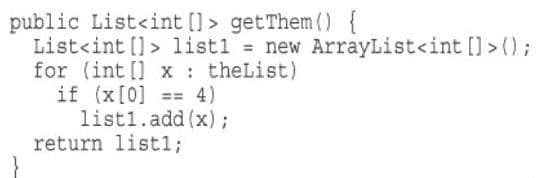

在上面的代码中，Robert c .“Bob 叔叔”Martin 指出很难判断代码在做什么。代码本身足够简单，从格式化的角度来看不难理解。

代码没有给我们提供重要的信息，比如列表中有什么，为什么值 4 很重要，以及如何使用返回的列表。

Bob 叔叔提供了这个代码作为更好的选择。他提供了更多的上下文，假设代码是扫雷游戏的一部分。

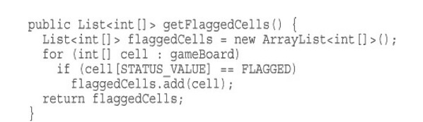

他对代码所做的一些更改是对模糊的关键项目进行重命名，使它们更加具体，并且比以前的版本传达/提供了更多的信息。

他把“列表”改成了**游戏板**，因为在扫雷游戏的上下文中，游戏板是单元格列表。

他还将值 4 更改为带标志的单元格，以反映该值的真实含义。

对代码的这些更改比以前的代码更好地传达了意图，以前的代码需要注释来帮助另一个开发人员(甚至将来的同一个开发人员)理解或记住值 4 代表什么或“列表”是什么。

*评论*

关于在代码中使用注释，有很多观点。一些开发人员认为好的、干净的、优雅的代码不需要注释。另一些人认为评论是有用的和必要的。我相对来说是这个领域的新手，至少现在，我认为代码应该以一种不用注释就能独立存在的方式编写。但是，有些情况下注释是必要的。

只有当代码本身不够有表现力时，才应该谨慎使用注释。它们应该在增加价值的时候使用，帮助开发人员更快地理解正在发生的事情，而不是根本没有注释。

注释不应该用来解释命名约定。

对每个人来说，更好的办法是改进名字本身，而不是创建解释它们的评论。

此外，评论不应该是多余的。下面是一个不需要注释的例子。代码会自己解释。

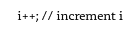

来源: [*代码完整*](http://a.co/hDVmCou)

写评论的时候，保持简单。避免任何对你将来处理代码没有用的东西。

此外，当你的团队使用你的代码时，避免任何无用的或者可能对他们有破坏性的东西(比如刻薄的评论或者糟糕的笑话)。

对于那些你已经以最具表现力的方式编写了代码，并且添加注释会增加清晰度并节省每个人时间的例子，写好的注释。

好的评论有什么特点？

评论应该简洁。他们应该用最少的词语传达尽可能多的信息。下面是一个来自 *[可读代码的艺术](http://www.amazon.com/exec/obidos/ASIN/B0064CZ1XE/makithecompsi-20)* 的 C++类型定义的例子:

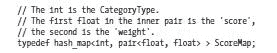

相比于:

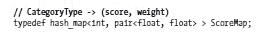

第二个示例中的注释比第一个示例中的有效得多。

在您的代码审查中，如果您看到不必要的或写得不好的注释，建议删除或重写这些注释。

*格式化*

可读代码的另一个组成部分是格式化。良好的格式使代码更容易阅读和使用。团队应该提前就格式样式达成一致并坚持使用，并且您的代码评审应该检查以确保样式被遵循。

在建立格式化最佳实践时，您应该:

*   保持一致
*   选择一种让你的代码易于理解的风格
*   使用空白使你的程序更容易阅读
*   提前决定使用制表符或空格
*   遵循预定的大写规则

要更深入地了解格式化，请查看[干净代码](http://www.amazon.com/exec/obidos/ASIN/0735619670/makithecompsi-20)和[可读代码的艺术。](http://www.amazon.com/exec/obidos/ASIN/B0064CZ1XE/makithecompsi-20)

*可维护性*

除了检查可读性，代码评审还需要确保代码是可维护的。开发人员花费大量时间维护代码。代码的可维护性越高，做维护工作所需的时间就越少。

下面是在进行代码可维护性的代码评审时要问的几个问题:

*   将来对代码进行修改是容易还是困难？
*   如果进行了更改，它们会对代码库产生积极还是消极的影响？
*   代码的可搜索性如何？代码是以这样一种方式编写的，使得你很容易找到你要找的东西吗？
*   按照代码编写的方式找到并修复 bug 是容易还是困难？

*安全*

开发过程的一个重要组成部分是安全性。为了保护您的公司和客户免受黑客攻击，安全性应该是代码审查过程的一部分，并在必要时进行。

因为这是一个非常大的话题，一整篇博文都可以用来讨论这个话题。出于我们的目的，我将重点关注 web 开发中的两个常见安全问题:

*   SQL 注入
*   跨站点脚本(XSS)

SQL 注入是一种常见的黑客攻击方法，通过在网页中输入 SQL 语句将恶意代码注入数据库。

这里有一个例子:

基于" " = " "的 SQL 注入始终为真

用户登录网站:

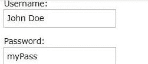

黑客输入:

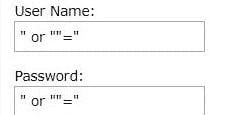

黑客可以通过在用户名或密码文本框中插入“或”“=”来访问数据库中的用户名和密码。

以下是服务器上的结果语句:

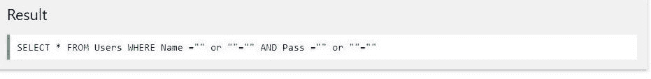

该语句是有效的，将返回“Users”表中的所有行，因为“**或** ""=”始终为真。

使用 SQL 参数，程序员可以保护网站免受 SQL 注入。

示例:

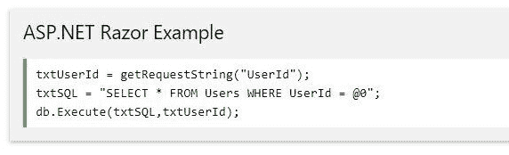

在上面的 SQL 语句中，参数由@标记表示。

该参数将防止黑客访问数据库中的数据。其他 SQL 参数可以在这里找到:[https://www.w3schools.com/sql/sql_injection.asp](https://www.w3schools.com/sql/sql_injection.asp)。

XSS 也在打针。然而，在这种情况下，恶意脚本被注入网站，而不是被注入 SQL 数据库。

恶意代码通过 web 浏览器脚本发送到网站用户的浏览器，以获取对包含在 cookies、令牌会话等中的用户浏览器数据的访问。

XSS 攻击比 SQL 注入更复杂，因为它们影响网站用户，而不是影响数据库。这使得应对 XSS 攻击更加困难和复杂。

也没有单一的方法或协议可以防止这些攻击，不像能够使用 SQL 参数来处理 SQL 注入。

由于 XSS 攻击的复杂性，我列出了一些有用的资源，您可以参考并考虑将它们合并到您的代码审查中，而不是参考特定的示例和代码片段。

**有益的 XSS 链接**

[https://www.owasp.org/index.php/XSS_Attacks](https://www.owasp.org/index.php/XSS_Attacks)

[https://www . owasp . org/index . PHP/Reviewing _ Code _ for _ Cross-site _ scripting](https://www.owasp.org/index.php/Reviewing_Code_for_Cross-site_scripting)

[https://en.wikipedia.org/wiki/Cross-site_scripting](https://en.wikipedia.org/wiki/Cross-site_scripting)

[https://www.checkmarx.com/2017/10/09/3-ways-prevent-xss/](https://www.checkmarx.com/2017/10/09/3-ways-prevent-xss/)

对数据库可能被黑客攻击的网站和其他应用程序的代码审查应包括对安全漏洞和编程策略的评估，以消除安全风险。

## 第三节。如何避免代码评审失败

### 第 6 章:代码评审失败的原因和避免失败的技巧

最终的失败是允许糟糕的代码进入生产。

然而，还有其他事情会导致代码审查失败。

代码审查会打击开发人员的积极性，并且不会提供有价值的反馈来帮助他们成长，因为程序员是失败者。

糟糕的代码评审的长期影响会对开发团队产生负面影响。

代码审查失败的原因有很多，但这里有一些突出的原因:

**原因#1:作者和审稿人之间的沟通中断**

这可能是代码评审失败的最大原因之一。

If the author is not open to feedback and has their way of doing things that may not align with how the reviewer thinks they should be done or that doesn’t align with team best practices, there will be a communication breakdown.

如果双方都没有达成一致或理解，代码评审将会失败，作者和评审者之间的关系将会紧张。

类似地，如果评审者不擅长以有效的方式给出反馈，并且给人的印象是居高临下或粗鲁无礼，那么代码评审将会失败，因为由于糟糕的交付，作者不会收到反馈。

**避免因通信中断而导致故障的提示**

作为评审者，提供清晰的反馈，避免不必要或粗鲁的评论。如有疑问，请在提交审核前让他人审核您的意见。

作为作者，欢迎建设性的反馈。考虑另一种方法如何有助于提高你的手艺。

**原因#2:代码评审没有一致同意的目标**

如果代码评审不是基于事先达成一致的共同目标，评审者将在评估中使用他们自己的目标。

这些目标可能与作者的想法不一致，特别是如果他们是请求代码评审的人。当没有预设的目标时，就会有很多冲突和沟通失败的空间。

也就是说，有一些高功能的团队采取更非正式的方法，并有心照不宣的、一致同意的目标。只要团队没有变化，这就没问题。

但是，我们知道改变是不可避免的，随着公司的成长，团队也会成长，团队中也会加入新人。

**避免因没有共同目标而失败的秘诀**

花些时间建立一致同意的代码评审目标。记录下来并与整个团队分享。与新团队成员一起回顾这些目标，以便每个人都在同一页面上。

**原因 3:不愿意改变或成长**

作为成年人，我们真的很难改变自己的行为和成长，即使我们知道改变和成长从长远来看对我们有好处。

如果作者不断地从代码评审中获得反馈，而这些反馈可以使他们更好地处理编程，但他们却没有付诸实践，那么这些代码评审就是失败的。

他们之所以失败，是因为这些程序员没有抓住他们被给予的成长机会。

它们也是失败的，因为可能一次又一次提供这种反馈的评审员会觉得他们是在浪费时间。随着时间的推移，如果他们觉得自己的建议被当成耳旁风，他们可能就不会那么彻底了。

**提示避免因变化和成长阻力而失败**

敞开你的心扉，迎接变化带来的冒险。如果你一遍又一遍地做同样的事情，你会感到厌倦，你不会成长。如果你尝试了新的东西，但没有成功，那也没关系。你学到了一些东西。但是，始终要寻找将创新概念应用到自己工作中的方法。

### 第 7 章:如何处理滥用代码评审

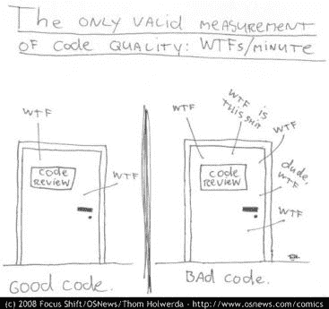

当我第一次看到这本漫画时，它让我发笑。然后我想了想，不仅仅是从测量质量代码的角度，而是从测量代码评审的质量的角度。

wtf 在漫画中是很搞笑的，但是当你是作者并且你感觉到你——作为个人或者代码评审环境中的程序员——正在被攻击时，就没那么好笑了。

处理评论者离开 WTFs 和其他粗鲁评论的情况的最好方法是以平静、专业而直接的方式面对这种情况。

让评审者知道你重视来自代码评审过程的反馈。然而，当代码评审充满了负面评价时，很难从评审中提取价值。

提醒他们，你们在同一个团队，应该想要同样的东西:向市场交付最好的产品，并建立一个可持续的代码库。

如果这不起作用，你可能需要将事情上报给你的经理。但是你永远不应该允许有人利用代码评审过程对你无礼或者居高临下。

## 第四节。摘要:代码评审清单

当进行任何类型的审查或质量检查时，最好有一个方便的清单来参考。下面是总结这篇文章所有要点的清单。当您进行自己的代码评审时，可以随意使用它。

| **项目编号** | **代码审查清单** |  |
| **1** | **发现并清除 bug** |  |
|  | **Check for common errors such as:**

*   逻辑/语义错误
*   运行时错误
*   语法错误(编写代码时未检测到)
*   其他错误

 |   |
| **2** | **确保代码的可读性、可维护性和安全性** |  |
|  | **Is the code readable?**

*   代码包含有意义的命名约定吗？
*   评论有用吗，有必要吗？
*   可以改进代码，使其本身具有足够的表达能力，并且不需要注释吗？
*   评论是多余的吗？
*   如果评论是必要的，它们是否简洁明了？
*   是否遵循了格式和样式指南？
*   如果没有正式的指导方针，代码的格式是否便于阅读？即

-始终采用一致的风格-一致的可读性-一致使用空白-使用一致的制表符和空格 |  |
|  | **Is the code maintainable?**

*   您正在评审的代码是易于维护还是难以维护？
*   这段代码将如何影响代码库？
*   将来对此代码的更改会有负面影响吗？
*   代码的可搜索性如何？例如，能否快速找到特定商品？
*   查找和修复 bug 是容易还是困难？

 |  |
|  | **Is the code secure?**

*   代码是否需要安全代码审查？

-如果是，请遵循贵公司的指导方针进行安全代码审查

*   如果您的公司没有安全代码审查流程，请安全专家检查整个代码中的漏洞。注意任何可能使您面临攻击风险的东西，如 SQL 注入、XSS 和其他危险的攻击。

 |  |
| **3** | **融入软技能以避免代码评审失败** |  |
|  | **Is your communication clear and respectful? Will your review add value to the author?**

*   你的交流是否清晰，没有被认为粗鲁的评论？
*   您的反馈是否给予了适当的表扬？
*   你是否提供了建议，不仅是为了改进手头的代码，而且是为了帮助开发人员整体提高？
*   关于代码库、最佳实践等，你有什么可以分享的知识吗？那会增加作者的价值吗？

 |  |

## 第五节.结论和资源

读完这篇文章后，我希望你已经成为代码评审的忠实粉丝。我也希望它能激发一些想法，让你可以在你进行的代码评审中包含一些东西。下面是一些对你有帮助的资源。

祝您好运，代码审查愉快！

如果你有任何能给这篇文章增加价值的想法，请随意发表评论。

### 进行质量代码评审的资源

**书籍/指南**

*   [*干净的代码*](http://www.amazon.com/exec/obidos/ASIN/0735619670/makithecompsi-20) 罗伯特·马丁著
*   罗伯特·马丁的《干净的编码者》
*   达斯汀·博斯韦尔和特雷弗·福彻的《可读代码的艺术》
*   [*如何赢得朋友&影响人*](http://www.amazon.com/exec/obidos/ASIN/B003WEAI4E/makithecompsi-20) 戴尔卡耐基著
*   [*习惯的力量*](http://www.amazon.com/exec/obidos/ASIN/B0055PGUYU/makithecompsi-20) 杜希格著
*   [OWASP(安全)代码审查指南](https://www.owasp.org/index.php/File:OWASP_Code_Review_Guide_v2.pdf)

**博客/博文**

*   [如何不进行代码评审](https://www.networkworld.com/article/2271242/software/how-not-to-run-a-code-review.html)
*   [我从第一次代码评审失败中学到了什么](https://medium.com/@Kieran11/what-i-learned-from-failing-my-first-code-review-c66075eb5926)
*   [XSS 袭击事件](https://www.owasp.org/index.php/XSS_Attacks)
*   [审查跨站点脚本代码](https://www.owasp.org/index.php/Reviewing_Code_for_Cross-site_scripting)
*   [跨站点脚本](https://en.wikipedia.org/wiki/Cross-site_scripting)
*   [预防 XSS 的 3 种方法](https://www.checkmarx.com/2017/10/09/3-ways-prevent-xss/)

**播客剧集和 YouTube 视频**

*   对话 Python，Dougal Matthews，[有效的代码审查](https://talkpython.fm/episodes/show/102/effective-code-reviews)
*   Dougal Matthews，[有效的代码评审演示](https://www.youtube.com/watch?v=uIwl01Nazdg)
*   简单的程序员约翰·桑梅兹，[如何处理激进的代码评审评论](https://www.youtube.com/watch?v=YBS2hH56KvQ)
*   [为太忙而没有时间审查代码的团队进行代码审查](https://www.youtube.com/watch?v=1m3eRFeCInY)