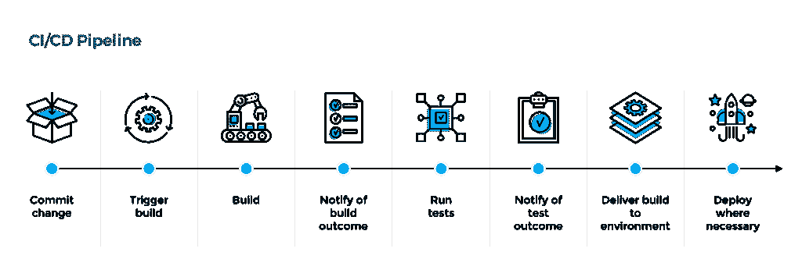

# 编码人员应该整合 CI/CD 计划的 5 个理由

> 原文:[https://simple programmer . com/coders-incorporate-ci-CD-program/](https://simpleprogrammer.com/coders-incorporate-ci-cd-program/)

编码有时会很乏味和困难。获得尽可能多的帮助是一个好主意，这就是为什么使用 CI/CD 工具是帮助您的项目的一个很好的助手。使用 CI/CD 工具真的可以增加你作为程序员的价值，并且对你的开发生涯有很大的帮助。

高质量的 CI/CD 工具可实现最高效率。它能让您显著提高生产率并节省可观的成本。此外，它还可以帮助您简化流程，将无错误的软件交到最终用户手中。

CI/CD 有助于自动化，并通过持续集成代码和持续部署代码使工作变得更容易——因此得名。它使捕捉错误变得更容易，同时增强了同事之间的交流和代码集成。

## 深度 CI/CD

拥有独立于持续部署(CD)的自身优势。使用 CI，可以很容易地频繁地进行小的更改，并减少错误，从而产生可靠的产品。这些变化能够无缝地集成到程序的所有领域，从而显著提高编码效率。

CD 是 [CI/CD](https://semaphoreci.com/cicd) 计划的另一半，指的是连续部署或连续交付，但由于它们在自动化方面的差异，通常是连续部署。工具的这一部分允许软件程序和任何额外的更改更快地自动部署到最终用户。

连续交付自动化了整个软件发布过程，并允许任何有权限的人部署新的版本。它还提供了更新系统所有区域的方法，并为其他程序和系统的反应设置规则。这使得部署发生时与其他系统的中断或冲突最小。

持续部署通过将源代码中的每一个更改都推送到生产环境中来自动化这一过程，而不必手动部署新版本。这使得它比连续交付系统更上一层楼，通过消除与部署新版本相关的所有手动任务，节省了总体时间。

[Marko Anastasov](https://semaphoreci.com/blog/2017/07/27/what-is-the-difference-between-continuous-integration-continuous-deployment-and-continuous-delivery.html#:~:text=Continuous%20Delivery%20(CD)%20is%20a,the%20entire%20software%20release%20process.&text=Continuous%20Deployment%20is%20a%20step,explicit%20approval%20from%20a%20developer.)说，“CI/CD 服务从那里接管，运行所有测试，将代码部署到产品中，同时让团队了解每个重要事件的结果。”您的 CI/CD 程序使您能够监控一切，并在需要时快速恢复。它还可以为您提供通过多个管道同时进行测试的额外好处。

## 更轻松的沟通和整合

CI/CD 管道允许每个人的代码被实时地放到同一个项目中。这样做将允许代码协同工作；它让每个人都了解代码的最新外观和操作。这避免了成员混合代码并导致错误的问题。

当错误发生时(所有编码项目都会发生)，只要 CI/CD 管道是活动的，并且测试自动化工具被实现，错误将很容易被发现、修复，并且以比正常情况快得多的速度被消除。

## 提高效率

利用 CI/CD 管道的最大好处之一是，通过持续集成，您可以一次编辑或添加几行代码。因为变化会更小，更少的错误会被忽视。因为您将使用 CI/CD 工具，所以代码也将被立即测试错误。

这允许您更多地关注代码，而不是仅仅关注错误，从而提高整个项目的效率。这不仅可以为你节省一些处理实际代码的时间，还可以让你更有效率，从而减少在加班上的浪费。

不管怎样，你的项目质量仍然会大大提高。这是因为您有更多的时间来进行改进和添加，同时总体上有更少的错误。

## 通过自动化测试降低成本

CI/CD 管道最重要的一个方面是测试自动化。使测试自动化可以确保添加或部署的任何代码都不包含错误。考虑到您不必手动操作，它还可以确保您节省金钱和时间。

这也允许更大的一致性。因为测试总是在进行，所以您可以确保所有输入的代码都与之前的代码一致。当代码发布到一个新的版本时，结合更多的测试，允许更少的错误通过，这将再次节省您的时间和金钱。

## 更快的 MTTR

MTTR 代表“平均解决时间”换句话说，这是一个衡量你修复错误的速度的指标。你越快修正错误，MTTR 就越快或越短。MTTR 越短，对你越有利。持续集成减少了 MTTR，因为代码更改较少。持续部署允许这些修复立即自动进入生产分支。

快速 MTTR 是一个迹象，表明你知道如何解决你的问题，并会尽快解决它们，这也意味着你是可靠的。CI/CD 程序还可能包括一个监视工具，它将为您提供有关您所遇到的问题类型的统计数据，甚至可以预测将来会出现什么类型的错误。这对于[解题](https://simpleprogrammer.com/1-skill-saved-my-life/)来说是很神奇的。

## 更快的发布

由于持续的代码集成，更小和更频繁的代码更改成为可能。正因为如此，错误将更容易被发现和修复。根据 CD 配置，无论是交付还是部署，这些更改都可以[自动推入生产](https://medium.com/the-telegraph-engineering/continuous-release-practices-are-evolving-here-is-our-story-2a4d164e9cac)。这只有在自动化测试发生后才会发生。这意味着当测试没有发现错误时，项目版本会更频繁地更新。

## CI/CD 带来更高的生产率

All of these benefits add up to the most important benefit of all, and that is increased productivity in your present and future [programming career](http://www.amazon.com/exec/obidos/ASIN/B073X6GNJ1/makithecompsi-20). If your productivity is increased, more of your ideas or goals can come into fruition with less frustration getting in the way.

CI/CD 渠道有许多好处，问题在于能否正确利用它。如果你这样做了，那么你会变得更有效率，比以前更容易获得成功。并非编码的每个部分都需要复杂、乏味或令人费解。

CI/CD 计划允许您专注于生产创新代码。它给你不断测试和整合变化的能力。它还缩短了部署和交付的时间。

现在，通过使用 CI/CD 程序自动化您的代码，让您的生活更加轻松。