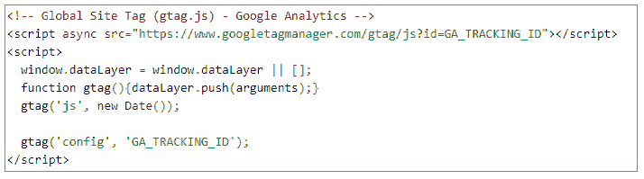

# 提升你数字营销职业生涯的编码技能

> 原文：<https://simpleprogrammer.com/coding-in-digital-marketing/>

[数字营销平台](https://the-media-image.co.za/)充斥着越来越多的营销软件，你可以用它们来保持竞争力，并跟上日益精通技术的用户的需求。

今天的数字营销在很大程度上是数据驱动的，为了在竞争中占据优势，您需要明智而果断地在各种营销平台上使用正确的软件，以降低成本并增加投资回报。通常，这需要一些编码。

营销人员无所事事，让程序员为他们工作的时代已经一去不复返了。今天的营销人员越来越精通代码，并且能够更好地与程序员讨论和传达他们想要的东西。

因此，开发人员需要掌握自己的游戏。他们需要很好地掌握在各种营销平台中使用的编程语言，并了解何时使用每种语言。

下面先睹为快，看看你可能会发现自己在网络营销世界中不时使用的编程语言——基于你正在使用的工具和你正在处理的任务。

## Java Script 语言

如果您使用 Google 跟踪代码，比如在实现跨域跟踪时，那么您可能已经记不清[与 JavaScript](https://www.guru99.com/introduction-to-javascript.html) 交互的次数了。这里有一个你应该熟悉的:

当设置网站的跟踪代码时，Google 会指示您将上面的代码片段添加到每个网站页面的标签之后。

这是用 JavaScript 编写代码的一个很好的例子。几乎所有的跟踪代码都是用 JavaScript 编写的。当在几乎每一种网站开发解决方案中实现跟踪代码时，它是最好的编程语言。

除了 CSS 和 HTML 之外，JavaScript 通常是 web 开发中最常用的编程语言。只要寻找一些弹出的、自动滚动的、动画的或变化的东西——深入到代码中，你通常会发现它是用 JavaScript 编写的。

事实上，谷歌分析、脸书、谷歌广告、疯狂鸡蛋、Reddit、Hotjar 和 DoubleClick 等工具的所有代码片段都是 JavaScript 代码。

如果您希望以更好的数据质量实现更好的跟踪粒度和准确性，比如当从 Google Analytics 提取原始数据或在任何营销平台上向跟踪代码添加额外参数时，请考虑使用 JavaScript。

当创建一个简单的预测来帮助你的网站与谷歌无缝沟通，或者自动化你的谷歌广告中的一些重复任务，特别是点击付费(PPC)活动时，它也是最好的语言。正是这种功能，你需要保持不浪费金钱在不必要的点击付费活动。

当您想要利用诸如跨不同站点传递(统一威胁管理)UTM 参数的机会时，JavaScript 的高级知识也很方便。

## 计算机编程语言

[Python](https://www.python.org/) 在几个方面与 JavaScript 相似，包括语法甚至复杂程度。

然而， [JavaScript](http://www.amazon.com/exec/obidos/ASIN/B00H1W9I6C/makithecompsi-20) 是为前端任务设计的，比如创建游戏或网络用户界面，而 Python 是一种后端编程语言，用于服务器端开发任务。

它是目前市场营销平台上数据分析中最流行的编程语言。它非常强大，经常用于通过一点简单的编码实现不同营销策略的自动化。

通常情况下，数字营销人员必须处理来自付费搜索、社交媒体、搜索引擎优化(SEO)活动和其他构成当今营销战略的营销组件的数据。

如果没有某种形式的自动化，收集、分析和理解这些数据几乎是不可能的。谢天谢地，这就是 Python 的用武之地。这种语言允许你提出一个自定义代码，分析来自你正在使用的各种营销平台的大量数据，给你一个更深刻的见解，可以通知企业的营销策略。

这种定制代码可以非常有助于检测故障线路，建立适当的纠正措施，并启动正确的数字营销活动。

作为一名 Python 开发者，数字营销公司不时需要您的服务来帮助创建代码，这些代码可以支持他们进行[数据挖掘](https://searchsqlserver.techtarget.com/definition/data-mining)、 [SEO 指数化](https://www.quora.com/What-is-indexing-in-SEO)、竞争对手趋势监控以及其他用于数字营销活动的自动化任务。因此，这是一种应该在你的编程技能列表中排在首位的语言。

是的，在当今竞争激烈的数字环境中，营销人员越来越多地在日常分析活动中获取和应用一些 Python 知识。然而，当涉及到高级 Python 编码时，仍然经常需要专业开发人员的帮助。

假设你想运行一个机器学习程序或预测分析项目。Python 是你想要使用的语言。

## 结构化查询语言

[结构化查询语言(SQL)是一种编程语言](https://www.khanacademy.org/computing/computer-programming/sql)，用于管理关系数据库管理系统中的数据。

我们一再提到，数字营销依赖于数据，大量的数据。要定义、操作或查询这些数据，您需要使用一种声明性语言，即 SQL。

SQL 擅长在大到数百万行的数据集上执行快速简单的数据查询或分析，这是 Microsoft Excel 的宏编程语言实际上无法处理的。

无论您想要连接这种大规模的表还是从公司的数据库中访问深入的用户数据，最简单的方法就是使用 SQL 来运行查询。这也使得在谷歌分析数据上运行高级查询变得更加容易。

简而言之，当您想要在非常大的表上运行查询(多达数千万行)以快速找到错误或只是管理一般的 Google Analytics 数据时，SQL 是首选语言。

## 尝试

Finally, you need to get a bit of a grip on Bash before you can comfortably consider yourself a bonafide developer.

尽管 Bash 不是最流行的编程语言，但它是每台 Linux 计算机的内置语言。

这意味着，如果你希望使用运行 Ubuntu(云计算最流行的操作系统)的计算机在各种营销平台上自动生成报告，那么你需要学习 Bash。

它也是大多数数据服务器的编程语言，这使得作为程序员的您非常重视它。

## 今天就开始学习

那么，你最熟悉这些编程语言中的哪一种呢？不管你的答案是什么，有一点是肯定的:一旦你学会了一种语言，随着你理解每种计算机语言背后的逻辑，学习其他语言就变得容易多了。

你会问，为什么学习多种用于数字营销的编程语言很重要？底线是，在你作为开发人员的职业生涯中，你是一个服务提供商，你的客户群越广，你的收入前景就越好。将你的知识局限于一种或几种语言只会减少你的潜在收入，从商业思维来看这是不明智的。