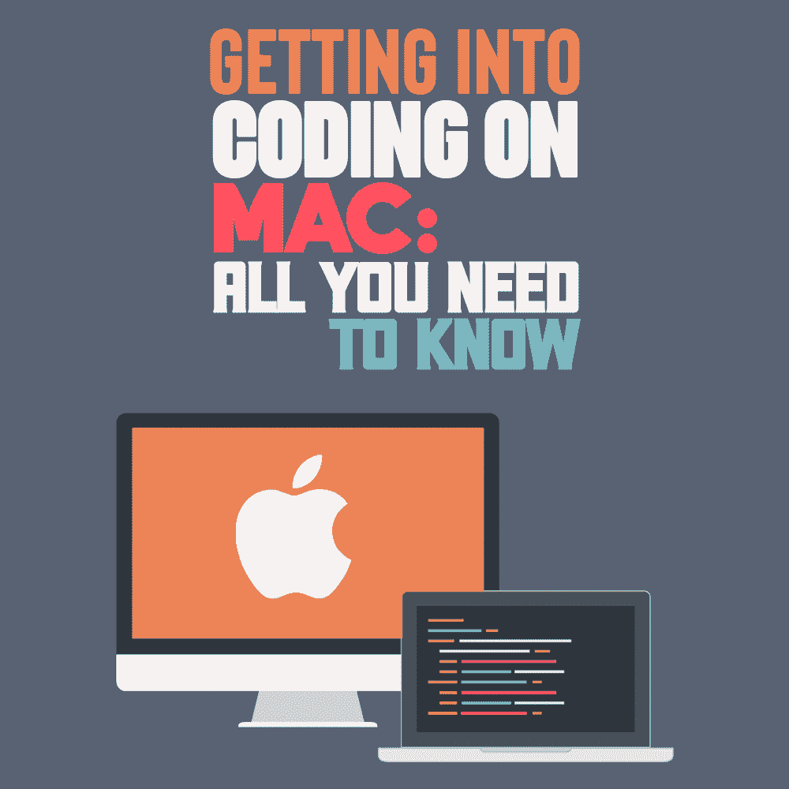

# 在 Mac 上编程入门:你需要知道的一切

> 原文：<https://simpleprogrammer.com/coding-on-mac/>

A safe assumption to make is that every programmer wishes to work with a computer with great speed and can handle applications effectively. Most programming enthusiasts who have developed programs with Mac and any other computer will agree that the Mac environment is better than the majority of other computer environments.

有效的跨平台兼容性是 Mac 如此受欢迎的主要原因之一，应该在您的编码活动中加以考虑。换句话说，如果你选择在 Mac 上工作，你可以在电脑上运行大多数主要的应用程序而不会有麻烦。

为了继续这个话题，当你开始在 Mac 上编程时，有一些事情你需要知道。但是首先，让我们来看看在你开始编辑之前你应该做些什么。

## 调整 MacOS 设置

在开始在 Mac 上编码之前，有几个系统设置需要调整，以使编码过程更有效。登录并运行软件更新，以确保您使用的是应用程序的最新版本。安装最新更新将为您的系统提供稳定性和安全性。

### 安装自制软件

如果你是初学者，创建一个用户帐户供你使用。您将始终使用这个新的管理员帐户登录。所以，除非你给别人你的密码，它永远不会干扰你的代码。要调整设置并为编码开发设置 Mac，有时您必须从 App store 安装命令行工具。

*   从 App Store 安装 **[Xcode](https://www.amazon.com/dp/B099P1W6G8/makithecompsi-20)** 然后打开一个窗口终端，输入“Xcode-select-install”这将在后面的段落中详细讨论。
*   你还需要设置**家酿**，因为它为 macOS 提供了一个包管理系统。此应用程序允许您快速安装和更新任何工具以及包含您随时间推移创建的程序的库。确保您修改了 PATH，以便随自制软件安装的工具的新版本可以优先于所有其他版本。

### 命令的自动完成

调整 Mac 编码设置的另一个步骤是启用大多数命令行工具提供的命令自动完成功能。对于调整，您必须编辑您的文件。主目录中的 zshrc。

您也可以在 Mac 上安装 Rectangle。矩形将有助于使用快捷键重新排列窗口大小。无论您使用的是哪种桌面设置，您都需要快捷方式来排列窗口。这可以是在边上，最大化当前的虚拟桌面或居中您的窗口。

下载 Rectangle 应用程序后，在安全和隐私设置中添加其可访问性。完成后，您现在可以使用它来调整窗口大小设置。无论编辑器选择什么，都要确保设置了编辑器环境变量，以允许命令行工具自动调用它。

为了保持您的代码项目整洁，您必须为您的项目建立一个目录结构。用一个容易记住的简短通用名称创建一个顶级目录。对于每个存储库主机，请确保创建了子目录。

如果您对终端顶部的资源监视器感兴趣，请启用状态栏并单击“配置状态栏”以查看所有可用选项。仍然有允许你反转鼠标滚动的设置。您可以将鼠标设定为独立滚动方向，同时保持触控板自然滚动。

### 管理键盘和快捷键

To be effective with programming on Mac, you will need to master the keyboard and other shortcuts that will help you get done with your work easily. Learning how to code can be mind-boggling, especially if you are a novice programmer new to technologies like Git, GitHub, and the Command-Line. With so many processes to learn, it's vital to prioritize learning keyboard shortcuts.

花时间学习几个对编码有用的简单命令将会大大节省时间。研究表明，学习管理键盘和整合不同的快捷键可以提高工作效率。

这是因为你变得比以前更容易更有效地编写和编辑代码。当你试图教其他初次编程的人如何轻松做到这一点时，这会增强你的信心。您可以学习各种键盘快捷键来改进您的整体编码过程。以下是您可以使用各种键盘快捷键完成的一些任务。

要剪切、**复制和粘贴**，可以使用下面的[键盘快捷键](https://support.apple.com/guide/mac-help/change-keyboard-preferences-on-mac-kbdm162/mac)。按苹果键+ X，按苹果键+ C，最后按苹果键+ V，第一个键盘快捷键，**苹果键+ X** ，会帮你从你的任何一个文件中剪切出一段代码。这意味着突出显示的代码将从屏幕上完全删除，并且永远不可用，除非你再次粘贴它。

在第二个快捷方式中， **Apple key + C** ，您正在复制一个代码段，而不是永久删除它。您正试图将复制的副本粘贴到最后一个快捷方式的代码文件中的其他位置。按下 Apple 键+ S 保存代码文件。

这将节省宝贵的时间，而不是从下拉菜单中选择“保存”命令。如果您想对代码的部分进行注释，请按 Apple 键+ /。

**在标签页之间切换**通常通过按 Ctrl + Tab 到右边和 Ctrl + shift + Tab 来切换并做出正确的决定。要在文件中进行**搜索，请按苹果键+ F。然后，输入您要查找的文本，它将被高亮显示。**

## 安装编码应用程序

随着先进技术的发展，编码 ide 和其他应用程序已经被开发出来，以帮助进行有效的编码。尽管 Mac 附带了大量的软件来帮助您实现目标，但您需要在 Mac 上安装一些编码应用程序。

有两种选择，你可以免费下载并安装应用程序，也可以付费订阅。导航到 Mac App Store 以搜索您正在寻找的编码应用程序。你仍然可以从开发者的网站上下载商店里没有的应用。

这些应用程序将帮助您有效地编写代码，调试以检查代码中的错误，并运行代码以查看输出。知道如何在 Mac 上安装不同的 app，会更容易下载安装各种编码 app。如果你想在 play store 之外安装一个应用程序，请阅读关于其功能的评论，以避免做出错误的选择。

每当你决定下载最好的应用程序时，你可以点击它的图标打开专门的页面。在这里，您可以看到各种用户评论、功能的概述，以及应用外观的截图。然后，继续从商店安装应用程序。

### Spotlight 下载

您可以按下 Command + Space 来打开 Spotlight，并键入您已下载的应用程序的名称。如果你想找到比浏览不同步骤更简单的方法。另一方面，你也可以从网上下载这些应用程序。但是你必须格外小心你正在做的事情。重要的是要记住，互联网上的许多应用程序都充满了会感染你的应用程序的*恶意元素*。

访问应用程序的网站，然后导航到下载选项。点击下载按钮，并使用相同的程序在您的 Mac 上安装应用程序。Mac 的安全应用程序会在安装之前扫描应用程序，以确保它没有病毒和其他可疑元素。

### 不适合 Mac 的应用程序

并不是每一个你需要编码的 app 都会被 Mac 支持。那么，你该怎么做呢？在这种情况下，您可以使用虚拟机软件下载软件，并将其安装在计算机上。互联网上有许多虚拟机软件应用程序可供下载使用。

确保安装的应用程序经常更新，因为这是确保一切和谐运行的唯一方法。您还可以使用虚拟化程序(如 VMWare 和 Parallels Desktop)创建模拟硬件组件的虚拟机。

## 修改终端

[终端](https://www.amazon.com/dp/B096PZP7MV/makithecompsi-20)是 Mac 的命令行界面。终端用于启动操作系统的[用户界面](https://simpleprogrammer.com/common-ux-design-mistakes/)支持的操作。

大多数未经改装的终端在工作或打交道时并不十分愉快。在开始编码之前，定制终端。修改终端将有助于以后调整其他新的修改以满足您的偏好。

修改终端的第一步是设置**主题**。点击终端窗口，然后选择终端。之后，导航到首选项。您将看到一个默认终端配置文件的列表，可以在您的编码环境中使用。

此外，您可以添加自己创建并存储在 GitHub 帐户中的自定义主题。这是一个更好的选择，因为您可以随时更改它。

选定主题后，您可以**设置您的偏好**。这些选项卡包括文本选项卡、窗口选项卡、选项卡、键盘选项卡和外壳选项卡。例如，使用“文本”选项卡选项，您可以取消选择“使用粗体”并允许闪烁文本。窗口选项卡主要用于取消选择活动流程名称、尺寸和参数。

对于*选项卡*选项卡的情况，您可以使用首选项设置来取消选择活动路径或活动进程，并显示活动指示器。键盘选项卡用于处理元键的选择，使终端看起来比默认设置更好。

您可以将它留在这里，但也可以继续进行配置。bash_profile。这通常是通过 nano 编辑器完成的，因为您只需要添加和保存几行。尽管如此，您仍然可以使用 emacs、vim 和任何您喜欢的编辑器。

### 可清除空间

When starting to code on Mac, it is vital to ensure the system is running fast enough and all installed coding software will work smoothly. For this, it's recommended to free up [purgeable space](https://cleanmymac.com/blog/clear-purgeable-space-mac) on Mac which can be done with Terminal. This can also be done when you notice an annoying message when opening the terminal window. The process involved in making the Terminal better is cleaning up.

要清除这些信息，您可以运行“touch .hushlogin”命令，它会自动为您执行清理过程。你将能够享受你的编码过程并拥有极好的学习体验的主要方式是通过定制你的数字空间。

最后，您可以**配置别名**,让您的终端编码体验好一点。别名有助于为命令、外壳文本或文件名创建快捷方式名称。有几种快捷方式可以用来设置有用的别名。你不局限于你能设定的，这就是为什么你能决定任何你认为会改善你体验的事情。

## 选择命令行工具

您可以使用各种命令行工具来获得更好的编码体验。关于这些命令行工具，你应该明白的是，它们不会让你成为伟大的程序员，但它们会让你觉得自己是一个伟大的程序员。成为一名伟大的程序员在于致力于正确的事情，并尝试尽可能多的编码挑战。要在 Mac 上安装命令行工具，您必须遵循以下步骤:

*   确保你更新了你的 macOS 版本。这将提高 Mac 与命令行工具的兼容性。旧版本的 Mac 可能不支持某些命令行工具功能。
*   检查是否已经安装了 **Xcode** 命令行工具。如果没有，您可以用 Homebrew 安装 Xcode 命令工具。这是最值得推荐的方法。或者，您可以为命令行工具安装完整的 Xcode 包。

这些工具都是用 Apple LLVM 编译器、Make 和 linker 构建的，使得编译过程更加脱离源代码。您可以使用不同的命令行工具来增强您的体验。

您可以使用系统工具。大多数程序员讨厌终端的一个主要原因是，你不能像在 finder 中那样操作文件。但是有了系统工具，就可以快速实现这一点。主要有两种开源命令行文件管理器，您可以将其用作系统工具。

这些开源命令行文件管理器包括 ranger 或 nnn。Ranger 是用 python 编写的，为程序员提供了一个快速入门的平台。另一方面，nnn 是一个功能齐全的终端管理器，速度非常快。

### 命令增强工具

有些为了编码而安装的软件应用，有很多原生命令，在终端下基本能用，而有些根本不好用。所以，你需要使用命令增强工具。

您可以在 Mac 上使用的一些命令增强工具包括 exa、fd 和 bat。Exa 是一个可以替代 LS 命令的现代工具。这是一个改进的文件列表器，有更多的功能和更好的默认设置。Exa 使用颜色来区分元数据和文件类型。

另一方面，fd 是一个简单、快速、易用的搜索工具，可以用来代替 Find 工具。它使用截短的语法和缩写的命令结构来保持键入的命令简短。

Bat 是猫的命令增强工具。这是一个很好的工具，尤其是在翻译的时候。Bat 文件用于自动执行常规命令，无需您的输入或干预。

有很多精彩有趣的工具可以用来增强你在 Mac 上的编码体验。选择的每种工具都应小心使用，以保证长期使用。**记住**，程序员的手是魔术师的手，他们在不同的 ide 上通过各种技巧将书面代码转化为伟大的软件。

## 准备，预备，开始！

当您调整设置并安装所需的应用程序以适应良好的开发环境时，使用 Mac 编码可以提供更好的体验。您可以调整 MacOS 设置，以适合您高度偏好的偏好设置。学习键盘和使用的各种快捷键。了解安装有用代码和修改终端的过程。最后，选择你在 Mac 上需要的命令行工具。如果你准备好了，就可以开始在 Mac 上编码了。