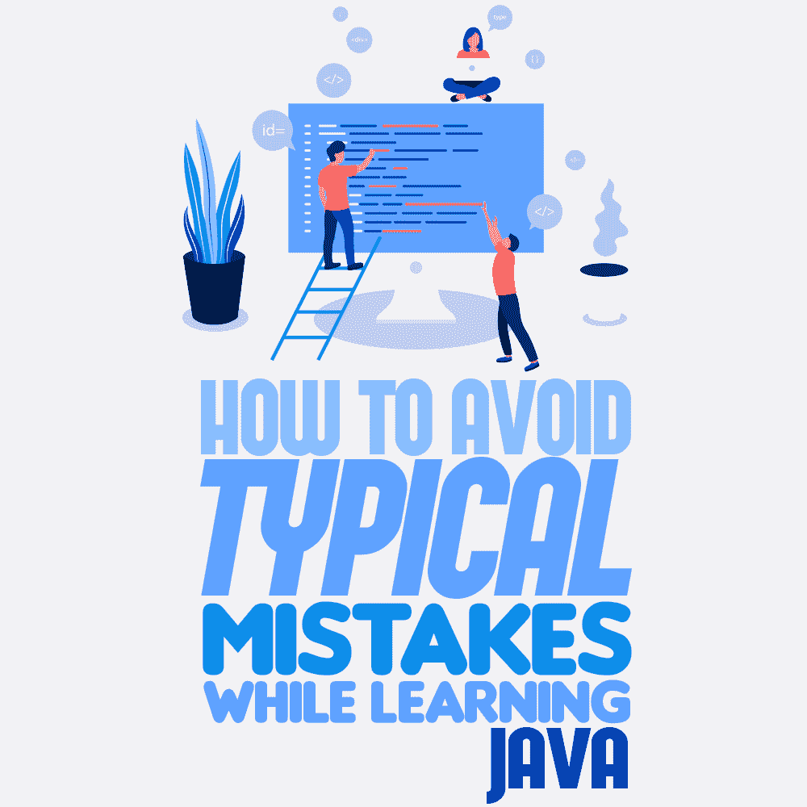
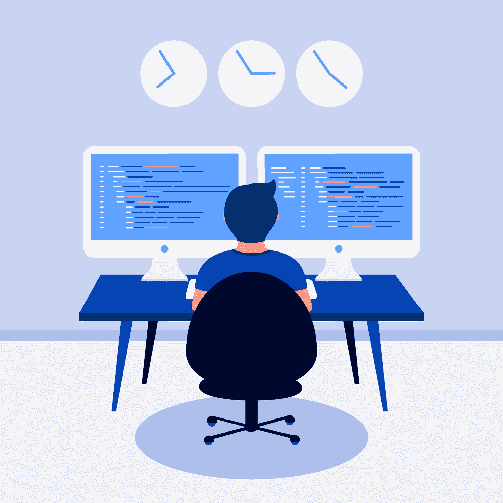

# 学习 Java 时如何避免典型错误

> 原文：<https://simpleprogrammer.com/common-mistakes-learning-java/>

So, you’ve decided to become a programmer. Great idea, but what should you do now?

有一个想法和实现它之间有着巨大的差异。你会面临犹豫，错误的学习方法，错误，失去动力，懒惰，缺乏时间，等等。我不认为你能找到一篇解决所有这些问题的文章。

然而，如果有人告诉你什么是错的，你至少可以避免其中的一些。

如果你想学 Java，我可以成为你的“某人”。

这篇文章描述了那些想要学习 Java 和初学 Java 的人(或者其他编程语言的学生)的常见错误。我既是 Java 资深开发者，又是 Java 导师，所以对题目了解很多。

## 在你开始之前……错误 0:认为大学是必须的

大学或任何其他官方教育机构给你计算机科学的知识和理解，但它很难使你成为专业的、面向行业的软件开发人员。

在大学里，你面对的是编程的学术方法。你的学习重点是理论和算法。你也可能在年底做一些大型的接近科学的项目。它可能是有用的，但是对于典型的面向行业的软件开发人员来说不是。

我想说的是，也许大学不是软件开发知识的最佳来源，但如果你梦想从事科学编程职业，它可能适合你。如果你是高中生，想做程序员，计算机学院也是你不错的选择。

在任何其他情况下，大学都不是必须的，而且通常，它只是在浪费你的时间。记住，不是所有的程序员都有计算机科学学位。不出所料，他们中的大多数都不会。

## 错误 1:学习的错觉

我记得戴夫，他是我的一个学生。他反复尝试不同的免费在线 Java 课程。我想，亚马逊上一半的 Java 书籍都是他买的。他的浏览器书签里有一百万页，都是关于 Java 的…而且…他不知道该做什么。

他会开始一道菜，然后是另一道，只是一个接一个地放弃，一次又一次。三年(！)在他遇见我之前，他的学习努力已经过去了。

"那么，戴夫，你现在在研究什么话题？"我问。

“扫描仪和阅读器，”他回答。

“哦，好吧……你的面向对象编程和集合进展如何？”

"我只是尝试了一点点，但没有深入."

“你告诉我你已经学了三年 Java 了，是吗？”

“……是的，但我几个月前就停止了，你知道，只是又从头开始了。”

他浪费了三年时间四处游荡，从一个源头跳到另一个源头。嗯，如果你懂一点 Java，你一定会认为 Dave 根本就不适合软件开发。幸运的是，这是不正确的。

他的问题是，他开始收集课程和书籍，而不是实际学习。他不是一个糟糕的潜在程序员，而是一个糟糕的老师。

Dave 加入我的团队后不到一年就成为了一名见习 Java 开发人员，并开始认真对待他的学习。我并不是想对每个人说，“嘿，现在就去找个家教；你一个人做不到。”大多数人可以自己做，如果他们知道该做什么，并有一个适当的教学大纲。这就是我首先为戴夫做的。我制定了他的教学大纲和学习计划。

不要误解我。我知道很多人只通过互联网自学编程。他们有一项非常重要的技能——处理信息并区分有用和无用信息的能力。

0 号错误会很快扼杀你的梦想，1 号错误会慢慢地、痛苦地消耗你的时间和金钱。

和 0 号斗争很容易。请访问任何求职者平台，搜索 Java 软件开发人员职位。我不认为你会找到任何需要计算机科学学位，而是需要技术知识和经验的工作。

头号错误“学习的错觉”是一个棘手的错误。它包含懒惰，缺乏决策，以及寻找成功学习的灵丹妙药。一个潜在的开发者获得了太多可靠的信息，却不知道该如何处理。他们开始认为软件开发太难了，并停止尝试…或者再试一次，犯同样的错误。

Well, my main advice is to do it the right way:

1.  获得正确的教学大纲。如果你有一个顾问(导师或程序员朋友)，那是最好的情况。如果你没有教学大纲，又不能或者不想上线下课程，那就去搜一个好的线上课程，最多一两门，就去上吧。独立的评论/评级会帮助你选择正确的课程，在本文的后面，我会给出一些好的免费课程的例子。
2.  一致性是成功学习的关键。每天编码，或者至少每隔一天编码。
3.  在你的时间中，75%或更多的时间必须用于实践，25%或更少的时间用于理论。我将在下面更详细地分析这个典型的初学者错误。

## 错误 2:理论读得太多，实践不够

想象一下，一个 2 岁的小家伙正试着说话。然而，他的妈妈和爸爸不让他做，因为他太小了，对这门学科一无所知。他们决定先向他解释语法规则，并雇佣一名语言治疗师(越快越好！).好吧，在所有这些措施之后，他们让他试试。嗯，这样的做法估计会有更多无语的人吧！

或者让我们想象一个想打冰球的大个子。“对不起，伙计。没有冰给你，直到你看了或者听了一些讲座，比如:

*   *冰的物理学*

*   *曲棍球运动员运动的运动学和动力学*

*   *假人用冰球和曲棍球棒*

*   *冰球运动员团队合作的心理*

*   *初学冰球运动员的创伤*

*   *如果其他曲棍球运动员的冰鞋不舒服地靠近你的脸，该怎么办”*

“好吧，”那家伙说，“我最好不玩这个游戏，继续我的生活。曲棍球一定很无聊很恐怖。而且太复杂了。”

似乎很可笑，不是吗？然而，许多学生和一些老师认为当我们谈论编程时就是这样。

我的信息非常简单:

1.  要掌握任何实践活动，就要去实践！
2.  编程是一项实践活动。
3.  1 和 2 的结论很明显吧？

从最开始的步骤开始，找一个有很多编码任务的课程或者书，每天解决。如果你这样做了，你就省略了学习编程时最大的一个错误:过于注重理论。

我不是说你应该忽略理论。只是“更少的理论，更多的编码”，比例为 25:75。写代码是学习 Java 的最佳途径。

## 错误 3:没有用正确的方式检查你的解决方案

你的代码做了它应该做的吗？通常，如果他们得到正确的结果，菜鸟程序员认为是这样的。然而，这并不意味着一切都很好。

你越早学会正确地测试你的代码，你就能越快成为一个更好的程序员。学习单元测试是一项非常有用的技能，但不适合一个完全的新手。你知道，适当的单元测试是一种超能力！

掌握自己的代码审查的第一步是在“如果”中思考尝试不同的数据集。考虑所有的情况并不容易，但是你在适当的时候通过每个“如果”收集了宝贵的经验。

但是，我必须承认，近年来出现了一些真正好看的编程课程和平台，配备了自动代码审查。它们极大地简化了你的第一个编码步骤，并给你一个将注意力集中在任务上的机会。

下面，您将找到一些有用的链接，链接到带有自动代码验证的资源。

## 错误 4:不经常练习

你知道发展实用技能最具破坏性和非理性的方法吗？我只能用一个词来形容——“有时候。”学习如何编码有点像爬一座冰冷的小山。如果你停下来，你会很快滑回去，甚至可能会头朝下滚下去。你的编码技术也是如此。当你停止编码时，你会很快地失去这项技能。

那样学习会浪费你很多时间。别折磨自己了，定期练习编码。我的意思是一周至少三次——或者更好，每天一次。

## 错误 5:太骄傲而不愿寻求帮助

Do you know what a professional software developer does when they aren’t successful in trying to solve a task with possible solutions they already know? They go to Stack Overflow to ask others on the forum. Why don’t you, my dear Java beginner, do the same?

“如果我的问题很蠢，其他男生嘲笑我怎么办？”你可能会问。嗯，真的，如果呢？你知道我们生活在一个伟大的钓鱼时代，所以一个好主意就是忽略他们。

记住一件重要的事情:为了你的学习，你有权问世界上最愚蠢的问题。但是在提问之前，先谷歌一下你的问题。几乎每一个初学者的问题，都有其他同学问过，也已经有人回答了。

当谈到编程论坛时，提出问题或只是与其他 Java 初学者或软件开发人员聊天真的很有激励作用。你意识到你并不是一个人有这样的问题，有许多人可以帮助你，也有那些你可以帮助的人。

## 错误 6:太快放弃或试图解决你的任务

“我尝试过一次解决任务，没有得到正确的答案。我应该问问谷歌……或者我的导师……或者我最近遇到的那个软件开发人员。”

停下停下停下。你还没试过呢！

当然，很难估计寻求帮助的正确时间。然而，首先问问你自己为什么你现在想要得到帮助。很可能，这只是你的懒惰或者你想更快地完成任务。如果是那样的话，就不要做了。我们在这里谈论的是你的学习，而不是速度竞赛。

## 错误 7:选择太难的任务

这是第五个错误的另一面。一些学生准备花数百个小时解决一个任务，这对他们来说太难了。我相信为初学者解决许多简单的问题比解决一个困难的任务要好，至少在他们学习的前两三个月是这样。

我建议你把棘手的任务留到以后，然后去解决其他的。你总是可以在以后回到这个困难的任务上来。也许你会发现这并不像看上去那么难？

## 错误 8:失去动力

“我不懂题目……我对编程不够好。我应该放弃，去尝试别的。”听起来很熟悉，是吧？

每一个——我是认真的——***每一个*** 初学编程的学生都至少失去过一次动力。在我身上发生过很多次。事实上，太频繁了。我所有的队友，以及我所有成功的学生，也经历了这一点。

当它再次袭击你时，请记住这一点。如果你缺乏动力看起来很严重，试着改变你正在学习的话题。不要忘记:几乎任何人都可以编码。学起来不容易，但肯定是可以的。

## 成功学习 Java 的链接

我为我的学生收集了一些好的链接，也简化了我作为导师的工作。它们也会对你有用。

CodeGym 是针对初学者到中高级学生的。这是一门实用的在线课程，在这里你可以找到一个优秀的核心 Java 教学大纲，大约 1000 个(我假设)带有自动代码验证的编码任务，以及提示和技巧。这看起来有点像电子游戏:你有你的角色(一个机器人),你必须把他从新手提升到 Java 程序员。做的编码任务越多，得到的点数越多，你用这些技能点去开新的讲座和任务。

coding name 是为 Java 或其他语言的中级到高级学生准备的。它让您能够在基于浏览器的集成开发环境中更改游戏，编译它，并实时查看更改！接受一些艰难的挑战，成为一名更好的开发人员。它不是一门在线课程，而是一种有趣的编码方式，为严肃的初学者和专业开发人员提供了令人愉快的、具有挑战性的练习。

GeeksforGeeks 是一个面向极客的大型计算机科学门户网站。它包含了一些不同编程语言的学术课程，有很好的教学大纲和大量的实践任务、测验和谜题。你还可以找到与算法和数据科学相关的有用问题。

对于每一个 Java 开发人员或学生来说，Oracle Docs 是该语言作者的主要来源。

适合从绝对初学者到进阶学员的三个不错的 Java 理论教程: [Tutorialspoint](https://www.tutorialspoint.com/java) 、 [w3schools](https://www.w3schools.com/java/java_encapsulation.asp) 、[Java point](https://www.javatpoint.com/)。

[Stack Overflow](https://stackoverflow.com/questions/tagged/java) 是最大的开发者社区，在这里你可以提出你的问题或者搜索你的问题的现有解决方案(由其他学生提出)。

Coderanch 比 Stack Overflow 小，但是对初学者非常友好，对 Java 开发人员很有好处。

Reddit 是一个巨大的网站，在那里你可以找到你的问题的答案。有益的子主题是 [learnprogramming](https://www.reddit.com/r/learnprogramming/) 、 [java](https://www.reddit.com/r/java/) 和 [learnjava](https://www.reddit.com/r/learnjava/) 。

****

**职业生涯读/看什么:**

*   凯西·塞拉和伯特·贝茨的《头先 Java 》是一本适合新手的好书。
*   凯·霍斯特曼的《核心 Java 第一卷和第二卷——基础知识 是最好的 Java 书籍之一，适合每一个 Java 学生。

## **自信面对 Java 挑战**

你并不孤单。所有初学 Java 的学生在掌握软件开发的道路上都面临着挑战。犯错没关系；你还在学习！

如果你在学习中停滞不前，也许你正面临着我上面提到的一个问题。记住，他们都有一个简单的解决方案。记住这一点，并以正确的方式练习。

别担心了，开始编码吧！