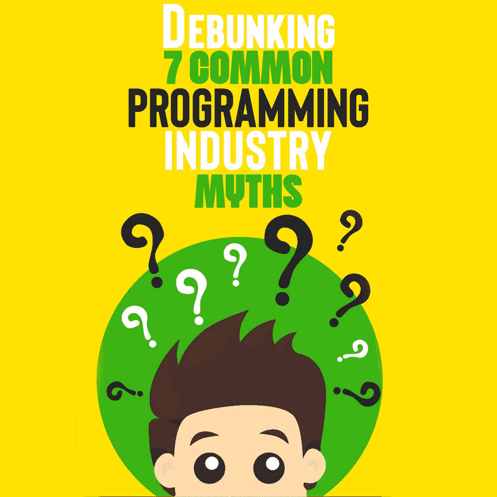

# 揭穿 7 个常见的编程行业神话

> 原文：<https://simpleprogrammer.com/common-programming-industry-myths/>

As a programmer, do you ever feel that you are not able to reach your full potential? There can be numerous reasons pulling you back, including believing certain myths that are prevalent in the programming world. Whether you are an aspiring programmer or an experienced software developer, popular notions have the power to shape your choices.

虽然这些神话一直存在，许多人相信它们是真的，但没有事实证据支持他们的说法。作为一名程序员，重要的是不要让自己陷入虚构的陈述中，这些陈述最终塑造了你的职业生涯。

为了支持你的编码之旅，在本文中，我将揭穿七个流行的编程神话，帮助你看到它们掩盖的真相，从而帮助你成为一名更好的程序员。

## 学习代码需要大学学位

几年前，大学学位无疑是获得编程工作的必经之路。然而，由于科技世界不断变化的动态，雇主更看重自学技能和实践知识，而不是四年的学位。许多公司已经放弃了大学学位的强制要求，因为他们想看看开发人员对于某个特定的角色有多胜任。

虽然程序员可以在学校学习编码的基础知识，但实习可以让你获得求职所需的实践经验。聪明的招聘人员知道，专注的开发人员会付出额外的努力来利用自由职业者的资源，并建立一个使他们在竞争中脱颖而出的组合。

由于高需求，替代选择在一定程度上变得越来越受欢迎。编码训练营为有抱负的程序员提供强化培训，被认为是学士学位的坚实对应。下一个最好的选择是边做边学。为开源项目做贡献对开发者有很大帮助。开发人员可以完善他们现有的技能，学习一项新技术，甚至最终为自己找到优秀的导师。

免除大学学位意味着你可以在更晚的年龄学习编程，即使你有一个完全不相关的学士学位。这里的**要点**是:没有学位不应该阻止你选择你想要的编程职业。像谷歌、IBM 和苹果这样的科技巨头不再以计算机学位来限制申请者，那么你为什么要限制自己呢？

## 编码需要非凡的数学技能

大多数人认为，如果他们不擅长数学，他们将无法编码。但事实真的是这样吗？

事实是，优秀的程序员必须具备高中就已经教授的基本代数技能。但是请放心，编码就像写语言一样——不是解决复杂的数学问题。

数学问题通常只有一个正确答案，而对于软件开发来说，情况并非如此。程序员必须跳出框框，想出创造性的解决方案来解决编码问题。此外，编程语言相互依赖，并有共同的原则。一旦你掌握了一门语言，学习新的语法就变得容易了。

因此，即使你在学校的数学成绩一般，你仍然可以成为一名伟大的程序员。有很多程序可以帮你做数学运算。一切都是为了找到合适的资源并让它们为你服务。

## 专攻一个领域是编码的关键

有一种编程神话认为开发人员应该专攻一种关键语言。然而，虽然从单一语言开始是明智的，但坚持使用一种语言并不是一个好主意。

据专家介绍，开发者可以采取 [T 形知识的方式。这意味着，作为一名程序员，你的目标应该是拥有一个广泛的知识基础，至少有一个深度专业化的领域。作为软件开发人员，重点关注的关键领域是算法、数据结构、各种架构以及后端和前端数据库。](https://simpleprogrammer.com/generalists-specialists/)

建立一个强大的通用基础的好处是，它也给你一个公平的想法，你可以选择什么专业。在某些情况下，开发人员选择了他们认为自己擅长的专业，后来才意识到这不是他们的工作。一个积极的程序员应该不断努力扩展他们的知识，同时扩展他们的专业领域。

除了 T 型方法，程序员应该培养一种有价值的特质:适应性。招聘人员寻找那些有诀窍在短时间内学习技能并根据公司需求成长的开发人员。不管你擅长什么技能，保持灵活的学习心态。

## 编程不会让你变得有创造力

Due to the extensive nature of the job, many people believe that programming is a boring profession. While it is true that coding does get technical at times, there is no reason for it to be boring. As a programmer, you design, test, analyze, and even play at your workplace. That being said, coding only gets boring if you stop learning and evolving.

作为一名程序员，你有能力从一个想法中创造出一些东西。某一天你正在为一个网站编写代码，第二天，你正在开发一个游戏。从抽象中构建东西需要大量的[创造力和控制力](https://www.amazon.com/dp/B008RQMDU4/makithecompsi-20)——这正是编程的意义所在。

即使你觉得自己缺乏创造力，也不要担心！有一些简单的方法可以从程序员可能陷入的单调的编码程序中得到乐趣。通过学习一门新的语言，走出你的舒适区。掌握一个有趣的新工具来扩展你的技能。最重要的是，在工作期限之外寻找有趣的项目来保持你的技能和兴趣。

## 编码只是编写代码的行为

人们通常认为程序员把所有的时间都花在遵循指令和把想法转化成代码上。然而，事实并非如此。编写好的代码需要一系列涉及非技术技能的行动。

在一个优秀的程序员开始输入第一行代码之前，他们必须学会阅读代码。原因是阅读他人的代码有助于你思考如何做得更好，以及你可以从中吸取哪些技巧。

写代码也意味着和其他程序员一起工作。你可以结对编程，加入黑客马拉松，或者找一个导师。参加团队活动也能让开发人员提高他们的社交技能。

编写代码不仅仅是一步到位的过程。程序员不得不重写和修改代码，使之比以前更好更容易。因此，编码过程需要分析思维、决策和时间管理技能——不仅仅是写代码。

## x 是最好的学习语言

也许编程行业中最有争议的话题是是否有一种最好的语言可以学习。简单来说，答案是否定的。这个逻辑背后的原因是[每种语言在编码环境中都有自己的位置](https://simpleprogrammer.com/popular-app-development-languages-2022/)。因此，招聘人员甚至会寻找懂几种语言的程序员。

因为不可能严格遵循一行代码，所以没有一种语言比其他语言完全更好。对于交互式云软件，你可以使用 JavaScript，而 R 被认为最适合数据分析。根据最新的趋势，一种语言可能现在很流行，过一段时间就会消失。为了应对不断变化的编程市场，招聘人员希望人们能够精通不止一种语言。

## 编码人员必须记住语法

有一种普遍的观念认为职业程序员必须用心学习代码。如果这是真的，那就只有少数明星程序员了。你很幸运，这根本不是真的。学习语法是学习编程的一个简单副产品。考虑到语言的数量，不可能学会每一种语言的语法——你也不应该试图去学。

有了扎实的语言基础，你就可以在需要的时候查找语法。如果你精通某一门语言，你就能组合出正确的语法。最好的解决方案是记住语法中[有用的部分——比如基本函数和逻辑结构——然后练习剩下的部分。](https://www.originate.com/thinking/a-unique-guide-to-syntax-from-a-developers-view)

这里的关键是记下你所知道的语言的最佳实践。即使你不知道语法，你也可以遵守规则，拥有正确的代码。

一个好的程序员不需要记住语法，但知道如何开发一个。经常练习和注意细节对理解语法很有帮助。就像口语一样，程序员每天都可以学到新的东西，并将其应用到代码中。

## 不要让神话定义你的编程生涯

Myths, in general, are based on mass opinions which don't tend to hold factual value. Such opinions lose validity over time as industries evolve and people establish their own realities through practical experience.

取代毫无根据的神话，看看一些有见地的想法，以帮助你成为一名更好的程序员。一般来说，定期学习和阅读。深入钻研技术世界将帮助你跟上最新的趋势和技术，在个人和职业层面都有所发展。

这篇文章的要点是，你不应该让神话阻碍你实现作为一名程序员的潜力。如果你想在 35 岁时学习编码，那就去做吧——不要因为一个神话，即学习代码为时已晚而停止。不要让这些神话阻止你拥有一个伟大的编码生涯！