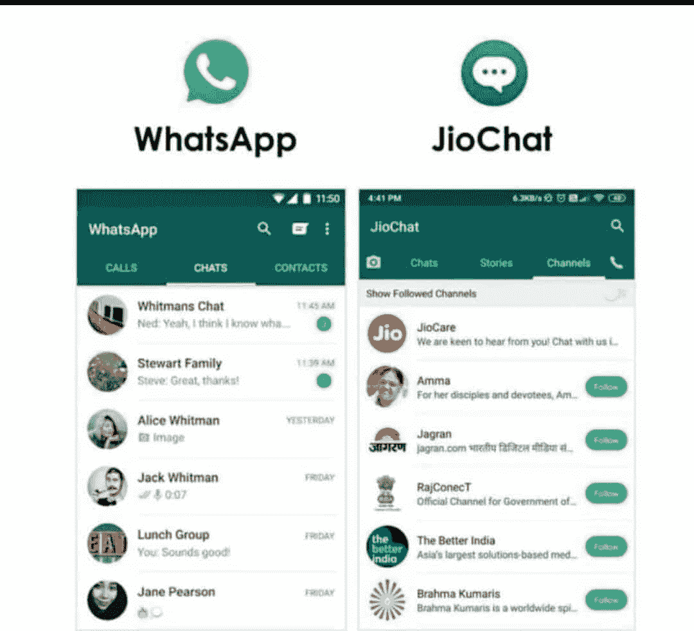
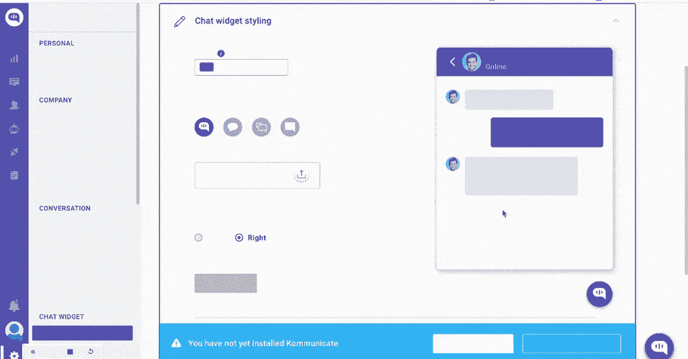
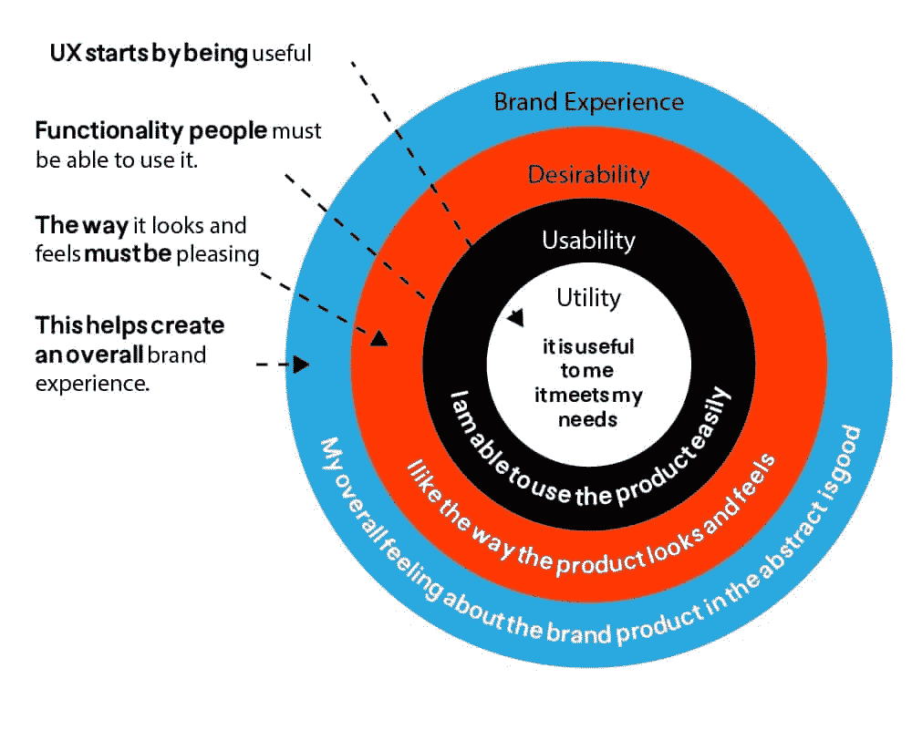
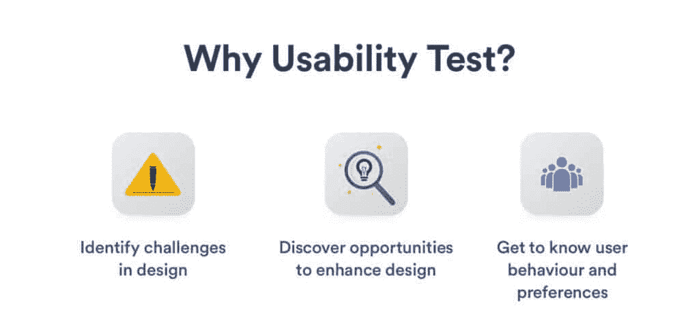
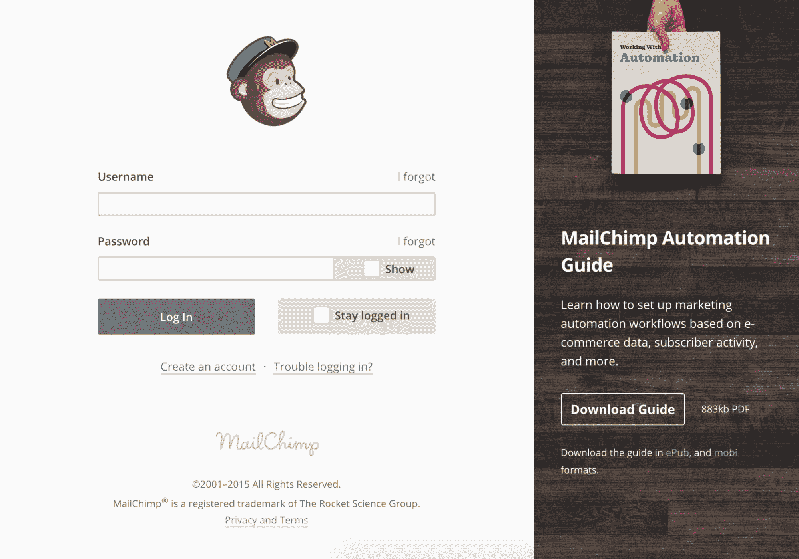

# 7 个被误认为潮流的 UX 设计失误

> 原文：<https://simpleprogrammer.com/common-ux-design-mistakes/>

成为谷歌 Play 商店 348 万应用程序或应用商店 222 万应用程序不可分割的一部分感觉很好。无论是 Android 用户还是 iOS 用户，人们都有很多选择来下载他们想要的移动应用程序。

医疗应用、娱乐应用、金融/商业应用、社交媒体应用等应用类别。，是一些下载量很大的热门类别。如果你的是以上几类的 app，应该有几百或者几千的下载量吧？

然而，如果一个移动应用程序无法获得足够的下载量，该怎么办？背后可能的原因是什么？你可能会责怪整个移动应用程序的设计和开发、图形或其他任何东西。

事实是，用户卸载一个不符合其用途的移动应用有几个原因，但糟糕的 [UX 设计](https://www.resourcifi.com/blog/ux-psychology-principles/?utm_source=simpleprogrammer.com&utm_medium=offsite)是一个常见的原因。你猜怎么着:还有更多影响用户体验和用户与产品互动的常见 UX 错误。

因此，请继续阅读，找出一些常见的 UX 设计错误，以及如何避免它们。

## 为什么用户体验很重要？

在我向你展示最常见的 UX 设计错误之前，有必要知道为什么 UX 设计对一个移动应用程序或网站很重要。

简而言之，UX 很重要，因为它被设计来满足用户寻找的一切。UX 设计的主要目标是为用户提供无缝体验，从而提高转化率和保留率。

如果处理得当，一个品牌/组织可以在视觉设计的每个阶段节省大量的时间和金钱。

如果用户能够轻松浏览你的手机应用或网站，那么恭喜你；你已经成功地向他们提供了一次很好的体验。因此，UX 设计的重要性不应该被低估。

## UX 设计失误

现在，已经看到了 UX 设计的重要性，让我们来看看一些没有人应该犯的 [UX 设计错误](https://simpleprogrammer.com/improve-ux-online-store/)。

### 忽略用户的反馈

拥有移动应用的大多数公司和组织总是倾听他们的用户。关注用户反馈可以在产品设计阶段优化应用程序。这节省了大量的时间和金钱。

用户对应用的判断是实时的，比开发者或设计师更好。这就是为什么像脸书(现在是 Meta)、WhatsApp 和 Instagram 这样的社交媒体巨头已经发展并看起来与以前的版本不同的关键原因。

### 模仿特征

市场上总是有新应用的空间，因为用户期待一些新功能。通过集成新功能，移动应用变得独一无二。尽管如此，UX 的设计者经常犯一个错误，集成了一个流行应用的类似功能。

模仿可能会危及移动应用程序或网站。比如 JioChat 就是 WhatsApp 的翻版。它有相同的用户界面设计，包括颜色和确切的功能。

[来源:Miro.medium](https://miro.medium.com/max/1400/1*KL5Q6smifzTW1nxQA3GCCA.jpeg)

然而，用户经常抱怨 JioChat 有一些问题，比如崩溃、消息延迟、缺乏流畅的登录等等..由于这些障碍，这款即时通讯应用已经失去了大量用户。

### 缺乏响应

从移动应用程序中排除响应是最容易陷入陷阱的方式。如果 UX 的设计无法响应，用户就无法访问应用程序。因此，用户体验设计师永远不应该忽视应用程序的响应能力。

来源:Userpilot

响应式设计是移动应用的关键要素之一。所有具有响应式设计的移动应用程序都应该兼容不同的屏幕尺寸和显示图形，而不会失真。

响应式设计会给品牌带来好处。使用响应式设计构建移动应用的一些最大优势包括降低跳出率、增加转化率、提高排名等等。

### 美观胜于功能

Jana Kingsford 说过，平衡不是你能找到的；它是你创造的东西。尽管 UX 设计师保证在美学和功能性之间取得平衡，但有些人要么偶然错过，要么有意避免。

[资料来源:Baianat](https://baianat.s3.amazonaws.com/articles/33mini_1550071503077_9rxie.jpg)

重外观轻功能是另一个常见的 UX 设计错误。功能应该是 UX 设计师的首要任务，应该与应用程序的美学同步。专注于不犯重外表轻审美的错误将会解决 UX 设计的问题。

### 零可用性测试

UX 设计师无法评估升级或优化应用程序。应该联系专业的用户研究人员来执行基本级别的用户测试，以找出初始开发阶段的缺陷。然而，专家强调通过包含真实的目标受众来执行可用性测试。

用户应该能够顺利地执行基本任务，如注册，登录，搜索等。，具体取决于移动应用程序提供的功能。避免这个阶段将会把 UX 的发展拖回到它的初始阶段。

### 没有负空格

负面空间被视为负面元素的日子已经一去不复返了。今天，留白已经成为 UX 和 UI 设计中的一个重要元素。

与其用过多的图片来淹没你的用户，留下一些空白将是一个明智的决定，因为这将使应用程序看起来不那么杂乱。

来源:用户界面模式

Mailchimp 是利用空白的一个很好的例子。战略布局的按钮和非压倒性的图形使用户理解起来不那么复杂。

### 信息太多

内容为王。虽然这是适用于 UX 和用户界面设计的潜规则，但当以一种平衡的方式完成时，效果最好！UX 的设计者必须注意显示给用户的内容数量。

不应该有令人不知所措的空话。而且建议不要收录 lorem ipsum，因为这样的内容让东西看起来格格不入。如果没有可用的信息或细节，最好不要动这个空间。包含虚拟文本会误导用户，这对网站或应用程序的转化率没有好处。

应用程序的 UX 设计应该在视觉上吸引人，同时简洁地传达信息。即使是对数字产品的描述也应该简明扼要，与图像和特征相关，这样用户才能产生共鸣。

## 亡羊补牢，为时不晚！

所以，现在我们有了。当一个 UX 设计师遵循 UX 设计趋势、道德和原则时，开发一个移动应用程序并不是一件难事。移动应用的主要目的是与用户交流，提供他们想要的东西，而不是让他们感到困惑。

当移动应用程序 UX 设计的路线图设计正确时，犯常见 UX 设计错误的机会就被遏制了。