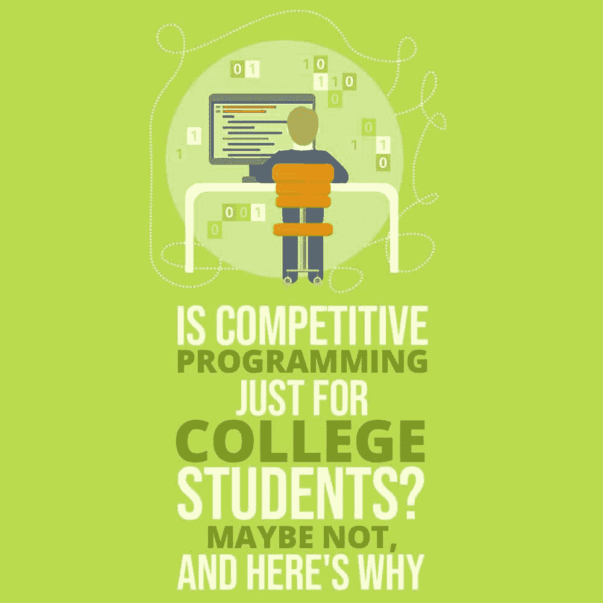

# 竞技编程只是针对大学生吗？也许不会，原因如下

> 原文:[https://simple programmer . com/竞技-编程-学院-学生/](https://simpleprogrammer.com/competitive-programming-college-students/)

<figure class="alignright is-resized">

</figure>

竞争性编程是一项脑力运动，程序员用符合特定标准的解决方案来解决类似难题的问题。

这些标准通常受到时间和/或内存限制的约束。速度是竞争编程的驱动因素——提交解决方案越快，获胜的机会就越大。

你还可以检查和发现别人代码中的错误，给你加分。Topcoder 、 [CodeChef](http://www.codechef.com/) 和 [Codeforces](http://codeforces.com/) 是一些为竞争性编程提供实践舞台的网站的流行例子。

考虑到所需的技能和它提供的刺激，竞争性编程在大学生或高中生中最受欢迎。对通过大量练习解决数学难题和问题的浓厚兴趣是在这类竞赛中获胜的关键。

就像任何其他运动一样，竞争性编程世界的黄金法则是尽可能早地开始。像 Petr Mitrichev 这样的竞争编程中坚分子和榜样在 20 岁时就已经赢得了 Topcoder 公开赛(竞争编程世界锦标赛)。

尽管在学生中非常受欢迎，但竞争性编程并没有引起专业人士和有经验的工程师的兴趣。谷歌的研究主管 Peter Norvig 继续说[擅长竞争性编程，事实上，与在工作中表现良好负相关](https://catonmat.net/programming-competitions-work-performance)。

在这篇文章中，我将向你展示什么是竞争性编程，以及为什么它对你这个职业程序员来说很重要。我们将看看竞争性编程经常被冷落的原因，以及为什么你仍然应该实践它。

## 为什么竞争性编程在专业人士中表现不佳

不利于竞争性编程的一些最流行的因素是:

### 处理与现实世界挑战几乎无关的假设问题

想象一个场景，你有无限多的写有数字的瓷砖。当两个牌上写有相同的数字时，它们会合并成一个更大的数字牌。您的目标是找到达到瓷砖上给定数字的预期移动次数。”

这是竞争编程中的一个典型问题[,您正在努力在一秒钟内运行指定输入的代码，而您编写的代码仅消耗 50KB！](https://www.codechef.com/problems/TILEBAG)

现在，将这与构建一个[笔记应用](https://blog.flexiple.com/react-hooks-learn-by-building-a-notes-app/)形成对比，在那里你做出产品和设计决策，例如用户流、UI 元素和要包含的特性。构建这样一个应用程序需要你慢慢地耐心地通过代码。

竞争性编程问题是典型的数学难题，在这里你要与现实世界中几乎不会困扰你的约束进行斗争。在构建真实世界的应用程序时，重要的因素包括设计健壮的系统、用户流等。在竞争激烈的编程世界中很少被解决。

### 不直接适用于你工作的技能

竞争性编程世界中的一个典型问题要求你快速理解问题陈述，想出一个逻辑解决方案，并尽可能快地编写代码。经过充分的练习，这将使你具备很强的理解能力、很高的资质和逻辑思维能力。

虽然以上是非常吸引人的特质，通常能让你比大多数人更擅长解决问题，但它们与取得工作上的成功没有直接关系。

问问任何一个有经验的工程师，如何才能成功地创造出伟大的产品，你会听到的技能是精通技术框架和模式、设计思维、坚持不懈等等。

考虑这个简单的例子:你的任务是构建一个类似于 [remote.tools](https://remote.tools) 的平台，用户可以在这里发布产品、投票和评论。这通常需要两到四周的时间来完成(最小可行产品或第一个版本)。

你认为哪些技能会帮助你打造这样的产品？在 Ruby on Rails 这样的框架中，是你的高资质**还是**你的经验深度？是你快速逻辑思考的能力**还是**你对设计模式的理解，或者是你编写清晰、干净代码的能力？

实际上，尽管天资和快速思考的能力是很好的通用技能，但它们不能取代对特定系统和方法的深入了解。

### 需要一种完全不同于构建真实世界产品的方法或过程

Topcoder 上的单轮比赛(SRM)通常持续两到三个小时。比赛的第一部分是留给个人编程的，而第二部分为您打开了观看和挑战他人解决方案的舞台。

经验丰富的玩家能够迅速将当前的问题集与过去的问题或现有的算法联系起来；他们有简短的代码模板，可以方便地用于常见情况，并且他们非常清楚在查看其他人的代码时在哪里寻找漏洞。

现在，将这与你典型的一天工作进行对比。假设您的任务是实现产品注册页面的新设计。

最自然的做法是参考前端库的在线文档或相关教程，然后开始编码。在这样做的时候，如果你遇到任何问题，你可以回去，阅读相同的内容，并编写代码。

任何职业工程师的典型周期都是研究、分析和编码——这与你在任何竞争性编程竞赛中所做的事情不同。

## 为什么您仍然应该练习竞争性编程

<figure class="alignright is-resized">

</figure>

看来我们已经提出了一个非常有力的反对竞争性编程的理由。看起来对于任何职业程序员来说都不值得考虑。或者是？

现在让我来谈谈你通过练习竞争性编程可能得到的好处，即使是每天一点点。

### 帮助你解决非常复杂的问题

在竞争性编程中，你可以练习涉及高级数学概念和算法的极具挑战性的难题。

以 Topcoder 教程[线扫描算法](https://www.topcoder.com/community/competitive-programming/tutorials/line-sweep-algorithms/)和[计算几何](https://community.topcoder.com/tc?module=Static&d1=features&d2=091806)为例。如果你能够成功地解决这些问题(在竞赛中或在你练习时)，这是一个不平凡的壮举，并且能够解决它们会给你带来巨大的快乐！

虽然您可能在日常工作中找不到这些概念的直接应用实例，但它们无疑为您快速掌握新概念或掌握新领域做好了准备(例如，学习新的编程语言或框架)。

### 让您以更专注的方式快速编写代码

一个典型的 Topcoder SRM 有两个阶段——编码阶段，持续 75 分钟，你用不同的难度解决两个问题，然后是挑战阶段，持续 15 分钟，你在别人的代码中发现错误。

显然，对于竞争性编程来说，速度非常重要。您需要快速思考和行动，同时在时间限制下以专注的方式编码。

通过练习，这有助于你在紧张的环境中保持冷静和专注，同时提高你的逻辑思维和编码能力。这是一个极其强大的特质，不仅适用于你的工作，也有益于你的个人生活。

### 对你的大脑的有力锻炼

在快节奏的环境中解决具有挑战性的难题绝对是提升你灰色细胞的绝佳运动！无论是现场比赛还是闲暇时做的一组练习题，你肯定会用上很多脑力。

经过一段时间后，你的日常工作可能会分阶段或全部变得平淡无奇。在其他问题中，你可能会养成习惯，呆在自己的舒适区，不去锻炼那些灰色细胞。兼职练习竞争性编程绝对是不断挑战你思维能力的好方法。

### 让你成为大公司的热门人选

无论如何，最好的软件公司仍然会根据候选人的技术能力(以及竞争性编程技能，无论是隐含的还是明确的)来评估他们的价值。虽然一家公司可能不会根据你在 TopCoder 或 CodeChef 等门户网站上的排名来判断你，但你肯定会在[一轮或多轮面试](https://simpleprogrammer.com/top-programming-interview-questions/)中面临具有挑战性的算法问题。

甚至像 [Flexiple](https://www.flexiple.com) 和 [Toptal](https://www.toptal.com) 这样的高质量自由职业平台也认为技术能力可以很好地代表总体聪明程度，并将其作为筛选过程的一部分。

### 减压和娱乐活动

最后，并不是你做的每件事都必须在职业发展方面结出果实。练习竞争性编程非常有趣，就像解魔方或数独一样。它也是一种很好的减压方式。

每个人都强调要有一个能帮助你培养创造力、释放压力、最重要的是获得乐趣的爱好。竞争性编程很可能成为你的爱好！

哇！这毕竟是个不错的选择。竞争性编程就像体操。是否直接帮助你在职业生涯中成长？也许不是。这有益吗，你还会去做吗？也许是的。

## 明智地利用你的时间

<figure class="alignright is-resized">

</figure>

竞争性编程本身不一定能直接帮助你在职业生涯中成长。然而，它带来了一系列的优势，使之有资格成为一个伟大的、互补的爱好，可以提高你的编程技能。而且，它可能会为你打开在顶级公司获得高薪职位的大门！

总之，你选择如何度过你的时间。记住，你离开工作的时间是有限的。你可以决定花时间练习竞争性编程问题，或者你可以花时间做一个可靠的副业项目，掌握一项补充技能，如 HTML/CSS(用于后端开发)或[学习一项新技术](https://simpleprogrammer.com/sevenlanguages-sevenweeks)。

这些选择各有利弊，你需要明智的选择。无论选择什么，确保你在相当长的一段时间内集中精力。只有到那时，你才会有所成就——这是编程世界的黄金法则。