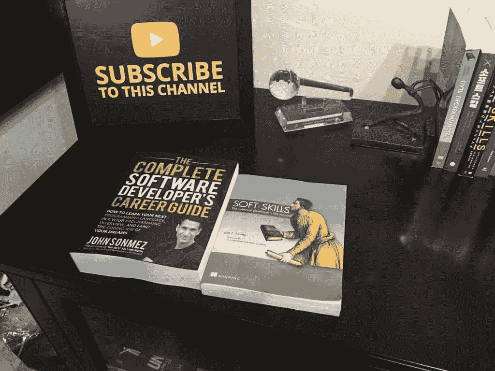
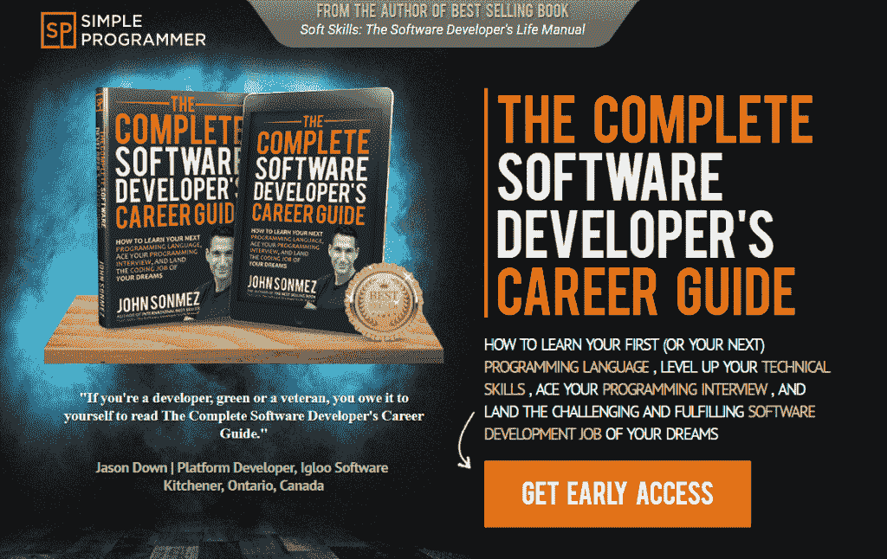

# 完整的软件开发人员职业指南–立即获取！

> 原文:[https://simple programmer . com/complete-software-developers-career-guide-get-now/](https://simpleprogrammer.com/complete-software-developers-career-guide-get-now/)

嗯，女士们先生们，**今天是…**

终于，在经历了大约整整一年的血、汗和泪之后，我准备好出版一本 800 页的巨著了:

[***完整的软件开发人员职业指南***](https://simpleprogrammer.com/products/careerguide)

这是一项艰巨的任务，但这是我知道我必须写的一本书，因为没有一本书涵盖了我认为一个软件开发人员在职业生涯中尽可能成功所需要知道的一切。

事实上，在我开始写这本书之前，我就已经把它的名字固定下来了。

我知道我想写一本书，我可以真正地称之为 ***[【完整的软件开发人员职业指南】](https://simpleprogrammer.com/products/careerguide)* 。**

几天前我刚拿到我的软拷贝，我对结果感到很兴奋。

  

软技能旁边的完整软件开发人员职业指南:软件开发人员的生活手册

我非常期待你也能拿到你的拷贝，并让我知道你对它的看法。

如果您还没有查看图书登陆页面和图书预告片视频，请务必也查看一下！

所以，事不宜迟，我向你展示 **[完整的软件开发人员职业指南](https://simpleprogrammer.com/products/careerguide)。**

现在就在亚马逊上购买，要么是 Kindle，要么是平装本，或者两者都有。

请务必现在就行动，因为我正在进行一些疯狂的发布日促销活动。

另外，请，请，传播这个词。让你认识的所有可能感兴趣的人都知道这本书。甚至告诉你的非开发人员朋友和家人，把这个词分享给他们的软件开发朋友，因为我想接触尽可能多的开发人员。

对于这本书，我有两个大而大胆的目标:

1.  **在发布日登上亚马逊网站第一名！**(对，没错，我都没开玩笑，完全可以实现。)
2.  让这本书成为每个软件开发人员办公桌上的书籍。史上最畅销的软件开发书籍。

在你们的帮助下，我们可以做到这一点，并真正对这个行业产生巨大影响。

如果你能加入我并成为其中的一员，我会很高兴的。

但是，至少[买一本书](https://simpleprogrammer.com/products/careerguide)并表达一些爱。

哦，如果你写了一篇评论，那么…我会，我会…那会让我非常开心。

尽情享受吧！

释放北海巨妖！！！