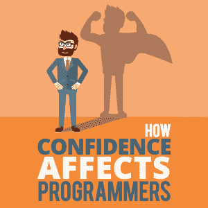

# 自信如何影响程序员

> 原文：<https://simpleprogrammer.com/confidence-for-programmers/>

In programming, we hear so much about what tech stack we need to learn or what the new hot technology is. What we do not talk about much is the mental health aspect behind how you can be a better programmer.

这就是我们将要在这里讨论的，也是我喜欢简单程序员的原因。我有机会从其他程序员那里听到一些我们在学校里不一定会学到的东西。

不管你是否意识到，自信程度每天都影响着你。见鬼，每一毫秒。你的想法因你的自信程度而异。根据你的自信程度，你决定采取的行动是完全不同的。例如，如果你对自己有信心，你将自己视为团队一员的方式就会不同。你不会害怕别人在你不在的时候说什么，或者他们会怎么看你。但是如果你不自信，你可能会浪费很多时间和精力去怀疑自己是否能适应。

今天，你将学习什么是自信，自信的不同程度对你的程序员生涯是好是坏，以及对自己最大的自信是多少。

## 什么是自信？

我们总是听说自信，但它不是你可以实际握在手里或看得见的东西。那到底是什么呢？

从谷歌的定义服务来看，信心是:

> 可以依靠某人或某物的感觉或信念；坚定的信任。

当你能真正相信某事时，信心就存在了。那可能是你预见会发生的事情。例如，如果你确信今晚会下雨，那么你就坚定地或真正地相信今晚会下雨。(现在，即使是气象学家也会搞错这一点，所以我非常怀疑你的信心，但这不是重点。)

如果你对某件事没有信心，那么你就不会真的相信它会发生。所以，离开可笑的天气例子，如果你没有信心今晚会下雨，那么你也不确定不会下雨。(然而，这并不影响是否下雨，因为这是你对自己的信念，而不是事实。)

但是足够的天气预报。这里要讨论的重要的一点是，作为一名程序员，你的自信是如何影响你的。简而言之，自信会影响你对自我的认识和你的能力。很简单，对吧？

这个定义和概念很容易理解，但是自信对你的影响是非常深远的。

## 作为程序员缺乏自信

当你对自己没有信心时会发生什么？让我们先来看一个例子。

David 是初级职位的程序员(就上下文而言，他已经在那个职位上干了五年了)。他在找一份新工作，这样他就能赚更多的钱。他开始申请新的工作，但他只申请初级职位。

他这样做的原因是因为他对自己的技术能力缺乏信心，并且认为现在不是他晋升到高级职位的时候。他申请了他大材小用的工作，他们雇佣了他，因为公司可以用初级工程师的价格得到一个大材小用的人。

There are a couple things to take away here. Although David has the experience to warrant a much higher salary, he is still going to be making the same money he was making at his old position. On top of that, he’s actually limiting his learning capability by not striving to go for a senior position, one that takes more responsibility. His confidence and self worth levels also never increase because he is always in junior positions.

这只是缺乏自信会伤害你的一个例子。没有足够信心的影响可能不止于此。

如果你在求职面试中不自信，你甚至会失去获得一份新工作的机会。

不自信会让你不相信你自己的设计或需求决定，从而让你设计出没人用的劣质产品。

这个清单还在继续。

对自己和自己的能力缺乏信心会阻碍你进步，成为一名伟大的程序员。(如果你正与缺乏自信作斗争，我写的这篇关于如何变得自信的文章可能会在短期内帮助你。)

## 作为程序员太自信了

现在，硬币的另一面是过于自信。这种伤害和缺乏信心一样大，但方式不同。这是另一个例子。

Veronica 是一名 23 岁的高级程序员。由于她非凡的技能，她晋升得很快。Veronica 现在面临着产品的设计决策。因为她相信自己是一个编程神童，所以她在没有咨询任何人的情况下，为这个每天将有 250 万人使用的产品做出了一个巨大的设计决定。

当客户发现维罗妮卡做了这个决定时，他们对她没有咨询他们感到非常愤怒。他们决定让她的整个团队退出这个项目。

维罗妮卡哪里出问题了？也许是别人对她的评价冲昏了她的头脑，或者是她之前的成功让她变得不那么谦逊了。这导致她过于自信，最终让她和她的团队失去了与该客户的未来。通常，工程师会咨询客户的需求，而不是自己做决定。

这样做并不意味着工程师不自信。一个过于自信的人很难看到从别人那里获得投入的好处。

许多人都在与过于自信作斗争。他们缺少谦虚的能力，也没有意识到自己也会犯错，所以他们倾向于不与他人商量就做决定。但这导致决策在背后咬他们一口。

如果你是一个在太多自信中挣扎的人，Ryan Holiday 的[“自我是敌人”](https://amzn.to/2LtES60)会给你很大的帮助。

## 只要对自己有足够的信心

现在已经很清楚自信太多是危险的，而缺乏自信会伤害你，那么什么是足够的自信呢？

有几件事你需要考虑。首先是你对某一特定主题的技能水平。如果你是在这个领域有 10 年以上经验的专家，那么当你对某件事有预感时，你应该感到自信。但是如果你只有不到一年的经验，我会建议你咨询一下更有经验的人，这样你才能做出正确的决定。寻求帮助实际上是一种谦逊的表现，而不是自大。当你不寻求帮助的时候，你认为你是无所不知的，是完美的，其实没有人是完美的。当你表现完美却不可避免地失败时，人们将会失去对你的信任。

Another factor in determining the right amount of confidence is the [situation itself](https://simpleprogrammer.com/build-confidence-start-writing-code/). Have you analyzed all the facts properly? Did you double-check them? Are there underlying circumstances you are unaware of? Making sure you know the situation itself is key to being confident in the decision you are making. If you do not know much, then you definitely cannot be confident about it. On the other hand, if you have an in-depth amount of knowledge on that particular problem, then you can be confident about whatever solution you’ve come up with.

了解情况和你在这些情况下的经验水平可以帮助你判断你是过于自信还是不够自信。这种自信和谦逊之间的平衡体现了几个好的品质。自信和谦逊是相辅相成的。它们有助于卓越的领导力和聪明的冒险精神。你必须知道自己的缺点，并谦虚地承认它们，同时相信自己会根据来之不易的经验做出决定！

## 自信但要谦虚！

自信强调每个程序员的语言、思想和行为。

如果你能理解什么是自信，拥有太少或太多都不是一件好事，拥有足够的自信可以让你的职业生涯一飞冲天，那么你将领先于大多数选择坚持技术而不学习他们的情绪如何影响他们的未来的程序员。

通常，自信取决于你此刻的感受。当你不喜欢的时候，很难真正相信自己和自己的技术能力。把你的感觉放在一边并成为你能做到的最好的程序员是很难的。我的[书](https://amzn.to/2KVDdoq)涵盖了那个确切的主题，因为我个人甚至发现作为一名程序员很难找到情感的平衡。

令人惊讶的是，这种无形的技能会对你的职业产生如此真实而有形的影响。