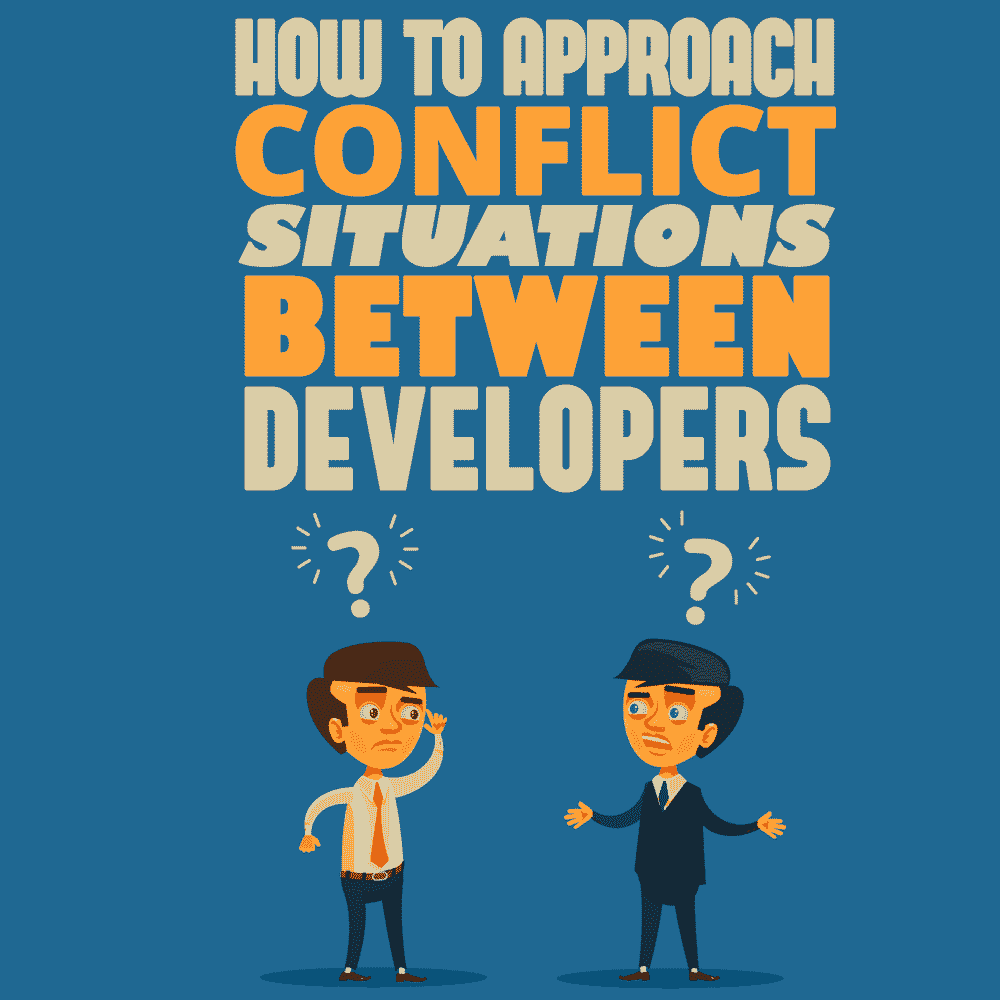

# 如何处理开发人员之间的冲突

> 原文：<https://simpleprogrammer.com/conflict-situations/>

<figure class="alignright is-resized">

</figure>

在 IT 行业，所有的产品都是团队开发的。团队的概念已经存在很长时间了，通常由至少几个团队成员和至少一个引导过程朝着正确方向发展的团队领导组成。在工作过程中有一个集体的团队焦点和提高生产力只是在团队中工作的两个好处。

然而，当多人在同一个项目上工作时，这就给同事之间的摩擦创造了很多机会。考虑到个性和观点的冲突，发生冲突是很自然的。虽然你无法控制同事的行为，但你绝对可以调整自己的行为，以最佳方式处理冲突，化解负面局面。

在我们继续讨论在争论的情况下做出反应的技巧之前，我们需要马上建立一些非常重要的东西:

#### 和平不是没有冲突，而是有能力以和平的方式处理冲突

罗纳德·里根

冲突可以表现为对产品应该如何开发有不同的看法。如果以尊重和开放的态度对待，你可以把它变成一个相互理解的挑战，并找到解决冲突的共同点。你会惊讶地发现，这反过来会给项目带来好处，产生意想不到的好结果。

所以，自动收费来捍卫你的立场肯定不会对你有任何好处。相反，对妥协持开放态度，这甚至会带来比你预期的更成功的项目。

此外，你也不想被人认为顽固、保守、难以共事。这最终可能会让你被排除在未来的决策讨论之外，并大大降低你在同事和上司眼中的职业价值。成为一个其观点因其价值而被考虑的人是一个你不想错过的无价的经历。

记住所有这些，以专业方式坚守阵地的关键在于理解不同类型的冲突、冲突的原因以及冲突背后的原因。

## 软件开发环境中的人际冲突

根据我在一家定制软件开发公司工作的经验，在团队中工作时，你可能会遇到一些不仅仅是令人讨厌的合作开发人员。

他们可能完全胜任自己的工作，但却无意中对同事不尊重。工作压力的增加和期限疲劳都可能成为人们不良行为模式出现的催化剂。

事实上，根据美国压力研究所发布的一项研究，工作场所压力的影响是如此难以应对，以至于 2%的参与研究的人承认曾经殴打过同事，29%的人承认曾经在工作场所对另一名员工大喊大叫。

当涉及到 it 行业时，人们通常期望开发人员专业并尊重与他们一起工作的其他团队成员。在许多情况下，当涉及到工作场所条件和处理此类事件的系统时，开发公司往往具有高于平均水平的标准。

然而，冲突仍然会发生——无论是在处理项目时的意见分歧，还是让压力影响他们的举止，仍然会有一些人表现不好。这就是为什么你需要准备好回应那些超越职业界限的人，不管他们是不是故意的。

### 处理被不尊重地接近

开发者之间发生冲突的[常见原因](https://simpleprogrammer.com/beauty-of-conflict)有很多。通常情况下，冲突产生于对哪种方法是最好的看法不一致。然而，有时这些冲突会突破专业意见分歧的界限，演变成人身攻击。

建设性的讨论和无礼的冲突之间的区别在于沟通的方式。如果这个人在挑战你的专业意见时很尊重你，那么这个考验可能会带来一个解决方案。

<figure class="alignright is-resized">

</figure>

然而，如果他们开始在个人层面上发表评论——针对你的专业能力和智力，甚至你的个人品质，而这些都与手头的话题无关——那么这个人很可能是因为其他不相关的原因对你发火。这可能是由于压力，或者他们甚至可能是故意寻找冲突。虽然后者比任何其他原因都更罕见，但当你与之打交道的人更具对抗性时，就会发生这种情况，因为他们将同事置于让他们看起来很糟糕的境地，从而在工作场所获得成功。

在这种情况下，最重要的是保持冷静和镇定。试图把谈话引回到主要问题上。询问以下问题:

*“你为什么觉得这种方法不合适？”*

或者

“你建议我们改做什么？”

或者

“你认为我们该如何改变解决方案，将它合并到代码和项目的其他部分？”

这样做可能会让他们大吃一惊——人们很少对人身攻击做出反应，提出问题来理解对方的立场。被吓了一跳，不尊重的人很快就会意识到他们的行为是多么不恰当，并将其修改为更专业。

冲突的一部分也可能来自于误解的地方。问这些问题可以让他们清除任何灰色地带和传达不当的信息。如果是这样的话，那么你有机会马上澄清任何错误的信息。

在这种方法无效的情况下，他们继续侮辱你或对你大喊大叫，你可以试着平静地告诉他们，他们对你说话的方式是不尊重和不专业的。你还可以补充说，如果他们想讨论他们认为更合适的方法，他们必须缓和语气，专注于手头的话题。你应该警告他们，如果他们不这样做，你必须向人力资源部报告他们的行为。

### 在全队面前被叫出来

[对你工作的反馈](https://simpleprogrammer.com/developers-personal-feedback/)应该总是被欣赏和接受——这是提高你的能力和成为一名更全面的专业人士的好方法。这不仅适用于来自管理层和更有经验的开发人员的反馈，也适用于相同专业水平的其他开发人员。

你可能会惊讶地听到一些你没有意识到自己正在做的事情阻碍了你的工作。或者你可能会发现他们可以建议一种更容易、更好或更快的方法来做事。这太棒了！

然而，有一件事是不被允许的，那就是在团队面前大声指责犯了错误的同事。如果这种情况发生在你身上，有几个可能的原因可以解释为什么有人会在专业环境中选择这种特殊的方法:

他们故意当众责骂你。有人认为羞辱你会把你推向正确的方向。在极少数情况下，他们可能会认为让你看起来很糟糕会在某种程度上促进他们自己的职业生涯。

最好的应对方式之一是保持冷静和不受影响。问他们是否想安排一次会议，如果他们认为有一些事情你需要讨论和改进，可以帮助团队前进。

如果这是为了避免冲突而发表的挑衅性言论，他们很可能不会接受你的提议，这样会显得不成熟和不专业，而不是让你看起来很糟糕。如果他们接受了你的会面邀请，冷静地听他们说完，然后根据手头的情况做出你认为合适的回应。

他们没有意识到他们让你处于一种不舒服的境地。我们都知道有些人说话有点太快。可能他们是想说这句话可以帮助你和你的工作，但却意外地选择了一个错误的方法，产生了相反的效果。

<figure class="alignright is-resized">

</figure>

如果是这样的话，当他们意识到他们的话是如何被理解的时候，你很可能会从他们的反应中发现这一点，或者你可以根据之前对他们与人交往的观察得到这一印象。

他们可能会脸红，或者表现出不舒服的迹象，或者把你拉到一边聊一会儿。有时，他们可能会为让你为难而道歉。其他时候，他们会简单地继续和你说话，但显然是以一种非侵略性的方式，似乎来自一个表明他们想帮助你把工作做得更好的地方。

如果是这样的话，那么最好对他们可能试图告诉你的事情保持开放的心态——你的工作可能会从中受益。通常情况下，这是来自那些试图提供帮助，但却以错误的方式处理问题的人。

他们试图私下和你谈过几次，但你没有承认或解决这个问题。这可能发生在变更对你自己和团队的工作流程很重要的情况下。如果你拖了团队的后腿，但没有尝试解决你这边的问题，可能他们觉得这是引起你注意并让你改变工作方式的唯一方法。在这种特殊的情况下，你不应该表现得像一个受害者，尤其是当他们的担忧是合理的或者你的管理团队也试图解决的时候。

不得不与公开质疑你工作质量的人打交道会让人非常苦恼。可以理解这会让你产生一系列的情绪——从悲伤到羞辱到愤怒。但是让你的情绪控制你的行为只会让你的同事质疑你的专业素养。

作为开发人员，你的逻辑思维和解决问题的方法是你性格的一部分。这是依靠你的技能的最好时机，在爆发之前尝试了解情况并迅速做出反应。

## 调整你的行为来处理冲突，不要让冲突升级

正如你所知，无论何时处理职业冲突，最重要的一条建议都相当简单: ***保持冷静，试着理解为什么对方会这样接近你。*** 做如下操作:

*   试着去听他们在说什么，把自己从他们的语气和方式中分离出来。
*   分析他们思考过程背后的原因——人们很少仅仅因为怨恨而变得粗鲁。
*   坚持自己的立场，不要争论和无礼——保持专业是摆脱冲突的最佳方式，不会损害你在团队面前的形象。

理解他们的动机将极大地帮助你走出困境，而不会损害你作为专业人士的形象。

大喊大叫、大发脾气、向其他同事抱怨应该是非常明显的反应*避免。*每一种反应都会让你看起来不成熟，无法接受批评和建议——是的，即使有人以错误、挑衅和不尊重的方式接近你，你仍然必须以专业的方式展示自己。

虽然你不能改变他人的行为，但你可以改变自己的行为。T3】

当其他开发人员甚至管理层在工作中咄咄逼人地接近你时，知道如何回应将有助于你与他们有更平静的互动。从长远来看，这将有助于你建立一种压力小得多的工作关系。