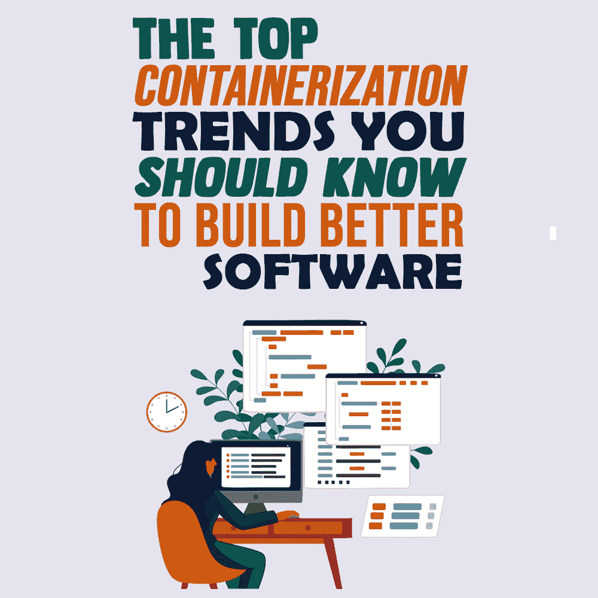
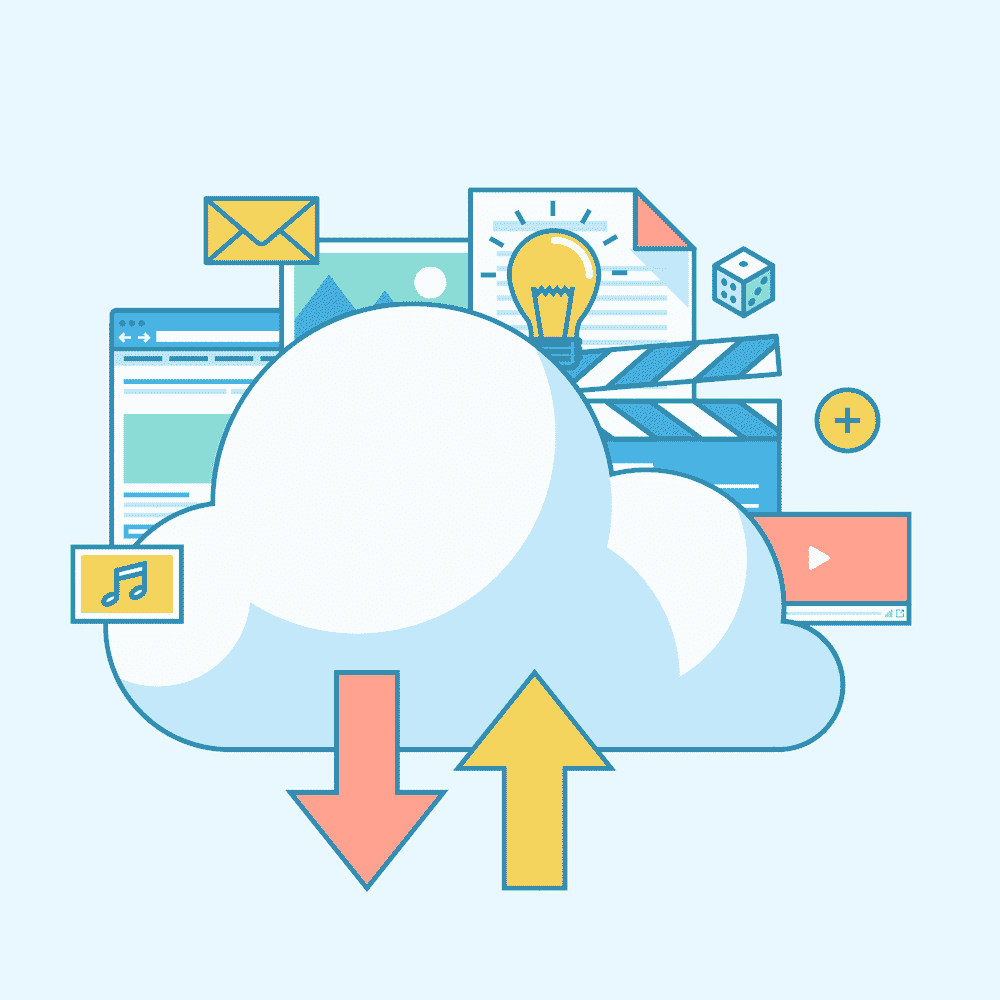

# 为了构建更好的软件，你应该知道的容器化趋势

> 原文：<https://simpleprogrammer.com/containerization-trends/>

The coronavirus pandemic has inspired many enterprises to accelerate the pace of their cloud migration and digital transformation. Thus, organizations and development teams are looking for ways to boost the productivity of their project development processes to launch cloud-native software in the market.

这种生产力的提升可以通过**容器**来实现！

在这篇文章中，我将向您展示最流行的容器化趋势，这些趋势将有助于开发人员更快、更高效地开发云原生应用程序。

然而，在检查这些趋势之前，了解什么是容器是很重要的。

## 什么是容器？

容器是软件包，由在任何环境中运行所需的所有组件组成。容器有助于虚拟化操作系统，以便在任何地方运行，从公共云到私有数据中心和开发人员的笔记本电脑。我们经常使用的应用程序如 YouTube 或搜索引擎如谷歌和微软 Edge 都是在容器中运行的。

此外，容器化使[开发人员](https://www.decipherzone.com/hire-developer)能够快速行动，部署软件，并以令人难以置信的水平运行。从技术上讲，容器是应用程序代码的轻量级包，以及它们的依赖项，例如运行软件中的服务所需的运行时和编程语言库。

容器使得在操作系统级别共享中央处理器(CPU)、网络资源和存储变得容易，从而提供了一个合理的打包设备，应用程序可以从运行它们的环境中抽象出来。

Gartner 预测，到 2022 年，75%的全球组织将在为其业务制作软件时运行容器化应用程序，相比之下，目前这一比例不到 30%。因此，可以毫不夸张地说，容器和微服务是我们行业正在经历的数字化转型背后的驱动力。

现在，是时候揭示作为开发人员应该了解的趋势了。

## 集装箱化的主要趋势

紧跟潮流可能会让人不知所措。然而，不知道哪种开发技术将成为潮流会导致技能过时，无论你是自由职业者还是全职员工，这都可能成为你职业发展的障碍。因此，为了避免任何后果，让我们来看看今年的集装箱化趋势。

### 技术

Kubernetes 是一个开源的、广泛的、可移植的平台，用于容器化的工作负载和服务。它促进了扩展、管理和部署的自动化。根据[CNCF 2020 年调查报告](https://www.cncf.io/wp-content/uploads/2020/11/CNCF_Survey_Report_2020.pdf)，83%的调查受访者(来自全球云原生社区)在生产中使用 Kubernetes。

Kubernetes 已经存在了六年多，但现在它比以往任何时候都更受欢迎，因为它提供了跨集群中几个服务器的容器伸缩、高容错性、内置数据加密以及跨不同平台的更好的软件可移植性。

此外，它还提供自我修复、存储协调、负载平衡、自动装箱、分配状态以及敏感信息和配置管理。Kubernetes 接口将额外管理基本的云和边缘功能。它还将增强和标准化边缘产品，以加快 5G 和物联网(IoT)中的容器应用实施。

### 集装箱服务网

对于无缝的服务到服务通信和网络流量管理，服务网格充当抽象层。它将自己附加到微服务架构中的所有服务，而无需修改代码。根据 CNCF 的报告，超过 27%的全球云原生社区在生产中使用服务网格，使其在容器化趋势中占据一席之地。

您可以将它与 HTTP、REST、HTTP/2 和其他协议集成在一起。服务网格自动应用相互 TLS 来保护和验证驻留在容器中的服务之间的通信。由于它拦截微服务的每个出站和入站呼叫，因此它可以提供无与伦比的网络可见性，以获得深入的见解。

### IT 运营人工智能(AIOps)

AIOps 是一种人工智能应用程序，使用大数据、机器学习和分析来增强 IT 运营。根据[报告](https://www.mordorintelligence.com/industry-reports/aiops-market)，2020 年 AIOps 市场价值为 135.1 亿美元，预计到 2026 年将达到 409.1 亿美元。

它提供了对整个环境中性能数据和依赖关系的深入了解。有了 AIOps，分析数据是否变慢或停机变得更加容易。除此之外，它会自动提醒团队有关问题、其原因和解决方案的信息，因此可以与 Kubernetes 一起使用来确认问题并找到其根本原因。

集装箱化行业 AIOps 趋势背后的核心原因是它能够以稳定的正常运行时间和效率处理不断增长的数据浪潮。此外，它还提供了数据的智能聚类，以识别未来可能导致问题的模式。

### 快速云边缘集成

随着物联网，5G，或者直播的发展，更多的计算业务和力量正在下沉数据源，以获得良好的响应时间和更少的成本。作为云计算的延伸，边缘计算将广泛应用于混合云场景，这些场景需要具有自主边缘设施、边缘云托管和去中心化的基础设施。

云端保留了云原生管理和丰富的产品能力，并通过云管理通道下沉到边缘，导致海量的边缘节点转化为云原生系统的工作负载。

### 云原生应用的高度自动化

Because of Kubernetes final state concept, cloud-native architecture now enables high automation. While developing cloud-native applications, the automation facility can be fully utilized to track the number of replicas, error retry, version consistency, and asynchronous event-driven.

为应用程序构建自动化的云原生基础架构是 2021 年要探索的主要因素之一，因为它可以降低每处理一个集装箱的成本。它提高了港口作业的一致性、可靠性、安全性和可预测性。此外，它不仅可以自动化应用部署或运营管理，还可以自动化风险控制和预防，同时为运营商提供自动化运行时间。

### 数据转换

数据一直是每个行业必不可少的一部分。数据转换是通过提取加载转换(ELT)将数据从一种格式转换为另一种格式的过程，提供了关于变量的更好的见解并提高了互操作性。

云原生技术还将推动数据驱动的应用程序支持数字化智能 IT 转型。将高性能计算应用和传统大数据迁移到 Kubernetes 是云原生社区面临的一个问题。由 Docker 和 Kubernetes 开发的云原生人工智能可以在未来提供一些缓解。

Kubernetes 的灵活框架、容量调度和批处理调度正在为数据转换期间的资源调度而实现。此外，Kubernetes 集群使用基于容器和插件的调度策略来支持 GPU 资源共享和调度。

此外，弹性数据任务的新场景以及人工智能和大数据的统一云原生基础将用于容器化。

### 使用容器的物联网激增

我们知道， [IoT](https://simpleprogrammer.com/build-iot-projects/) 涉及多个智能设备的使用。它们之间共享的数据数量巨大，在数据存储和分析的处理和管理方面带来了挑战。

然而，随着容器和云原生基础设施的使用，这种巨大的数据量可以得到管理，因为容器在边缘设备上提供了轻量级的功能。容器通过其更低的延迟、更高的可扩展性和更低的网络成本，使您能够从边缘生态系统中的任何位置管理任何工作负载。

由于操作系统虚拟化，使用容器实现物联网激增已经成为一种趋势，因为它是轻量级和敏捷的。此外，使用容器支持数据处理，以及对用户的服务可用性。这里的核心目标是在访问数据和利用带宽的同时获得更快的速度。

### CI/CD 的集装箱图像扫描

容器扫描现在已经成为一种不可或缺的“左移”策略(一种在早期软件交付过程中发现和防止错误的实践)来扫描和分析 DevOps 过程中的容器图像。

根据 [Sysdig 报告](https://www.forbes.com/sites/janakirammsv/2021/01/18/5-interesting-trends-from-sysdig-2021-container-security-and-usage-report/?sh=578dea806e18)，74%的开发人员在预部署时扫描构建的映像，以识别潜在风险。此外，大约 66%的集装箱扫描图像已经集成到其持续集成和持续开发(CI/CD)管道中，以确保应用程序的安全性。

容器扫描有助于利用应用程序开发行业中的安全性，因为它能够识别威胁并在早期阶段加以利用。

## 引领这些趋势

容器化是一项重要的技术，它使软件部署和开发发生了革命性的变化。在未来几年，由于其前所未有的潜力和优势，容器的采用将会显著增加。

这些顶级趋势，如 Kubernetes、物联网激增、高度自动化、数据转换等，将帮助您获得专业技能优势，同时保持竞争优势。请记住，从您觉得更容易的技术开始，然后逐步推进其他技术。