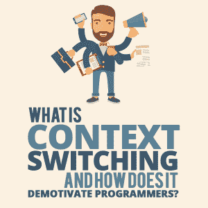

# 什么是上下文切换，它如何挫伤程序员的积极性？

> 原文：<https://simpleprogrammer.com/context-switching/>

Many good articles and blog posts have been written on how to keep yourself motivated as a software developer. Simple Programmer alone has [many](https://simpleprogrammer.com/?s=motivation).

不同的作者提出了各种有效的技术，从将编码实践变成游戏到提醒自己工作很重要的 T2。

但是正如一些技巧和环境可以激励我们一样，也有一些我们经常做的事情会让自己失去动力。除非我们停止做那些让我们失去动力的事情，否则那些旨在激励我们的方法就不会那么有效。

问题是:虽然激励行动需要有意识地实施，但主动扼杀动机的行动往往是不假思索地完成的。

在编程世界中，最大的(如果不是最大的)破坏动机的活动之一是多任务处理，或者说是它的一个特殊方面:上下文切换。

## 什么是上下文切换？

纯粹的多任务处理是不存在的。同时完成两项具有精神挑战性的任务是不可能的。因此，当我们进行多任务处理时，我们真正做的是不断地从一项任务切换到另一项任务。这就是语境切换。

这个术语来源于[计算机科学](https://whatis.techtarget.com/definition/context-switch)。然而，它同样适用于人类执行的脑力任务。毕竟，人类的大脑在许多方面都类似于 CPU。

就像运行多线程进程的 CPU 在运行另一个线程的同时临时暂停一个给定线程的执行一样，人类的思维也会暂停一个任务，以便将注意力转移到另一个任务上。

## 为什么上下文切换这么糟糕？

正如 Scott Hanselman [曾经说过的那样](https://www.hanselman.com/blog/ScottHanselmansCompleteListOfProductivityTips.aspx):“任何系统中线程的最佳数量是一个线程。”

Hanselman 在微软的领导地位是众所周知的，但他也写代码和博客，教编程，并周游世界发表演讲。由于他经常做这么多不同的事情，没有一件是容易的，你会认为他做了很多事情。他不知道。

相反，他所做的是在一天中安排一些时间，让他能够最大限度地专注于一项任务。当他和家人在一起时，他也不做与工作相关的事情，他强烈主张当你感到不知所措时，对任务说不，而不要有负罪感。

上下文切换不好的关键原因是因为[进入焦点需要时间和精力](http://www.progressyourprofits.com/productivity/stop-feeling-tired-get-more-done.html)。所以每次我们转换任务时，我们都会失去能量，如果我们只是停留在一个任务上，我们就不会失去能量。所有这些能量损失造成的疲劳会严重挫伤我们的积极性，并可能导致精神枯竭。

这也是程序员经常在完成工作时感到筋疲力尽的原因，即使他们当天没有做任何非常困难的事情。他们归咎于睡眠不足、不健康的饮食、过多的咖啡因或其他因素。这些因素中的任何一个都会导致疲劳，但是不断转移注意力会导致疲劳[很多](https://qz.com/722661/neuroscientists-say-multitasking-literally-drains-the-energy-reserves-of-your-brain/)。

疲劳不是上下文切换产生的唯一问题。生产率也受到了影响。

为了完成一项精神上具有挑战性的任务，比如在最佳水平上编程，一个人需要达到[一种流畅的状态](https://positivepsychologyprogram.com/mihaly-csikszentmihalyi-father-of-flow/)，在那里完全专注于一项活动。这并不容易。T2 周围的普通人需要不间断工作 15 分钟才能达到这种状态。

一个反复分心或不断试图同时完成几项任务的人不太可能达到这种高效的精神状态，即使是在一个典型的工作日。因此，他们很可能被那些已经学会掌握专注艺术的人超越。

## 消费技术并没有让它变得容易

Getting distracted by technology is one of the most common types of context switching. This includes habitually checking your phone, visiting social media, or reacting to any notifications from any of your devices.

让这种习惯变得普遍且难以改变的是这样一个事实:消费技术已经被故意设计成让人上瘾。这样做主要是为了让用户继续访问内容，这样他们就能尽可能多地发现商业内容。

像[无限滚动](https://www.psychologytoday.com/gb/blog/automatic-you/201208/infinite-scroll-the-webs-slot-machine)和未决消息动画这样的功能是专门为吸引用户而设计的。这两个都是强 T2 多巴胺触发 T3 的例子。

多巴胺是期待的主要荷尔蒙，因此，它能够对人产生强烈的吸引力。因此，一旦我们被社交媒体分散了注意力，我们就很难再回到富有成效的任务上。

不管你的工作有多充实和有趣，它仍然包括需要你努力保持专注的活动。而且浏览社交媒体根本不需要努力。因此，当你陷入检查你的饲料的诱惑时，你会经历一次疲劳，当你不得不将你的注意力从一个容易上瘾的任务切换回一个比较困难和无趣的任务时，你会经历额外的疲劳。

所以，当你从事一项富有成效的任务时，抵制检查手机的诱惑:一旦你屈服于诱惑，这将比切换回富有成效的任务更容易。

最后，无论你在开始工作前感觉多么有动力和驱动力，所有这些强大的多巴胺触发器都会让你的工作看起来非常枯燥。这肯定会大大减少，甚至完全扼杀你的任何动力。

## 适得其反的生产力黑客

还有另一种类型的活动，表面上看起来非常高效，但实际上是一种消极因素:在等待外部流程完成的同时，执行一些高效但与当前任务无关的活动。

例如，代码通常需要一段时间来编译，尤其是当使用持续集成系统时。因此，开发人员可能会利用这段时间阅读编程博客，实践新技术，或者花一些精力来修复系统不同部分的错误。

但是，和以前一样，程序员也在进行上下文切换，即使他们目前对自己的主要任务无能为力。在构建不超过半小时就能完成的情况下尤其如此，这意味着他们必须在完成其他任务的任何有意义的工作之前切换回原始任务。

一旦代码编译完成，启动该过程的程序员将需要切换回应用程序的该部分。所以程序员不可能在切换回前一个任务之前完全沉浸在另一个任务中。

这样做的缺点是显而易见的。如果另一项任务涉及阅读技术文章或文档，很可能不会保留太多信息。如果它与系统的不同部分相关，它很可能会留下不完整的部分，使得以后更难找到。

每当你转换任务时，这些问题发生的可能性就会变大，因为每一个迫使你改变注意力的活动都会降低你的精神能量。

精神疲惫是一种不愉快的感觉，如果你经历得太频繁，你最终会开始将它与成为程序员联系起来，这将使你失去工作的动力。所以，不管你一开始对编程有多么强烈的热情，如果你试图过度优化你的工作，几年后可能就什么都没有了。

因此，尽管以这种方式利用空闲时间看起来很有效率，但事实往往并非如此。你不仅不太可能以最好的方式完成所有的任务，而且还可能完全扼杀你的动力。

## 如何停止上下文切换

So what do we do with our downtime? When you come to a point in your work where you have to wait before continuing with your current task, you can still remain in the state of flow.

你可以将等待的时间用于计划当前任务的后续步骤。由于时间不够，程序员通常不会做足够多的计划，但是适当的计划比仅仅在 T2 的基础上构建一个原型要好很多。

当你可以继续你的主要任务时，你会对下一步做什么有一个清晰的想法。不同类型的活动之间的切换将是渐进的，更加自然。

你可以在不打破心流状态的情况下做的另一件富有成效的事情是做一些与你正在工作的系统部分直接相关的学习。

例如，您可能有一些[异步代码](https://stackify.com/when-to-use-asynchronous-programming/)要处理。如果你对它的工作原理只有模糊的理解，这将是更新你知识的好时机。这同样适用于您正在使用的任何其他技术或编程语言特性。

## 训练你的思维

尽管当你被技术包围时不被分散注意力是很难的，但有许多可靠的方法来防止它。

一个[经过充分研究的](https://positivepsychologyprogram.com/benefits-of-mindfulness/)，长期的解决方案是正念，这是一种精神上完全处于当下的能力，也是一系列有助于达到这种状态的练习。从短期来看，正念可能不会带来任何好处，甚至会显得乏味。然而，如果经常练习，它最终会训练你的思维，并帮助你拒绝任何分散注意力或无益的想法。

虽然正念经常与冥想联系在一起，但这两件事并不一定相同。任何让自己坚定地[处于当下](http://www.fulfillmentdaily.com/why-mindfulness-is-more-than-just-meditation/)的活动都是正念，对于不喜欢在一个地方坐 20 分钟同时注意自己呼吸的人来说，可能包括跑步、游泳或演奏乐器。冥想恰好是练习正念的最纯粹和研究最多的方式。

一旦你的头脑足够自律，你将能够轻松进入心流状态，进行[深度工作](https://medium.com/@kulykdenys/deep-work-and-meaningful-productivity-23a172c21689)，在那里你可以连续几个小时保持专注。

在短期内，番茄工作法是可以有效利用的。该方法包括在一段时间内纯粹执行与工作相关的任务，然后在开始下一轮之前休息一会儿。

当你知道你只需要在相对较短的一段时间内集中注意力，然后就能做一些有趣的事情时，就更容易不分心了。

实际的持续时间因你询问的对象而异。有人说 20 分钟的工作间隔加上 10 分钟的休息时间效果最好，而其他人会告诉你 50 分钟的工作间隔加上 15 分钟的休息时间对他们来说更好。

我个人认为一小时的工作间隔和 15 分钟的休息时间最适合我。通过反复试验找出适合你的方法是个好主意。

关于番茄工作法要注意的一点是，虽然这个想法是在设定的时间间隔内不要分心，但它仍可能不时发生。为了使这项技术有效，你可以记录下每一轮你分心的次数。

What gets measured gets improved, so you may find that over time the numbers will go down to zero and stay there. This is one of the things Scott Hanselman [suggested](https://www.hanselman.com/blog/ScottHanselmansCompleteListOfProductivityTips.aspx), and it’s worked for me.

## 从你的生活中摆脱上下文切换

我们讨论了当你在工作时，环境转换是如何对生产力、能量水平和动力产生不利影响的，以及如何将它最小化。好消息是，同样的原则也可以应用到你生活的其他领域。

上下文切换会耗尽你的精力，不管它应用在什么样的上下文中。随着你生活中环境转换的次数减少，你的生活满意度会上升。

第一步是在你自然的活动过程中尽量减少被打断的次数。之后，你可以养成习惯，在不同的活动之间逐渐过渡，而不是盲目地跟随无关但重要的任务清单。

我们程序员擅长构建软件。但是为自己建立一个充实的生活怎么样？也许以一种所有活动都自然流动的方式规划你的工作生活是一个好的开始。