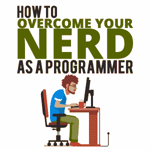
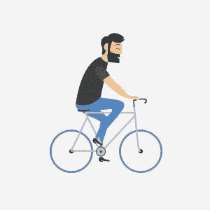
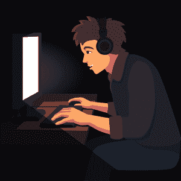

# 如何克服自己程序员的书呆子身份

> 原文：<https://simpleprogrammer.com/cool-programmer/>

Stereotypes can be a damning thing to overcome, regardless of how old you are or what position you hold in life. Of course, as a programmer, this is probably something you know quite well. From the first moment people find out that you work with computers and coding, they instantly begin to form an opinion. Unfortunately, this isn’t always a flattering one.

这是因为大多数人认为程序员是书呆子。因此，尽管他们确实欣赏你的智慧，但这也意味着你会被归为社交笨拙、无聊、偏执、不时尚甚至古怪等形容词。现在，说“棍子和石头”很容易，但事实是，在一定程度上，别人如何看待你很重要。这些观点通常决定了你将获得的工作类型，甚至决定了你将建立的人际关系类型。

还有一个事实是，大多数程序员的刻板印象确实源于一个真理的核心——正如这个[科学研究](https://digest.bps.org.uk/2015/10/26/the-surprising-truth-about-which-personality-traits-do-and-dont-correlate-with-computer-programming-skills/)所示。科学家们深入研究了与程序员相关和不相关的性格特征，以观察“书呆子”的刻板印象是否成立。他们发现智力和编程之间存在关联。简而言之，你越聪明，你就会成为越好的程序员。自然，和大多数事情一样，聪明是有代价的。同一项研究还表明，智力较高的程序员也更可能内向。

你可以想象，如果你倾向于喜欢自己的公司或者摆弄各种系统和代码，人们很可能会简单地给你贴上书呆子的标签。然而，有趣的是，这项研究也证明了当涉及到神经质和令人讨厌的特质时，程序员的得分不会高于平均水平。这证明了程序员-书呆子的刻板印象通常就是这样。

显然，你不能把这项研究打印出来，在你遇到的所有人面前挥舞。这不仅会很奇怪，而且会强化你的书呆子形象。不管是好是坏，行动往往比语言更响亮。因此，如果你想让别人对你刮目相看，你需要重塑自己。下面，你会找到你需要的技巧和工具。

## 注意你的健康

你可能想知道这个话题和你的书呆子身份有什么关系。让我们停下来讨论一下大多数人眼中的程序员在做什么。很有可能很多人会想象你在一个黑暗的房间里度过一天，每天 16 个小时弓着背坐在电脑前，喝着咖啡，吃着奇多。

其中一些想法可能是错误的，但也很有可能其他人在金钱上是正确的。所以，问问你自己你的饮食习惯有多健康。你每天锻炼多少？最后但同样重要的是，当你在电脑前工作时，你的姿势是什么样的？如果你不喜欢你得出的答案，那么你需要做出一些认真的改变。

当你注意自己的健康时，你也会变得更好看。你可能会开始减肥，你的皮肤会变干净，你的周围会充满健康的光芒。好消息是，变得精力充沛实际上很容易；这并不一定很有趣。记住这一点，让我们开始做你需要做的事情:

### 开始多喝水

尽量每天至少喝半加仑的水。如果这听起来不可能，试着用一杯水代替你的一些含咖啡因或含糖饮料。你的身体以后会感谢你的。

### 改善你的饮食

The main step you need to take is to cut out foods that contain additives or preservatives, as these aren’t doing your health any favors. Slowly introduce more fresh vegetables and lean meats into your meals and try to add flavor with herbs, spices, and other healthy ingredients. Don’t worry if this isn’t something you can’t get on board with right away. The main thing is that you try.

你可能还想尝试更多的在家烹饪，因为这能让你更好地控制食物的添加量。因此，你会发现少吃盐、脂肪和其他对你不好的成分会更容易。同时，你也可以确保每天摄入适量的健康食物。

### 多锻炼

心脏病、癌症、血栓和维生素 D 缺乏症有什么共同点？这些疾病更有可能影响程序员，因为他们过着久坐不动的生活方式。如果你没有得到大量的锻炼，这是你需要立即改变的。你应该每天至少锻炼 30 分钟，每周三到四次。

当然，这并不意味着你必须去健身房举重。然而，你需要做一些身体活动，比如瑜伽、徒步旅行、游泳、跑步或任何你觉得有吸引力的运动。如果你真的想减肥或增肥，去健身房真的很有帮助，尤其是在私人教练的帮助下。没有比被撕裂更好的方式来摆脱书呆子的刻板印象了——这也适用于女程序员。

### 坐直

你需要努力的最后一件事是你的姿势。你现在必须停止弯腰驼背。保持肩膀向后，脊柱挺直。为了让这变得简单一点，试着购买符合人体工程学的家具，因为它会让你有一个更健康的姿势。同时，如果你能做到的话，试着经常站着工作。

我们已经说过，非程序员对程序员和开发人员有一定的了解。基本上，他们认为你就像一盆放在地下室太久的盆栽植物——苍白而多病。然而，通过掌控你的健康，你可以改变这一切。

因此，当人们遇到一个容光焕发、肌肉结实、镇定自若的人时，他们不会认为你是书呆子。他们会把你看作是一个足够尊重自己，可以自我照顾的人。反过来，他们会从你身上得到启示，以一种更好的、非书呆子的眼光看待你。

## 培养时尚感

让我们花点时间感谢比尔·盖茨、马克·扎克伯格和其他所有穿着糟糕的科技偶像，他们确保程序员永远不会被视为时尚。至少在这十年里不会。不过，这种刻板印象还是有一定道理的。再说一次，这其实不是你的错。

关于程序员时尚的事情是，它就像任何其他类型的风格趋势一样——人们从高层那里得到暗示。因此，当扎克伯格作为新的技术继承人出现，穿着连帽衫，穿着人字拖，留着随意的发型时，一股热潮就诞生了。每一个科技男女，尤其是那些在硅谷的人，都认为如果他们想走得更远，就需要看起来像这样。然后，媒体得到了这个，嗯…剩下的就是历史了。程序员的时髦被巩固了，它并不漂亮。

这给我们带来了如何改变男性和女性程序员的这种看法。毫无疑问，首先要培养一种时尚感。由于不是每个人都有时尚意识，这可能有点困难。

让我们从基础开始。要记住的关键是，你不必扔掉所有你喜欢的衣服。你甚至不需要停止穿它们。然而，如果你要去一个你主要会遇到非程序员或非开发人员的环境，你将需要加强你的风格游戏。

成为一个衣着光鲜的程序员的秘密，尤其是如果你已经超过 30 岁，就是凝聚力。这意味着你需要注意如何搭配你的衣服。因此，在选择衣服时，预测特定的图案、印花和颜色如何搭配是很重要的。虽然你不需要总是匹配，但要把注意力放在互补的部分，而不是那些互相冲突的部分。

Let’s talk about how you can put this into practice. The first thing to get out of the way is colors, as these can be quite tricky. If you really can’t seem to understand how colors look together, sticking with neutrals like black, white, gray, and navy blue is probably a good idea. These can be mixed and matched pretty easily and don’t really look out of place together. To spice things up a bit, add just one other color to your outfit in the form of a tie, a belt, a blazer, or shoes.

然后，还有模式的问题。这通常是女性程序员更需要担心的事情，因为女性版块有更多的风格选择。这里的关键是始终[保持你的模式精简](https://www.independent.co.uk/life-style/fashion/prints-patterns-how-to-wear-fashion-guide-stripes-spots-florals-a8494561.html)。因此，尽管圆点、条纹、花卉甚至动物图案都是可以接受的，但记得搭配中性配饰，以免看起来过于花哨。例如，如果你穿了一条条纹裤子或一条圆点的裙子，用一件中性上衣来平衡一下。

现在，我们来谈谈头发。不可否认，在时髦的地方理发确实会让你的钱包缩水。更不用说，如果你不确定什么适合你，那会很可怕。不过，最好还是去一家你能负担得起的好沙龙。向时尚的朋友、同事或家人寻求建议。

说真的，一个漂亮的发型可以完全改变你的形象，当然也会改变人们对你的态度。这是因为你的发型通常反映了你愿意为自己的外表付出多少努力。所以，如果你剪了一个适合你的发型，看起来很现代，那将会很有帮助。

最后，让我们来看看眼镜。不，这不是刻板印象。据估计，十分之六的人戴眼镜，所以你很有可能也属于这一人群。作为一名程序员，你可能已经注意到其他程序员喜欢厚框眼镜，这已经成为许多人的主食。如果这适合你，那么，你一定要继续下去。

如果不合适，你需要找一双适合你脸型和大小的。毕竟，你的眼镜会在一天的大部分时间里遮住你的脸，这意味着这是人们最先注意到你的地方。因此，确保你选择一个讨人喜欢的设计确实是值得的。

好了，现在你知道应该怎么穿了。不过，如果时尚真的不是你的强项，那你就没有努力的理由了。让我们来分解一下，这样你就能更好地理解为什么穿着打扮给人留下深刻印象如此重要。

关于人类，要理解的最重要的事情是，尽管我们的技术进步了，我们仍然是最基本的生物。这就是为什么大多数人依赖一种过时的策略，即在与人见面时做出仓促决定。例如，[一项研究表明](https://www.sciencedirect.com/science/article/abs/pii/S0092656612000608)人们能够仅仅根据他们的鞋子对一个人做出判断。

也许这个实验更令人不安的是，大量的参与者实际上做出了准确的结论。可能正因为如此，你遇到的大多数人会继续以这种方式评价你。如果你想被视为自信、善于交际和成功，你需要开始打扮自己。

然而，有趣的是，时尚不仅仅会影响你遇到的人对你的印象。当你开始穿得漂亮时，你可能会开始以更积极的态度看待自己。多项学术研究都指出了同一个问题:当你在穿着上更加努力时，你会引发更高层次的思考。

如你所见，改进你的风格是一个双赢的局面。一方面，你会影响陌生人对你的评价，对你更好。同时，你也会增强自己的信心。

## 克服你的书呆子心态

If people say something about you often, there is a good chance that you will start believing it, too. This means that if a lot of people call you a nerd, you’ll probably start acting like one. The result of this may be that over the years, you have become shy, quiet, and don’t really call attention to yourself. This is what is known as a self-fulfilling prophecy. So, let’s talk a bit about how you can change this.

关于这篇文章，你首先应该明白的是，它是关于改变别人对你的看法。这并不意味着你必须改变你的为人。你可能会问，为什么不呢？好吧，说到底，做个书呆子也没什么不好。事实上，这是一件很棒的事情。

当你想到世界上一些最著名的书呆子时，你会不由自主地想起这些人改变了世界。他们以他们的书呆子气被完全接受而在历史上留下了他们的印记。你也一样，你的每一个想法和你写的每一行代码都产生了明显的影响。

看吧，书呆子只有在别人也这么认为的时候才会变成一件坏事。有些事情被社会简单地认为是“不好的”,出于这样或那样的原因，这些特征中的一些被归因于书呆子。这就是为什么你的目标不应该是不再是一个书呆子。相反，你需要改变别人对成为一个书呆子意味着什么的看法。

是的，在一定程度上，这样做意味着以不同的方式接近人们。这就是为什么你应该改变你的穿着和外表来适应这个场合。然而，还有一步要走，这可能是最重要的一步。你现在需要做的是树立信心。

如果拥有自己的书呆子身份是第一步，那么下一步就是在这种新获得的自信的基础上建立自信。看，是你对自己的自信会让人们注意到你，是这种沉着会让你踏入所有正确的大门。

如果你是内向的，就像一些程序员倾向于那样，这甚至会让你感到害怕。这就是为什么你应该采取假装的策略，直到你成功。一项基于证据的研究表明，重要的是你处理问题的方式，而不是你在社交场合有多好。因此，如果你假装自信，人们通常会从表面上相信你。

做到这一点的一个方法是改进你开始和进行对话的方式。大多数人会根据非常有限的信息和线索对你做出判断。所以，通过保持轻松有趣的对话，充分利用你和新认识的人在一起的时间。

因为在这种情况下很容易变得紧张，所以试着想办法提前做好准备。例如，如果你已经计划好了一些话题，你可能会更自在地和一个陌生人说话。或者，你可以用一个一般性的笑话来打破僵局。这是关于选择一条你感觉最能控制环境的路线。

这里的要点是展现自信，尤其是第一次见人的时候。大步走向他们，坚定地和他们握手，进行适当的眼神交流，保持镇定。随着时间的推移，人们将不会记得你以前“书呆子”的样子，而会开始把你当成今天的你。

## 同样的你，新形象:最后一句话

当你看到这篇文章中所有的建议时，感到不知所措是很自然的。做出如此多的改变会让人感到害怕，甚至感觉你在背叛自己。没必要担心这个，因为这不是所有这些指针的目的。这篇文章的全部目的是向你展示当你遇到非程序员时，如何给你最好的印象。

For instance, have you ever felt slighted at a job interview or meeting because people didn’t take you seriously enough? Or, maybe you have always been reluctant to ask out a guy or girl who doesn’t fall within your immediate social group. Perhaps it is as simple as being tired of being the butt of everyone’s jokes.

如果你正在寻找一种方法来改变你的生活而不改变你是谁，那么这里所有的信息都会帮助你。有了这个指南，你将能够在外表、穿着和行为上扮演一个需要尊重的人。所以，将来当人们见到你时，他们会看到你希望他们看到的那个人，而不是他们头脑中已经形成的刻板印象。

最后一点，学徒们，你们被教得很好。唯一留给你去做的事情就是将这些课程具体化，勇往直前，征服世界。你能行的。