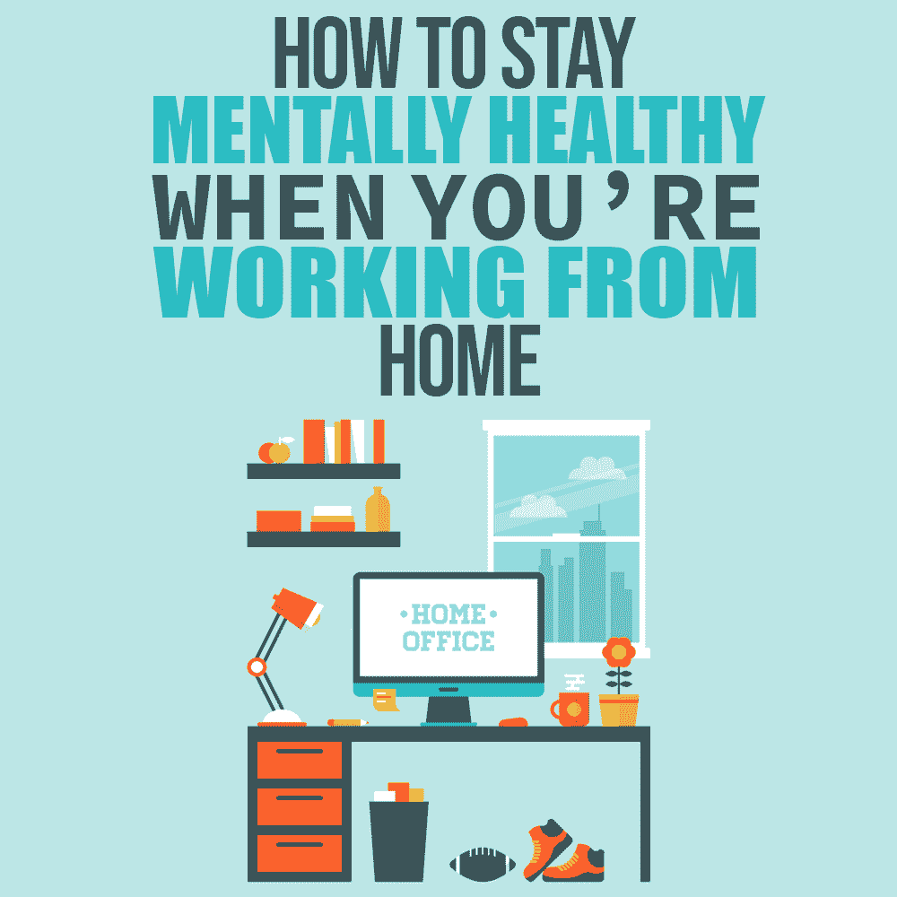
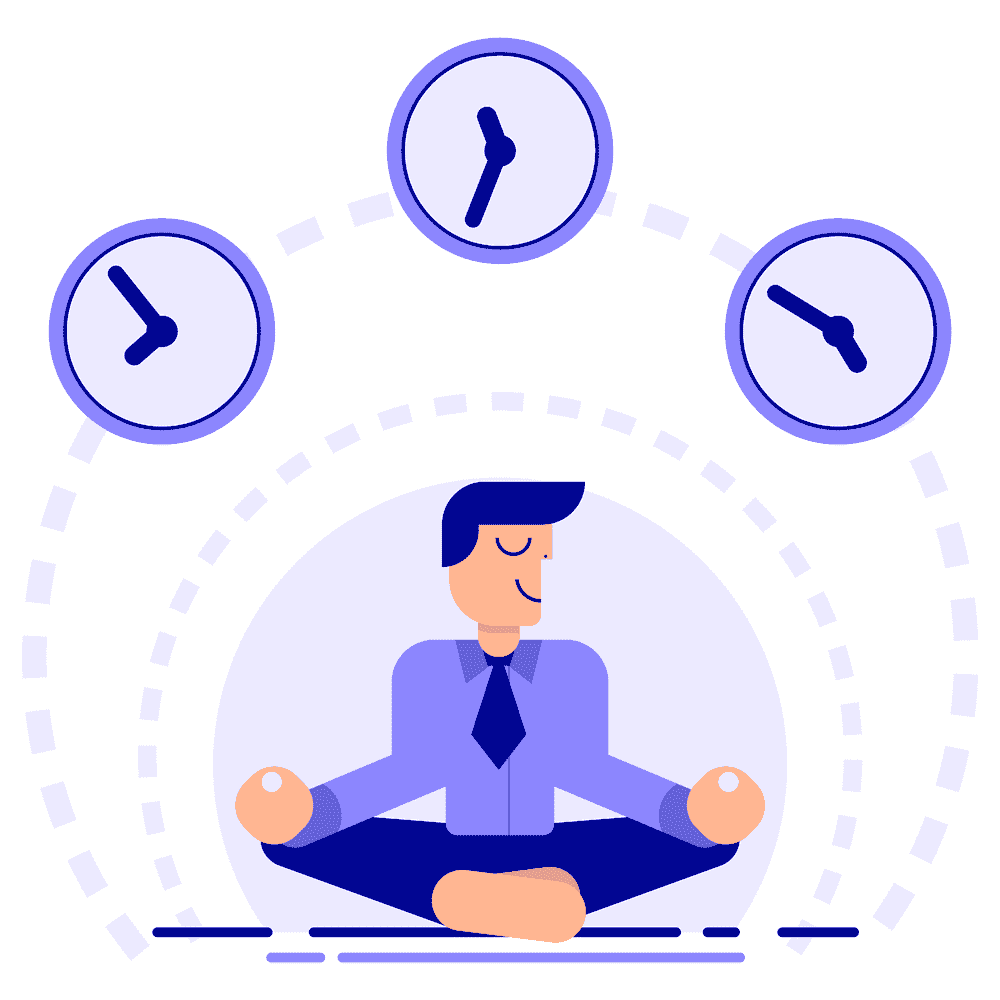

# 在家工作时如何保持精神健康

> 原文：<https://simpleprogrammer.com/coronavirus-work-from-home/>

“Starting tomorrow we’re all working from home.”

这是上周四我们公司的首席执行官发出的信息。

我知道我们不是唯一的。

随着新冠肺炎的影响力越来越大，许多程序员第一次发现自己在远程工作。这就是梦想，对吗？

也许不是因为某种让世界大吃一惊的超级病毒。但是，总的来说，我们中的大多数人会更愿意选择这样一个工作日，我们从床上爬起来，躺在沙发上，在自己舒适的家里工作。

不过，事情是这样的:这不一定是每个人都认为的理想情况。事实上，如果你不小心，在家工作会以一种你意想不到的方式损害你的心理健康。

我知道是因为四年来，我是一名自由职业者，在家工作。不要误会我；它的某些部分很棒。但是过了一段时间，新鲜感就开始消失了。我发现自己在与孤立和无法关闭我的思想等事情做斗争。

在家工作不像往常一样，尤其是现在。事实上，如果你认为在家工作和在办公室工作是一样的，那你就走上了一条艰难的道路，最终可能会精疲力尽。

当你在洗衣服的同一个地方工作时，你必须有意识地对待你的过程。所以为了你自己的缘故，[提前做一点艰苦的工作，看看它能给你的工作流程和快乐带来什么样的变化。](https://simpleprogrammer.com/6-work-home-tips-programmers/)

听着，我知道这可能不值得你去努力。但是如果你在家里工作的时候不暂停一下，为自己的成功做好准备，很快你就会发现你的工作效率开始下降，如果不是完全停止的话。

作为一名程序员，我学到了在家工作时如何保持健康的五个方法。

## 建立您的共享空间

你需要做的第一件事是为你的工作建立一个专用空间。不幸的是，它不能是你客厅的沙发。

原因如下。

你需要想办法从心理上区分工作时间和玩耍时间。如果你不这样做，你会发现很难放松。你开始把家里的一切都和工作联系起来！

最好的方法是在你的房子里有一个你只工作的地方。把房子的其他地方留给与工作无关的东西。

和[睡眠专家](https://www.sleepfoundation.org/insomnia/treatment/what-do-when-you-cant-sleep)说如果晚上睡不着，要醒着躺 20 分钟再下床是一个道理。如果你一直数几个小时的绵羊，你就开始在你的床和保持清醒之间有一种不健康的联系。

你家也是一样。如果你不仅仅是为了工作而指定一个空间，你的大脑就会开始把家里的一切都和工作联系起来。那就是**不好玩**！

我知道你可能空间有限。但是你不需要太多。房间的一角放上一些搁板和一把椅子就能达到目的。

发挥创造力。

想知道我做了什么吗？

在我的洗衣房里，我把洗衣机和干衣机移得更近了。我拿起车库里的一个旧床头柜。找到一把没人用的椅子。

从我的卧室借了一盏灯。把它塞到角落里，然后嘣。即时办公。它确实花了我 0 美元。

也许这不是理想的情况，但在你的房子里有一个你只用来工作的空间是值得的。

## 加倍努力与同事建立联系

Nothing puts a strain on your mental health like tension in relationships. And there is one group of people that you spend equal and in some cases more time with than your family.

你的同事。

远程工作使得清晰沟通和与同事保持联系变得更加困难。因此，如果你不刻意努力与你的同事保持联系，这将开始对你的心理健康产生影响。

加强与同事的交流并不意味着你需要立刻成为外向的社交大师。但是这确实意味着你必须付出更多的努力。

我的建议是，无论你在办公室做什么，都要加倍努力。

如果你每天和同事联系两三次，那就增加到四六次。

你也不能整天偷懒。你必须给他们发视频信息。试着给他们打个电话，不要担心浪费他们的时间。与同事建立融洽的关系和沟通渠道需要时间，但随后会带来生产力红利。

有时候，在 Slack 上打出你的想法比打一个五分钟的电话还要花时间。情况并不总是这样，但是当事情开始变得非常技术性时，就该按电话图标了。

一开始，和你曾经坐在旁边的人进行视频通话可能会显得不自然。但是，当你开始努力寻找向同事伸出援手的理由时，你就开始做得更好了。

你可以做的另一件事是我们公司称之为“办公时间”的事情，在这个时间里，每个人都加入到一个 zoom 电话中一起工作。这就像在一个真实的办公室里，大家一起工作…只是虚拟的。

你不用说什么，但大多数时候，人们会开始说话。这是一种有趣的方式，既能建立友谊，又能完成工作。

无论你做什么，只要确保你比以前更加努力地与你的同事联系和沟通。

## 养成习惯

Having a consistent routine that you do every day is [super important](https://simpleprogrammer.com/importance-routine/) for your mental health, and that’s even more true when you’re working from home. Having a routine is another way to create clear mental boundaries between your workday and your time off.

听我说完。我不是那种“坚持养生”的人。让我们把所有的东西都放在文件夹里。

当人们看着我电脑的桌面时，他们会咯咯地笑，然后挖苦我“一个干净的桌面是一个干净的头脑”

我是那个在浏览器上打开 30 个标签的人。他们中的一些人已经在那里呆了几个星期了。

所以，例行公事对我来说绝不是自然而然的事情，但是尽管我有这种倾向，我还是努力确保我有一个例行公事，因为我需要它在家里工作时富有成效。

按照你的时间表和常规工作，感觉不到你实际上在做什么。但是我发现，我在效率上每花一分钟，我就能收回五分钟。

你可以做几件事来最大化你从日常工作中获得的效率。

你应该做的第一件事是制定一个开始和停止的程序。

如果你真的想提高你的工作效率，你必须有一个早上的惯例。在家工作的额外好处是，它给你更多宝贵的时间来安排一些具体的事情。

试着提前 15 分钟起床。喝一杯水。祈祷吧。做点练习，拜托，拜托，拜托，别接电话！

你早上的例行公事真的可以为你一天的剩余时间定下步调。

我发现的关于养成早晨习惯的最好的书之一是哈尔·埃尔罗德写的《奇迹的早晨》 。他谈到他的生活是如何通过每天早上做一些小事而改变的。

你也可以做一些事情，比如分配你的时间，这意味着在你的工作中寻找模式，然后把那些任务放在一起同时完成。

当你在家工作时，日子很容易混在一起，所以我们需要寻找信号让我们知道今天是星期几和时间。

但是阻碍我们高效工作的一个主要原因是从一个任务转到另一个任务。约翰·梅迪奇在《大脑规则》 中讲述了如何在不同的任务中跳跃，让你在一个项目上的工作量增加 50%。

分批完成任务有助于提供这些信号，让你不要浪费时间从一个任务跳到另一个任务。

不要一收到通知就查看邮件，而是在上午 9 点和下午 3 点查看。当你检查的时候，回复每一封你需要回复的邮件。当你把邮件留到以后处理时，你最终会保留大脑空间来回复邮件，而你可以把这些空间用在其他事情上。

在家工作时，你能做的最糟糕的事情就是让日子和时间混在一起。花点时间。定一个套路，坚持下去。

你的精神健康会感谢你的。

## 请求帮助

我做了多年的自由职业者。不容易。当你和一群人一起工作时，你可以利用同龄人的集体知识。作为一名自由职业者，花三个小时就能想明白的事情，当我是团队的一员时，只需要 30 分钟。

当你在家工作时，很容易忘记你还是团队的一员。

我知道当你需要帮助的时候，你可能会觉得自己在“打扰”别人，但是事实并非如此。据我所知，人们喜欢能够提供帮助。我知道我有！

I love it when I’m the one that has the answer someone spent a lot of time searching for. It makes me feel like I’m actually a decent contributor to my company.

你的同事也是如此。你没有打扰他们。你实际上是在赞美他们。

此外，除了绝对必要的时间，没有什么比花更多的时间去解决一个 bug 更让你筋疲力尽的了。听着，有些事情只是需要时间，但你必须开始权衡自己解决问题和向可能帮助你的人求助的利弊。

在某种程度上，你继续寻找别人很容易给你的答案，实际上是在浪费公司的钱。

两个警告:

1.  如果你自己没有做足够多的研究，就不要主动联系。在你试图自己解决问题之前主动伸出援手是不光彩的。简直是懒透了。
2.  在正确的时间接触正确的人。有些人讨厌被打扰；其他人可能正在解决问题。

## 耐心等待转变

如果你和我一样，当你没有发挥出最佳水平时，你会非常挣扎。

但是任何形式或方式的转变都是困难的。它会比你预期的更多地影响你的工作效率。

从办公室环境到远程环境是一个巨大的转变。这需要一些时间。你将无法完成你所希望的那么多工作。

没关系。

给它一些时间。最终，你会发现自己的表现达到了曾经的水平。

给你一个建议:如果你在这个过程中对自己太苛刻，会花更长的时间，所以让自己休息一下。

克里斯汀·内夫关于[自怜](https://www.youtube.com/watch?v=IvtZBUSplr4)的 Ted 演讲是我见过的关于这个话题的最好的东西之一。她鼓励你像对待朋友一样对待自己。大多数时候，我们会在心里谈论自己，而不会谈论别人。

所以给它一些时间。一定要有意识。但是不要指望在第一周就能让你的家庭办公室成为完美的工作环境。

## 在家工作不一定会影响你的心理健康

自从工业革命以来，员工们别无选择，只能在工作环境和家庭环境之间划清界限。

在过去的 15 年里，事情开始发生巨大的变化。你们中的一些人一直梦想着有一天，你们可以摆脱通勤，并开始能够将你们的书房的一部分作为办公室。

页（page 的缩写）s:我不是注册会计师，不要把这个当成税务建议。

别误会我的意思。在家工作很棒，但也有一些独特的挑战。

如果你有心且勤奋，你可以保持健康的工作/生活平衡，并在这个历史上非常怪异的季节保持心理健康。

所以，一定要在家里为自己打造一个专用于工作的空间。

一定要额外努力与你的同事沟通。增加你每天开始和结束时的例行活动。需要的时候寻求帮助。最后，对自己要有耐心。

老实说，这并不需要太多。但是，当您远程工作时，一点点努力就能帮上大忙。

在这一切都过去，我们回到办公室之前，我希望你在家工作时保持健康和高效。