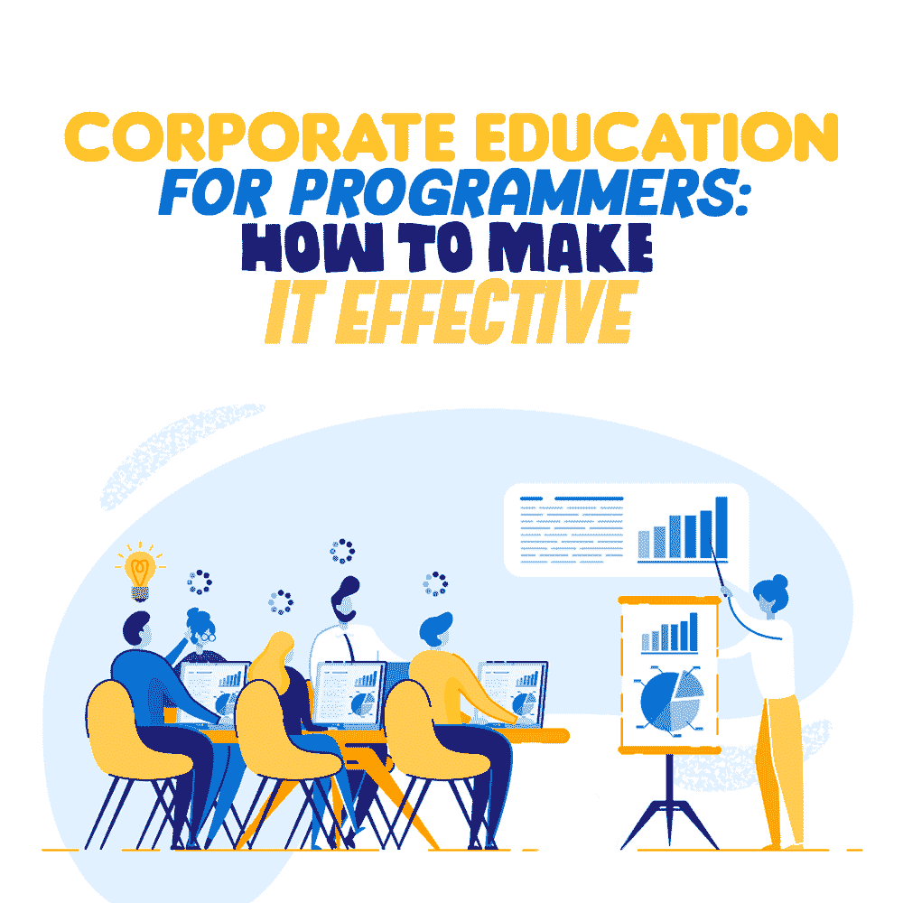

# 程序员的企业教育:如何使其有效

> 原文：<https://simpleprogrammer.com/corporate-education-for-programmers/>

According to Solon, one grows old “ever learning many things.” This is good advice to keep in mind in all cases, but it's perhaps particularly relevant in corporate life, where knowledge equals professional skills, status, and income.

因此，对新知识和职业发展的渴望一直在推动所有领域的专家不断学习。

对于程序员来说，不断学习是他们一直以来的基本目标之一:由于技术发展如此之快，掌握新的知识和技能是软件专家保持市场竞争力和建立职业生涯的唯一途径。

公司也对所有类型的企业教育活动感兴趣，并考虑在他们的业务发展中进行投资。根据福布斯撰稿人 Dan Pontefract 的数据，2018 年，美国组织在企业学习和发展方面的支出超过 876 亿美元。

但是那些投资合理吗，有真正的商业价值吗？

在本文中，我们不仅要回答这个问题，还要分析企业面临的企业学习挑战。此外，我们将发现改进学习过程的可行方法，特别是那些针对软件开发专业人员的方法。

## 学习投资与成果

令人惊讶的是，即使教育支出如此之大，企业培训的有效性仍然值得怀疑。来自 50 家公司的 1500 名经理中有 75%被证明对他们的企业学习计划的结果不满意。

对于企业主来说，他们很难从教育活动中获得预期的结果:只有 8%的首席执行官从企业学习和发展项目中观察到真正的商业利益，而只有 4%的人展示了可衡量的投资回报率。

企业学习的低效率可能有几个原因:

*   学习过程是僵硬的。教育项目被搁置了多年，它们太笼统，不适合特定团队和专家的具体情况。35%的美国员工表示，他们的公司培训已经过时，而 33%的专家表示，他们接受的培训没有达到他们的预期。
*   组织不想失去对学习过程的控制。因此，许多企业仍然依赖于课堂上良好的旧学习，而忽视了数字教育的好处。与此同时，转向电子学习可以让这些公司节省多达 60%的学员学习新材料的时间。
*   员工没有机会在商业环境中应用新知识和技能。事实上，只有 12%参与企业学习的员工称他们在工作中实践了新学到的技能。

显然，如此糟糕的公司学习结果可能会在许多方面影响公司。学习差距可能成为业务流程缓慢、重复性人为错误和员工被动的核心原因。

学习管理问题是任何企业的特征。然而，软件开发公司和以 IT 为中心的组织中的学习弱点会比任何其他业务领域更快地带来负面的业务结果。原因如下。

## 学习差距对程序员和他们的公司意味着什么？

当拥有内部 IT 部门的公司或专业技术公司出现学习差距时，它们会带来以下与员工相关的头痛问题:

*   软件专业人员会很快失去资格。这对于软件开发外包提供商来说尤其重要，因为他们的服务质量取决于员工的技能。
*   团队之间可能存在很大的知识差距，因此不同团队的成员无法在需要时相互替换。
*   程序员可能会在竞争公司寻找相关培训，甚至申请那里的工作。目前，73%的员工[肯定](https://business.linkedin.com/content/dam/me/business/en-us/talent-solutions/resources/pdfs/linkedin-2020-global-talent-trends-report.pdf)更好的职业技能发展能力会阻止他们离开公司。
*   他们会感到不投入，表现出低生产率。管理 IT 团队的公司面临着员工流失的风险，并最终导致相当不热情的 IT 人员加入，他们的知识多年来停留在同一水平。总而言之，拥有成熟学习流程的公司[报告称](https://business.linkedin.com/content/dam/me/business/en-us/talent-solutions/resources/pdfs/linkedin-2020-global-talent-trends-report.pdf)与学习活动差的公司相比，流失率低 53%。
*   他们可以选择自学，一旦找到更好的工作，可以实践新的知识和技能，他们就会离开。

那么，公司可以做些什么来避免学习管理不足带来的问题，并使他们的企业教育更加有效呢？

## 走向有效的企业学习

这里有一些公司可以用来打破公司学习僵局的活动。

### 根据业务目标调整学习计划

有必要回顾一下已采用的企业学习策略，使其与当前的业务需求保持一致。不需要长期战略；从为期一年的项目开始就可以了。

公司应该把重点放在遵循商业计划的培训上。例如，如果他们计划在一年内采用 AWS，内部专家必须现在就开始学习 AWS 技术。

### 为不同的团队和技术专家精心设计学习计划

企业可以尝试为来自不同团队和不同资历级别的软件专业人员制定更加个性化的计划，而不是引入另一种通用的教育课程。

他们可以在两到三个团队中测试这种个性化的培训方法，然后将最佳实践传播给其他员工。

### 清理学习内容存储

公司图书馆经常堆满了过时的手册和书籍。更新内容存储是实现更有效的自我教育的重要一步，并为软件专家提供了更新技术知识和提升软技能的机会。

### 针对学习需求优化软件

当谈到改善企业的电子学习时，公司开始直接选择专用的学习管理软件。他们经常忘记他们可以使用当前的解决方案来振兴基本的学习管理活动。

例如，一个组织可能运行一个不发达的 SharePoint 门户。因此，公司可以通过定制平台的通用开箱即用功能来构建 SharePoint 学习管理系统，而不是购买另一个软件。

### 混合软硬技能培训

Companies often focus on developing their IT staff’s hard skills while ignoring the importance of soft skills. In reality, in the era of digital communication and distributed workspaces, [programmers’ soft skills](https://simpleprogrammer.com/soft-skills-remote-work/) are the key to their professional success.

为了让公司了解非平凡的软技能培训，他们可以效仿 Etsy 的例子:该公司成功地将软件工程师的编码培训与舞蹈和摄影课程结合起来。

### 计划学习后的活动

为学习而学习很少是个好主意。每一次培训或课程都应该有项目跟进，让软件专业人员能够应用他们的新知识。

仅仅因为 Salesforce 是一个受欢迎的平台，而没有真正的项目供他们参与，就让程序员学习 Salesforce 定制的原则是不合理的。

### 确保团队和专家之间的知识交流

使用员工门户网站、维基或企业学习解决方案，程序员可以与同事分享他们的真实经验和生活窍门。

说有一个团队和 AngularJS 打了好几年交道，还有一个团队刚开始学技术。在这种情况下，在开发项目中积累并在团队之间共享的每周提示和技巧甚至比长时间的培训会议更有效。

### 开始练习小额学习

在很短的时间内要学的东西太多了。这是破坏学习计划的最大障碍之一。

试图让 10 名开发人员参加 60 小时的培训，公司可能会在终点线上看不到任何人。这不是糟糕的时间管理或个人拖延的问题，而是软件开发人员的工作节奏和时间表很难吸收 60 个小时的额外培训。

公司可以采用流行的微学习方法，通过 5 分钟的视频、一页纸和快速测验来确保知识的传递，而不是耗时的会议。

程序员自己也要有选择性，[合理学习新的编程技能](https://simpleprogrammer.com/learn-new-programming-skills/)。有时候，阅读最新的行业新闻、短评和同事的生活经验比学习一门新的编程语言更有效。

## 从企业学习战略到企业哲学

只要企业学习只是作为一种正式的战略存在，积极的成果将只是一个梦想。学习应该成为程序员日常生活的一部分，成为他们的习惯，这将刺激他们的专业成长，并产生对企业有价值的成就。

公司可以通过让学习变得可及、个性化和多样化来培养这种以学习为中心的企业哲学。为了实现这一点，最好避免将整个任务仅委托给学习管理技术，或者使其成为一次性活动。

例如，如果没有定期更新学习内容和积极分发学习材料，即使是最好的学习管理系统也不会促进学习活动。

一旦一个公司在一个开发团队中取得了学习上的成功，他们不应该停下来，而是继续改进这个项目，并在其他团队中推广。

最后，公司不应该把企业学习放在一边，作为一种辅助的、不重要的活动。企业必须牢记，学习机会不仅能激励现有员工并提高他们的忠诚度，还能吸引那些认为企业学习是企业重要福利的潜在候选人。