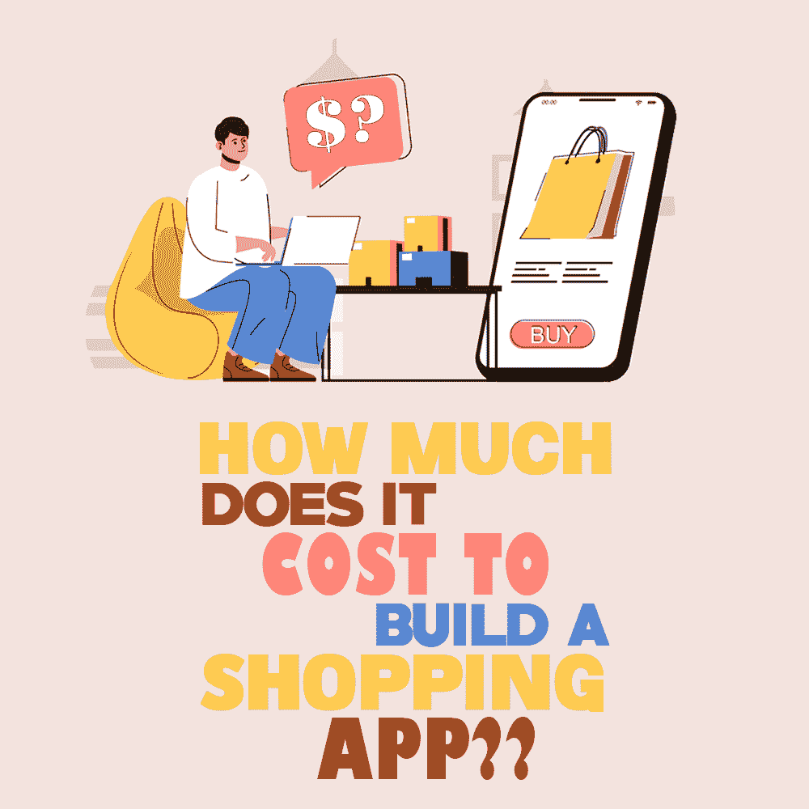

# 建一个购物 App 要多少钱？

> 原文：<https://simpleprogrammer.com/cost-to-build-shopping-app/>

Let’s be honest, shopping online is one of the best things we have in the digital world—we should be so thankful for the bright minds who created e-commerce. Isn’t it convenient to shop whenever you want with just one click? Online shopping has become the most influential business tool to boost sales and customer engagement.

由于技术进步，我们现在有了一个更好的工具:移动商务，它给了我们流动性和自由。一个吸引人的网店背后站着一个开发团队，他们打造更好的购物体验。

为了帮助您的企业保持竞争优势，为您的企业创建一个电子商务应用程序是必不可少的。移动商务在当今市场中已经显示出了明确的优势，本文将帮助您实现这一点。

## 为什么选择移动商务？

在过去两年里，将实体店迁移到在线平台变得至关重要。为了在疫情的封锁中生存下来并保持竞争力，企业不得不转变他们的战略模式。

随着智能手机和移动技术的发展，零售领域再也不能置身事外，处于离线状态。过去几年向移动商务的转变和用户数量的急剧增加导致市场规模从 2014 年的 1161.2 亿美元增加到 2019 年的 4673.5 亿美元，CAGR 为 32.1%。预计市场将继续增长，到 2026 年，CAGR 将达到 34.9%，将达到 39，010 亿美元。

推动市场上涨的因素是全球细分市场的数字化转型、在线支付方式的渗透以及消费者行为的转变。作为电子商务的一个分支，移动商务被证明更有前景和前途。市场集中在印度、中国和美国，这些顶级市场参与者引领着潮流。需要记住的一个关键点是，移动商务是动态的；它是一个活的有机体，随着新的移动技术和功能而转变，以获得更高的保留率和参与度。

那么，为什么选择移动商务呢？[谷歌研究](https://storage.googleapis.com/think/docs/app-marketing-mobile-shopping.pdf)表明，超过 58%的智能手机用户通过智能手机查看产品和价格并进行购物。对于零售商来说，这是一个巨大的触发器，可以建立一个稳固的客户基础，并保持不断的互动。

### 移动应用对零售商的优势

除了作为一个网上购物的平台，移动应用程序也是一个很好的长期工具。

**卓越的用户体验。**现代用户在使用智能手机时比在网站上，甚至是在逛商店时感觉更舒服。即使用户互动没有导致最终购买，它仍然会让客户喜欢你的应用程序，并导致未来的购买。

**围绕品牌建立社区。**凭借吸引人的界面、糖果功能和社交网络整合，这款移动应用将开始连接用户并建立社区，这些社区将[分享体验](https://www.marketingprofs.com/chirp/2014/25578/consumer-psychology-and-the-e-commerce-checkout-infographic)。

**个性化方法。**基于人工智能的移动应用通过个性化的优惠和折扣以及自动产品过滤创造了更好的用户体验。有一个这么懂你的 app 是不是很棒？

**公司拥有的营销渠道。**移动应用是开展营销活动和获得即时响应的强大营销渠道。有了分析，开展活动和构建未来战略以提高客户参与度变得更加容易。

## 构建商店应用程序的方法

移动应用程序开发始于符合市场需求和预算的商业计划。作为第一步，选择应用程序开发方法非常重要。

### 图形化编程工具

从头开始开发一款购物应用可能是一项挑战，尤其是如果你预算和开发人员都不足的话。幸运的是，有一些不需要开发技能的无代码应用程序构建者，他们承诺快速、廉价地创建应用程序。然而，这种方法在用户界面(UI)解决方案中受到限制，转换率较低，并且是一种效率较低的重定目标工具。

### 原生应用开发

Android 或 iOS 的原生移动应用是获得高响应产品的最有效途径。原生 app 中的每一个细节都与 OS 相匹配；它符合[买家旅程](https://www.amazon.com/dp/3110641119/makithecompsi-20)和品牌，工作顺畅，看起来很棒。同样，也有陷阱要考虑。构建原生应用既耗时又昂贵。它需要一个有经验的软件工程师团队来完成这个项目。

### React Native/Flutter 应用开发

最后，我们有第三种选择，开源的[跨平台框架](https://www.amazon.com/dp/1839211148/makithecompsi-20)，这是迄今为止创建任何移动应用的最佳选择，包括电子商务应用。像 Flutter 和 React Native 这样的跨平台框架给了开发人员绝对的自由，让他们可以使用数以千计的模板和图标，这些模板和图标的行为和外观都像是移动操作系统的原生模板和图标。

## 如何做一个购物 App？

Starting with a mobile app, both business owners and app developers should carry out a comprehensive analysis and draw up a business plan. Before taking the project directly to the development stage, it is important to carry out preparatory work.

第一阶段进行市场调查。软件开发从市场调查开始，以确定目标受众并构建客户旅程路线图。在这个初始阶段，企业所有者和开发团队定义项目预算，分析市场竞争对手，并提出要关注的目标。

第二阶段定义必备功能。下一步，利益相关方定义项目范围，使购物应用具有独特性和竞争力。为了降低成本和风险，最佳解决方案是[从 MVP](https://articles.abilogic.com/486335/what-features-should-online-shopping.html) (最小可行产品)开始，并在发布后改进产品。说到购物应用，以下是必备功能:

*   *客户登录。*让客户注册并登录可能不是强制性的，但获取客户的社交媒体数据和电子邮件以建立更个性化的体验是一种强有力的营销策略。要记住的规则是，在到达结账阶段之前，永远不要催促顾客注册。
*   *产品搜索和过滤。*[购物应用](https://simpleprogrammer.com/e-commerce-development-web-test-automation/)的目的是提供一个产品列表，让搜索尽可能简单和顺畅。过滤、搜索和排序是购物应用程序缩小产品列表的标准工具。过滤选项越多，功能就越好。为了更好地 UX，该应用程序可能基于机器学习，其算法可以处理产品建议和最佳匹配。
*   *用户点评。*事实证明，点评功能将销售额提高了 18%。电子营销人员的研究表明，消费者阅读评论的次数是产品描述的 12 倍。顾客确实信任有评论的产品。该应用可以鼓励用户在购买后留下评论。
*   *结账和支付网关。*据统计，[10 个顾客中有 7 个](https://baymard.com/lists/cart-abandonment-rate)没有完成购买就离开了 app 或网站。为了解决这个问题，零售商应该降低额外成本，取消强制注册，简化结账流程，包括跟踪，并通过集成多种支付方式和确保个人数据的最大安全性来使应用程序对用户友好。
*   *运输。*购物应用成功的原因之一是快速送货和跟踪。销售应用程序必须集成发货 API。

除了必备功能之外，该应用程序可能会在即将到来的更新中增加更多功能:

*   在线聊天
*   意愿清单
*   类似 Instagram 的照片馈送
*   产品的 3D 视图
*   忠诚度计划
*   游戏化
*   线下商店地图

第三阶段选择有吸引力的设计。一个吸引人的界面是一个成功应用的先决条件，因为用户在使用应用的最初几秒钟就形成了对应用的看法。开发人员和利益相关者的目标是创建一个实用且有吸引力的产品。

app 的重点应该放在产品上。这意味着描述应该清晰，产品的特点应该是可见的和易于访问的，产品照片和视频应该是高分辨率的。更高级的应用使用 AR 和 VR 技术，在与产品交互时创建更好的用户体验。

第四阶段选择平台。理想情况下，商业计划应该为 Android 和 iOS 提供两个本地应用的开发。不过，这个决定应该由市场分析和需求来决定。如果该地区和用户群体正在主导 iOS 用户，那么没有必要在 MVP 发布的第一阶段就进行 Android 应用开发。如果开发方法是跨平台的框架，那么平台的选择就无关紧要了。

第 5 阶段开展持续的支持。应用程序开发和部署是成功的一半。为了让你的应用程序工作并产生收入，它应该配备充足的价值功能，并始终保持最新。MVP 发布后，将是时候处理用户反馈，做额外的研究，并致力于改进应用程序的新功能。需要关注的主要细节是速度、稳定性和支持。

## 构建移动购物应用的成本

开发购物应用的[成本取决于项目的复杂程度。重要的驱动因素是用于开发的技术、位置和开发人员的经验:](https://technonguide.com/how-much-does-it-cost-to-hire-an-app-developer-in-2022/)

*   设计复杂性
*   应用程序复杂性
*   特征数量
*   技术堆栈
*   每小时费用

具有基本功能的 MVP 的成本可能如下图所示:

| **App 功能** | **时间** | **成本** |
| 注册/登录 | 20-25 小时 | $800-$1,000 |
| 支付 | 50-65 小时以上 | $2,000-$2,600 |
| 应用内购买 | 20-30 多个小时 | $800-$1,200 |
| 搜索 | 12-15 小时以上 | $500-$600 |
| 用户概要 | 15-20 多个小时 | $600-$800 |
| 推送通知 | 12-15 小时以上 | $500-$600 |
| 分析(分析工具的集成 | 每个工具 2-5 小时 | $100-$200 |
| CMS:管理员授权 | 8-12 小时以上 | $350-$500 |
| CMS:行政管理 | 6-10 多个小时 | $250-$400 |
| CMS:用户管理 | 20-37 小时以上 | $800-$1,500 |

### 如何开始使用购物应用程序

一旦你启动了你的目标受众和利基，你就可以开始寻找一个应用程序开发团队来[建立一个应用程序](https://simpleprogrammer.com/app-development-pricing-2021/)。总结驱动开发成本的标准和因素，构建一个购物应用所花费的时间将如下:

*   安卓购物应用:300-350+小时
*   iOS 购物 app: 250-290 小时
*   后端开发:400-470 小时
*   UX/界面设计:150-200 小时
*   质量保证:200 多个小时

用开发时间乘以小时费率，你就会得到构建一个购物应用的大概价格。找到一个具有相关专业知识的专业开发团队对于项目的成功至关重要。与合作伙伴一起深入分析和讨论如何制作销售 app。

## 购物应用是商业的未来

The internet has been a revolution for shopping, as being able to shop online, without having to leave home, has been a real game changer. It was perhaps only natural to have a second such revolution with the emergence of smart mobile devices.

移动商务给了我们移动性和自由，如果你想保持竞争力，为你的企业创建一个电子商务应用程序是必须的。虽然这个过程乍一看似乎令人不知所措，但是适当的规划和对相关参数的仔细考虑可以简化事情，并帮助您根据您的需求和预算找到理想的解决方案。