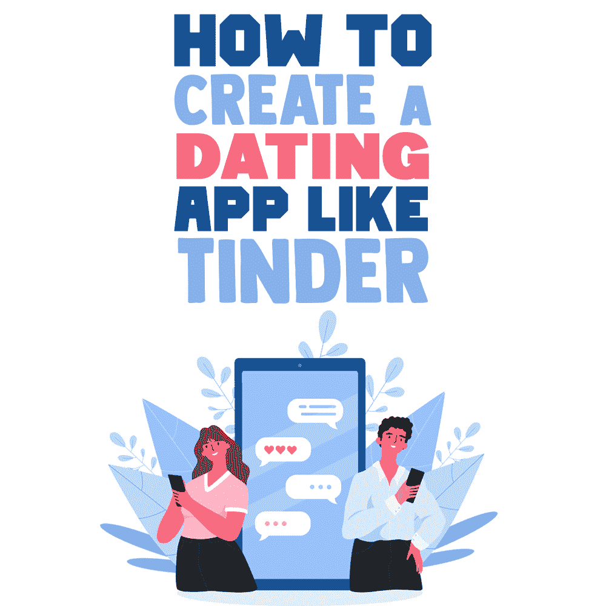
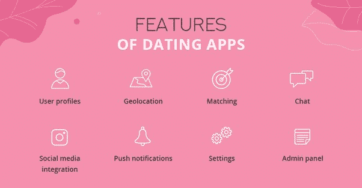
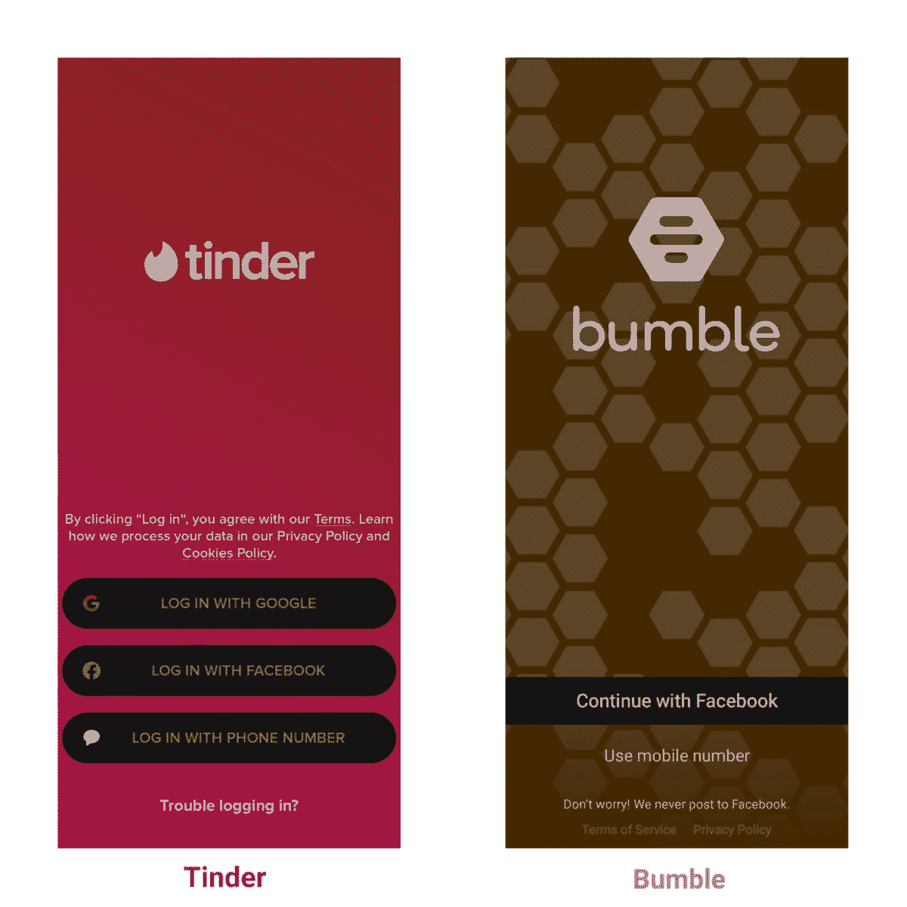
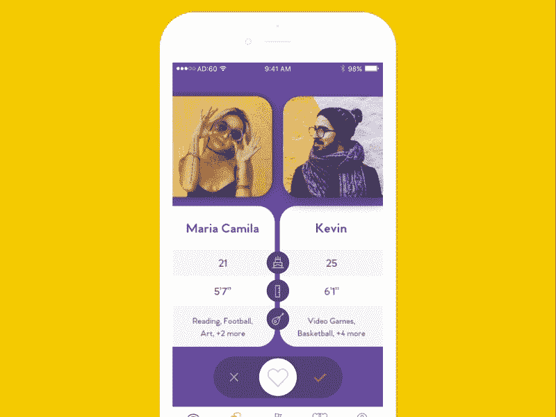

# 如何创建像 Tinder 这样的约会应用程序

> 原文：<https://simpleprogrammer.com/create-a-dating-app/>

Dating apps not only bring many individuals a step closer to their dating partners and potential soulmates, but they are also a great business venture. For developers, dating apps can earn a handsome profit.

事实上，统计数据很能说明问题。2021 年 5 月， [Tinder 出现了 650 万次下载](https://www.statista.com/statistics/1200234/most-popular-dating-apps-worldwide-by-number-of-downloads/)。紧随其后的是 Badoo，390 万，Bumble，170 多万。

约会应用——尤其是用于临时约会和约会的应用——是一种日益增长的趋势。[对 2024 年的预测](https://www.statista.com/forecasts/891146/eservices-dating-services-online-user-by-segment-worldwide)显示约会应用的用户总数为 2.8 亿，其中 1.13 亿用户寻求配对，7000 万用户寻求非正式约会。

尽管如此，约会应用程序开发过程并不像听起来那么简单。在创建像 Tinder 这样的约会 app 之前，必须做大量的功课。

虽然你的应用不太可能取代 Tinder，但如果它是通过考虑图形、UX 和功能等因素而正确开发的，人们仍有可能使用它。如果你正在考虑如何创建一个约会应用程序，我可以帮你。请继续阅读，我会向你介绍设置像 Tinder 这样的约会应用程序所需要知道的一切。

## 确定你的竞争对手

市场上已经有这么多活跃的约会应用，为什么我们还需要一个呢？很简单:因为如果新东西填补了约会应用世界的空白，它总是有空间的。

如果一个新的约会应用程序有一个独特的功能可以取悦用户，它可以承诺在更多的下载和增加转换方面有更好的结果。

因此，**竞争对手分析是必须的**，因为它能让你更深入地了解如何创建合适的约会应用。竞争对手分析找出你的竞争对手的弱点和长处。这些细节将有助于确定构建约会应用的有效策略。

仔细看看竞争对手的应用程序的功能从来没有任何坏处。弄清楚竞争对手做了什么让它脱颖而出是至关重要的。同样，注意他们的失误可以帮助你避免在自己的发展过程中犯潜在的错误。

## 匹配算法

像 Bumble，OkCupid，Tinder，Hinge，Grindr 等流行的约会应用。拥有相似的技术和不同的算法。是算法魔力将所有的交友 app 用户捆绑在一起。只要[应用的算法](https://simpleprogrammer.com/learning-algorithms/)显示出想要的结果，用户就倾向于坚持使用一个应用。

用户是根据这些应用中显示的搜索结果来划分的。例如，一些用户喜欢有共同品味的潜在匹配者，而一些用户喜欢那些看起来有魅力的人。

因此，不涉及许多数学计算；重要的主要是偏好。这就是对人工智能进行实验的地方。约会软件开发公司(还有这一节)关注的是某些不可忽视的算法。

### 基于位置的算法

基于位置的算法为特定区域内的用户指定结果。个人可以在一个城市或一个州内根据他们的**首选地点**找到他们的潜在伴侣。

许多约会应用开发商通过提供应用内购买来扩大搜索半径，从而将应用货币化。用户扩展指定位置需要渲染一定的费用。

### 基于行为的算法

当你和你的潜在伴侣有相同的品味和选择时，没有什么比这更好的了！行为方法是另一种积累用户数据的方式，可以建立有相似兴趣的档案。

[来源:Quora](https://www.quora.com/What-are-the-features-and-costs-of-dating-app-development?top_ans=181551128)

由于人们不会公开与他们的利益相关的一切，基于行为的算法是最好的解决方案。它根据用户的社交媒体账号、偏好的播放列表等收集用户数据。，这有助于根据共同兴趣确定合适的匹配。

## 非压倒性的结构和设计

对于用户来说，制作像 Tinder 或 OkCupid 这样成功的约会应用的黄金潜规则是零复杂性。从长远来看，一款不会让用户不知所措的应用会脱颖而出。让我们深入了解约会应用程序的设计细节。

### 一个吸引人的名字

这个名字应该补充应用程序的核心功能，帮助用户理解它。毫无疑问，OkCupid 是约会应用程序朗朗上口的名字的最好例子。

### 目标受众

除非被目标受众所利用，否则一个应用程序无法在竞争中生存。这适用于谷歌 Play 商店和 App Store 上的所有约会应用。年轻人是约会应用的主要人群，为目标人群整合合适的功能至关重要。

例如，Bumble 在其高级版本中有一组高级功能。它允许用户根据身高、体重、吸烟/饮酒习惯、教育程度等身体特征过滤偏好。

### 令人愉悦的用户界面设计

现代而直观的用户界面设计让用户对约会应用着迷。无论是 Tinder、Bumble 还是 OkCupid，它的用户界面设计既时尚又简单。看看下面对比的 Tinder 和 Bumble 的登录设计。

来源:米罗。中等

它们既不会让用户不知所措，也不会让用户困惑。事实上，这样的设计很容易被新用户理解，因为它们引导用户通过不同的选项登录。就这么简单！

## 需要技术堆栈

现在是时候…提出这个问题:如何制作一个约会应用程序？

软件开发人员必须为每次开发选择正确的软件。交友 app 开发也没什么不同，有自己特定的需求。

*   **编程:** Java，Kotlin，Swift。这些语言不需要核心的编码技能。代码可以很容易地修改，而不用从头开始。
*   **数据库:** MongoDB，SQL，Redis。所有这些都是开源平台，具有特别查询、复制、文件存储、负载平衡等特性。这些数据库被认为非常适合在云端存储用户数据。
*   **框架:** React Router，Node.js，Express.js 这些开源框架有助于构建可扩展的网络应用。
*   **云存储:** AWS。对于许多约会应用程序来说，AWS 是存储之王，因为它可以随时随地访问数据。它消除了购买自己的存储空间的需求。
*   **Web 服务器:** Nginx。web 服务器是在 web/app 上分发内容的重要元素。Nginx 是同时处理 10K 连接的首选之一。
*   **支付网关:** Stripe，PayPal。用户需要为使用该应用程序的付费功能支付费用。PayPal 和 Stripe 被认为是有用的，因为这些支付应用程序在国际上广泛使用。
*   **通用工具:**谷歌地图，谷歌分析，Optimizely。跟踪每个位置的用户数量有助于开发人员引入所需的定制功能/服务。

## MVP 要求

每个人都希望创建一个从竞争中脱颖而出、具有独特功能的约会应用程序。然而，每个约会应用程序开发工具都必须具备一套特定的功能，以确保顺利运行。以下部分分享了哪些功能必须包括在内，以及每个功能需要什么。

*   **轻松登录。**传统的登录流程已经成为历史。用户喜欢即时登录过程，避免了忘记密码的麻烦。因此，你应该允许用户使用他们的谷歌或脸书账户登录。
*   **用户资料。**用户资料是交友 app 用户的身份。在这里，用户的所有细节和偏好都是共享的。由于信息是从社交媒体句柄中提取的，因此用户不需要花费额外的精力来手动填写信息。
*   地理定位。此功能使用户更容易识别潜在匹配的位置。他们可能会为了约会而改变他们的位置偏好。
*   **聊天。**聊天功能允许用户发起与潜在匹配者的对话。这样的功能可以让双方更容易打破僵局，开始友好的对话。
*   **匹配。** [匹配功能是交友应用的灵魂](https://www.amazon.com/dp/B015VNBEE6/makithecompsi-20)。当有匹配时，用户可以发起对话，并可能选择见面。
*   **推送通知。**约会应用用户将收到所有与聊天、个人资料访问、心跳评级等相关的通知。，在推送通知部分下。
*   **刷卡功能。**刷单在交友类 app 中很常见。这样的特征简化了选择/拒绝潜在匹配的简档。向右滑动表示选择，而向左滑动表示不感兴趣。

[来源:Dribbble](https://dribbble.com/shots/3915630-Setup-Dating-App-Matching-couples)

## 交友 app 如何创收？

约会应用可以通过广泛接受的货币化策略来产生收入。以下是一些从约会应用中赚钱的方法。

*   无广告内容。用户可以支付一定金额来订阅应用程序的无广告内容。这是一个半年或一年的订阅，用户不会收到任何广告。

*   **礼物。** Premium subscription 应用程序用户可以获得更多功能，例如在聊天时向潜在合作伙伴发送礼物。此功能可以与固定费用相结合。

*   **无限制的右刷卡。**像 Tinder 和 Bumble 这样的约会应用遵循这种常青树策略。他们通过高级升级提供无限刷卡，用户可以获得更多正确刷卡的好处。

## 如何搭建像 Tinder 这样的交友 App

约会应用的概念已经被证明是一个极好的创新。构建一个约会应用程序并不是火箭科学，但需要一个精简的开发方法，以及与其营销相关的一套正确的策略。

通过整合正确的功能、算法和技术堆栈，构建一个成功的约会应用程序将会一帆风顺。它不需要创新思维，只需要解决用户的特定需求和愿望。

上面分享的想法和要点将帮助你创建一个优秀的约会应用程序。如果你已经有了填补市场空白的约会应用的独特想法，那你就成功了！