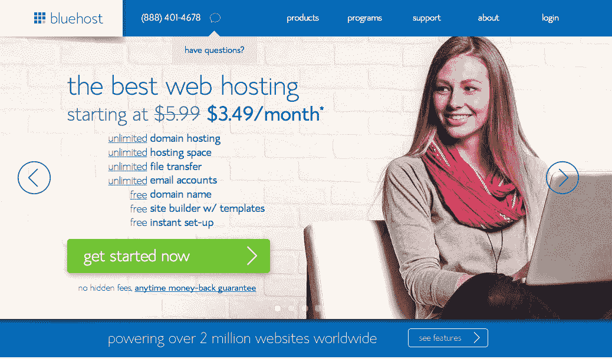
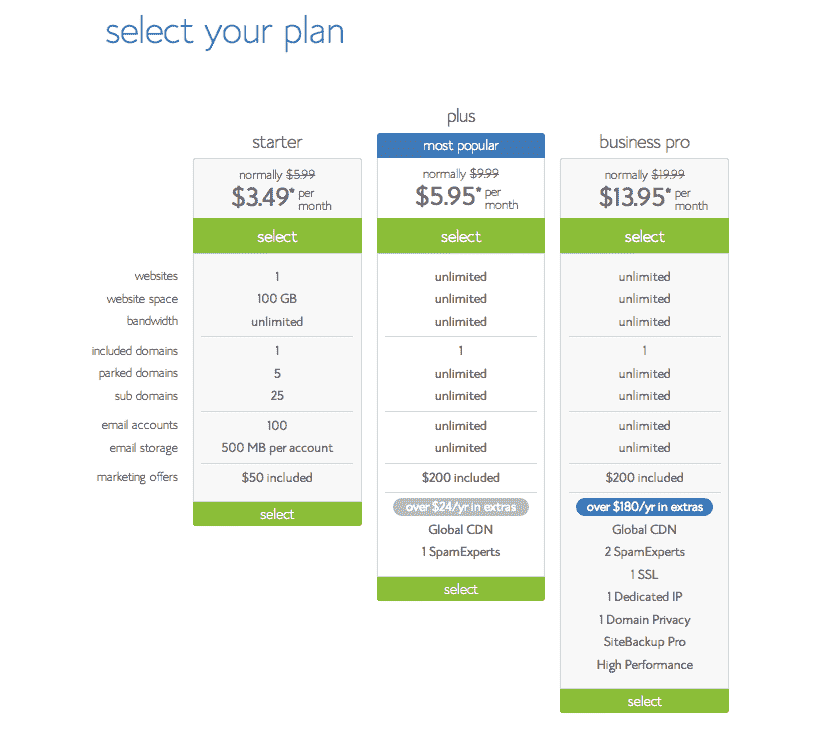
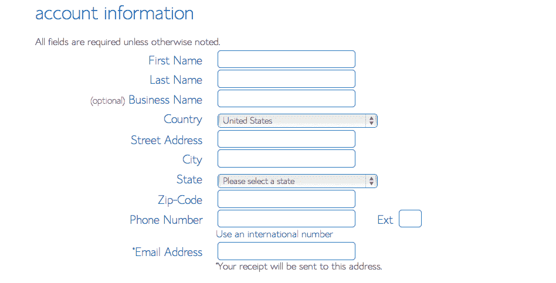
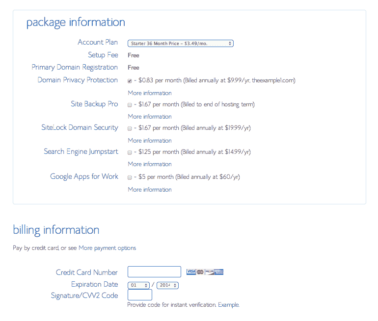

# 如何使用 WordPress 在 10 分钟内创建你的博客

> 原文：<https://simpleprogrammer.com/create-blog-using-wordpress/>

作为一名程序员，创建博客是你职业生涯中最重要的部分之一。如果你是《简单程序员》的追随者，你可能知道我有多重视创建博客和在网上推销自己。创建博客是我职业生涯中做的最好的事情之一。创建博客的好处数不胜数。以下是其中的几个例子:

*   它将你定位为你所在领域的权威
*   它帮助客户找到你
*   它给你可信度
*   这让招聘过程变得简单多了
*   它开启了朝九晚五工作之外的可能性
*   等等。

在这篇博文中，我们将教你如何使用最简单的在线工具之一 WordPress 一步一步地创建一个新博客。你完全可以在 10 分钟之内建立一个博客。简单对吗？那么，我们开始吧。

## **选择虚拟主机公司**

创建博客的第一步是选择一个你可以信任并且可靠的虚拟主机公司。现在有很多虚拟主机服务，你应该特别注意这一步，因为它绝对可以为你的未来节省几个小时的压力和头痛。

我个人推荐 [Bluehost](http://www.bluehost.com/track/simpleprogrammer/) ，这是 WordPress 自己唯一官方推荐的服务。这个组合再好不过了。Bluehost 是最可靠和最强大的虚拟主机公司之一，拥有成千上万的客户。服务器几乎从不停机，它有一个 24/7 的技术支持团队，提供一个免费的域名，当然，它有一个一键式 WordPress 安装功能，这使得这个过程更加容易和快速。

在这篇博文上[注册 Bluehost 的用户将获得比正常价格低 15%的**(取决于你选择的计划)。Bluehost 对简单程序员读者的礼貌。**](http://www.bluehost.com/track/simpleprogrammer/)

为了加快速度，为你的博客想一个域名，并准备好你的信用卡。完成后，按照下面的步骤。

## **设置您的托管账户**

要开始，进入 Bluehost 的主页，点击[“立即开始”](http://www.bluehost.com/track/simpleprogrammer/)。

  

点击立即注册

下一步是选择适合你的计划。如果你刚刚开始，对你来说最好的计划肯定是“起步计划”。然而，如果你打算获得可观的流量，甚至创建多个博客，你肯定应该考虑购买更可靠的计划，如 plus 计划或 business pro 计划。

之后，你会被要求为你的博客选择一个域名。如果您还没有域名，您可以在这一步购买一个。最棒的是，购买这个新的 WordPress 托管账户是免费的。选择一个域名，然后单击“下一步”。*(注意:如果您已经有域名，只需在“转移域名”字段输入您当前域名的名称，然后按照 Bluehost 提供的步骤操作)*

一旦你选择了域名，就该输入你的个人信息了。

下一步是选择您的套餐计划并输入您的账单信息。普通的共享主机服务定价为 12 个月、24 个月和 36 个月。长期计划会帮你存更多的钱，你的月供也会越低。研究什么将是最适合你的选择，并选择一个包。你还会看到一些 Bluehost 合作伙伴提供的服务，比如 SEO jumpstart 和 domain privacy。选择符合您需求的产品。

填写您的帐单信息并选择您的主机包后，单击“下一步”完成您的购买。您将被要求为您的帐户创建一个密码。你可以使用 Bluehost 的密码生成器，也可以自己想出密码生成器。

现在你已经完成了虚拟主机部分的设置，是时候安装 WordPress 了。

## **安装 WordPress**

这曾经是开始写博客时最复杂的步骤之一。然而，Bluehost 最近让你什么都不用做。

看看这个视频，我向你展示这有多简单:

[https://www.youtube.com/embed/13z4_hVF4V8?feature=oembed](https://www.youtube.com/embed/13z4_hVF4V8?feature=oembed)

现在你已经自动创建了你的 WordPress 安装，并且你已经自动登录到你的新的 WordPress 博客了！

你已经完成了博客的创建和 WordPress 的安装。现在，只需进入管理员登录网址登录你的 WordPress 网站。输入您的用户名和密码，然后点击“登录”。这将把你带到你的 WordPress 仪表盘。从这里，你可以控制你的 WordPress 网站的一切，比如写博客，创建页面，改变整体外观等。

## 想要更进一步吗？

这只是一个关于如何创建博客的简单介绍。创建博客的好处很多，我在我的免费博客课程中详细介绍了这些好处，你可以[在这里注册](https://simpleprogrammer.com/blog-course)。