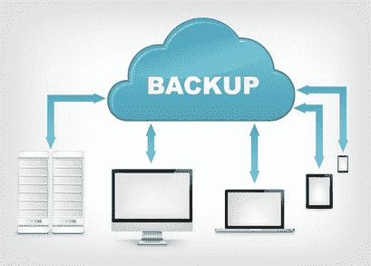

# 如何创建您可以信赖的简单备份解决方案

> 原文:[https://simple programmer . com/create-simple-backup-solution-can-trust/](https://simpleprogrammer.com/create-simple-backup-solution-can-trust/)

备份数据非常重要。

我们都听说过太多这样的故事:硬盘崩溃，电脑丢失或被盗而没有备份，电脑主人遭受不可替代数据的可怕损失。

  

为什么我没有备份我的数据？

那么，如果我们都知道备份数据如此重要，为什么不去做呢？

嗯，我们中的一些人是这样做的，但是我知道我交谈过的大多数软件开发人员要么根本没有做好备份，要么做着我称之为半吊子的工作。

原因很简单:**想出一个好的备份解决方案很难，或者至少看起来是这样。**

这就是我写这篇博客的原因。我想让它尽可能简单。

我将向您展示一种创建备份策略的简单方法，而不仅仅是一种解决方案，您可以轻松实施。

基本方法如下:

*   减少需要备份的“东西”的数量
*   将备份数据分为两类:关键和非关键
*   拥有三份数据拷贝，两份在本地，一份在异地
*   让一切自动化

## 步骤 1:减少需要备份的“东西”的数量

简化备份解决方案的最简单方法是从减少需要备份的内容开始。需要备份的内容越少，管理这些备份和实际执行备份就越容易。

  

如果不需要，就不要存放

我们想要做的是检查我们认为需要备份的所有数据，并尝试尽可能多地删除这些数据。

我认识的大多数人，尤其是软件开发人员和 IT 人员，都在存储各种他们永远不会用到的东西。

我过去常常把各种各样的电影、视频游戏和音乐拷到我的电脑上，然后把它们保存在一个巨大的图书馆里，这样，如果我需要的话，我就可以数字化地访问所有这些东西。

猜猜我有多经常需要一些我已经看过的电影，一个我已经打败的电子游戏或者一本我已经读过的书？

几乎从来没有。

现在，我意识到有些人确实在使用他们庞大的媒体库。例如，儿童电影经常会被看很多遍，但是你必须承认可能有很多东西你再也不会接触了。

我试图清除尽可能多的东西，我知道我可能永远不会再接触。

我知道你可能会抗拒这样做，但让我试着说服你，这是一个好主意，然后你可以忽略我，如果你想备份它。

首先，想想今天按需租用数字内容或从亚马逊或易趣上买东西是多么容易。你真的需要存储一份《[在罗克斯伯里过一晚](http://www.amazon.com/gp/product/B00819ECMO/ref=as_li_tl?ie=UTF8&camp=1789&creative=390957&creativeASIN=B00819ECMO&linkCode=as2&tag=makithecompsi-20&linkId=WJGRWRWBAOAYFH6U)》吗可能不会，如果你想再看一遍，只要付几块钱，然后[到这里](http://www.amazon.com/gp/product/B00819ECMO/ref=as_li_tl?ie=UTF8&camp=1789&creative=390957&creativeASIN=B00819ECMO&linkCode=as2&tag=makithecompsi-20&linkId=WJGRWRWBAOAYFH6U)就可以了。

如果你看了很多电影，订阅《网飞》会比你试图存储每一部你看过的电影的副本好得多。想想你浪费了多少时间把电影拷到磁盘上，并且一丝不苟地组织它们。这些电影你到底看了几部？

音乐、书籍和电子游戏也是如此。大多数东西只会被消费一次。尽可能多地扔掉这些东西。你不仅不再浪费时间存储所有这些东西，而且你的备份会更容易，你会发现巨大的精神负担从你身上卸下来了。

即使是巨大的音乐收藏也大多是浪费时间。你可以订阅多种音乐服务，以低廉的月租费获得你想要的任何音乐。

另外，这种趋势只会越来越强。越来越多的东西将按需从云中获得，只需支付少量的租赁费或月租费。

别再存那些垃圾了。

## 步骤 2:将备份的数据分为两类:关键和非关键

将 1tb 的数据备份到云中需要很长时间，而且成本可能很高，这就是大多数人不这么做的原因。

那么，你最后得到了什么？

嗯，如果您像大多数人一样，您最终会有某种本地备份，而您实际上没有一个好的云或异地备份。尝试将所有数据备份到云中太麻烦了。

如果您遵循了我的第一步，您应该可以减少需要备份的总数据量，但是我们可以做得更好，将数据量减少到更少。

不要试图将所有东西都备份到云或异地，如果你专注于备份关键的东西，你会发现它更易于管理，而且你不需要千兆互联网来备份所有东西。

将所有需要备份的数据分成两类:关键数据和非关键数据。

重要的东西是指一旦你失去了它们，你会很难过的东西，因为它们是不可替代的，或者会给你带来很大的伤害。

对我来说，关键数据的一个很好的例子是我妻子的照片。如果我丢失了我妻子的照片，我可能需要找一个新的妻子。

  

如果你爱我，你会有云备份

对我来说，其他关键数据是我正在进行的当前项目和过去的项目，我可能需要在未来的某个时间再次访问这些数据。

[我的 Pluralsight 课程](https://simpleprogrammer.com/pluralsight)和其他培训课程是关键数据。我的应用程序的源代码是关键数据。

关键数据的对立面是非关键数据——废话。

但是什么是非关键数据呢？

这些数据可能会丢失，但不会是世界末日。也许数据丢失会给你带来小小的不便，但是可以被替换。

电影、视频游戏和音乐的收藏都属于这一类。是的，如果您丢失了这些数据，您会很失望，但是您可以替换这些数据，即使这可能会花费您一些钱。

现在，在你对你的电影收藏妄自尊大之前，请记住，**我不是说我们不会备份你的非关键数据**-我们会的-只是我们不会将这些数据备份到云或异地。

其他非关键数据可能是您的计算机或开发工作站的图像。如果你丢失了那个备份，你可能不得不重新安装你的操作系统或者浪费一些时间重新安装其他程序，但是这没什么大不了的。

您的大部分数据应该是非关键的。当然，除非你已经处理掉了大量的数据，因为你意识到存储那些你再也不会使用的数字拷贝是徒劳的。但是，如果我现在还没有说服你，我可能永远也不会，所以我们就把你的"[完整的黑客帝国三部曲(黑客帝国/黑客帝国重装上阵/黑客帝国革命)[蓝光]](http://www.amazon.com/gp/product/B001CEE1YE/ref=as_li_tl?ie=UTF8&camp=1789&creative=390957&creativeASIN=B001CEE1YE&linkCode=as2&tag=makithecompsi-20&linkId=LSLGZALXO6MJFSSP) "非关键数据。

## 步骤 3:准备三份数据副本，两份在本地，一份在异地

好了，现在我们实际上已经准备好备份了。

最有可能的情况是，您会有少量的关键数据，或者大量的非关键数据，或者几乎没有数据。

我们不想丢失的关键数据。因此，我们需要确保该数据始终有三份拷贝。

  

三份数据拷贝，两份本地，一份异地或云

最简单的方法是:

*   一份工作副本
*   一个本地备份
*   和一个云备份

今天，这实际上很容易实现。

有一段时间，我通过使用类似于 [CrashPlan](https://www.code42.com/) 的服务来做这件事。崩溃计划允许您指定计算机上的文件夹备份到另一个位置，并指定一些文件夹备份到崩溃计划云服务器。

我创建了两个备份集。一个把我的关键数据备份到我电脑的另一个硬盘上，另一个备份到 CrashPlan 的服务器上。

这在一段时间内运行良好，但后来我意识到，当我已经为 Dropbox 的额外存储空间付费时，我并不真的需要支付 CrashPlan 的月费，我还想有一个中心位置来本地备份数据，而不仅仅是从我的一台 PC 备份。我妻子需要备份一些数据，我有一台笔记本电脑和其他设备。

别误会，CrashPlan 很棒。我强烈推荐它，但如果你有一个 NAS(网络附加存储)和一个 Dropbox 或 OneDrive 的帐户，你可能真的不需要利用像 CrashPlan 这样的服务。

但是，在我进入我正在做的事情的细节之前，让我们再一次谈论策略。

我们想要三份我们的数据。一份工作副本、一份本地备份和一份异地备份。

有许多方法可以实现这一点；最简单的方法是使用云存储解决方案，如 [Dropbox](https://db.tt/shOx0t2) 或 [OneDrive](https://onedrive.live.com/?invref=6f46d1304980a5c7&invsrc=90) 作为异地备份，然后想办法进行本地备份。

我们需要异地备份和本地备份的原因是，我们有两种可能的情况:

1.  您的本地备份失败，当您恢复数据时，您发现了这个问题。在这种情况下，你可以从云中获取数据。
2.  您的云备份要么失败、停业，要么丢失数据。在这种情况下，您可以使用本地备份来恢复数据，并将异地备份移动到另一个服务。

如果你只是把你的数据放在云端，这是不够好的，因为你完全依赖于别人的服务，而你无法控制。

如果你只是在本地备份你的数据，这是不够的，因为你可能会发生火灾，你的整个房子可能会被烧毁，或者你可能会被抢劫，或者你的备份可能只是失败，而你不知道。

## 我如何备份我的关键数据

那么，既然我已经取消了 CrashPlan 订阅，我该如何备份我的关键数据呢？

嗯，我投资了 Synology NAS，即网络连接存储。

我买了一台 [Synology DiskStation 2-Bay(无盘)网络连接存储(DS213j)](http://www.amazon.com/gp/product/B00CRB9CK4/ref=as_li_tl?ie=UTF8&camp=1789&creative=390957&creativeASIN=B00CRB9CK4&linkCode=as2&tag=makithecompsi-20&linkId=GRCWNI4RKRPLAJ7O) ，我将它直接连接到我的网络。

它允许我网络中的任何计算机将它用作文件服务器，它运行自己的小操作系统，可以做各种各样的事情，如将我的数据备份到 Dropbox 甚至亚马逊冰川。

与在我的计算机中安装一些硬盘来创建数据副本相比，这种设备有两大优势:

1.  我家里的所有电脑和设备都可以轻松访问这些数据。我不需要打开我的主电脑并连接到网络。
2.  Synology 设备非常容易实现 RAID 类型的存储。因此，我可以有两个硬盘，如果其中一个发生故障，另一个仍然有所有的数据。

第三，对我来说，Synology box 可以作为一个完整的媒体服务器。我不常使用这个功能，但我知道一些收藏了大量电影的人会使用。

我的解决方案的关键点是 Synology 设备创建了一个非常好的冗余 RAID。在我看来，这相当于本地数据的两份拷贝。

我只是把我的 Synology box 作为一个网络驱动器连接到我的电脑和设备上，我存储任何我想确保备份到那里的数据。

Synology 有一项服务，你可以安装这项服务，将你的设备与你的 Dropbox 帐户挂钩(OneDrive 支持即将推出。)因此，我只需将 Synology 驱动器上 Dropbox 文件夹共享到我的网络中，我可以将任何我想要备份的文件放在该共享中，这些文件不仅会在 Synology 驱动器上进行双重备份，还会备份到我在云中的 Dropbox 帐户。

我的妻子也可以这样做，所以这很方便。

我甚至不再担心在我的电脑上有一份本地备份，因为我知道 Synology drive 中的数据备份在两个硬盘上和云中。

## 我如何备份我的非关键数据？

非关键数据呢？

简单。我只是把它复制到 Synology 设备上的一个共享区，这个共享区没有备份到 Dropbox 账户。

例如，现在，我唯一真正考虑的非关键数据是我计算机的图像。我只是把这些放在 Synology 上分享，我不担心它们。

## 为什么不使用 CrashPlan 或 Mozy 这样的备份服务呢？

同样，整个事情可以通过 CrashPlan 这样的备份服务来完成，但如果我已经有了一个我使用的 Dropbox 帐户，我看不出支付和管理另一个备份系统的意义。

事实上，我很可能会专门转向 OneDrive，因为微软最近刚刚宣布，Office 365 用户可以获得无限的 OneDrive 存储空间。

如果你想使用备份服务，尽管去吧。只要确保您的关键数据有本地备份和基于云的备份即可。

## 步骤 4:让一切自动化(并测试它)

如果你遵循了我的备份计划，或者你正在使用像 CrashPlan 这样的服务，那么你可能不需要在这里做太多，因为一切都已经自动化了。

CrashPlan 会在数据发生变化时自动备份，所以你真的不用担心。

而且，如果你使用的是 NAS 和 Dropbox 之类的服务，这也是自动化的，因为你基本上只需将文件放入 NAS 上的 Dropbox 文件夹，它就会自动与 Dropbox 同步。

但是，如果你正在做别的事情，只要确保整个过程是自动化的。例如，您可能想要自动备份电脑的映像。或者，您可能希望自动从手机或相机中取出照片，并将其放入备份位置。

最后，确保你测试了所有的东西。

没有经过测试的备份是没有价值的。

如果你使用 CrashPlan 这样的服务，试着从中恢复数据。

如果您的备份将是您的 Dropbox box 和 NAS，请进行测试。确保您可以检索到您需要的任何数据。如果您正在备份数据库或快照 PC，请确保您可以恢复所有这些备份，否则一开始就不要费心备份它们。

最糟糕的事情莫过于尝试恢复备份，却发现它毫无用处或不起作用。

## 你在备份你的数据吗？

请在下面的评论中告诉我。

并且，如果你喜欢这篇文章并觉得它有帮助，加入这个简单的程序员社区，这样我就可以保持联系，并在我有新文章或其他你可能感兴趣的免费内容时通知你。

还有，如果你有一些其他的建议或者觉得有我遗漏或者没有考虑到的地方，留下评论让我知道。