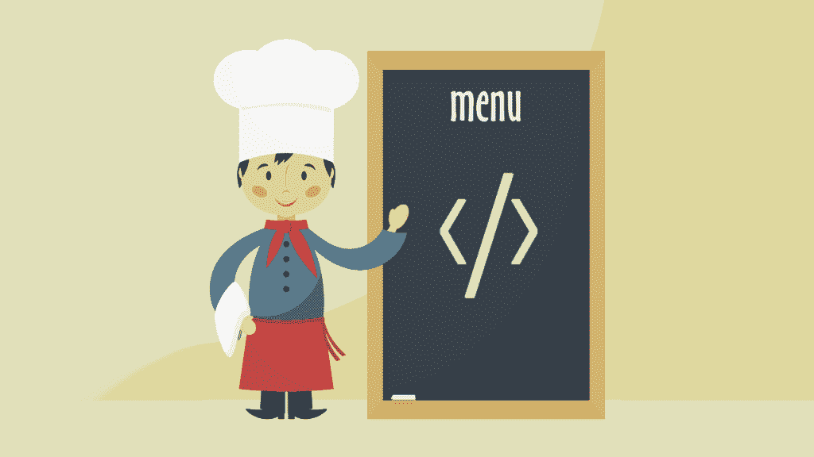

# 创造一个产品？对编程以外的事情充满热情

> 原文：<https://simpleprogrammer.com/creating-a-product/>

打造自己的产品是一项艰巨的工作。根据我的经验，你可以几个月都没有收入。这会让人士气低落，尤其是如果你并不特别关心你正在建造的东西。

有这种想法的不止我一个人。史蒂夫·乔布斯曾经说过，你需要热爱你所做的事情，因为创业是如此艰难，你的激情往往是唯一能把你推向终点的东西。

没有人会拍拍你的背，钱甚至可能不会来。

我进入软件行业几乎是偶然的。年复一年，我住在山里，在美国和新西兰追寻无尽的冬天。

我做过各种工作，从餐厅服务员到滑雪板租赁，所有这些都是为了让我每天能花几个小时做我真正喜欢的事情——滑雪。

作为一种生活方式的选择，这非常有趣。我强烈建议推迟几年(或者近十年)的职业生涯，只是为了用这种方式享受 20 多岁。

然而，作为一个实际的职业选择，它并不令人满意。

我不想把我的余生都拴在一个小镇滑雪场的当地经济上。我想做重要的高薪工作。最终，我想退休，这样我就再也不用做那种工作了。

问题是怎么做。我有一些编程技能，但我不知道要构建什么。那时，我是一名收入微薄的自由撰稿人，我知道我的时间应该用来做更好的事情。

但是什么？

## 我如何为我热爱的运动开发并发布应用程序

12 月的一天，天气凉爽，我和朋友们在平底船上，想出了一个主意。

我们看过孩子们制作自己的骰子的视频，上面有不同的滑雪板技巧。它们被称为“雪骰子”我的朋友在缆车上有一套，我们滚动不同的技巧，看看我们应该在下一圈通过地形公园时尝试什么。

当时我甚至没有智能手机，但我很清楚，如果我有，我会想要某种应用程序版本的游戏。

你必须意识到，这是在 2010 年，当时智能手机还不是一个真正的东西。山坡上的大多数人使用翻盖手机。我不知道这样的想法是否会流行起来。

话说回来，所有这些孩子用一套实体骰子玩雪骰子是相当愚蠢的。

你可以丢骰子。当你脱下手套去卷它们时，你的手会变冷。骰子是有限的，你可以在上面玩多少花样。

所以尽管我最初有所保留，我耸耸肩，建造了这个东西。毕竟，我想要自己的产品。我真的不在乎[是否有很多人买](https://simpleprogrammer.com/2015/02/12/can-get-people-buy-product/)。我想我可以赚几千块然后就此收工。

不完全是这样的。差远了。

一年后，地形公园里几乎每个人的手机上都有我的应用程序。专业滑雪者正在使用它。世界各地的人们在法国举行比赛，使用我们的应用程序为每场比赛设计技巧。

我和我的商业伙伴已经有点名气了。

## 为什么？不是因为我真的热爱编程。

当我住在新西兰南岛一个冰冷破旧的健身房时，我开发了这个应用程序的第一个版本。那个地方太脏了，我都不好意思邀请别人来做这个产品。

我花了大约两周的时间来学习 Objective-C 并把这个应用程序放到应用商店里。老实说，当我写我们发布的第一个构建时，我已经半醉了。只能说这是一个相当喜庆的家庭，到处都是滑雪爱好者。

但这些都不重要。产品足够好。

忘记我对如何正确设计一个 iOS 应用一无所知。忘记到处都有代码重复，我没有时间去学习什么是视图控制器。(顺便说一句，我现在知道了，我强调工作时不喝酒。)

这些都不重要。

重要的是漂亮的图形和漂亮的动画。重要的是专业滑雪者使用我们的产品发布自己在地形公园滑雪的视频。这些事情比我在代码中做的任何事情都重要。

[https://www.youtube.com/embed/Vs3UyCjV5XY](https://www.youtube.com/embed/Vs3UyCjV5XY)

My knowledge of the tricks mattered. Our app could dream up combinations that most people wouldn't think of themselves. It challenged them.

我们在 9 月中旬向市场推出了一款摇摇欲坠的产品，人们对它如饥似渴，第一天就有超过 500 次下载。

我永远不会忘记第二天早上。我检查了我们的数字，吐出了我的咖啡。

## 编程是达到目的的手段，而不是目的本身。

当我创建“雪骰子”时，我并没有这样做，因为我想得到一份程序员的工作。这不是什么“作品集”我甚至不知道我应该有一个投资组合。我当时超级天真，完全不知道一个程序员可以在一年内轻松拉下 10 万美元。

我开发我的产品有几个简单的原因:我想和我的朋友一起玩滑雪游戏，我想在山上挑战自己。我们一遍又一遍地玩同样的把戏。把东西混在一起很有趣。

好吧，你说对了，我也有点想做些酷的事情。

无论如何，我从来没有把编程本身看作是目的。甚至到今天，我还有那种态度。是我的口头禅。

我们所做的一切都是为了服务于设计。我们变得更好，所以我们可以制造更好的产品。

这并不是说我不喜欢编程。我知道。你可以说我对此充满热情。但是我总是回想起激励我采取行动的事情，那种想要做一些我想让 T1 使用的东西的愿望。

## 但是不知道从何说起。我该怎么办？

T2】

我告诉你要做的最后一件事就是走出去，买一把吉他，学习如何弹奏它，这样十年后你就可以创建有史以来最好的吉他应用程序。

我只是建议你清点一下。你在业余时间做什么？如果你回顾一下去年所有的周末，它们是怎么度过的？

蒂姆·费里斯有一个新颖的方法。他看看最近他把钱花在了什么地方。特别是，他寻找昂贵的商品，似乎他对产品的价格并不敏感。

那些是他真正热爱的产品。这些是他非常想要的东西，价格也不能阻止他。

一个新产品的想法几乎总是来自这种购买。

如果你看看我的财务状况，你肯定会发现一个规律。每当我不在乎价格时，我可能会购买以下三样东西中的一种:

1.  滑雪板装备
2.  苹果产品
3.  视频游戏

所以我最终为滑雪的人做了一个应用也就不足为奇了。这正是我愿意花很多钱买的那种东西。如果我——我是一个普通人——经常在滑雪板产品上花大钱，那么其他人也很有可能会这么做。

但还有更好的。

## 你的爱好只是一个开始。

我告诉你一个小秘密。“雪骰子”不是我们最成功的产品。绝不可能。

滑板骰子(Skate Dice)是一款面向滑板爱好者的应用。

[https://www.youtube.com/embed/JkRXmKrkcl4](https://www.youtube.com/embed/JkRXmKrkcl4)

“But that’s blasphemy,” you’ll say. “Didn’t you just tell us we should build a product for the thing we are passionate about?”

是的，你应该这样做。但是一旦你已经投入了工作，你就离另一个产品只有一步之遥了，这个产品很容易赚到比你的第一个产品多十倍的钱。

多年来，我和我的商业伙伴已经意识到，我们不只是发明了世界上最好的随机滑雪板技巧应用程序。

我们发明了世界上最好的随机“极限运动”技巧应用程序。

滑雪、滑板、单板滑雪和小轮车。我们写的软件完成了所有的工作。

我们为单板滑雪版本采用了相同的代码，并使用它为尽可能多的运动构建了相同的应用程序。我们所需要做的就是与一些专业运动员交谈，交换不同的技巧，并加入一些新的图形。其他一切都保持不变。

现在，你可能会想为你真正热爱的某个爱好开发一个应用程序。我在这里告诉你这只是开始。一旦你的产品的第一个版本上市，你可以迅速扩展到其他领域。这是你更有可能获得更高回报的地方。

在我们的案例中，滑板的观众人数恰好是单板滑雪的十倍。用相对较少的努力，我们获得了十倍的收入。

## 无论你做什么，不要做快餐厨师。

我从来没有完全认为自己是一个程序员。我是一名滑雪运动员，为他的运动开发应用程序。我是一名设计师，用代码来创造一个美丽而实用的产品。在更好的东西出现之前，我写代码，因为这是我需要做的事情，来制造我想要的东西。

代码是我的工具。这不是我的身份。

厨师和快餐厨师的区别是什么？毕竟两者技能差不多。厨师可以做饭，许多快餐厨师也有和厨师一样的烹饪能力。

那么这两者之间有什么区别呢？为什么一个厨师能得到所有的名声和金钱？我提个建议:厨师知道为什么。

一名厨师要经过艰苦的工作，将正确的配料放在一起。她寻找能与她服务的人群产生共鸣的口味组合。她找到了观众。厨师不只是做饭。厨师设计菜肴，每一道菜都有独特的用途。

程序员经常被视为快餐厨师。有时，我们被告知要建造什么，却没有被带入对其目的的更大讨论中。我们中的一些人认为这没关系。它不是。

快餐厨师永远不会真正成功。这同样适用于只写代码的程序员。

如果你想成为一名更好的程序员，你需要关心为什么。你需要对你的软件解决的问题感兴趣。你需要参与关于设计和商业发展的混乱的固执己见的对话。你需要有能让你用新的眼光看待世界的爱好。

你需要对大局充满热情。如果你不是，你将拥有所有的工具，却没有任何原料。