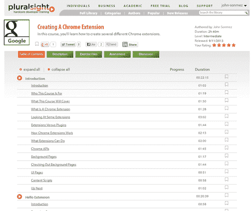

# 创建 Chrome 扩展

> 原文：<https://simpleprogrammer.com/creating-chrome-extension/>

对这门课程非常感兴趣。我发表这个帖子有点晚了。但是，上周我的关于创建 Chrome 扩展的 Pluralsight 课程发表了。

[创建 Chrome 扩展](https://simpleprogrammer.com/creating-chrome-extensions)

创建一个 Chrome 扩展非常容易，而且真的不需要很长时间就能学会。如果你懂 JavaScript 和 HTML，你已经知道了你需要知道的 75%。

以下是课程描述:

Chrome 是谷歌推出的一款非常棒的浏览器，速度非常快，重量轻，但功能也非常强大。Chrome 还有一个非常好的扩展性模型，允许开发人员只需要 HTML、CSS 和 JavaScript 技能就可以创建强大的扩展。

在本课程中，当我们创建 3 个不同的 Chrome 扩展时，我将向你展示创建 Chrome 扩展的基础。我们将从课程开始学习一些关于 Chrome 扩展的基础知识，以及扩展如何在 Chrome 中工作，然后我们将开始创建我们的第一个扩展。

一旦我们有了基础，我们将建立一个更强大的扩展，它有自己的用户界面和选项页面，能够使用 Chrome APIs 保存数据，并在 Chrome 的右键菜单中添加自己的条目。

然后，我们将学习创建一个页面动作扩展，它只会出现在某些网页上。我们还将学习如何利用 Chrome 消息 API，甚至如何将我们自己的 JavaScript 和 CSS 注入到现有页面中以增强其功能。

实际上，我们将让我们的扩展修改 [Pluralsight](https://simpleprogrammer.com/pluralsight) 网站课程列表页面，以使课程列表可排序——因此，您不会想错过这个。

最后，我们将通过学习如何调试和部署扩展来结束我们的 Chrome 扩展之旅。

因此，如果你对 Chrome 扩展感兴趣，但一直认为为自己创建一个可能太难了，你肯定需要看看这个课程。相信我，这比你想象的要简单得多，本课程将告诉你如何去做。