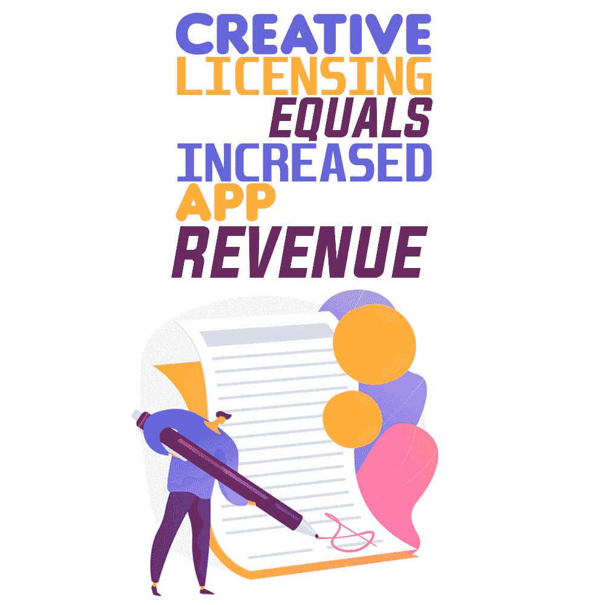

# 创意许可等于增加应用收入

> 原文：<https://simpleprogrammer.com/creative-licensing-app-revenue/>

Software licensing, a process often overlooked or hastily implemented to meet product deadlines, is a key ingredient to increasing value to your users, as well as increasing revenue to you.

企业和软件开发人员必须仔细考虑许可对收入、客户保持和软件开发周期的影响。

我建议利用[创造性的许可策略](https://simpleprogrammer.com/value-of-failure/)来增加你的应用程序的价值。您的许可策略不需要专门针对您的应用程序或以前从未做过的事情，但它需要适用于您的产品，例如按产品功能、期限许可或使用许可进行许可。

许可的目标是提供最能满足客户广泛多样需求的产品，同时降低他们与许可相关的成本。

让我们考虑一下软件许可的“为什么”和“是什么”,以及如何确定哪种许可形式最适合您的应用程序。

## 为什么您应该许可您的应用程序？

简单明了，钱。开发软件需要无数的时间和资源。周到的许可使您能够利用这一投资。[许可通过定期支付增加您的收入](http://www.amazon.com/exec/obidos/ASIN/1119167965/makithecompsi-20)。

以一次性预付款的方式直接销售软件通常会降低购买能力，并可能会吓退潜在客户。创新和灵活的软件许可有三个主要优势:

*   它提高了客户的承受能力。
*   它为您的软件提供控制和安全性。
*   它保护你的投资。

让我们仔细看看这三个优势。

**提高可负担性:**通过消除前期成本，并为您的客户提供小额、持续的付款，您降低了访问软件的门槛。

这样做，你会吸引那些不愿意支付大笔预付款的客户。这样你也可以吸引那些只需要在短时间内使用你的应用程序并且不能证明初始投资是合理的客户。可负担性的提高[会带来更多的客户，这就意味着更多的收入](http://www.amazon.com/exec/obidos/ASIN/0692620931/makithecompsi-20)。

**软件的控制和安全性:**软件许可让您可以控制谁可以访问应用程序、访问多长时间以及他们可以访问哪些功能。您可以防止未经授权的访问或访问受限者的过度使用，从而确保每次使用您的应用程序都能获得收入。

**保护您的投资:**无论是最终用户在不知不觉中安装了比付费时更多的应用程序实例，还是恶意用户试图侵入您的软件，都会威胁到您的应用程序的完整性并绕过税收征收。执行良好的许可策略可以确保您的客户付费使用。

## 什么样的软件许可策略能产生最好的结果？

**基于使用的许可:**这为最终用户提供了应用程序中预定数量的使用或令牌。

打印报告就是一个例子。客户可以使用该应用程序，但他们必须付费打印报告。当您的客户用完所有用途时，他们必须购买额外的用途或代币，从而创建一个产生收入并确保付款的活动。

**基于时间的许可:**它允许最终用户在一定时间内访问您的应用程序。在许可期限到期时，用户必须购买额外的时间来继续使用，从而创造一个创收事件。

每月或每年授权是常见的方法。每月许可产生更多的收入收集点，但允许客户取消他们的订阅。年度许可通常提供折扣，并提前支付，锁定客户一整年。

**基于功能的许可:**顾名思义，它启用或禁用软件中的特定功能。一种常用的基于功能的许可策略包括基本、基本加和高级。用价格更低、功能更少的基本版本吸引客户。您的用户必须购买 Basic Plus 或 Premium 软件才能获得附加功能并充分利用应用程序的潜力。

## 制定许可策略的四种方法

现在让我们讨论开发您的许可策略的四种方法:自主开发的解决方案、软件解决方案、云解决方案和硬件加密狗解决方案。每一种都有明显的优点和缺点。

**自行开发的软件许可:**自行开发的许可解决方案是在内部开发的。这些解决方案是由专注于应用程序开发而非许可的内部软件开发人员创建的。

如果没有这种关注，通常只包含基本级别的许可选项。这种解决方案实现起来可能很便宜，因为开发人员已经在职，但是如果需要升级就很难维护，并且随着时间的推移会变得昂贵和不灵活。

**基于软件的许可:**基于软件的许可利用第三方软件实施许可。许多供应商提供自动保护，不需要修改源代码，但是使用自动保护对许可的内容控制较少。

要访问受保护的应用程序，许可证密钥存储在最终用户的本地计算机上，不需要连接到互联网。

**基于云的许可:**与软件许可一样，云许可利用第三方软件来实施许可，并且还提供自动保护(不改变源代码)。

不同之处在于许可证密钥的存储位置。

对于基于云的软件，许可证存储在云上，计算机必须连接到互联网才能访问软件。

**基于硬件加密狗的许可:**硬件加密狗许可类似于软件和基于云的许可，它利用第三方技术来实施许可。

可以使用自动保护或通过源代码集成来实现加密狗。当在源代码级别集成时，可以定制许可以满足您和您的客户的需求。

要访问应用程序，许可密钥存储在物理加密狗上，该加密狗必须存在并插入计算机。拥有一个外部硬件大大增加了安全性和便携性。不需要连接到互联网或许可证服务器。

## 让创造性的许可策略为你所用

Determine which strategy to implement by identifying your product offering as a whole and asking yourself three questions:

1.  我的典型客户的生命周期是怎样的，我会有回头客吗？或者他们是一次性的吗？
2.  我的产品中是否有对理想客户来说不必要的额外功能？
3.  我的客户是否将我的单一产品应用到多种设备中？

对于问题 1，如果你的客户使用你的产品几个月甚至几年，那么基于时间的许可可能适合你。这将允许您在需要的期限内将您的应用程序租赁给他们，并使您能够在最终用户的整个生命周期内创造经常性客户和收入。

如果您分发的应用程序可能附带三到四种不同的产品，那么基于功能的许可可能是最好的，因为您可以提供一个核心产品和附加功能，他们可以在以后或需要时购买。

最后，如果您认为您的客户正在实现您的应用程序的许多实例，我会实施基于使用的许可策略。基于使用的许可防止最终用户购买您的单个产品并将您的应用程序的多个实例安装到多台机器上。

例如，如果您的最终用户需要将应用程序安装在十几台不同的机器上，那么基于使用的许可在这种情况下会非常有用；每次它被访问或使用，你都得到报酬。

## 保护您的应用，保障您的收入

当你把一个产品推向市场时，有两件事你必须做:保护你的应用和你的收入。许可您的产品使您能够保护这两者。

无论您选择基于软件、基于硬件还是基于云的软件许可，您都可以确信，您将有能力通过创造性的、重复性的许可策略来扩大市场份额和增加收入。

您还将通过防止未经授权使用和分发您的应用程序来确保您的投资得到保护。

不要低估你自己或你的产品。你已经投入了大量的时间和精力将你的应用推向市场，所以用安全的收入和安全的应用来奖励你自己吧。