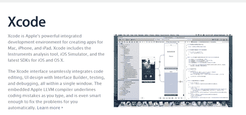
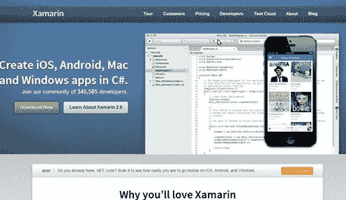
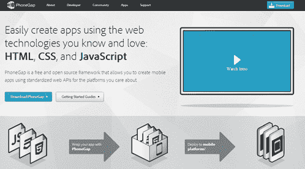
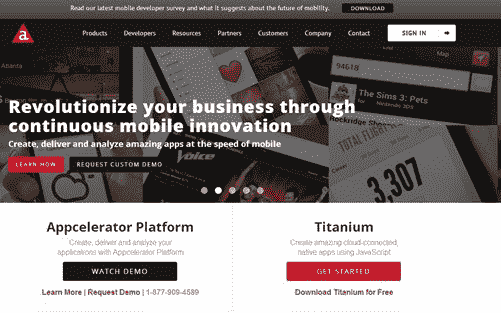

# 应该选择哪个跨移动开发平台？

> 原文：<https://simpleprogrammer.com/cross-platform-mobile-development/>

我处在一个独特的位置，几乎开发过所有主要的跨平台移动开发解决方案。

我已经在以下网站发布了针对 Pluralsight 的[课程:](https://simpleprogrammer.com/pluralsight)

*   [MonoTouch (Xamarin.iOS)](https://simpleprogrammer.com/monotouch4)
*   [安卓版单声道](https://simpleprogrammer.com/mono-for-android) (Xamarin。安卓)
*   [PhoneGap](https://simpleprogrammer.com/phone-gap-intro)
*   [加速器钛](https://simpleprogrammer.com/cross-platform-android-ios-appcelerator-titanium)
*   [原生 Android 开发](https://simpleprogrammer.com/alax)
*   [原生 iOS 开发](https://simpleprogrammer.com/pluralsight)
*   [一夫一妻制](https://simpleprogrammer.com/monogame-1)(跨平台游戏开发)

在使用了所有这些不同的解决方案并调查了其他解决方案之后，我想我应该发表一下我对这些选择中的每一个以及它们之间的差异的想法。

我主要关注 Android 和 iOS，因为即使有其他竞争对手，它们也是目前仅存的主要玩家。其他人的市场份额相对较小。

## 本土发展

构建移动应用程序最明显的方法是使用平台自带的原生工具。

对于 Android，它是 Java 和 Eclipse 或新的 Android Studio 以及 Android SDK。

对于 iOS，是 Objective-C 和 XCode。

对于 Windows Phone 来说，应该是 C#和 Visual Studio。

我为 iOS 和 Android 原生构建了我的第一个移动应用程序。我从我的应用程序的 Android 版本开始，然后将大部分代码和设计移植到 iOS。

这是一个相当困难的过程，我没有能力分享任何代码。我必须学习这两个平台以及它们的 SDK，我还必须学习 Objective-C ，因为在我开始编写我的第一个 iOS 应用程序之前，我不知道 Objective-C 或者任何关于 Mac 开发的东西。

一般来说，我不推荐这种方法，因为你将会浪费大量的时间来维护两个完全独立的代码库，而且使用原生工具也不会有太大的收获。

然而，我建议任何认真考虑跨平台移动开发的人至少在 Android 和 iOS 上开发一个简单的原生应用。这样做的原因是，它将使您更容易理解跨平台移动开发解决方案将为您提供的抽象层下发生的事情，并且它将帮助您看到跨平台解决方案的价值或价值缺失。

## Xamarin 工具

Xamarin 工具基本上允许你用 C#开发一个 Android 或 iOS 应用程序，并分享大量代码。

当您使用 Xamarin 工具编写应用程序时，您基本上是在 iOS 和 Android 的真正 SDK 之上使用抽象。

这意味着，您最终将拥有一个完全原生的应用程序，在每个平台上都有一个完全原生的用户界面。

这也意味着在某种程度上，您可以在平台之间共享的代码量会受到限制。

通常，当我使用 Xamarin 工具开发应用程序时，我会构建一个共享代码的应用程序核心，并让 iOS、Android 甚至 Windows Phone 版本的应用程序依赖于这个核心库。

使用这种方法，你可以重用大约 60-70%的代码，甚至不用非常努力。

但是你可以更进一步，或者使用像 MVC 或 MVVM 这样的架构开发你自己的抽象，这样你唯一没有重用的代码就是实际的视图本身，或者你可以使用像 MVVM·克罗斯这样的框架。当然，这种方法开始有点困难，但是可以提供更高比例的代码重用，大约 80-90%。

至于工具，他的工具棒极了！

Xamarin 有自己的 IDE，名为 Xamarin Studio。这个 IDE 是跨平台的，设计非常好，易于使用。

Xamarin 工具还有一个 Visual Studio 插件，允许您在 Visual Studio 中开发应用程序。您甚至可以从 Visual Studio 开发一个 iOS 应用程序，但是您仍然需要一台 Mac 来执行构建。(该工具使用对 Mac 的远程调用来执行构建。)

Xamarin 最近还引入了一个组件库，可以很容易地直接从 Xamarin Studio 中找到可重用的组件，并将它们插入到您的应用程序中。

**书籍:**

*   使用 C#进行移动开发:构建原生 iOS、Android 和 Windows Phone 应用(作者是我非常尊敬的 Greg Shackles)
*   使用 MonoTouch 为 iPhone 和 iPad 开发 C#应用程序。NET 开发者(由另一位 Xamarin 天才 Bryan Costanich 撰写)

## 开发

PhoneGap 可能是下一个最广为人知的跨平台移动开发解决方案，但它也有些令人困惑。

PhoneGap 基本上是一组 JavaScript APIs，允许您访问设备的原生功能。它还是一个包装器，允许您构建一个本地安装到设备上的 web 应用程序。

当您使用 PhoneGap 构建应用程序时，您实际上是在使用 HTML5 和 JavaScript 构建一个移动网站，就像您今天构建任何其他网站一样，但是您是将 HTML 和 JavaScript 放在手机上。

PhoneGap 应用程序运行在手机的本地浏览器上，并有一些与本地库的挂钩，这些库通过它们的 JavaScript APIs 向您公开。

这一切意味着什么？

这意味着如果你正在开发一个 PhoneGap 应用程序，你可以像开发一个跨平台的移动网站一样开发它。你可以使用任何你喜欢的移动框架，比如 Sencha Touch，或者 JQuery Mobile 等等。

由于你的应用程序将会是 HTML 和 JavaScript，你在很大程度上可以分享你的所有代码，但你不会编写一个本地应用程序。

因为您的 PhoneGap 应用程序将在浏览器中运行，它将更像一个 web 应用程序，而不是一个本地应用程序。您设计的用户界面不会使用本机控件，并且会受到 web 浏览器的限制和速度的影响。

这也意味着您可能需要编写一些特定于平台的代码来弥补浏览器之间的差异，但是您基本上可以假设您将能够共享大部分代码。

PhoneGap 的工具完全取决于您想要构建应用程序的环境。你可以在任何你喜欢的环境中开发，并且在大多数情况下基本上使用 IDE 的插件。有相当多的手动步骤，所以设置起来并不容易。

PhoneGap 的一个很大的好处是 PhoneGap build，它允许你在任何你创建它的环境中上传你的项目，但是为其他平台自动构建它。

**书籍:**

*   PhoneGap 精要(约翰·m·沃戈著)
*   [PhoneGap 2.x 移动应用开发](http://www.amazon.com/gp/product/1849519404/ref=as_li_ss_tl?ie=UTF8&camp=1789&creative=390957&creativeASIN=1849519404&linkCode=as2&tag=makithecompsi-20) (Kerri Shotts)

## 加速钛

接下来我想提一下这个平台，因为很多开发者把这个和 PhoneGap 搞混了。

[Appcelerator Titanium](http://www.appcelerator.com/) **与 PhoneGap 完全不同。**唯一的相似之处是使用的语言是 JavaScript。其他的都完全不一样。

使用 Appcelerator Titanium，您可以使用跨平台移动开发定制 API 来构建您的应用程序。这与 PhoneGap 或 Xamarin 不同，因为使用 Xamarin，您可以使用包装器来包装真正的原生 SDK，而使用 PhoneGap，您可以使用任何想要的东西来构建 HTML5 web 应用程序。

使用 Titanium，你实际上是在他们的 SDK 上编写所有的代码，其中也包括 UI 组件。这意味着当你编写一个 Titanium 应用程序时，你实际上可以编写一个跨平台的用户界面。

Appcelerator Titanium 应用程序实际上是被编译成完全本地的应用程序，这些应用程序为平台使用真正的本地控件。

例如，在 Titanium 中，您可以以编程方式声明一个按钮，并指定其布局和该按钮的一些属性。当你编译你的应用程序时，按钮将在 Android 上显示为一个真正的原生 Android 按钮，在 iOS 上显示为一个真正的原生 iOS 按钮。

这是否意味着你可以构建一个完全跨平台的应用程序，包括 100%代码重用的 UI，并且用 JavaScript 来实现？

也许吧，但可能性极小。许多 UI 元素和交互范例是跨平台的，但有些部分不是。例如，在 iOS 中，你有一个导航控制器的想法，它跟踪你浏览过的屏幕的历史，并让你返回；Android 没有这样的控件。但是，Titanium 确实支持特定于平台的控件，这只是意味着您必须使一些代码基于平台。

所有这些都是说，你可以以最小的公分母进行编程，获得一个完全跨平台的应用程序，接近 100%的代码重用，但是即使你有原生控制，结果可能看起来并不那么好。

事实是，如果您使用的是 Titanium，您可能希望为特定的平台定制应用程序的某些部分。

钛实际上有一些非常好的工具。有一个 Titanium IDE 实际上非常好，在自动完成 JavaScript 代码方面做得非常好，特别是在 Titanium APIs 方面。IDE 的构建过程非常简单，甚至可以让您在相同的代码基础上构建 web 应用程序。还有一个市场，你可以为你的应用程序使用和购买组件。

**Titanium 最近推出了一个名为 Alloy** 的 MVC 框架，它极大地简化了创建 Titanium 应用程序的过程，消除了以编程方式创建所有用户界面的繁琐。有了这个框架，您可以使用 XML 标记来声明您的用户界面，这非常简单。然后使用控制器类来填充 UI 并与之交互。它还有与 CSS 非常相似的样式表的概念。

然而，Titanium 最令人印象深刻的事情之一是它的云产品。 Titanium 基本上允许您访问他们的云服务的完整后端，这允许您轻松创建可以被最好地描述为类似脸书的功能，而不必编写自己的后端代码。你可以使用云服务来管理用户，验证他们，存储关于用户的数据，如社交图，甚至只是存储键值对。这个功能给我留下了深刻的印象。

**书籍:**

[Appcelerator Titanium 应用程序开发示例初学者指南](http://www.amazon.com/gp/product/1849695008/ref=as_li_ss_tl?ie=UTF8&camp=1789&creative=390957&creativeASIN=1849695008&linkCode=as2&tag=makithecompsi-20) (Darren Cope)

Appcelerator Titanium:模式和最佳实践

## 更多跨平台移动开发选项？

显然还有更多选择，但我选择这三个用于标准应用程序开发，因为根据我的经验，它们是最重要的广泛使用的产品。

这 3 种产品也包含了几乎所有跨平台移动开发的方法:

*   共享代码，但独立的原生用户界面(Xamarin)
*   本地运行的 HTML5 应用程序(PhoneGap)
*   完全共享的代码本地应用程序(Titanium)

显然，每种方法都有其利弊，没有什么是完美的，但我确实考虑了所有这些好的解决方案。

总的来说，我更喜欢 Xamarin 方法，因为我喜欢完全控制本机用户界面，也喜欢能够用 C#开发。

如果我现在用 PhoneGap 进行开发，我最有可能使用的是 [Icenium](http://www.icenium.com/) ，它基本上是一个 IDE，是围绕 Cordova(PhoneGap 的开源部分)构建的一组构建和测试工具，使得开发和部署更加容易。

如果您想学习如何快速使用这些移动开发框架，请不要忘记查看我的 Pluralsight 课程。

成为一个平台的专家并不会给你一张通往伟大事业的免费通行证。如果你有技能，但只是看不到你的职业发展，那么[看看我的关于作为软件开发人员推销自己的课程。](https://simpleprogrammer.com/store/products/how-to-market-yourself/)T3】