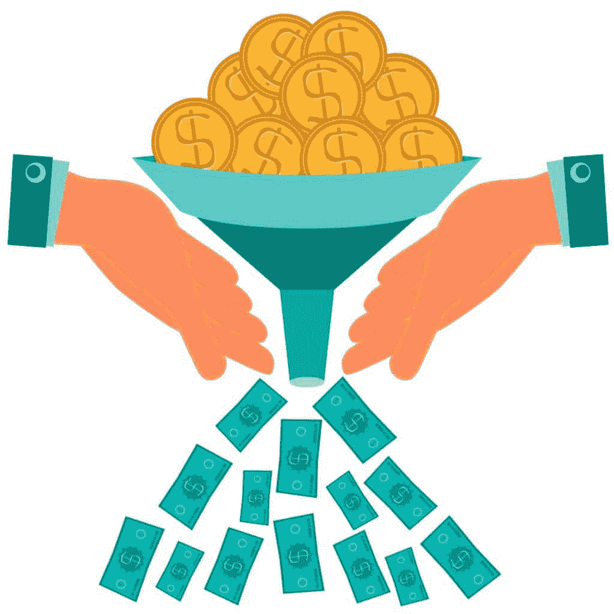

# 如何为编程专业人士培养赞助人

> 原文：<https://simpleprogrammer.com/cultivate-patrons/>

历史上伟大赞助人的名字，美第奇、古根海姆和教皇朱利叶斯二世，让人想起他们对艺术家和工匠的支持以及这种支持催生的伟大作品。西斯廷教堂、米开朗基罗的大卫像和其他数不清的杰作都是因为艺术家们的作品得到了赞助而诞生的。

作为一个程序员，赞助模式也可以很好地为你服务。

如果你一直在寻找新的项目和下一个收入来源，自由程序员的生活可能会有经济压力。你会觉得自己像一个饥饿的艺术家，只能勉强糊口。正如杰夫·戈因斯在他的书《真正的艺术家不会挨饿》中解释的那样，打破这种循环的关键是建立和培养赞助人。但我能听到你在问，“我是程序员，不是画家，所以谁会光顾我的工作？”

虽然你不一定会花时间在工作室里创作你的顾客会冲进来带走的作品，美元钞票在他们身后飘来飘去，但有一个顾客会让你有能力通过自己的技能实现产品愿景并获得持续的报酬。赞助人将提供需求；你将提供技术诀窍。

与顾客的关系不同于典型的[客户关系](https://simpleprogrammer.com/2017/07/10/freelancing-business/)。客户比顾客更容易交易。一个客户可能对你的服务有一个非常特殊的需求，但没有发展成更大关系的潜力。这种类型的交易没有错；这种关系不会给你带来稳定、长期的收入。

与顾客的关系是长期的。随着你为你的顾客承担更多的佣金，他们对你的信任会增加，他们会给你带来越来越大的项目。合适的赞助人也会把你的消息传播给他们的朋友和同事，扩大你的赞助人圈子，让你的收入来源更加可靠。

如果你培养这些赞助关系，你最终会有比你有能力承担的更多的工作。在这一点上，你可以开始向其他程序员推荐，或者像过去的大师们那样，接受学徒和旅行者来帮助你交付佣金，并通过自己的咨询实践扩大你的收入潜力。

培养与顾客关系的步骤包括三个阶段:发现、建立信任和合作。随着时间的推移，每一步的细节都会被掌握，并随着每一个新顾客的到来而不断完善。随着你经历这三个阶段，你的顾客的价值会增加，你对顾客的价值也会增加。你最终会成为他们特定需求的“求助者”,如果你继续通过交付高质量的工作来保持他们的信任，你的财务前景将是安全的。

那么，如何在这些阶段中导航呢？找到一个赞助人，向他们证明你的价值，并享受多年持续合作的必要步骤是什么？让我们进入细节。

## 发现:如何找到赞助人

培养资助人时要问的第一个问题是，“谁是我的资助人？”

要回答这个，你需要先看看你作为程序员的技能。如果你是一个 web 开发人员，你不太可能找到一个需要在数据库或基础设施领域工作的客户。然而，你会发现顾客正在改造或建立绿色领域的网络应用程序。在你的鱼饵最吸引鱼的地方钓鱼。

一旦你确定了你的技能，开始头脑风暴列出这些技能可以解决的需求。如果你在理清思路方面有困难，那就从你过去遇到的一些需求开始。列出你在以前的项目中已经建立的东西，通常在几分钟内，你的创造力就会发挥出来，你会开始考虑你可能没有帮助解决的额外需求，但你知道你完全有能力解决这些需求。试着列出 50 种需求。你不应该花超过 30 分钟的时间来列出你的清单。

接下来，开始在你的列表中寻找主题。你的很多项目都围绕着用户体验吗？性能调优是你的强项吗？

为这些主题想出一个总体分类。这将是你向潜在顾客推销自己的开始。

举个例子，下面是我个人清单上的一些项目:

*   建立一个虚拟看板来跟踪项目的开发工作
*   为团队编写遵循敏捷开发实践的程序
*   培训团队成员编写用户故事
*   培训团队成员使用点数或相对估算来估算工作量
*   作为团队的 Scrum master

很快，敏捷软件交付的主题出现了。

为每个主题写下一个电梯推销词——你可以用它来描述你在乘坐电梯期间擅长什么。这不是一个完整的销售演示，而是一个吸引潜在顾客兴趣的诱饵。它会邀请你共进午餐或喝咖啡，在那里你可以深入了解细节。

继续我个人的例子，我的电梯间推介大概是这样的:

潜在顾客:那么你又是做什么的？

我:我专攻[敏捷软件交付](http://www.obsidianriver.com/agile-software-delivery/)。

潜在顾客:这是什么意思？

我:您的组织中有软件开发项目吗？

潜在顾客:是的。

我:它们会不会陷入困境，然后失去控制，变得越来越大，越来越贵？

潜在顾客:嗯……有时候。

我:如果你能定期交付软件中最有价值的部分，比如说，两周一次，会不会更好？您可以立即开始使用而不必等待整个项目完成的部分？

潜在顾客:嗯，当然。

我:我就是干这个的。我使用敏捷方法，特别是 Scrum，我提供一个开发团队，每两周以固定的价格交付软件。

潜在顾客:什么类型的软件？

我:任何类型。我提供能力，你定义你需要什么。我们根据你的清单来决定两周内我们能建造什么。一旦我们有了一个使用了我们所有能力的列表，我们就停止添加列表。然后我们开始建造。

潜在顾客:这很有趣。我想听更多。我们能一起喝杯咖啡或吃顿午餐，讨论一下我该怎么做吗？

我:绝对！什么时候对你有好处？

潜在顾客:我可以今天下午三点在街上煮咖啡。

我:太好了，三点见。

电梯:* *叮！* *[到达目的地楼层]

电梯间距不是高压。它的目的是让潜在的顾客对你的工作感到好奇。当陈述正确时，它会引导进一步的对话，在对话中你可以详细说明你做了什么，你的潜在顾客需要什么，以及你的所作所为如何能满足他们的需求。

一旦你建立了电梯推销，你就会想为你的潜在顾客创造一个角色来帮助你调整你的推销。开始头脑风暴需要你服务的理想人选的特征。

问问自己这个人是谁。你的赞助人有什么头衔？你的赞助人在他们的组织中扮演什么角色？你的资助人是什么性格类型，内向还是外向？你的顾客喜欢如何度过他们的空闲时间？你的顾客喜欢从哪里获取信息？今天你的顾客最关心的是什么？

这些问题的答案也将帮助你确定你可能在哪里遇到你的顾客。这些接触可能是面对面的，也可能是虚拟的。如果你的赞助人参加当地项目管理协会的月度会议，你也应该参加。如果他们总是在博客或社区网站上阅读最新的更新，你应该在那里贡献尽可能多的价值。

你想成为你的赞助人所在的同一个专业“场景”的一部分。那么你是怎么找到这些场景的呢？

最简单的第一步是从你的联系人开始。同事、熟人和以前的客户都是值得利用的资源。以前的客户最有可能成为顾客，而同事和熟人更有可能把你推荐给潜在顾客。让他们知道你擅长什么领域，以及你有兴趣听到与这些主题相匹配的人、地方和事件。即使他们没有马上想到的建议，他们也可能会遇到一些符合的东西。如果你已经让他们知道了你的兴趣，并且你会感谢他们分享这些机会，你会开始听到更多关于他们的信息。

关键就在于参与。你必须出现在专业的场景中才能获得它的好处。参加讲座。向论坛投稿。为社区成员提供帮助。做一个积极主动的参与者，这样潜在的顾客就会认可你，熟悉你的工作。当你这样做时，很有可能顾客会开始向你提供机会和佣金。

但是如果他们没有呢？

如果你没有经历过顾客蜂拥而至的情况，你必须乐于寻求机会。一旦你熟悉了你所在场景中的人群，开始询问潜在客户和思想领袖他们正在做什么项目。听听他们在说什么。确保你很好地理解了他们想要达到的目标，并找出你确定的主题可以帮助他们实现目标的地方。

下一步自然是展示你的电梯间推介。确保您已经对其进行了调整，以展示它如何满足他们的特定需求。如果你最初的推销是为了提高软件性能，而你的潜在顾客对某个特定的性能问题提出了质疑，那么就用这个问题作为例子，说明你将如何利用你的专长来解决这个问题。帮助他们想象你在提供解决方案中的角色，为他们纠正这个恼人的问题。

询问他们是否对你的帮助感兴趣，并解释为什么你认为你的参与会对他们有帮助。不要害怕承担你专业领域的小任务。一些简单的事情，比如主动回答问题或者做一个想法的传声筒，可以让你获得越来越多的机会。

当你开始进行这些对话时，你就从发现阶段进入了建立信任阶段，兑现你对潜在顾客的承诺是很重要的。把每一个承诺都当成神圣的承诺。这是建立信任的第一步。

## 建立信任:如何赢得顾客并赢得更多业务

与顾客建立信任的过程在概念上很简单，但需要承诺和专注去执行。基本前提可以归结为:**用你提供的东西取悦你的顾客。**这需要清楚你的顾客想要什么，设定适当的期望，并兑现你的承诺。

如果不清楚你的顾客想从你的佣金中得到什么，很有可能你提供的东西不会令人满意。不要害怕问你的顾客问题或更多的信息。为了避免混淆，最好是面对面地得到澄清。面对面的会议或视频电话应该是你首选的沟通方式。让他们不仅描述他们想要什么功能，还要描述为什么这些功能对他们有价值。这会让你更透彻地了解他们真正想要的是什么，并且经常会问更多的问题。

当你问完问题后，向你的顾客重复你对他们要求的理解。描述你所做的任何假设，并要求你的顾客纠正你的任何错误。根据需要多次重复这个反馈循环，直到你的顾客不再需要提供任何纠正。在这一点上，你们都会非常清楚你们被要求创造什么。

现在你必须为你的顾客设定适当的期望。他们主要关心的是需要知道你什么时候结束。他们通常不会说——他们只会假设——你交付的东西必须是高质量的。质量因顾客而异，但通常包括以下内容:

*   所有功能都完全正常
*   该软件可以优雅地处理意外情况
*   该系统在压力负载下表现良好
*   系统设计遵循最佳实践

与你的顾客讨论期望。从他们的角度理解质量意味着什么。请他们举一个他们认为高质量交付的项目的例子。问问它有什么特点可以被认为是高质量的。相比之下，要求他们提供一个低质量项目的例子，以及哪些特征没有满足他们的期望。

这将让你更准确地评估和计划你的工作，如果你对质量的理解与他们不一致，也不会让你的顾客失望。有了这种理解，你就为设定期望的最后一步做好了准备:提供一个完成要求你做的工作所需时间的估计。

如果你以前从未评估过一个软件项目，帮你自己一个忙，读一读史蒂夫·麦康奈尔的“[软件评估:揭开神秘的黑色艺术](http://www.amazon.com/exec/obidos/ASIN/B00JDMPOVQ/makithecompsi-20)”。它将向您展示，评估开发工作比第一次出现所显示的要多得多。它将为你的工具箱增加一套新的工具，当你更准确地预测何时兑现你的承诺时，它将引导你找到更满意的顾客。

当你把你的估价交给你的顾客时，一定要问一下它是否符合他们的时间表。如果他们有一个很紧的截止日期，需要加快工作进度，你可以谈谈需要什么来满足他们的需求。你能给这个项目增加更多的程序员并缩短交付时间吗？有没有某些特性可以从最初的交付品中去掉，然后再添加进去？问这些问题会让你更有可能留住客户和项目，即使你最初的估计超出了他们期望的时间表。

最后，你已经到了建立信任的最后阶段。虽然其他两个阶段是关键，但这一阶段将是你的顾客对你工作的记忆，也是他们继续光顾你或不再光顾你的原因。在这个阶段，你必须兑现你对顾客的所有承诺。

对顾客的任何陈述，包括“我会……”的话，都是一种承诺。你应该把它视为神圣。对一个赞助人的承诺不会比另一个更有价值。不要轻易做出承诺。当你说“我会……”时，想想你承诺了什么，这包括合同、电子邮件和口头对话。对顾客的每一个承诺，不管是如何交付的，都应该像签署合同一样正式对待。

如果你的日程超负荷，不要说“我今晚会给你更新(尽快，很快，等等。)."认真思考你什么时候能够兑现承诺，并根据你知道你能完成的事情来承诺你的承诺。我不是说不要努力去实现一个困难的承诺，我也不是说要过多地安排你给自己的时间去完成一个承诺。我是说确保你的承诺给你一个合理的成功机会。如果你不这样做，你会让自己失败，让你的顾客失望。

考虑你的承诺，不要轻易承诺。这是在你和你的顾客之间建立信任和持久合作的秘密。

## 合作:享受长期健康的赞助关系

一旦你建立了信任，你就进入了与顾客关系的合作阶段。这个阶段可能会持续你的职业生涯。

在这一阶段，你和你的赞助人将在一个又一个项目中循环，你们的关系随着每一次成功的交付而加强。你将不仅仅是你顾客的资源，你的顾客也不仅仅是你的客户。

你们将一起工作，发挥彼此的优势，取得比过去更大的成就。你与顾客工作的越密切、时间越长，你的思维就越一致。你们俩都能预料到对方的想法，并会发现彼此合作越来越容易。

在这一点上，你可以选择与你的顾客保持一对一的关系，或者扩大到包括一个学徒或旅行者工作室。如果你选择保持一对一的关系，你为顾客承担的项目范围将会被限制在你花费在这些项目上的时间和精力上。如果这适合你和你的赞助人，你可以在这个水平享受多年的佣金，你的收入将保持在一个可预测的水平。

如果你想从你的顾客那里增加收入，你会想通过在你的“工作室”工作的学徒和旅行者来扩大你的能力。这些是你用你的方法训练的程序员，他们的工作是你设法向你的顾客交付更大规模的项目。正式成立一家有薪酬承包商的咨询公司是管理这些学徒和旅行者程序员工作的合乎逻辑的商业实体。你的赞助人希望你作为咨询公司的所有者对这些项目的完整性和质量负责，但是雇佣顾问为你工作可以让你承担比单独从业者更大的努力。

然而，要知道，在这种情况下，你的手会离工作越来越远。如果你认识到了这一点，并接受了它，这将是一个有利可图的安排。但如果是工作本身让你充满活力，这条路会很快让你失望和精疲力竭。

了解你自己。了解你的动机。选择一条你充满激情的道路，你会成功的。

## 现在敬你…

几个世纪以来，赞助一直是创意者、艺术家和工匠的模式。也很符合编程的自由职业模式。拥有源源不断的工作和收入会让你远离经济困难。但是顾客不会轻易走进你的生活——你必须培养他们。如果你愿意做发现、建立和合作的工作，你将发展有益和丰富的关系。

别等了。走出去发现你的顾客，与他们建立信任，并开始享受与他们合作的回报。

除了你自己，没有什么能阻挡你。