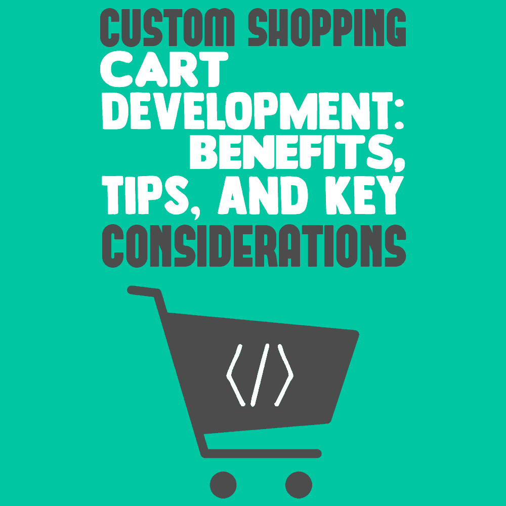

# 定制购物车开发:好处、提示和关键考虑

> 原文:[https://simple programmer . com/custom-shopping-cart-development/](https://simpleprogrammer.com/custom-shopping-cart-development/)

<figure class="alignright is-resized">

</figure>

每个电子商务商店都需要有一个适合其业务目标和用户体验偏好的购物车。由于放弃购物车是绝大多数在线商店的共同担忧，电子商务商店需要设计可以帮助减少这一问题的购物车。

四分之三的购物者会放弃购物车而不购买。虽然这背后有各种原因，但定制购物车设计可以帮助避免这种情况。

让我解释一下关于定制购物车设计的一切，从最基本的定义和不同的可用选项开始，到关于购物车的问题，到有效的购物车开发原则和实践。

## 购物车的基础:目的和重要性

购物车只不过是电子商务网站中帮助用户购买产品或服务的软件解决方案。购物车负责处理客户的付款，并将付款信息分发给流程的各个利益相关者，包括商家、付款处理者和其他方。

购物车有助于将商品浏览等非商业购物活动与实际购买联系起来。

为了更好地理解这一点，只要想想在线商店中浏览的数百万件产品与客户实际购买的产品和服务。虽然购物和浏览活动仍然是免费的，但购买数量少得多，给了电子商务商店实际的业务。购物车是将这些销售从浏览活动转化的门户，这就是为什么拥有高质量的购物车软件是至关重要的。

[根据 bigcommerce.com 的说法，](https://www.bigcommerce.com/ecommerce-answers/whats-shopping-cart/)除了把顾客带到收银台，购物车还有以下功能:

*   存储产品信息
*   像管理订单、目录和客户的网关一样工作
*   为用户显示产品信息、产品类别和网站信息

详细地说，电子商务购物车不仅仅是帮助你搬运物品。它也是存放产品的货架、结算柜台、收银机和支付处理系统。

## 购物车开发的关键选项是什么？

在我们解释定制购物车开发以及相应的实践和规则之前，我们需要看一下可用的选项。基本上有两种类型的购物车:

### 托管或通用购物车开发

当第三方服务提供商负责托管、维护和升级购物车以及服务器备份时，该购物车被称为托管购物车。

这种解决方案的最大好处是托管购物车不需要花费一毛钱。如果购物车开发成本是您的首要考虑，这个解决方案效果最好。但是，客户需要去不同的网站处理他们的付款。

让我们更深入地看看托管购物车的利与弊。

***利弊***

*   并没有增加一个电商店铺的成本负担。
*   这是一个集成购物车的简单解决方案，不需要太复杂。
*   这种类型的购物车开发对于可能没有多少技术知识的新企业主来说是理想的。

***缺点***

*   这种类型的电子商务购物车开发是一种“一刀切”的解决方案，可能完全不适合现代定制电子商务网站。
*   托管购物车要求客户到不同的网站处理付款，这在用户体验方面有点麻烦。
*   托管购物车缺乏灵活性和增值范围。因此，购物车没有太多的功能，并且与第三方插件不兼容。

### 定制或特许购物车开发

当企业主构建自己的购物车并对其进行定制以满足特定的要求和偏好时，这被称为定制或许可购物车。这种类型的购物车具有更灵活的功能，并允许第三方加载项。

以下是定制购物车的更多优点和缺点:

***利弊***

*   定制购物车提供了更广泛的定制范围，适合定制电子商务 web 开发。
*   通过解决特定的业务需求和客户偏好，定制购物车实际上有助于提供更好的客户体验和随之而来的业务转换范围。
*   定制购物车还允许添加第三方工具，以确保客户体验中的许多附加价值。

***缺点***

*   与现成的解决方案相比，定制购物车的成本更高。
*   与现成的购物车不同，定制购物车只由少数人测试，因此更容易出现开发错误。

## 关于购物车的关键问题

在我们知道定制购物车如何帮助用户体验之前，我们需要评估电子商务购物者面临的问题。

正如我已经提到的，绝大多数电子商务商店都存在弃车问题，导致业务严重流失。这就是为什么关于购物车的问题需要详细评估和解释。

<figure class="wp-block-image">

</figure>

在分析弃车现象时，我观察到许多案例涉及几个常见问题:

*   运费等隐性成本是放弃购物车的最常见原因。在[周围，四分之一的顾客](https://www.barilliance.com/10-reasons-shopping-cart-abandonment/)将运费作为不购买就离开购物车的原因。另一方面，较低或打折的运费通常会带来更大和更稳定的销售转化。免费送货仍然是购物的一大动力，它有助于更持续地将购物车转化为销售额。
*   另一个常见原因是**无法获得首选付款方式**。例如，在许多市场中，货到付款是首选的支付方式，如果在支付渠道列表中没有看到这种方式，客户通常会放弃购物车。[根据 ClickandBuy 最近进行的一项调查](https://econsultancy.com/e-tailers-need-to-offer-more-payment-options-survey/)，许多在线零售商正在失去潜在的销售额，因为无法提供大量的支付方式。调查显示，50%的网上购物者会取消购买，如果他们首选的方法不可用。
*   漫长而强制的注册过程通常会导致顾客放弃购物车。不要强制注册，因为您总是可以通过访客登录来接纳新客户。即使在注册客户时，也要将流程限制在几个步骤之内。
*   未能建立信誉和信任是购物者离开购物车的另一个原因。为了建立你的品牌的信任和可信度，确保所有的页面都有真实的客户评论，没有 404 链接，并且增强了服务器处理高峰时段流量增加的能力而不降低性能。来自 VeriSign、Google Trusted Store、PayPal verified、McAfee secure 等的可信徽标。也能让你的店更有分量。
*   **与竞争对手进行价格比较**可能会导致你失去客户，但你可以通过解释能够说服客户选择你的产品的附加值来避免这种情况。

## 你如何说服你的顾客完成购买？

购物者出于各种原因离开购物车，包括去其他竞争对手的网站利用折扣或有竞争力的价格。

这通常会导致从其他竞争对手网站购买的客户大量流失。[据 maxtraffic.com](https://maxtraffic.com/blog/shopping-cart-abandonment-a-scary-occurrence-to-prevent/)统计，超过 80%的电商店铺都有一个坚定的信念，认为废弃的购物车是永远失去的，追求那些顾客完成购买是没有意义的。然而，顾客经常放弃手推车，而打算回来。

现在，了解电子商务商店如何说服客户回来并完成购买非常重要。[电子商务购物车开发](https://www.cmarix.com/ecommerce-web-development-services.html)没有“添加到愿望清单”和“保存购物车”等选项是不完整的，因为这些功能可以打开与客户的沟通。

电子商务商店可以通知顾客类似的产品、促销或限时优惠。“保存购物车”功能也有助于商店通过使用折扣和优惠营造一种紧迫感来联系顾客。

## 定制购物车开发:如何实现

<figure class="alignright is-resized">

</figure>

虽然购物车仍然是电子商务商店的核心和灵魂，但根据特定的业务需求和受众定制购物车是在线商店的关键成功因素。

由于在线商店在营销商品和广泛接触顾客方面面临全方位的竞争，一辆高质量的购物车可以在改善购物体验方面发挥不可估量的作用。

虽然定制购物车在转换业务方面的优势非常突出，但让我们来解释一下如何做到这一点。您需要考虑几个与购物车性能和业务转换相关的关键问题:

### 购物车应该有什么特点？

考虑到高标准的[用户体验](https://simpleprogrammer.com/improving-ux-design/)和观众参与度，你需要对某些购物车功能毫不妥协。

*   你需要确保光顾你商店的顾客能够以多种方式浏览产品。购物车应该提供多种过滤器选项，允许客户根据品牌、材料、价格、类别、颜色和其他选项搜索产品。
*   购物车应该**包含产品评级和评论**以建立可信度和可靠性。
*   最后，应该有一个**顺利结帐过程**配备了多种支付选项和网关。

### 您应该加入自定义元素还是从头开始开发购物车？

当您希望为您的电子商务商店使用定制购物车时，您可以选择在现有购物车解决方案上集成定制功能，或者从头开始构建定制购物车。

如果你不能雇佣一个技术娴熟、经验丰富的软件开发团队来构建你的定制购物车，你可以为你现有的购物车增加价值，并提供许多定制的特性和功能。

为你的电子商务商店创造额外价值的一些关键功能包括跟踪订单、提供快节奏的快速结账、提供促销优惠以及创建定制衣柜或愿望清单。

## 定制购物车设计和开发的最有效技巧

定制购物车需要定制的设计和特性集。我将解释一些在线商店定制购物车的设计和开发技巧。让我们从基本的设计技巧和步骤开始:

*   不要采用电子商务 CMS 的默认设计，而要评估为你的商店的特定需求而设计的优点。如果你需要加入新的元素或者进行改进，那就去做吧。
*   您可以逐个调整“背景图形”、“背景颜色”和“标题图形”设计，以形成您喜欢的购物车设计。
*   同样，通过转到产品选项卡，您可以为特定产品选择自定义或缩略图。
*   为每件产品添加简短而吸引人的描述。

### 购物车开发和设计中需要注意的关键参数

构建购物车时，您需要注意某些参数，以确保最佳性能和用户友好的体验:

*   **购物车打开速度–**购物车打开的速度对性能和用户体验至关重要。理想情况下，购物车应该在几毫秒内打开和关闭。由于大多数顾客离开商店时会延迟装货时间，因此您需要优先考虑装货速度。

*   **使用当地货币–**尽管任何购物车的默认货币都是美元，但您应该始终允许使用当地货币。对于产品、税收和运输成本，使用当地货币将提供突出的优势。

*   **产品运输选项–**由于运输是拖累您业务转换的问题领域之一，您需要提供多种产品运输选项，以帮助客户选择他们喜欢的一种。更多的运输选择将有助于提高客户的电子信心。

## 定制购物车如何促进您的业务

<figure class="alignright is-resized">

</figure>

我们已经了解了定制购物车和普通购物车之间的基本区别，但是让我们更深入地了解定制购物车如何比普通购物车提升用户体验和销售。虽然定制购物车可能涉及处理开发、设计和[测试](http://www.amazon.com/gp/product/0471358460/ref=as_li_tl?ie=UTF8&camp=1789&creative=390957&creativeASIN=0471358460&linkCode=as2&tag=makithecompsi-20&linkId=P376HSKN3AK7NKOI) [i](https://simpleprogrammer.com/testingcompsoftware) [ng](http://www.amazon.com/gp/product/0471358460/ref=as_li_tl?ie=UTF8&camp=1789&creative=390957&creativeASIN=0471358460&linkCode=as2&tag=makithecompsi-20&linkId=P376HSKN3AK7NKOI) 的复杂性和可观的预算，但通用购物车可以在不面临这些挑战的情况下使用。

定制购物车在增强参与度和业务转换方面提供了一系列优势，而通用购物车只是缺少将业务转换为现代电子商务网上商店的基本元素:

*   **独特的用户体验—**标榜定制设计的购物车意味着它是专为特定受众打造的。设计决策是基于在线商店需要向其顾客提供的功能和特征而达成的。除了拥有独特的外观，设计还应该为浏览产品提供最佳的便利。

*   **灵活的产品列表–**普通购物车的最大限制之一是不允许调整产品列表。例如，在某种过滤器下，如价格或类别，通用购物车可能不允许列出太多或无限数量的产品。相比之下，在任何过滤器选项或类别下，定制购物车可以列出尽可能多的产品，并提供适当的分页或滚动选项。

*   **开展特别促销–**当您进行定制购物车开发时，您的商店可以在单独的页面中列出特别促销和优惠的产品。显然，将产品列在一个特殊的促销页面下有助于促进业务转化和销售。

*   **增强控制—**普通购物车通常由托管公司控制的远程服务器托管。这意味着有限的访问和控制。此外，您需要依赖可能有自身漏洞的服务器的安全设置。定制购物车提供对所有记录和数据的完全控制和访问。因为您还可以控制源代码和根数据库，所以您可以根据自己的喜好配置安全设置。

*   **更快地整合变更—**当您需要将一些变更整合到通用购物车时，使用通用购物车，您所能做的就是在客户端和服务器端的模板上实施变更。这使得该过程复杂且耗时。相比之下，定制购物车可以轻松地合并更改，并允许更快地修改，而不需要处理太多复杂的事情。

*   **增强的可扩展性—**普通购物车几乎没有任何可扩展的容量来支持其与您的电子商务业务一起增长。您必须使用容量有限的购物车，它永远无法满足您不断增长的电子商务业务的需求。相比之下，定制购物车提供了最佳的可伸缩性，以适应增加的流量和业务查询。

*   **营销—**普通购物车没有特殊的营销功能。相比之下，定制购物车在促销和营销产品方面有很大帮助。电子商务商店可以为每个列出的产品和所有页面包含单独的 SEO 标签，以增加通过搜索引擎结果产生的流量。

*   **精心设计的价格选择–**对于普通购物车，您只能选择预先配置的固定价格选项。相比之下，使用定制购物车，您可以为不同的产品类别创建详细的定价选项。同时，定制购物车允许您将促销优惠和折扣纳入定价组合，使产品列表更有利可图。

## 定制购物车:值得的投资

如果您想要建立一个极具竞争力的电子商务商店，拥有一系列用于转换业务的详尽的特性、功能和设计元素，那么采用购物车的定制方法现在是一个主要要求。

只有定制设计的购物车才能帮助电子商务商店满足特定用户的需求和偏好。定制购物车的开发可能有点昂贵，但当您考虑到所提供的无与伦比的业务优势时，这是值得的。