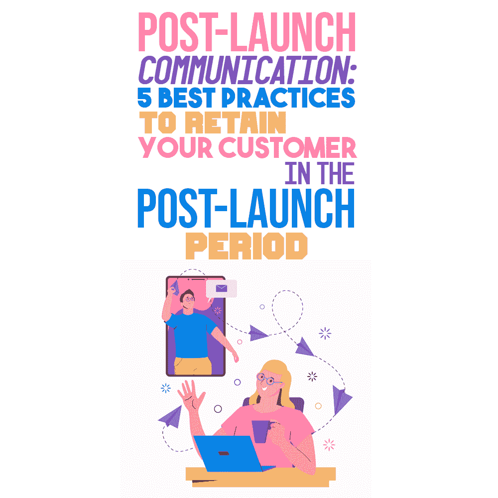

# 发布后沟通:在发布后时期留住客户的 5 个最佳实践

> 原文：<https://simpleprogrammer.com/customer-retention-post-launch/>

Launching a product rightly feels like a big deal, as it’s a graspable accomplishment, the reward after a lot of hard work. A product launch also gives a certain impression that the process is now over. But is this really the case?

发展的现实告诉我们并非如此。创造一个成功的产品绝不会停留在发布阶段，因为它们需要持续的改进、维护和支持。

这就是为什么外包公司不应该将他们的[定制软件开发服务](https://www.oxagile.com/services/custom-software-development/)仅仅局限于构建产品并将其交给客户，而是应该考虑发布后的维护和支持。

在本帖中，我将与您分享在发布后时期留住客户的最佳实践。

## 为什么产品发布后客户还会和开发者在一起？

产品发布后，客户会向您求助，主要有两个原因:

*   **出了问题**，他们需要修复它。即使您应用了质量保证和测试的最佳实践，在产品发布后，仍然可能会出现问题。在这种情况下，对于一个经验丰富的软件开发公司来说，最好的策略是对投诉和批评保持开放，寻找解决问题的方法，并且[永远不会在客户陷入困境时离开客户](https://simpleprogrammer.com/effective-agile-communication-plan/)。
*   他们只是想要更多的东西。即使一切正常，您的客户无疑会欢迎产品的持续升级。[专注于**创造价值**的以产品为中心的开发人员](https://productcoalition.com/product-thinking-vs-project-thinking-380692a2d4e?gi=9227f0661f20)肯定会走在以项目为中心的思维模式的采纳者的前面，对他们来说**开发过程的重要性**占上风。

对于上述两种情况，最好的办法是为发布后的阶段准备一个维护和支持计划，在这个计划中，你要描述你可以增加什么额外的价值来为项目带来额外的利润。让我们更详细地了解这一点，您可以关注五个关键领域。

## 提供示范性发布后支持的五大秘诀

正如我上面提到的，当你做好充分准备时，支持和升级事宜都可以处理。遵循下面的五个技巧，你可以保证在项目交付后与客户建立可靠的长期关系。

### 创建明确定义的 SLA

服务水平协议(SLA)定义了客户订购的服务类型、质量以及对违反合同的制裁。合同工具的目的是**在客户-技术供应商关系中创造一个全面的环境:**从一开始，合同双方就阐明他们对合作伙伴关系的期望，以及如果不能满足这些期望将受到的惩罚。

不要忘记在您的 SLA 中包括以下组件:

*   对您将要提供的服务的详细描述；
*   客户可以用来衡量你的服务的标准:服务的可用性，每个周期的截止日期和可交付成果，等等；
*   如果没有达到商定的服务水平，您提供的补救措施。

通常，最合理的方法是雇佣法律顾问为每个新项目制定 SLA。然而，每次你签新合同时，考虑下面的建议来减少咨询服务的预算:

*   **准备一份标准 SLA。**拥有这样一份文件将是一个良好的开端。尽管如此，还是有必要与专家讨论 SLA 中与您提供的服务、您的目标受众以及您最活跃的市场相关的关键条款。
*   在与新客户签约之前，审查 SLA。客户在服务范围、定价或交付条款等方面各不相同。您无法确保不同项目的结果相同，所以请关注您控制范围内的指标。如果您的标准协议保证 99.99%的服务可用性，而这超出了您的工作范围，这将导致合同违约，并对您造成进一步的处罚。
*   包含更新 SLA 的机制。随着您与客户关系的发展和自然变化，您的 SLA 内容也将随之变化。如果你签订了一份长期合同，试着加入一个条款，说明你每 X 个月定期审查一次协议，以保持文件的灵活性和活力。

### 就违反服务级别和违反合同的处罚进行协商

这一至关重要的战略是前一点的一部分。实践表明，如果客户的期望没有得到满足，有三种可能的出路:

*   **经济处罚。**如果违反 SLA，供应商有义务向客户偿还损失金额。不要忘记小心这一点*，不要同意全额报销客户支付的服务费*。相反，进行价格调整或按比例扣减。
*   **违约金(LD)。**如果供应商表现不佳，按照 SLA 的规定，他有义务重做已完成的工作，且不收取额外费用。
*   **额外奖金。**通常，外包公司提供支持服务，如按特殊费率进一步开发或在一定期限内维护，不收取费用或降低费用。

卖方和客户双方都规定在违约赔偿金(LD)条款中包含何种惩罚。虽然有些人会发现不满意的工作可以得到他们的钱，但其他人更愿意以后再接受供应商的服务。

### 启动进一步的产品升级

如果你事先采取所有必要的措施，在项目中提供一个清晰的工作环境，并向你的客户提供各种保证，这是非常好的。

但是，为[产品的进一步开发和重构](https://www.amazon.com/dp/0201485672/makithecompsi-20)提供一个计划是一个更加积极的方式来继续你们的合作关系。

还记得我提到的面向产品的方法吗？源于它的是一份**增量改进的详细计划(不是大修！)**您建议您的客户端在部署后应该遵循的内容:新特性、基于用户测试的增强等。这是展示你对结果的兴趣和商业思维的好方法。

### 确保及时维修

持续的开发和缺陷修复是任何成功产品的一部分。牵头并建议[制定一个针对](https://simpleprogrammer.com/provisioning-deployment-and-maintenance/)特定客户需求的维护计划。

维护支持合同应阐明以下问题:

*   在产品构建和交付后，您的团队将提供产品支持的期限。
*   赡养义务的范围。思考以下问题:在产品出现故障或缺陷的情况下，你能保证采取什么行动？你如何定义“故障”和“缺陷”这两个术语？你应该以多快的速度做出反应并采取行动？
*   维护费用及其计算方式。

当与客户的合同指定了支持和发布后维护服务时，这增强了您和您的开发团队的主人翁意识。

### 提供定期备份和数据恢复服务

Things such as user errors, cyber attacks, lack of necessary hardware or an expired license, data corruption and deletion may happen to any client. That is why a developer who takes precautions about data security is worth their weight in gold.

您可以为备份和数据恢复做些什么:

*   向您的客户咨询可能的数据备份和灾难恢复解决方案。如果您的客户不是技术专家，他们很可能对数据加密、存储重复数据删除和其他类似方法一无所知。即使他们没有提出这些问题，也要主动向他们详细解释一切。
*   **如果主要规格不包含任何获取客户端数据副本的机制，建议在产品中实施本机备份解决方案**。
*   **作为整体数据管理和安全计划的一部分，为客户端制定常规数据备份策略**。很有可能你会被雇佣去把它投入到生活中。

## 考虑长远，积极主动

如上所述，在你和你的客户的关系中，清晰是“美好友谊的开始”。

虽然即使你采取了预防措施，事情也可能会出错，但专业外包公司会通过[与客户](https://www.amazon.com/dp/1934356344/makithecompsi-20)建立可信赖的关系、可预测的流程和预先商定的风险缓解策略来度过难关。

如果你准备好主动行动，而不仅仅是被动反应；如果你从长远的角度关心产品质量；如果你采用以产品为中心的思维模式，没有客户会在产品发布后离开你。